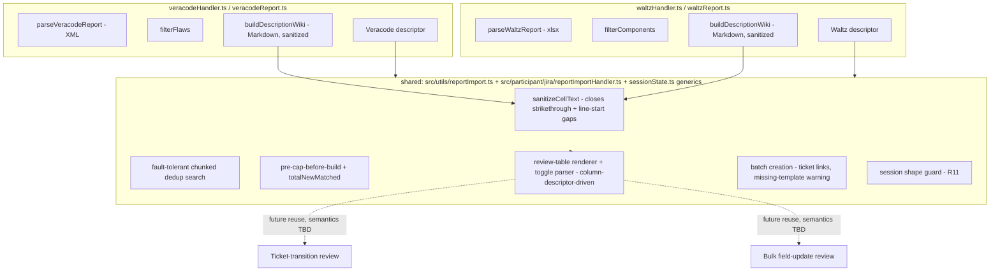

# Report Importer Consolidation - Plan

## Goal Capsule

- **Objective:** Consolidate the Veracode and Waltz report-to-Jira-ticket importers onto one shared, hardened implementation — one proven path for session flow, dedup search, the review-table/toggle UX, and batch ticket creation — while each keeps its own parser and label scheme.
- **Product authority:** A `ce-brainstorm` dialogue, following a `ce-compound`-documented security review of the Waltz import feature. The coherent-work gate split a broader request into three areas; this plan owns consolidation only — the ticket-transition/bulk-update UX family and the Waltz schema-validation item are not active scope (see How This Work Fits Together).
- **Open blockers:** None — dialogue and planning research resolved all scope questions; ready for implementation.
- **Execution profile:** Single-session refactor of existing, shipped code. No new user-facing commands or chat triggers. Touches persisted `workspaceState` session shapes — see R11.
- **Stop conditions:** Stop and ask if implementation reveals a third handler function pair with no clean shared shape, or if the descriptor abstraction (KTD3) can't express a real divergence without leaking importer-specific branches into the shared module.

---

## Product Contract

**Product Contract preservation:** R1 and R4 each gained one clarifying clause (message-wording scope on R1; URL-context sanitizer scope on R4) — no scope change, closes an ambiguity planning research found. R11 is new (session/`workspaceState` backward-compatibility across the update), with its own Key Decision — an omission in the original brainstorm scope that planning-time research surfaced, not a conflict with any existing R. AE5–AE7 added to cover R3, R8, and R11, which previously had no Acceptance Example. Confirmed with the user before this write (see the Phase 5.1.5 scoping synthesis exchange).

### Summary

Veracode and Waltz report imports move onto one shared implementation for session flow, dedup search, batch ticket creation, and the review-table/toggle UX, while each keeps its own parser and label scheme. Veracode's ticket descriptions switch onto Waltz's Markdown-then-sanitize-then-convert pipeline, and both importers converge on Waltz's more hardened behavior — including graceful handling of a review session that predates this change.

### Problem Frame

Waltz's import feature was built by deliberately mirroring Veracode's — its own plan doc states "Architecture: Mirrors the Veracode import feature exactly," reinforced three more times through that document — continuing a lineage where each new report importer copies the shape of the last (email import → Veracode → Waltz). This produced two file pairs (`veracodeHandler.ts`/`waltzHandler.ts`, `veracodeReport.ts`/`waltzReport.ts`) sharing eleven identically-named functions, near-identical session types, and mirrored control flow throughout.

A recent security review of the Waltz feature made the cost of that duplication concrete. Three fixes — dedup search fault tolerance, a missing-template warning, and a Markdown-injection sanitizer for ticket descriptions — landed only in Waltz's files, because that's where the review happened to look. Veracode's `buildDescriptionWiki()` still writes raw Jira wiki markup directly from unsanitized external report data — not just missing the two narrow gaps Waltz's sanitizer has, but with **zero** sanitization at all today, making it the more directly exploitable of the two. The two `extension.ts` command handlers have already drifted apart within a day of merge: Waltz's calls a shared session-builder helper, Veracode's still inlines the same logic redundantly, and independently hardcodes its own size/batch-limit constants three times over.

None of these divergences are deliberate product decisions for Veracode — each exists only because a fix landed on whichever file the bug happened to be found in.

### Key Decisions

- **Consolidate the architecture, not just description generation.** (session-settled: user-directed — chosen over narrower alternatives surfaced at the coherent-work gate: fixing only the sanitizer gaps, or validating the Waltz schema against a second export. Those are independent, narrower tracks; this addresses the root cause.) Governs R1.
- **Full behavioral convergence, not code-only deduplication.** (session-settled: user-directed — chosen over converging only safety-relevant behavior or leaving behavior untouched: today's divergences aren't intentional Veracode-specific decisions, they're just where a fix happened to land.) Governs R5, R6, R7, R8.
- **Veracode's description generation moves onto Waltz's Markdown-then-sanitize-then-convert pipeline**, replacing hand-authored Jira wiki markup. (session-settled: user-directed — the user's own framing: not "one generating jira markup directly and next using the translation from markdown.") Governs R3.
- **The shared sanitizer must close its two known residual gaps as part of this work**, not as a separate follow-up. (session-settled: user-directed — chosen because Veracode is about to start depending on the same function; it should be proven before that happens.) Governs R4.
- **Scope stays at Veracode and Waltz; the wider review-table/toggle pattern (also used by ticket-transition and bulk field-update review) is deferred.** (session-settled: user-directed — chosen over widening scope to unify all four flows now, or deferring the call pending a side-by-side comparison.) See Scope Boundaries and How This Work Fits Together.
- **The shared descriptor is scoped to exactly what Veracode and Waltz need today** — no speculative fields or hooks for a hypothetical third importer. (session-settled: user-approved — agent proposed with the tradeoff surfaced; user assented after raising, then accepting, the reasoning that the descriptor is inherently data-driven for the two real cases already.) Governs R9.
- **The review-table renderer and toggle-reply parser are implemented as a separable unit** within the shared implementation, not entangled with dedup/session logic. (session-settled: user-approved — agent proposed as low-cost prep for a later, separately-scoped reuse by the ticket-transition/bulk-update screens; user assented.) Governs R10.
- **An in-flight session from before this ships must degrade gracefully, never silently corrupt.** (session-settled: user-approved — agent proposed with the tradeoff surfaced at the Phase 5.1.5 checkpoint, over leaving it unaddressed: this refactor changes the shape of persisted `workspaceState` session objects for two shipped, in-production features, and neither session type has any compatibility guarantee today.) Governs R11.

### Requirements

**Shared pipeline**

- R1. Veracode and Waltz share one implementation — including message wording, not just control flow — for session flow (template/issue-type selection through review to batch creation), dedup search, the review-table renderer, and the toggle-reply parser; each importer supplies only its own parser, configuration, and label/summary/description-building specifics.
- R2. Existing user-facing entry points are unchanged: the same two VS Code commands and the same two `@jira` chat triggers, with the same prompts and command names.

**Description generation**

- R3. Veracode's ticket description generation is rebuilt on the same Markdown-then-sanitize-then-convert pipeline Waltz uses, replacing its current hand-authored Jira wiki markup.
- R4. The shared sanitizer neutralizes markdown-structural characters in every untrusted field interpolated into a generated description, for both importers — including values used inside a generated link's URL, not only span text — and including the two gaps identified in review: `~~strikethrough~~` markers, and values pushed as a standalone line (susceptible to line-start rules such as horizontal rules, blockquotes, and list markers).

**Behavioral parity**

- R5. Veracode adopts Waltz's dedup search fault tolerance: a failed dedup chunk does not discard matches already found by other chunks.
- R6. Veracode adopts Waltz's missing-template warning: if a previously picked template no longer exists when the user replies, the user is told, rather than the ticket silently proceeding with no template fields.
- R7. Veracode adopts Waltz's cap-and-resume behavior: when more new (not-yet-ticketed) items are found than the batch limit, the review screen states how many more exist and that re-running the import will pick them up.
- R8. Both importers link to each newly created ticket in their per-item creation-progress output.

**Design boundaries**

- R9. The shared descriptor (or equivalent per-importer configuration) is built from exactly what Veracode and Waltz need today; it adds no fields, hooks, or generality for a hypothetical third importer.
- R10. The review-table renderer and toggle-reply parser are implemented as a unit separable from dedup/session logic, positioning them as the reuse point for a later, separately-scoped unification with other review-screen flows — without doing that unification now.

**Compatibility**

- R11. An in-flight Veracode or Waltz review or template session created before this change ships does not render corrupted data or silently misbehave after the update; it either continues to work or degrades to an explicit message telling the user to re-run the import.

### Acceptance Examples

- AE1. **Covers R4.** Given a CVE summary or flaw description containing `~~injected~~`, or a value pushed as a standalone line starting with `-`, `>`, `+`, a digit followed by `.`, or `#`, When the description is generated, Then no strikethrough, horizontal rule, blockquote, list item, or heading appears in the rendered ticket that the source value didn't legitimately contain.
- AE2. **Covers R5.** Given a dedup search where one chunk's Jira query fails and other chunks succeed, When the review screen is built, Then it shows the already-ticketed matches found by the successful chunks — the failed chunk degrades gracefully rather than discarding everything found so far.
- AE3. **Covers R6.** Given a user picks a template, then the template is deleted or renamed before they reply, When they confirm, Then they're told the template is gone and the ticket proceeds without its fields — not silently with the wrong fields.
- AE4. **Covers R7.** Given more new items match a report than the batch limit, When the review screen renders, Then it states how many more exist beyond what's shown and that re-running the import will pick them up.
- AE5. **Covers R3.** Given a Veracode flaw whose `description`, `recommendation`, or `functionPrototype` contains markdown-structural or line-start trigger characters, When the ticket description is generated, Then no injected heading, table row, link, strikethrough, or list/quote/rule markup appears that the source value didn't legitimately contain — the same guarantee AE1 proves for Waltz, proven independently for a Veracode-only field.
- AE6. **Covers R8.** Given a ticket is created during batch execution and a Jira base URL is configured, When the per-item creation-progress line is streamed, Then it renders as a clickable link to the new ticket, for both importers.
- AE7. **Covers R11.** Given a stored review-session object that predates this change (missing fields the new code expects), When the user replies to continue that session, Then they see a message telling them the session expired and to re-run the import, rather than a table with missing or undefined cells or a batch run against incomplete data.

### Scope Boundaries

**Deferred for later**

- Unifying the review-table renderer and toggle-reply parser with the ticket-transition (bulk cleanup) and bulk field-update review screens — same interaction family, but a separately-scoped future pass (see How This Work Fits Together). Note: that family uses skip semantics (default-all-included, reply lists rows to exclude) while Veracode/Waltz use toggle semantics (reply lists ids to flip) — a real interaction-model difference a future unification will need to reconcile, not just a wording difference.

**Outside this work**

- Validating the Waltz `.xlsx` schema against a second real export — a separate, already-deferred item from the original Waltz plan, unrelated risk surface (parsing correctness, not architecture).
- Designing or building support for a third external-report importer type.

<!-- ce-section: work-relationships -->
### How This Work Fits Together

This plan owns consolidating the Veracode and Waltz report importers only. The broader picture below is the current understanding, not a committed roadmap — a later plan may revise, split, merge, or discard any of it.

- Ticket-transition (bulk cleanup) and bulk field-update review screens (`TransitionBatchSession`, `BulkUpdateReviewSession`) — **Shares** the same review-table/toggle-reply interaction pattern this plan builds for Veracode/Waltz. This plan's renderer/parser is built as a separable unit specifically so a later plan can extend it here — but see the skip-vs-toggle semantics note in Scope Boundaries. **Still to decide:** whether and when that unification happens, and how the two interaction models reconcile.
- Waltz `.xlsx` schema validation against a second real export — **Can proceed independently of** this work; it addresses a different risk (parsing correctness against schema drift), not architecture.

### Dependencies / Assumptions

- Existing Veracode tickets already created keep their current formatting; only tickets created after this ships use the unified pipeline and behavior.
- Veracode's dedup labels are derived from numeric issue IDs, which cannot collide the way Waltz's sanitized component-name labels can — the shared design makes collision-safety (hash-suffixing) conditional per-importer rather than uniform, since Veracode doesn't need it.
- R7 is a user-visible, intentional behavior change: existing Veracode users with more than 50 matching flaws will see a smaller review screen (50 + a resume note) after this ships, rather than today's unbounded list. Worth a release-notes mention (see Documentation / Operational Notes).
- Key Flows are omitted: the multi-step import flow itself (parse → filter → dedup → review → toggle → batch-create) is unchanged and already documented for both features; this plan's behavioral changes are fully pinned by the Requirements and Acceptance Examples above.

### Sources / Research

- Handler and util duplication confirmed 1:1 across `src/participant/jira/veracodeHandler.ts` / `waltzHandler.ts` and `src/utils/veracodeReport.ts` / `waltzReport.ts` — eleven matching function names, near-identical control flow in most.
- `src/participant/sessionState.ts`: `VeracodeReviewSession`/`WaltzReviewSession` and their table-builders/parsers follow the same mirrored shape; `parseVeracodeReviewInput`/`parseWaltzReviewInput` and `applyVeracodeToggle`/`applyWaltzToggle` are character-for-character identical under different type names (`sessionState.ts:488-508`, `589-609`).
- `docs/superpowers/plans/2026-08-13-waltz-oss-report-to-tickets.md:7` — "Architecture: Mirrors the Veracode import feature exactly."
- `docs/superpowers/plans/2026-08-10-veracode-report-to-tickets.md:7` — Veracode's own plan states it "Mirrors the existing `.eml` email-import feature exactly."
- `docs/solutions/security-issues/waltz-oss-report-markdown-injection-in-jira-wiki-converter.md` — the security review this consolidation responds to; documents the sanitizer's two known residual gaps (with fixes already reasoned through — see KTD7), and independently flags Veracode's `buildDescriptionWiki()` (`src/utils/veracodeReport.ts:160-185`) as carrying zero sanitization and being "more directly exploitable" than Waltz's original gap.
- `src/utils/veracodeReport.ts:166` — `cweId` is interpolated unvalidated into a CWE-database URL, with no `ISSUE_ID_PATTERN`-style validation the way `issueId` has (`veracodeReport.ts:43,93`) — the URL-context sanitization gap behind R4's amendment and KTD5.
- `extension.ts:307-386` (Waltz) vs `extension.ts:194-303` (Veracode) — Waltz calls the shared `buildWaltzTemplateSession()`; Veracode re-implements the same session-building inline. Credential-check ordering also differs (Waltz checks first, `extension.ts:317-323`; Veracode checks after parsing, `extension.ts:244-248`).

---

## Planning Contract

### Key Technical Decisions

- KTD1. **The shared session-flow module owns message wording for every shared condition, not just control-flow structure.** An importer cannot pass a private copy of shared-condition text (the missing-template warning, the cap/resume message, the toggle-reply footer) through the shared function's parameters — today's Veracode and Waltz already word their cap messages differently despite both being "cap behavior," which is exactly the drift this consolidation exists to close. Governs R1.
- KTD2. **`extractDedupMap` takes the nested `{ key, fields: { labels? } }[]` shape** (matching the raw Jira search-result shape Waltz already uses), not Veracode's flattened `{ key, labels }[]`; **`buildDedupJql` always quotes labels** (Waltz's defensive form), even though Veracode's current numeric-only labels are safe unquoted — quoting unconditionally removes a class of future bug where a label format changes and quoting is forgotten. Governs R1, R9.
- KTD3. **The per-importer descriptor is a plain object of typed fields and functions** — `parse`, `filter`, `readConfig`, `buildSummary`, `buildDescriptionWiki` inputs, `buildLabels`, a `labelToDedupKey` function, an `itemNoun` string, an optional `onIssueTypeFetchFailed` UI-notify callback (see KTD9), and a column descriptor (header + accessor pairs) for the review table — modeled on this repo's existing injected-callback precedent (`onDiag` in service constructors, `onAttemptFailed` in `src/utils/lmRetry.ts:24`) and the `Schema<T>`-parameterized function pattern already used in `waltzReport.ts:77-91`. Not a class hierarchy; not a registry. Governs R1, R9, R10.
- KTD4. **The unified `extension.ts` command registration adopts Waltz's order (check Jira credentials before reading/parsing the file), and both `MAX_REPORT_BYTES` and `BATCH_LIMIT` become single shared constants exported from `reportImport.ts`**, consumed by both importers — not just fixing Veracode's own triple-duplication in place. Both values are already numerically identical across importers today (20 MB; 50), and `BATCH_LIMIT`'s existing comment already frames it as a general product convention ("matches the `cleanupHandler.ts` `BATCH_LIMIT` convention"), not a format-specific one — keeping them independently declared would reproduce the exact identical-value-defined-twice drift risk this consolidation exists to close. Governs R1 (full behavioral convergence), R2, R9.
- KTD5. **`cweId` gets numeric validation at Veracode parse time** (mirroring `ISSUE_ID_PATTERN`, `veracodeReport.ts:43`), dropped like a malformed `issueId` if it fails; the shared sanitizer's span-text stripping (`sanitizeCellText()` or its successor) is not relied on to make a value safe inside a URL — that's a different context with different rules. Governs R4.
- KTD6. **Session backward-compatibility is achieved by keeping the two `workspaceState` keys separate** (`jira.session.veracodeReview`, `jira.session.waltzReview` stay distinct even though the underlying code is shared) **and by writing an explicit `schemaVersion` number on every new session object.** The shape guard on session read checks `schemaVersion` against the current expected value — present-and-current passes through, absent or lower responds with the "session expired, please re-run the import" message from AE7. An incidental field's presence/absence (e.g. `totalNewMatched`, which already exists on pre-consolidation Waltz sessions and is separately optional post-consolidation) is not used as the discriminator, since it cannot reliably distinguish old from new. Governs R11.
- KTD7. **The sanitizer fix adds `~` to the stripped-character set, and gives every bare-standalone-line interpolation (component name/version, max rating, and any Veracode field that becomes its own line post-migration) a literal `: ` prefix** rather than adding more characters to a denylist of line-start triggers. The prefix character must itself be non-whitespace and outside every line-start rule's trigger set — `markdownToJiraWiki()`'s horizontal-rule check (`.trim()`) and its list regexes (`(\s*)` before the trigger character) both consume leading whitespace before matching, so a whitespace prefix (or a prefix drawn from an un-stripped trigger character like `-`/`>`/a digit) would not close the gap; `:` is not a line-start trigger anywhere in the converter. A fixed, verified-inert prefix is more robust against `markdownToJiraWiki()` gaining new line-start syntax later than enumerating today's known trigger set. Governs R4.
- KTD8. **Test files re-point their imports to the shared module for functions that move there** (`chunkX`, `buildDedupJql`, `extractDedupMap`, `buildLabels`, `buildReviewRows`, the sanitizer, the generic table/parser functions); existing test *behavior* and fixtures stay importer-scoped and unchanged for functions that stay genuinely distinct (`parse*`, `filter*`, `buildSummary`, `buildDescriptionWiki`). No existing assertion should need to change meaning, only its import source. Governs R1, R9, R10.
- KTD9. **The shared `buildXTemplateSession` equivalent takes an optional UI-notify callback for issue-type-fetch failure**, so Veracode's existing user-visible `showWarningMessage` on that failure path survives the move to the shared session-builder. Today's `buildVeracodeTemplateSession()`/`buildWaltzTemplateSession()` only log the failure via `onDiag`; Veracode's `extension.ts` command additionally shows a warning pop-up that would otherwise be silently dropped by switching to the shared builder (KTD4). Governs R2, R6.

### High-Level Technical Design

Descriptor-driven: each importer plugs its parser and content builders into the shared flow; the shared flow owns dedup, batching, session lifecycle, message wording, and the review-table/parser as one testable unit.

---

## Implementation Units

### U1. Generic session types and backward-compatibility guard

- **Goal:** Replace the four duplicated Veracode/Waltz session type and function pairs in `sessionState.ts` with generic equivalents, and add the shape guard that lets a pre-consolidation session degrade gracefully.
- **Requirements:** R1, R9, R10, R11
- **Dependencies:** None
- **Files:**
  - `src/participant/sessionState.ts` (modify)
  - `src/test/JiraParticipant.test.ts` (modify — re-point existing Veracode/Waltz table/parse/toggle tests)
- **Approach:**
  1. Replace `VeracodeTemplateSelectionSession`/`WaltzTemplateSelectionSession` with a generic `TemplateSelectionSession<TItem>`; replace `VeracodeReviewSession`/`WaltzReviewSession` with a generic `ReviewSession<TRow>` carrying `totalNewMatched` (harmless as absent/0 for a session that doesn't need it) and a required `schemaVersion: number` written by every session-writer (KTD6).
  2. `src/participant/JiraParticipant.ts` imports `VeracodeTemplateSelectionSession`, `VeracodeReviewSession`, `WaltzTemplateSelectionSession`, `WaltzReviewSession` directly as generic type arguments to `ws.get<...>(...)` calls — `JiraParticipant.ts` itself is deliberately **not** in this unit's Files list. Instead, `sessionState.ts` re-exports each of the four names as a type alias of the new generics (e.g. `export type VeracodeReviewSession = ReviewSession<VeracodeReviewRow>;`), mirroring the file's existing `export type { WaltzReviewRow } from '../utils/waltzReport';` re-export pattern, so `JiraParticipant.ts`'s existing imports keep resolving unchanged. `npm run compile` is what verifies the aliases actually cover every call site.
  3. Replace `buildVeracodeReviewTable`/`buildWaltzReviewTable` with one generic `buildReviewTable<TRow>(rows, baseUrl, totalNewMatched, columns, itemNoun)` per KTD3's column-descriptor shape.
  4. Replace `parseVeracodeReviewInput`/`parseWaltzReviewInput` and `applyVeracodeToggle`/`applyWaltzToggle` with one generic pair (per KTD8 — these were already character-for-character identical).
  5. Add the `schemaVersion` shape guard on session read (KTD6): current version passes through; absent or lower responds with the AE7 "session expired, please re-run the import" message.
- **Patterns to follow:** The existing `parseVeracodeReviewInput`/`parseWaltzReviewInput` bodies (already identical) define the generic's exact behavior — this is a rename-and-type-parameterize, not new logic.
- **Test scenarios:**
  - Existing Veracode and Waltz table-rendering, toggle-parsing, and toggle-apply test suites pass unchanged against the generic functions (behavior identical, only the call site's type argument differs).
  - A session object with no `schemaVersion` (pre-consolidation) or a lower `schemaVersion` than current is detected by the shape guard and treated as expired, not rendered with `undefined` cells. Covers AE7.
  - `totalNewMatched` renders the "N more matched, not shown" note when present, and is silently absent from the table when 0/undefined (Veracode's case, before R7 lands its own cap tracking in U2).
- **Verification:** `npm test` passes; the two existing describe-block sets for Veracode/Waltz table/parse/toggle behavior in `JiraParticipant.test.ts` still pass after re-pointing imports.

### U2. Shared report-import pure utilities

- **Goal:** Extract chunking, dedup-JQL building, dedup-map extraction, label building, review-row building, fault-tolerant chunked dedup search, and batch pre-cap computation into one new `vscode`-free shared module.
- **Requirements:** R1, R5, R7, R9
- **Dependencies:** U1 (shares row/session typing)
- **Files:**
  - `src/utils/reportImport.ts` (new)
  - `src/utils/veracodeReport.ts` (modify — remove functions that move; keep `parseVeracodeReport`, `filterFlaws`, `buildSummary`, `buildDescriptionWiki`)
  - `src/utils/waltzReport.ts` (modify — same split)
  - `src/test/reportImport.test.ts` (new — tests for the shared functions)
  - `src/test/veracodeReport.test.ts` (modify — remove tests for moved functions, or re-point imports)
  - `src/test/waltzReport.test.ts` (modify — same)
- **Approach:**
  1. `chunkStrings(items, chunkSize)` — generalized from `chunkIssueIds`/`chunkComponentLabels` (already byte-identical).
  2. `buildDedupJql(projectKey, labels)` — always quotes labels (KTD2).
  3. `extractDedupMap(issues, labelToDedupKey)` — takes the nested `{ key, fields: { labels? } }[]` shape; `labelToDedupKey` is importer-supplied (numeric-capture for Veracode, prefix-match for Waltz) (KTD2).
  4. `findAlreadyTicketed(labels, chunkSize, search, onDiag?)` — the fault-tolerant per-chunk orchestration (R5), taking a `search: (chunk: string[]) => Promise<JqlIssueLike[]>` callback so it stays `vscode`-free and testable with a mock; a failing chunk is caught, logged via `onDiag`, and skipped without discarding earlier successful chunks' results.
  5. `capNewRows(items, batchLimit)` — takes the raw parsed `TItem[]` (not built rows) and returns `{ included: TItem[], totalNewMatched: number, droppedOverCap: number }`, generalizing Waltz's pre-cap-before-build logic (R7) for both importers. Runs *before* row-building (step 6), matching `waltzHandler.ts`'s current order (cap `componentsToBuild` first, then call `buildReviewRows` only on the capped set) — capping already-built rows would run the expensive per-row description-building work before discarding the excess, reintroducing the exact wasted-work problem this ordering exists to avoid.
  6. `buildReviewRows(items, dedupMap, rowBuilder)` — generalized from the existing identical id-numbering scheme (`A${n}` / `${n}`), with `rowBuilder` supplying importer-specific fields; called on `capNewRows`'s `included` items, not on the full unfiltered set.
  7. Export `MAX_REPORT_BYTES` and `BATCH_LIMIT` as the single shared source of truth for both importers (KTD4), consumed by `extension.ts` (U6) and both descriptors' `readConfig`.
- **Patterns to follow:** `waltzHandler.ts:265-285`'s pre-cap-before-build comment explains the perf rationale (avoid building expensive descriptions for rows that'll be dropped) — preserve that ordering in the generic flow.
- **Test scenarios:**
  - Chunking: exact multiple of chunk size, remainder, single item, empty input.
  - `buildDedupJql`: quotes both numeric-looking and text labels; escapes/handles labels containing a literal quote character if any exist in fixtures.
  - `extractDedupMap`: nested shape with present and absent `labels`; unmatched issues produce no map entry.
  - `findAlreadyTicketed`: Covers AE2 — one chunk's search callback rejects, other chunks resolve; result map contains the successful chunks' matches, and the failure is logged via `onDiag`, not thrown.
  - `buildReviewRows`: id-numbering scheme for a mix of already-ticketed and new items, in source order.
  - `capNewRows`: exactly at the limit (no drop), one over (drops one, `totalNewMatched` reflects true count), well under (no truncation note).
- **Verification:** `npm test` passes; `npm run compile` clean (the `labelToDedupKey`/`rowBuilder`/`search` callback types must type-check against both importers' concrete usages).

### U3. Sanitizer hardening and CWE-link validation

- **Goal:** Close the two known residual sanitizer gaps and add URL-context validation for Veracode's `cweId`.
- **Requirements:** R4
- **Dependencies:** U2 (reportImport.ts must exist before this unit modifies it)
- **Files:**
  - `src/utils/reportImport.ts` (modify — houses the shared sanitizer once Veracode also depends on it; move `sanitizeCellText` here from `waltzReport.ts`)
  - `src/utils/veracodeReport.ts` (modify — add `cweId` numeric validation at parse time, mirroring `ISSUE_ID_PATTERN`)
  - `src/test/reportImport.test.ts` (modify — add sanitizer test cases)
  - `src/test/veracodeReport.test.ts` (modify — add `cweId` validation test cases)
- **Approach:**
  1. Add `~` to the sanitizer's stripped-character set (KTD7).
  2. Give every field currently pushed as a bare standalone line a literal `: ` prefix instead of stripping more line-start trigger characters (KTD7) — apply to Waltz's existing `maxVulnRating`/`nameVersion` lines and any Veracode field U4 pushes as its own line.
  3. Add `const CWE_ID_PATTERN = /^\d+$/` validation in `parseVeracodeReport()` (mirroring `ISSUE_ID_PATTERN`, `veracodeReport.ts:43,93`); a flaw with a malformed `cweId` drops the CWE link section rather than building a URL from unvalidated input (KTD5). Note in a code comment at the validation site that this is a point-fix for a URL-interpolation context specifically — span-text sanitization does not make a value safe inside a URL, so a future field interpolated into a generated link needs its own validation, not an assumption that the shared sanitizer already covers it.
- **Patterns to follow:** `ISSUE_ID_PATTERN` validation and drop-on-mismatch behavior at `veracodeReport.ts:93-95`.
- **Execution note:** Write the crafted-payload tests (the AE1/AE5 shape — one value carrying every trigger character) before the character-set/prefix fix; this is exactly the discipline the referenced security learning names as what was missing the first time.
- **Test scenarios:**
  - A crafted value containing `~~injected~~` is not rendered as strikethrough in the output. Covers AE1 (extends the existing Waltz test to also assert this).
  - A crafted standalone-line value (`"1. urgent"`, `"--- fake rule"`, `"> quoted"`, `"# fake heading"`) does not trigger a list item, horizontal rule, blockquote, or heading once the `: ` prefix fix is applied — the heading case matters because `#` is not in the stripped-character set at all and is only closed by the prefix pushing it out of line-start position.
  - A well-formed numeric `cweId` still produces a working CWE-database link.
  - A malformed (non-numeric) `cweId` is dropped/rejected at parse time and produces no CWE section, rather than a URL built from the raw value.
  - Existing Waltz tests asserting the exact rendered text of the `maxVulnRating`/`nameVersion` standalone lines are updated to expect the new `: ` prefix.
- **Verification:** `npm test` passes, including the extended crafted-payload tests.

### U4. Veracode description generation on the shared pipeline

- **Goal:** Rebuild `veracodeReport.ts`'s `buildDescriptionWiki()` to author Markdown and convert once via `markdownToJiraWiki()`, with every untrusted field sanitized.
- **Requirements:** R3
- **Dependencies:** U3
- **Files:**
  - `src/utils/veracodeReport.ts` (modify)
  - `src/test/veracodeReport.test.ts` (modify)
- **Approach:**
  1. Rewrite `buildDescriptionWiki(flaw)` to build a Markdown lines array (mirroring `waltzReport.ts`'s `buildDescriptionWiki` structure) instead of hand-authored `h3.`-prefixed template literals.
  2. Wrap every untrusted field in the shared sanitizer before pushing it onto the lines array: `description`, `recommendation`, `module`, `sourceFile`, `sourceFilePath`, `functionPrototype`, `categoryName`, `cweName` — the full field list, not just the ones with a rough Waltz analogue.
  3. Build the CWE link from the now-validated `cweId` (U3); sanitize `cweName` as span text separately from the URL.
  4. Join and convert once at the end via `markdownToJiraWiki(lines.join('\n'))`, matching Waltz's pattern exactly.
- **Patterns to follow:** `waltzReport.ts`'s `buildDescriptionWiki` (Markdown-then-convert structure) and its interpolation-point comment explaining why conversion happens once at the end.
- **Execution note:** Write AE5's crafted-payload test against the current (unsanitized) implementation first to confirm it fails, then rebuild the function — proves the migration actually closes the gap rather than coincidentally passing.
- **Test scenarios:**
  - Covers AE5 — a crafted `description`, `recommendation`, or `functionPrototype` containing heading/table/link/strikethrough/line-start trigger characters produces no injected wiki markup in the generated description.
  - A well-formed flaw still renders all sections (Severity, CWE + link, Location, Description, Recommendation, Veracode Issue ID) with the same information as today's hand-authored version.
  - A flaw with no `cweId`/`sourceFile`/`functionPrototype` (all optional fields) omits those sections cleanly, matching current optional-field handling.
- **Verification:** `npm test` passes; manually diff a sample generated description against the current hand-authored output to confirm no information is lost, only the generation mechanism changes.

### U5. Shared handler orchestration

- **Goal:** Build the shared session-flow handler implementing R1/R2/R6/R8, with `veracodeHandler.ts`/`waltzHandler.ts` reduced to their descriptors plus thin wrappers.
- **Requirements:** R1, R2, R6, R8
- **Dependencies:** U1, U2, U3
- **Files:**
  - `src/participant/jira/reportImportHandler.ts` (new)
  - `src/participant/jira/veracodeHandler.ts` (modify — reduce to descriptor + thin exports preserving today's function names for `extension.ts`/`JiraParticipant.ts` call sites)
  - `src/participant/jira/waltzHandler.ts` (modify — same)
- **Approach:**
  1. Move `buildXTemplateSession`, `streamXTemplateSelection`, `handleImportXReport`, `handleXTemplateSelection`, `streamXReview`, `handleXReviewReply`, `executeXBatch` bodies into generic equivalents in `reportImportHandler.ts`, each taking the importer's descriptor as a parameter.
  2. Missing-template warning (R6) and its message text live once in the shared module (KTD1).
  3. Thread `baseUrl` through to `executeXBatch`'s equivalent so both importers render a ticket link (R8) — Veracode's current 3-argument call site (`veracodeHandler.ts:288`) gains the parameter Waltz's 4-argument call site already has.
  4. `buildXTemplateSession`'s equivalent accepts the descriptor's optional `onIssueTypeFetchFailed` callback (KTD9/KTD3); Veracode's descriptor supplies its existing `showWarningMessage` call so that user-visible warning survives the move to the shared builder — it does not silently become log-only.
  5. `openXFilePicker` standardizes on `path.basename` (Waltz's existing form) for both.
  6. `readAndFilterXFile` stays two thin, encoding-aware wrappers (`utf-8` string for Veracode's XML, `Buffer` for Waltz's xlsx) calling into one shared filter step.
  7. `veracodeHandler.ts`/`waltzHandler.ts` keep their current exported function names so `extension.ts` and `JiraParticipant.ts` need no call-site changes beyond what U6 makes.
- **Patterns to follow:** Waltz's existing `findAlreadyTicketed` try/catch (`waltzHandler.ts:172-187`) is the reference implementation R5 already exists for U2 to generalize; this unit consumes U2's generalized version rather than re-deriving it.
- **Test scenarios:** `Test expectation: none for the handler-glue orchestration itself` — this file imports `vscode` and cannot be loaded by Vitest, matching the existing repo convention documented in CLAUDE.md's Testing section (`veracodeHandler.ts`/`waltzHandler.ts` have no dedicated unit tests today). The behavior this unit wires together (fault-tolerant dedup, missing-template detection, cap computation, ticket-link threading) is unit-tested as pure functions in U1–U3; this unit's own correctness is verified by a manual chat walkthrough of both `@jira import veracode report` and `@jira import oss report` against representative fixtures (Verification Contract).
- **Verification:** `npm run compile` clean. Manual walkthrough: run both import commands against `src/test/fixtures/veracode/` and `src/test/fixtures/waltz/` sample files, confirm the missing-template warning, cap message, and ticket link all render with the same wording pattern for both.

### U6. `extension.ts` consolidation

- **Goal:** Make both command registrations call the shared session-builder consistently, with one credential-check-then-parse order and the shared `MAX_REPORT_BYTES`/`BATCH_LIMIT` constants.
- **Requirements:** R1, R2
- **Dependencies:** U2, U5
- **Files:**
  - `src/extension.ts` (modify)
- **Approach:**
  1. Veracode's command registration calls `buildVeracodeTemplateSession()` (already exported, currently unused by `extension.ts`) instead of re-implementing the same session-building inline (`extension.ts:269-299` today).
  2. Both commands check Jira credentials before reading/parsing the file (KTD4 — Waltz's existing order and rationale comment at `extension.ts:317-323`).
  3. Both commands import `MAX_REPORT_BYTES`/`BATCH_LIMIT` from `reportImport.ts` (U2, KTD4) in place of every independently hardcoded copy (`veracodeHandler.ts:21-22`, `extension.ts:205`).
- **Patterns to follow:** `extension.ts:307-386` (Waltz's existing command registration) is the reference shape both commands converge toward.
- **Test scenarios:** `Test expectation: none — extension.ts imports vscode and registers commands; no dedicated unit tests exist for command registration today, matching repo convention.` Verified by the same manual walkthrough as U5, confirming a misconfigured (missing Jira credentials) run fails fast for both importers before any file parsing occurs.
- **Verification:** `npm run compile` clean; manual walkthrough confirms credential-check-first behavior for both commands.

### U7. Documentation updates

- **Goal:** Keep `CLAUDE.md` accurate after the shared module split.
- **Requirements:** R1 (traceability — CLAUDE.md's Key Files table and per-feature sections are the canonical map of this architecture)
- **Dependencies:** U1–U6
- **Files:**
  - `CLAUDE.md` (modify)
- **Approach:** Update the Key Files table to list `src/utils/reportImport.ts` and `src/participant/jira/reportImportHandler.ts`; update the "Veracode report import" and "Waltz OSS report import" sections to note the shared implementation and point to the new shared files rather than describing each as if fully independent; note R7's user-visible cap-screen-size change for existing Veracode users.
- **Test scenarios:** `Test expectation: none — documentation only.`
- **Verification:** Manual read-through confirms the Key Files table and both feature sections accurately describe the post-consolidation architecture.

---

## Verification Contract

| Command | Applicability | Gate |
|---|---|---|
| `npm run compile` | All units | Clean TypeScript type check, no errors. |
| `npm test` | U1–U4 | All existing and new Vitest tests pass, including AE1, AE2, AE4, AE5, and AE7's covering test scenarios. |
| Manual chat walkthrough | U5–U6 | Run `@jira import veracode report` and `@jira import oss report` against `src/test/fixtures/veracode/` and `src/test/fixtures/waltz/`; confirm identical wording for the missing-template warning, cap/resume message, and toggle-reply footer; confirm ticket links render for both. |
| `npm run test:e2e` | Optional | Not required in CI (repo convention — needs a real VS Code instance); run locally if available as an extra check. |

## Definition of Done

- All of R1–R11 satisfied; every Acceptance Example (AE1–AE7) has a passing test, or — for AE3 and AE6, whose behavior lives in `vscode`-dependent handler code with no dedicated unit tests (repo convention) — is confirmed by the Verification Contract's manual walkthrough.
- `npm run compile` and `npm test` both pass clean (`npm test`'s scope is U1–U4's Vitest coverage, including AE1, AE2, AE4, AE5, and AE7's covering test scenarios; AE3 and AE6 are covered by the manual walkthrough, not `npm test`).
- Manual walkthrough (Verification Contract) confirms wording parity and ticket-link behavior for both importers.
- No unintended behavior change beyond what R2 (unchanged entry points) and R5–R8/R11 (intentional convergence) specify — R7's cap-screen-size change for existing large Veracode reports is confirmed intentional, not a regression.
- `CLAUDE.md` reflects the new shared-module architecture (U7).
- Dead-end or experimental code from intermediate refactor attempts is removed before declaring done — no leftover unused exports from the pre-consolidation `veracodeReport.ts`/`waltzReport.ts` functions that moved to `reportImport.ts`.

## System-Wide Impact

- Affects both `@jira import veracode report` and `@jira import oss report` command flows and their VS Code command-palette entries — no changes to command names, chat trigger phrasing, or intent routing (R2).
- Touches persisted `workspaceState` session shapes for two shipped features — mitigated by R11's shape guard (KTD6), keeping the two storage keys distinct.
- No changes to `IJiraClient`/`JiraApiClient`/`MockJiraClient` or any other Jira API-layer code.
- No changes to the `@bitbucket` participant — fully independent per this repo's architecture.

## Risks & Dependencies

- **Risk:** A user with an open Veracode/Waltz review session at the moment of an extension update sees a stale-session experience. Mitigated by R11/KTD6's shape guard; residual risk is limited to a "please re-run" message, not data corruption.
- **Risk:** R7's pre-cap-before-build behavior is a visible, intentional change for existing Veracode users with large reports (>50 matches) — flagged for release-notes mention (Dependencies/Assumptions, U7).
- **Dependency:** None external — this is an internal refactor with no new third-party dependency.
