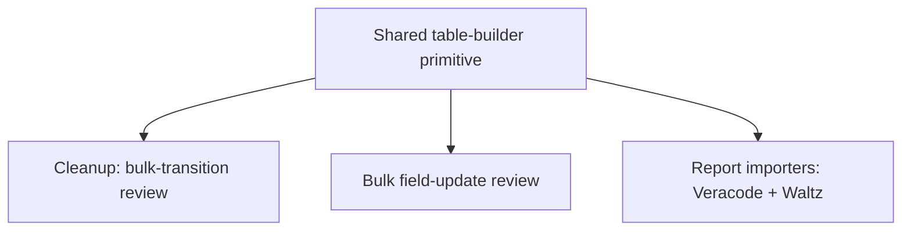

# Unify Review-Table Rendering - Plan

## Goal Capsule

- **Objective:** Every review screen in Ticket Sidekick (cleanup's bulk-transition review, bulk field-update review, and the report-importer review) renders from one shared, documented table shape instead of three independently-maintained implementations, so a future review-table-shaped feature extends the shared shape instead of writing a fourth one.
- **Means:** Extract a single configurable table-builder, generalized from the report importers' existing `ReviewTableColumn<TRow>[]` descriptor pattern, and migrate all three existing consumers onto it. Reply-parsing semantics (skip vs. toggle) are untouched.
- **Product authority:** Session-settled across the invoking brainstorm dialogue — see Key Decisions.
- **Open blockers:** None. Both items originally deferred to planning (module location, migration order) are resolved — see Planning Contract's Key Technical Decisions and Sequencing.

---

## Product Contract

### Summary

Extract one shared, configurable table-rendering primitive for review screens and migrate all three existing consumers — cleanup's bulk-transition review, bulk field-update review, and the report importers' review — onto it. Reply-parsing semantics (skip-family vs. toggle-family) stay exactly as they work today; only the rendering code becomes shared.

### Problem Frame

Three review-table implementations exist in `src/participant/sessionState.ts` today, split across two interaction families: a skip-semantics family (cleanup's bulk-transition review and bulk field-update review — default-all-included, reply lists rows to exclude) and a toggle-semantics family (the report importers, already unified across Veracode and Waltz behind one descriptor). The report-importer consolidation plan (`docs/plans/2026-08-13-001-refactor-consolidate-report-importers-plan.md`) named the cross-family table-rendering duplication directly and deliberately parked it as "a real interaction-model difference a future unification will need to reconcile." Left alone, every future bulk-action feature repeats the same table-rendering code again — the same cost the Veracode/Waltz consolidation already paid once, for the same reason.

No specific new feature is blocked on this today; it is preventive debt paydown, surfaced by a recent ideation pass over the repo's known technical debt (`docs/ideation/2026-08-20-open-technical-debt-ideation.html`).

### Requirements

No Key Flows section: this work changes no user-facing flow — the existing build-table → reply → apply sequence is unchanged for all three consumers; only the rendering call underneath it moves.

**Shared rendering primitive**
- R1. A single configurable table-builder function renders review-screen tables from a column-descriptor input, generalized from the report importers' existing `ReviewTableColumn<TRow>[]` shape.
- R2. The primitive covers the structural elements currently duplicated across the three existing implementations: borders, headers, and the separator row. Multi-section screens (the report importers' "Already ticketed" / "New" split) get their section framing from their wrapper calling the primitive once per section, per KTD3 — not from the primitive holding a sections concept itself. No column-width truncation exists in any current implementation (confirmed by research) and none is added.
- R3. The primitive is presentation-only: it has no opinion on skip vs. toggle reply semantics, session shape, or how a reply is parsed or applied.

**Migration**
- R4. Cleanup's bulk-transition review renders through the shared primitive, with no change to its skip-semantics reply parsing or its visible reply syntax.
- R5. Bulk field-update review renders through the shared primitive, with no change to its skip-semantics reply parsing or its visible reply syntax.
- R6. The report importers' review (Veracode and Waltz, via the existing descriptor pattern) renders through the shared primitive, with no change to its toggle-semantics reply parsing or its visible reply syntax.
- R7. Migrated output is materially equivalent to today's rendered output — the table continues to serve the same content to the reader — not required to be byte-identical.

### Key Decisions

- **Preventive debt paydown, not a blocked feature** (session-settled: user-directed — chosen over waiting for a concrete third consumer to appear: a recent ideation pass already flagged the cross-family duplication risk, and nothing external is forcing the question). Governs R1-R7.
- **All three existing consumers migrate in this work, not one pilot with the rest deferred** (session-settled: user-directed — chosen over migrating only cleanup and leaving report importers and bulk field-update for a later touch: the other two are structurally close enough to cleanup, and to each other, that migrating them repeats the same swap rather than separate design work, and doing all three keeps the three review screens consistent). Governs R4, R5, R6.
- **Shared primitive is one configurable table-builder** (session-settled: user-directed — chosen over a toolkit of small composable render helpers, and over also sharing the reply-*application* logic behind one inclusion predicate: closest to the report importers' existing structured shape, smallest new concept surface, and stays inside the render-only boundary). Governs R1, R2, R3.
- **Equivalence bar is "serves the same content," not byte-identical** (session-settled: user-directed — chosen over requiring an exact output match: the rendering exists to serve the content displayed). Governs R7.
- **Reply-parsing semantics stay fully separate** (carried from the originating ideation idea, reaffirmed by the mechanism decision above — skip vs. toggle is the "real interaction-model difference" the consolidation plan already identified and deferred; this work does not reopen it). Governs R3 and the Scope Boundaries below.

### Scope Boundaries

- Unifying toggle-vs-skip reply-parsing and reply-application semantics is out of scope — stays exactly where the original consolidation plan left it.
- No new review-table consumer is introduced by this work; only the three existing ones are migrated.
- No change to any review screen's visible reply syntax — the numbers or ids a user types to include, exclude, or toggle a row.

### Dependencies / Assumptions

- The report importers' `ReviewTableColumn<TRow>[]` descriptor shape generalizes to the skip-family consumers as a flat rows-in, string-out primitive (research confirmed: cleanup's parent/subtask grouping does not fit a flat descriptor directly, so the caller flattens and decorates rows before calling the primitive — see KTD3 — rather than the primitive growing a second, grouped shape). No structural mismatch severe enough to change scope was found.
- Existing test coverage for `parseSkipInput`, `parseReviewInput`, `buildReviewTable`, and `buildImportReviewTable` (`src/test/JiraParticipant.test.ts`, `src/test/cleanupHandler.test.ts`) is confirmed sufficient as a regression net for those four functions. Bulk field-update's rendered output has **no existing test coverage** — its render logic is inline in `src/participant/JiraParticipant.ts:1059-1084`, a `vscode`-importing file Vitest cannot load — so this migration is the first time that output becomes testable. See U3.

---

## Planning Contract

**Product Contract preservation:** restructured, no scope change — R2's "column truncation" was removed: research confirmed no column-width truncation logic exists anywhere in the three current implementations, so there was nothing to preserve. R2 now names the two structural elements that actually are duplicated (borders, section framing). No other Requirement, Key Decision, or Scope Boundary changed.

### Key Technical Decisions

- KTD1. **The shared primitive lives in `src/participant/sessionState.ts`, extended in place — not a new file.** Every sibling function it replaces already lives there, and CLAUDE.md documents `sessionState.ts` as the home for pure, `vscode`-free session/render logic for the Jira participant. Governs R1.
- KTD2. **The existing public function names and signatures (`buildReviewTable(session)`, `buildImportReviewTable(rows, baseUrl, totalNewMatched, columns, itemNoun)`) stay unchanged, as thin wrappers around one new internal primitive.** Avoids rewriting the ~15 tests that call them directly (`src/test/cleanupHandler.test.ts:718-788`, `src/test/JiraParticipant.test.ts:863-1044`) and keeps this refactor internal-only. A new `buildBulkUpdateReviewTable(...)`-shaped wrapper is added for bulk field-update, which has no existing public render function to preserve. Governs R4, R5, R6.
- KTD3. **Row grouping and section framing stay a caller concern; the primitive renders one flat, pre-built row list per call.** Cleanup's parent/subtask formatting (indentation, the conditional Resolution column) is computed by cleanup's own wrapper before calling the primitive, the same way `buildImportReviewTable` already lets its caller compute `included`/`existingTicketKey` per row. A multi-section screen (the report importers' "Already ticketed" / "New" split) is composed by its wrapper calling the primitive once per section — passing that section's own column array, including a column (like "Already ticketed"'s extra `Ticket` column) not shared with the other section — and prepending its own section heading before each call's output. The primitive itself stays "headers + rows + separator style → string" for one call, with no grouping, indentation, or cross-section concept of its own. Governs R1, R2, R3.
- KTD4. **The primitive standardizes the separator-row rendering to one computed style** (a dash cell per column, e.g. `columns.map(() => '---').join(' | ')`), replacing three different hand-written separator strings. Cosmetic-only change, inside the R7 equivalence bar the Product Contract already grants. Governs R2, R7.
- KTD5. **The primitive adds no cell sanitization, no invalid-reply re-render policy, and no session-expiry checks.** All three stay caller decisions, exactly as they are today — a shared primitive is not the place to add cross-cutting behavior beyond what was asked. Governs R3.
- KTD6. **Bulk field-update's existing behavior of not re-rendering the table on an invalid reply is preserved unchanged**, even though cleanup and the report importers both do re-render on an invalid reply. This is a real, pre-existing divergence between consumers, not something the primitive should homogenize. Governs R5.
- KTD7. **A final cross-consumer verification pass is required after all three consumers are migrated**, comparing each consumer's actual rendered output (real session data, not just fixtures) before and after migration. Re-running the pre-existing unit test suite alone does not satisfy this — this repo has twice already shipped a refactor of shared code where the existing test suite stayed green while real behavior drifted, because the fixtures shared the same blind spot as the code under test (`docs/solutions/security-issues/waltz-oss-report-markdown-injection-in-jira-wiki-converter.md`, `docs/solutions/integration-issues/waltz-oss-report-unzip-failure-on-real-world-xlsx.md`). Governs U5.

### Sequencing

Migrate in this order: cleanup (U2) first — the most-tested, simplest consumer, and the one whose row-flattening approach (KTD3) needs proving first since the other two don't need it. Bulk field-update (U3) next — new territory (no existing render tests), lower risk to attempt after the primitive is already proven against one real consumer. Report importers (U4) last — already the best-structured of the three, so expected to be the smallest diff. Final verification (U5) runs only after U2, U3, and U4 are all complete.

---

## Implementation Units

### U1. Extract the shared table-rendering primitive

- **Goal:** Add one new internal primitive in `sessionState.ts` that turns a column-descriptor input plus a flat row list into a rendered markdown table string — borders, header, standardized separator, section framing. No truncation, no sanitization, no reply-semantics awareness.
- **Requirements:** R1, R2, R3
- **Dependencies:** None
- **Files:**
  - `src/participant/sessionState.ts` — add the primitive and any new shared types alongside the existing `ReviewTableColumn<TRow>` interface
  - `src/test/sessionState.test.ts` (new) — unit tests for the primitive itself, independent of any consumer
- **Approach:**
  1. Generalize `ReviewTableColumn<TRow>[]` (currently scoped to `buildImportReviewTable`) into the primitive's column-descriptor input.
  2. Implement standardized separator rendering per KTD4.
  3. Keep the primitive free of grouping, sanitization, re-render policy, and expiry logic per KTD3, KTD5.
- **Patterns to follow:** `buildImportReviewTable`'s existing column-descriptor shape (`sessionState.ts:500-583`) is the closest existing precedent — generalize it rather than inventing a new shape.
- **Test scenarios:**
  - Given a column descriptor and a flat row list, the primitive renders a header row, a separator row, and one data row per input row, each cell pipe-delimited.
  - Given zero rows, the primitive renders header and separator only (no data rows), matching how each consumer already handles the empty case upstream of the call.
  - Given cell content containing a literal `|` or newline, the primitive does not attempt to escape or strip it (sanitization stays a caller concern — Test expectation confirms KTD5, not new behavior).
  - Given two separate calls with different column arrays (one per section, per KTD3), each call renders independently — the primitive holds no state between calls, so U4 can compose a multi-section screen from repeated single calls.
- **Verification:** New primitive unit tests pass in isolation, with no dependency on any of the three consumers.

### U2. Migrate cleanup's bulk-transition review

- **Goal:** `buildReviewTable(session)` becomes a thin wrapper: cleanup flattens its parent/subtask rows (with indentation and the conditional Resolution column) into the primitive's row shape, then calls U1's primitive.
- **Requirements:** R4, R7
- **Dependencies:** U1
- **Files:**
  - `src/participant/sessionState.ts` — `buildReviewTable` becomes a wrapper; `parseSkipInput` is untouched
  - `src/test/cleanupHandler.test.ts` — existing describe blocks (`parseSkipInput`, `buildReviewTable`) must continue to pass unchanged
- **Approach:**
  1. Move `buildReviewTable`'s row-flattening logic (parent/subtask ordering, `↳ Sub-task` prefix, conditional Resolution column) into the wrapper, ahead of the primitive call.
  2. Confirm cascading skip behavior in `parseSkipInput` is untouched — this unit changes rendering only.
- **Patterns to follow:** The existing `buildReviewTable` implementation (`sessionState.ts:92-115`) for exact row-ordering and formatting to preserve.
- **Test scenarios:**
  - Existing `cleanupHandler.test.ts` `buildReviewTable` describe block passes unchanged: header columns present, conditional Resolution column, alphabetical sort by `currentStatus`, subtask placement with `↳` prefix immediately after its parent, footer prompt text.
  - Existing `parseSkipInput` tests pass unchanged (this unit does not touch reply parsing).
- **Verification:** `cleanupHandler.test.ts` passes with no test file changes required.

### U3. Migrate bulk field-update review

- **Goal:** Extract the inline table-building currently in `JiraParticipant.ts:1059-1084` into a new `buildBulkUpdateReviewTable(...)`-shaped wrapper in `sessionState.ts`, calling U1's primitive. `parseBulkUpdateReview` is untouched.
- **Requirements:** R5, R7
- **Dependencies:** U1
- **Files:**
  - `src/participant/JiraParticipant.ts` — remove the inline table-building at `:1059-1084`; call the new wrapper instead
  - `src/participant/sessionState.ts` — add `buildBulkUpdateReviewTable(...)`
  - `src/test/JiraParticipant.test.ts` — add new tests for the wrapper's rendered output (first coverage; none exists today)
- **Execution note:** The current inline table lives in `JiraParticipant.ts`, a `vscode`-importing file Vitest cannot load — "characterizing" it means reading its current output shape directly from source and hand-transcribing the expected strings, not importing and calling the existing code. Write those transcribed expectations as the new wrapper's first tests before wiring `JiraParticipant.ts` to call it, so the extraction has a concrete before/after to check against.
- **Approach:**
  1. Read the current inline implementation (`JiraParticipant.ts:1059-1084`) and transcribe its exact output — the `| Key | Summary | Current value |` shape and the footer prompt text — into expected-output test assertions for the new wrapper (per Execution note).
  2. Extract the row-building and primitive call into `buildBulkUpdateReviewTable`.
  3. Confirm the invalid-reply path still does not re-render the table (KTD6) — this is a caller-side decision in `JiraParticipant.ts`, not something the primitive enforces.
- **Patterns to follow:** `buildImportReviewTable`'s wrapper shape (rows decorated by the caller, primitive handles only structure) is the nearest precedent, more so than cleanup's grouped rows.
- **Test scenarios:**
  - Given a set of tickets with current field values, the rendered table matches today's exact column set and row content (transcribed from the current inline implementation per the Execution note).
  - Given an `ok` reply, the session clears and the bulk update runs, matching current behavior.
  - Given an invalid reply, the table is **not** re-rendered (per KTD6) — only the existing short hint is shown.
  - Existing `parseBulkUpdateReview` tests (`JiraParticipant.test.ts:601-621`) pass unchanged.
- **Verification:** New render-output tests pass, `parseBulkUpdateReview` tests pass unchanged, and the characterization tests written in step 1 pass against the post-migration output.

### U4. Migrate report importers' review

- **Goal:** `buildImportReviewTable(...)` becomes a thin wrapper around U1's primitive. `parseReviewInput` and `applyReviewToggle` are untouched.
- **Requirements:** R6, R7
- **Dependencies:** U1
- **Files:**
  - `src/participant/sessionState.ts` — `buildImportReviewTable` becomes a wrapper
  - `src/test/JiraParticipant.test.ts` — existing `buildImportReviewTable`/`parseReviewInput`/`applyReviewToggle` describe blocks must continue to pass unchanged
- **Approach:**
  1. Call the primitive once per section, per KTD3: once for "Already ticketed" rows with their column array (including the extra `Ticket` column), once for "New" rows with theirs — composing the two outputs under their existing section headings and the wrapper's own synthesized `#`/`Include?` cells, exactly as today.
  2. Confirm `isSessionExpired`/`CURRENT_SESSION_SCHEMA_VERSION` handling (session-lifecycle logic, not rendering) is untouched.
- **Patterns to follow:** `buildImportReviewTable`'s current implementation (`sessionState.ts:519-583`) is both the pattern to follow and the function being migrated.
- **Test scenarios:**
  - Existing tests pass unchanged: already-ticketed/new split, link-vs-plain-key by `baseUrl` presence, empty-new-rows message, `totalNewMatched` truncation note, `BATCH_LIMIT`-exceeded warning text, toggle case-insensitivity, `applyReviewToggle` immutability.
  - Each section ("Already ticketed", "New") renders via its own primitive call with its own column array; the two outputs concatenate under their existing headings, matching today's combined structure.
  - Existing `isSessionExpired` guard test continues to pass, confirming this unit did not touch session-lifecycle logic.
- **Verification:** `JiraParticipant.test.ts`'s import-review describe blocks pass with no test file changes required.

### U5. Final cross-consumer verification

- **Goal:** Confirm all three consumers render materially-equivalent output after migration, per KTD7 — not just that the existing test suites pass.
- **Requirements:** R7
- **Dependencies:** U2, U3, U4
- **Files:** None (verification only; any drift found here is fixed in the unit it belongs to, not a new file).
- **Approach:**
  1. For each consumer, capture rendered table output for one representative real (or realistic) session before this plan's changes and after, and diff them.
  2. Confirm every difference is explained by an intended change (KTD4's separator standardization) and nothing else.
  3. Do not rely on the existing tests' `.toContain`-style assertions alone as proof of equivalence — they check individual substrings, not full structure, so a reordering or an unchecked dropped cell could still pass them. The before/after diff in step 1 is the actual proof.
- **Test scenarios:**
  - Covers R7. Cleanup's rendered output, before vs. after: differences limited to the separator row.
  - Covers R7. Bulk field-update's rendered output, before vs. after: differences limited to the separator row.
  - Covers R7. Report importers' rendered output, before vs. after: differences limited to the separator row.
- **Verification:** All three diffs show only the expected separator-style change, with no other content, ordering, or wording drift.

---

## Verification Contract

| Command | Purpose |
|---|---|
| `npm run compile` | TypeScript type check — catches signature mismatches from the wrapper refactor across all four touched files. |
| `npm test` | Vitest unit suite — must stay green throughout; `cleanupHandler.test.ts` and `JiraParticipant.test.ts` are the primary regression net (see each unit's Test Scenarios). |

CI (`.github/workflows/ci.yml`) runs `npm ci` → `npm run compile` → `npm test` on every push and pull request; both commands above must pass locally before pushing. No new CI configuration is needed — this refactor introduces no new tooling, dependency, or environment variable.

---

## Definition of Done

- `npm run compile` and `npm test` pass.
- All three consumers (cleanup, bulk field-update, report importers) render through the U1 primitive — no consumer still builds a table string directly.
- U3's characterization tests exist and pass, giving bulk field-update its first render-side coverage.
- U5's before/after comparison is complete for all three consumers, with no unexplained output drift.
- No reply-parsing behavior or visible reply syntax changed for any consumer (`parseSkipInput`, `parseBulkUpdateReview`, `parseReviewInput`, `applyReviewToggle` all unchanged).
- No dead code remains: the inline table-building removed from `JiraParticipant.ts` in U3, and the old separator-string literals replaced by KTD4, are fully removed rather than left alongside the new primitive.

---

## How This Work Fits Together

<!-- ce-section: work-relationships -->

This plan closes one specific item the report-importer consolidation deferred, not a new initiative.

- Depends on: nothing unmerged — the descriptor pattern this plan generalizes already exists in the codebase.
- Shares: the same review-table interaction family the consolidation plan analyzed (`docs/plans/2026-08-13-001-refactor-consolidate-report-importers-plan.md`).
- Still to decide: whether toggle-vs-skip reply semantics are ever unified — deliberately out of scope here, as in the originating plan.

---

## Sources / Research

- `docs/plans/2026-08-13-001-refactor-consolidate-report-importers-plan.md` — Scope Boundaries names this exact cross-family rendering unification as deferred.
- `src/participant/sessionState.ts` — existing implementations: `buildReviewTable` / `parseSkipInput` (skip family, cleanup), `parseBulkUpdateReview` (skip family, bulk field-update), `buildImportReviewTable` / `parseReviewInput` (toggle family, report importers) — plus the existing session-schema-versioning mechanism (`CURRENT_SESSION_SCHEMA_VERSION`, `isSessionExpired()`) available for any migration to reuse.
- `docs/ideation/2026-08-20-open-technical-debt-ideation.html` — the originating idea and its basis.
- `docs/solutions/security-issues/waltz-oss-report-markdown-injection-in-jira-wiki-converter.md` — prior case in this repo of a fix hardened for one shared-code consumer not automatically transferring to a second; motivates KTD7.
- `docs/solutions/integration-issues/waltz-oss-report-unzip-failure-on-real-world-xlsx.md` — prior case where "existing tests stayed green" was a weak regression signal because the tests shared a blind spot with the code under test; also motivates KTD7.
- `src/participant/JiraParticipant.ts:1059-1084` — bulk field-update's current inline table-building, the extraction target for U3.
