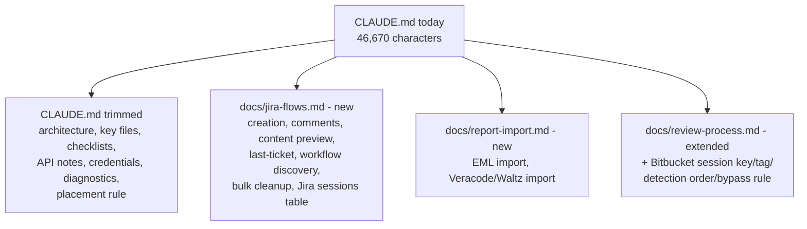

# CLAUDE.md Knowledge Restructure - Plan

## Goal Capsule

- **Objective:** This project's operating knowledge (`CLAUDE.md` plus `docs/`) is organized so each fact lives in exactly one place, `CLAUDE.md` carries only what nearly every session needs, and the structure resists re-bloating the way it grew before this rewrite.
- **Means:** Split `CLAUDE.md` into a lean index plus a small set of domain-grouped satellite docs, remove hand-duplicated copies of facts that already exist in code/config, add a standing placement rule to `CLAUDE.md` itself, and execute the rewrite now.
- **Product authority:** Repo owner, established in the source brainstorm dialogue.
- **Open blockers:** None. All three planning-deferred choices from the brainstorm are resolved below (KTD1-KTD3).

## Product Contract

### Summary

Restructure `CLAUDE.md` and `docs/` so `CLAUDE.md` stays a lean, always-loaded index — architecture rules, the key-files map, operation checklists, settings/credentials pointers — while full feature-flow detail lives in a small number of domain-grouped docs. Remove duplicated content that already has a source of truth elsewhere in the repo, and add a standing rule to `CLAUDE.md` so new detail lands in the domain doc, not back in `CLAUDE.md`.

### Problem Frame

`CLAUDE.md` is 46,670 characters. Each feature this repo has shipped came with a matching `CLAUDE.md` update commit — 55 commits total touching the file — growing it roughly in step with feature count, with no corresponding split-out step. Claude Code notified the user that the file exceeds its 40,000-character guidance threshold. Unlike files under `docs/`, which load into a session only when something reads or references them, `CLAUDE.md`'s entire content loads into *every* session automatically, so everything in it is paid for on every turn regardless of relevance.

The repo already has partial precedent for pulling detail out of `CLAUDE.md`: `docs/review-process.md` holds the full Bitbucket PR review pipeline (with diagrams), `docs/solutions/` holds past bug write-ups by category, and `CONCEPTS.md` holds domain vocabulary. But that precedent wasn't generalized — `CLAUDE.md`'s own "PR review flow (Bitbucket)" section still re-describes, in prose, nearly everything `review-process.md` already covers with diagrams, and several settings/session-state tables in `CLAUDE.md` are hand-maintained copies of facts that already exist in `package.json` (`contributes.configuration`, 25 properties) or as literal string constants in source.

### Requirements

**Target structure**

- R1. `CLAUDE.md` is trimmed to what nearly every session needs: architecture/layering rules, the key-files map, the "adding a new operation" checklists (Jira and Bitbucket), settings/credentials pointers, diagnostics conventions, and a short summary plus link for each feature-flow area — not full flow narratives.
- R2. Full feature-flow detail (multi-step behavior, session-state tables, per-feature edge cases) moves into domain-grouped docs rather than staying inline: a Jira-flows doc covering ticket creation, bulk cleanup, workflow discovery, comment handling, content preview/refinement, last-ticket context, and the Jira multi-turn session-state table; a report-import doc covering EML import and the shared Veracode/Waltz `reportImportHandler` flow (these already share one implementation per the current `CLAUDE.md`).
- R3. `docs/review-process.md` remains the sole detailed source for the Bitbucket PR review pipeline; `CLAUDE.md`'s "PR review flow (Bitbucket)" section is cut to a short summary plus link, removing the prose restatement of steps `review-process.md` already covers.

**De-duplication against source of truth**

- R4. Settings keys are documented in exactly one authoritative place. `CLAUDE.md` no longer carries a hand-typed table that duplicates `package.json`'s `contributes.configuration` and can drift from it as settings are added.
- R5. The Jira multi-turn session-state table (workspaceState key + response tag per session) is verified against the current source at migration time and relocated into the Jira-flows doc rather than existing in two places.

**Migration and governance**

- R6. This restructuring is executed as an immediate rewrite — `CLAUDE.md` and the new/updated domain docs are edited to match this plan's target shape as part of this work, not left as a future backlog item.
- R7. `CLAUDE.md` gains a standing, explicit rule instructing contributors and agents that new feature-flow detail belongs in the relevant domain doc, with `CLAUDE.md` updated only with a one-line summary and link — so the file does not regrow the way it did before this rewrite.

### Key Decisions

- **Domain-grouped satellite docs over one doc per feature.** Two new docs (Jira-flows, report-import) rather than seven-plus per-feature docs — fewer files to keep in sync than the fine-grained alternative, at the cost of slightly coarser grouping. Governs R2. (session-settled: user-approved — chosen over a doc-per-feature split: the repo's own `review-process.md` already carries a "keep in sync" self-reminder, showing more files means more sync risk, not less.)
- **Bitbucket's PR review section is trimmed too, not left alone.** `CLAUDE.md` already partially duplicates `review-process.md`; the same summary-plus-link pattern applies there, not only to the new Jira docs. Governs R3. (session-settled: user-approved — surfaced as a call-out with an explicit opt-out offered; user confirmed without opting out.)
- **Settings and session-state tables point at their real source rather than being retyped.** Closes an active drift risk (settings keys), not just a size problem. Governs R4, R5. (session-settled: user-approved.)
- **The rewrite happens now, in this same effort.** Not staged as a documented-but-undone future backlog item. Governs R6. (session-settled: user-directed — the user explicitly asked for the shape to be made consistent now, not just documented as a target.)
- **`CLAUDE.md` states its own placement rule going forward.** Without it, the file regrows the same way it grew to 46,670 characters — by habit, one feature at a time. Governs R7. (session-settled: user-directed.)

### Acceptance Examples

- AE1. **Covers R7.** When a contributor implements a new Jira operation and follows `CLAUDE.md`'s "adding a new operation" checklist, the step that used to say "update CLAUDE.md" now results in a one-line summary and a link added to the Jira-flows doc, not new flow prose inside `CLAUDE.md` itself.
- AE2. **Covers R2.** When someone needs the full Veracode/Waltz report-import flow, they follow one link from `CLAUDE.md` to the report-import doc and find the complete step list there — not split across `CLAUDE.md` and a satellite doc.
- AE3. **Covers R3.** When someone needs the full Bitbucket PR review pipeline, `CLAUDE.md` points them to `docs/review-process.md` in one line rather than repeating the pipeline steps inline.
- AE4. **Covers R4.** When a new setting is added to `package.json`'s `contributes.configuration`, no corresponding edit to a `CLAUDE.md` settings table is needed to keep `CLAUDE.md` accurate, because `CLAUDE.md` references the config schema rather than re-listing each key.

### Success Criteria

- `CLAUDE.md`'s size drops from ~46,700 characters to under 30,000 characters, comfortably clear of the 40,000-character trigger.
- No fact appears verbatim in both `CLAUDE.md` and a domain doc — each fact has exactly one owning location.
- A reader of `CLAUDE.md` alone can still reach full detail for every feature area covered by this plan through exactly one link.

### Scope Boundaries

- `docs/solutions/`, `docs/plans/`, `docs/ideation/`, `docs/presentation/`, and `CONCEPTS.md` stay untouched — this rewrite only touches `CLAUDE.md` and the domain docs it links to (the new Jira-flows and report-import docs, and the existing `docs/review-process.md`).
- This plan defines and executes the target structure; it does not introduce a new documentation *tool* or generator (e.g., auto-generating a settings table from `package.json`) — pointing to the source file by reference is sufficient.

### Dependencies / Assumptions

- Assumes `docs/review-process.md` stays the authoritative Bitbucket doc as-is; this work only changes what `CLAUDE.md` says about it, and adds the small set of session-state facts it was missing.
- Assumes `package.json`'s `contributes.configuration` remains the single source of truth for settings keys; no separate generated settings doc is introduced.

### Sources / Research

- `CLAUDE.md` (repo root) — full current content read section-by-section to identify every fact and its target destination; 46,670 characters, 55 historical commits touching it.
- `docs/review-process.md` — existing precedent for a domain-grouped satellite doc with diagrams; already narrates `ReviewSession` mechanics in prose (missing only the workspaceState key, tag, detection order, and PR-URL-bypass facts CLAUDE.md currently carries).
- `docs/solutions/` — existing precedent for category-grouped (not per-incident) documentation; confirmed to hold no learnings relevant to documentation restructuring itself.
- `package.json` `contributes.configuration` — source of truth for settings keys (25 properties, confirmed by direct read), currently hand-duplicated across four tables in `CLAUDE.md`.
- `CONCEPTS.md` — confirmed present; out of scope for this rewrite, unaffected.

---

## Planning Contract

**Product Contract preservation:** Unchanged — this plan was authored in the same session as the source brainstorm; no conflicts surfaced during planning.

### Key Technical Decisions

- KTD1. **Settings keys become a prose pointer, not a thinner table.** `CLAUDE.md`'s "VS Code settings keys" section is replaced with one short paragraph naming the five settings-key prefixes (`ticketSidekick.jira.*`, `.bitbucket.*`, `.email.*`, `.veracode.*`, `.waltz.*`) and pointing at `package.json`'s `contributes.configuration` for the authoritative list. Governs R4. (session-settled: user-approved — chosen over keeping a table with just the key values stripped: a table missing the keys themselves has no scanning value over prose, and prose costs no upkeep as settings are added.)
- KTD2. **Bitbucket session-state facts merge into `docs/review-process.md`'s existing "Follow-ups" area**, not a new section. Only the facts not already narrated there are added: the `workspaceState` key (`bitbucket.session.review`), the response tag (`<!-- bitbucket:review-session -->`), the handler's detection order, and the PR-URL-bypass rule. Governs R3, R5.
- KTD3. **EML import and Veracode/Waltz import share one new doc, `docs/report-import.md`**, matching their shared `reportImportHandler.ts` implementation already noted in `CLAUDE.md`'s current text. Governs R2.
- KTD4. **`CLAUDE.md`'s six Jira flow headings (creation, comments, content preview, last-ticket, workflow discovery, bulk cleanup) collapse into one combined "Jira flows" pointer section** linking to `docs/jira-flows.md`, rather than staying as six separate stub headings. Governs R1, R2. (session-settled: user-approved — surfaced as a call-out at plan-time synthesis; user confirmed without redirecting.)
- KTD5. **Both "Adding a new operation" checklists (Jira and Bitbucket) gain one line** directing new multi-step-flow detail to the relevant domain doc, reinforcing R7 at the exact point where past growth happened rather than relying on a standalone rule alone. Governs R7.

### High-Level Technical Design

`CLAUDE.md`'s content splits four ways: what stays in place, and three destinations for what moves out.

`docs/jira-flows.md` and `docs/report-import.md` are new files, authored fresh from content relocated out of `CLAUDE.md`. `docs/review-process.md` already exists and gains only the Bitbucket session-state facts it was missing — everything else it already covers about the PR review pipeline stays as-is.

### Sequencing

U1, U2, and U3 create/extend the destination docs and can proceed in any order (no interdependencies). U4 trims `CLAUDE.md` and must run last, since it links to the final headings the other three units produce.

---

## Implementation Units

### U1. Create docs/jira-flows.md

**Goal:** Relocate every Jira feature-flow section from `CLAUDE.md` into one new domain doc, following `docs/review-process.md`'s existing style.

**Requirements:** R2, R5. Covers AE1, AE2 (parallel case for Jira flows).

**Dependencies:** None.

**Files:**
- `docs/jira-flows.md` (new)

**Approach:**
1. Open with a short intro paragraph naming the doc's scope and the code files it documents: `src/participant/jira/*Handler.ts`, `src/participant/sessionState.ts`, `src/services/WorkflowService.ts` — mirroring `docs/review-process.md`'s opening pattern (scope statement + "the code lives in" list).
2. Move `CLAUDE.md`'s "Ticket creation flow" section verbatim, as its own `##` heading.
3. Move "Comment handling" verbatim.
4. Move "Content preview/refinement" verbatim.
5. Move "Last-ticket context" verbatim.
6. Move "Workflow discovery" verbatim.
7. Move "Bulk cleanup" verbatim.
8. Move the Jira sessions table and its "Detection order" sentence out of `CLAUDE.md`'s "Multi-turn session state" section, under a "Session state" heading; keep the general tag/workspaceState mechanism explanation in `CLAUDE.md` (see U4) rather than duplicating it here.
9. Relocate facts verbatim — this is a move, not a rewrite. No paraphrasing that could silently drop a detail (exact endpoint paths, field names, session/tag names).

**Test expectation:** none -- documentation-only relocation; no code or runtime behavior changes.

**Verification:** Read the new doc top to bottom and confirm every fact from the seven source sections is present: the four-step field-resolution order in ticket creation, the `POST /rest/api/2/issue` endpoint, all `contentSource` values, the ticket-key resolution priority order, all `cleanupRules` fields, and all seventeen rows of the Jira sessions table (session name, workspaceState key, response tag).

### U2. Create docs/report-import.md

**Goal:** Relocate the EML import and Veracode/Waltz OSS report import sections from `CLAUDE.md` into one new domain doc.

**Requirements:** R2. Covers AE2.

**Dependencies:** None.

**Files:**
- `docs/report-import.md` (new)

**Approach:**
1. Open with a short intro paragraph naming the doc's scope and code files: `src/utils/reportImport.ts`, `src/participant/jira/reportImportHandler.ts`, `src/utils/veracodeReport.ts`, `src/participant/jira/veracodeHandler.ts`, `src/utils/waltzReport.ts`, `src/participant/jira/waltzHandler.ts`, `src/utils/emlParser.ts`, `src/participant/jira/emailHandler.ts`.
2. Move "EML email import" (including the "Import flow" and `pickEmailOption` subsections) verbatim.
3. Move "OSS/vulnerability report import (Veracode + Waltz)" verbatim, including the shared-implementation intro, both "Veracode report import" and "Waltz OSS report import" subsections, both "Known limitation" notes, and the "Component labels" note.
4. Preserve the existing cross-reference to `docs/plans/2026-08-13-001-refactor-consolidate-report-importers-plan.md` intact.

**Test expectation:** none -- documentation-only relocation; no code or runtime behavior changes.

**Verification:** Read the new doc top to bottom and confirm every fact from the source sections is present: the 9-step EML import flow, both "Known limitation" notes, the `sanitizeComponentLabel()` behavior, and all numbered steps of both the Veracode and Waltz import flows.

### U3. Extend docs/review-process.md with Bitbucket session-state facts

**Goal:** Add the Bitbucket session mechanics `CLAUDE.md` currently documents but `review-process.md` does not, without restating what `review-process.md` already says.

**Requirements:** R3, R5. Covers AE3.

**Dependencies:** None.

**Files:**
- `docs/review-process.md` (modify)

**Approach:**
1. Near the existing "Follow-ups" section, add a short "Session state" note giving the `workspaceState` key (`bitbucket.session.review`) and response tag (`<!-- bitbucket:review-session -->`).
2. In the same note, state the handler's detection order (check command → comment preview → review-session follow-up → new PR review) and the PR-URL-bypass rule (a PR URL anywhere in the prompt always starts a fresh review, even when a session marker is present), citing `hasPrUrl()` in `reviewSessionState.ts`.
3. Do not restate what "Follow-ups" already says about `ReviewSession`, `rawDiff`, or `rawDiffTruncated` — add only the key/tag/detection-order/bypass facts that are net-new to this doc.

**Test expectation:** none -- documentation-only addition; no code or runtime behavior changes.

**Verification:** Confirm the new note states the exact key, tag, detection order, and bypass rule, and that no sentence duplicates existing "Follow-ups" content.

### U4. Trim CLAUDE.md to a lean index and add the placement rule

**Goal:** Reduce `CLAUDE.md` to what nearly every session needs, replacing migrated content with short summaries and links to the docs U1-U3 produced, and add the standing placement rule.

**Requirements:** R1, R3, R4, R6, R7. Covers AE1, AE3, AE4.

**Dependencies:** U1, U2, U3.

**Files:**
- `CLAUDE.md` (modify)

**Approach:**
1. Replace the "VS Code settings keys" section with one paragraph naming the five settings-key prefixes (including `ticketSidekick.veracode.*`) and pointing to `package.json`'s `contributes.configuration` (KTD1). Remove all four settings tables.
2. Collapse "Ticket creation flow", "Comment handling", "Content preview/refinement", "Last-ticket context", "Workflow discovery", and "Bulk cleanup" into one combined "Jira flows" section: a short paragraph naming what each covers, plus one link to `docs/jira-flows.md` (KTD4).
3. Replace "PR review flow (Bitbucket)" with a short summary paragraph plus the link to `docs/review-process.md` — remove the 15-step walkthrough and the "Review mode"/"Follow-up turns"/"Line-number invariant" detail now that `review-process.md` (extended by U3) covers all of it.
4. Replace "EML email import" and "OSS/vulnerability report import (Veracode + Waltz)" with one combined "Report import" section: a short paragraph naming what it covers, plus one link to `docs/report-import.md`.
5. In "Multi-turn session state", keep the general tag/workspaceState mechanism paragraph; replace the Jira sessions table with a one-line pointer to `docs/jira-flows.md`, and replace the Bitbucket sessions subsection with a one-line pointer to `docs/review-process.md`.
6. Add a new short section, "Where documentation belongs", stating: new multi-step feature-flow detail goes in the relevant domain doc (`docs/jira-flows.md`, `docs/report-import.md`, `docs/review-process.md`, or a new domain doc when none fits); `CLAUDE.md` gets only a one-line summary and a link (R7).
7. Append one line to both "Adding a new Jira operation" and "Adding a new Bitbucket operation" pointing to that rule (KTD5).
8. Leave every section not named above unchanged: "What this is", "Architecture", "Key files", "Running tests", "Testing", "Jira API", "Bitbucket API", "Credentials", "Diagnostics", "Documented Solutions", "Branch ticket detection".

**Test expectation:** none -- documentation-only edit; no code or runtime behavior changes.

**Verification:** Confirm `CLAUDE.md`'s final character count is under 30,000; confirm every link added in steps 2-5 resolves to a real heading in its target doc; confirm every fact removed from `CLAUDE.md` in this unit is present in the doc U1, U2, or U3 produced (cross-check against those units' own verification pass); confirm the new "Where documentation belongs" section and both checklist additions are present.

---

## Verification Contract

| Unit | Verification | Repo command |
| --- | --- | --- |
| U1 | Content-fidelity read-through against the original "Ticket creation flow" through "Bulk cleanup" sections plus the Jira sessions table | none (docs-only) |
| U2 | Content-fidelity read-through against the original "EML email import" and "OSS/vulnerability report import" sections | none (docs-only) |
| U3 | Confirm the new note adds only net-new facts, no restatement | none (docs-only) |
| U4 | Character count, link resolution, fact-coverage cross-check | none (docs-only) |
| All | Confirm the change is doc-only and does not affect the build | `npm run compile`, `npm test` |

## Definition of Done

- `CLAUDE.md` is under 30,000 characters.
- `docs/jira-flows.md` and `docs/report-import.md` exist and contain every fact relocated from `CLAUDE.md`'s migrated sections.
- `docs/review-process.md` contains the Bitbucket session key, tag, detection order, and bypass rule, with no restated content.
- No fact from the pre-rewrite `CLAUDE.md` is unreachable — each is present either in `CLAUDE.md` directly or via exactly one link from it.
- The "Where documentation belongs" rule and both checklist additions are present in `CLAUDE.md`.
- `npm run compile` and `npm test` still pass.
- No leftover scratch or draft content from this rewrite remains in any touched file.
