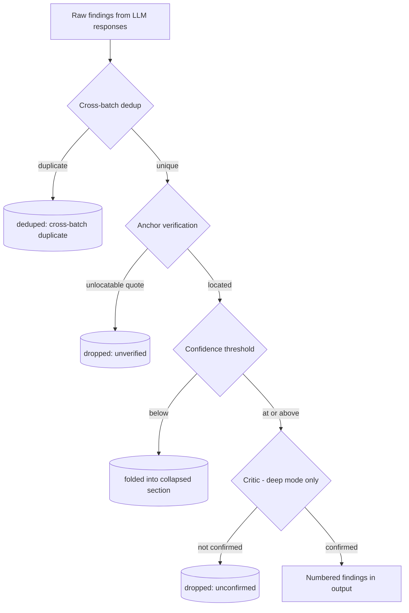

# Bitbucket Review Diagnostics - Plan

## Goal Capsule

- **Objective:** After any Bitbucket PR review — clean or partially failed — reading the Ticket Sidekick output channel alone tells the operator which side of an LLM call is suspect: the model (garbage or cut-off output) or their own configuration and pipeline.
- **Means:** A per-call diagnostic timeline in the shared output channel, an opening line recording effective run configuration, full detail on failures and truncations, a findings funnel at review end, an opt-in setting that adds a structured run record, and one reworded chat message.
- **Product authority:** This plan owns diagnostics for the Bitbucket review pipeline only; retry/split/continuation behavior and the Jira participant are not active scope.
- **Open blockers:** None.

---

## Product Contract

### Summary

The Bitbucket review pipeline logs one compact line per LLM call — pass, batch, attempt, item count, prompt size with estimated tokens, response size, duration, status — opens each run with its effective configuration, records full detail on failures and truncations, and closes with a findings funnel showing where findings dropped and by which stage. A new detailed-diagnostics setting (default off) adds a single structured run record per review. Implementation extends the existing `onDiag`/`logDiag` pattern already used across the Bitbucket pipeline — no new logging mechanism — and keeps new pure logic in `reviewSessionState.ts`/`PrReviewService.ts` so it stays Vitest-testable, matching how `resolveFindingAnchors` and `parseCriticKeep` are already structured.

**Product Contract preservation:** restructured, no scope change — R6's stage list and diagram gained an explicit "deduped as cross-batch duplicate" stage between raw findings and anchor verification. `dedupeFindings` already removes cross-batch duplicates before `formatReview` runs; without a named stage for it, the funnel's counts would not reconcile (raw ≠ deduped + anchor-dropped + confidence-folded + critic-dropped + final). All other R/F/AE IDs are unchanged.

### Problem Frame

A 14-file review whose response came back truncated produced no diagnostic output at all: truncation is the one event in the pipeline that throws nothing, so nothing reaches the output channel, and `docs/review-process.md`'s resilience claim — that every failed attempt is logged to the shared output channel — is silently false for it. The identical retry that resends a full batch after a failure is equally invisible — an operator who saw a second full-size prompt suspected a file-accounting bug (the 13-vs-14 "resume") before tracing it to by-design behavior. Beyond those gaps, the log cannot separate the two suspects of any bad review: the model returning garbage or cut-off output, versus operator-side misconfiguration or a pipeline bug. Effective run configuration is never logged, and per-call sizes and durations exist only in the end-of-run token footer. The anti-hallucination anchor filter drops findings without recording that it did.

### Requirements

**Always-on timeline**

- R1. Every LLM call in the review pipeline (pass 1, truncation continuation, pass 2, critic) emits one compact line to the Ticket Sidekick output channel identifying the pass, batch, attempt, run tag, and what it covered.
- R2. Each per-call line carries prompt size with estimated tokens, response size, duration, and outcome status (ok, truncated, or error with code).
- R3. Each review opens with one line recording the effective run configuration: model identity, resolved token budget, context budget ratio, review mode, critic enabled or not, and context lines.

**Failure and truncation detail**

- R4. A truncated response is recorded as its own diagnostic event: response size, complete result lines parsed versus cut-off tail, whether the final meta line was present, which files had findings and which did not, and a short raw preview of what came back.
- R5. Recovery decisions are logged as their own events — identical retry in flight, batch split into halves, continuation starting with N files — so a reader can follow what happened without knowing the algorithm.

**Findings funnel**

- R6. At review end, a findings funnel summary records counts at each stage: raw findings from LLM responses, deduped as cross-batch duplicate, dropped by anchor verification, folded by confidence threshold, and (deep mode) dropped by critic.

**Detailed diagnostics (opt-in)**

- R7. A new `ticketSidekick.bitbucket.*` setting enables detailed diagnostics, default off. When on, the review additionally emits a single fenced structured run record in the same output channel — run configuration, per-call records, and the findings funnel with drop reasons — copy-pasteable as one block.

**Chat surface**

- R8. The truncation-continuation chat message is reworded so it states what the count means — files that had no findings in the truncated response, being reviewed now — rather than reading as a sequential resume. No other chat-stream changes.

### Key Decisions

- **B always-on baseline with C behind an opt-in toggle** (session-settled: user-directed — chosen over B-only or C-always: general visibility without paying for deep follow-up on every run). Governs R1–R7.
- **Detail lives in the output channel; chat stays terse.** (session-settled: user-approved — chosen over moving diagnostics into the chat stream: project convention puts detail in the channel and glanceable status in chat, and it keeps the stream readable on large reviews.) Governs R1–R8.
- **Structured record as a fenced block in the output channel, not a file** (session-settled: user-approved — chosen over workspace-file output: copy-pasteable with zero new surface; file persistence later if needed). Governs R7.
- **The chat rewording is in scope** (session-settled: user-approved — the original "Continuing review for N uncovered files" line is where the operator's confusion started, and it costs one message). Governs R8.

### Key Flows

- F1. Truncated pass-1 recovery, as logged
  - **Trigger:** A pass-1 response for a batch comes back cut off before its final meta line.
  - **Steps:** The per-call line records the attempt with status truncated (R2); the truncation event records size, parse shape, covered versus uncovered files, and raw preview (R4); a decision line records the continuation starting with N files (R5); the continuation call gets its own per-call line (R1); the end-of-review funnel includes any anchor drops from both responses (R6).
  - **Covers R1, R2, R4, R5, R6.**

### Acceptance Examples

- AE1. Model-side suspect — truncation
  - **Covers R2, R4, R5.**
  - **Given** a pass-1 call whose response is cut off mid-result-line with no final meta line, **when** the review continues, **then** the output channel shows a truncation event with response size, parse shape (complete lines versus cut-off tail), files covered versus uncovered, and a short raw preview — enough to see the model stopped mid-stream rather than the pipeline dropping data.
- AE2. Operator-side suspect — configuration
  - **Covers R3.**
  - **Given** an operator who set an unusually small context budget ratio, **when** a review starts, **then** the opening configuration line shows the effective token budget and ratio alongside model identity — misconfiguration visible without re-running.
- AE3. Detailed record for follow-up
  - **Covers R7.**
  - **Given** detailed diagnostics enabled, **when** a review completes with partial failures, **then** a single fenced structured block appears containing configuration, per-call records, and the funnel with drop reasons — copy-pasteable as one unit for comparing against another run or pasting into a provider bug report.

### Success Criteria

- Reading only the output channel after any completed or partially-failed review lets the operator determine which side of an LLM call is suspect — the model's response or the operator's configuration — without re-running the review.
- With detailed diagnostics on, one copy-pasteable block captures a full run for comparison against another run or for a provider bug report.
- Two `@bitbucket` reviews running concurrently in one VS Code window produce diagnostic lines each attributable to its own review, not interleaved without attribution.

### Scope Boundaries

- The retry/split/continuation algorithm is unchanged — the 13-vs-14 file accounting was verified correct; this work is visibility, not behavior.
- Existing failed-attempt log content (error message, code, covered items, partial-text preview) is preserved as-is.
- No per-file LLM calls — that would eliminate truncation but multiply cost roughly N×.
- The Jira participant's diagnostics are unchanged.
- No file-based persistence of the structured record and no built-in run-comparison tooling — the record enables manual diffing only.
- Raw previews (R4) stay truncated-only, matching the existing partial-text-preview behavior; they are not scanned for secret-shaped content (see KTD2 and Dependencies/Assumptions).
- No hard size cap on the R7 structured record — it scales with call count on large or deep-mode reviews; this is a stated expectation, not a defect.

### Dependencies / Assumptions

- The output channel remains the sole diagnostics surface; this extension has no telemetry service or file store, and none is introduced.
- Short raw previews in the channel are acceptable even though they quote untrusted PR content — bounded length matching the existing partial-text preview, with automatic key-based redaction applied as to all details objects (`src/utils/logRedaction.ts`). This is key-based, not content-based: a real secret embedded in reviewed source could still appear verbatim, truncated but unredacted, in a preview. Accepted as consistent with existing behavior (KTD2); not a new risk this plan introduces.

### Outstanding Questions

None — the three items previously deferred to Planning (line/field format, setting shape, funnel wiring) are resolved below in the Planning Contract.

### Sources / Research

- `src/utils/lmRetry.ts` — `withEasierRetry` bounds attempts to at most 4 per chunk (1 initial + up to 3 retries, 3rd splits the batch in half); its `onAttemptFailed(attempt, err, items)` hook is where failure detail already flows.
- `src/participant/BitbucketParticipant.ts` — pass-1 call (~662–677), truncation branch (~689–713, confirmed emits no diagnostic today), pass-2 (~715–756, has partial `logDiag` coverage), critic (~762–805, has partial `logDiag` coverage), end-of-run summary and token footer (~826–835).
- `src/participant/reviewSessionState.ts` — `parseNdjsonFindings` (~206–234, truncation = missing final meta line; the cut-off tail text is currently discarded in an empty catch block), `resolveFindingAnchors` (~533–568), `parseCriticKeep` (~575–586).
- `src/services/PrReviewService.ts` — `formatReview` (~163–208) splits primary/low findings by `confidenceThreshold` but returns only a markdown string today; its one call site is `BitbucketParticipant.ts:825`.
- `src/utils/logRedaction.ts` — `isSensitiveKey()` does whole-word tokenized matching against `{token, authorization, password, secret, credential, bearer}` plus an `apikey` special case, not substring matching; new field names must be checked against this list.
- `docs/review-process.md` "Resilience & debugging" — the "every failed attempt is logged" claim this work makes true; keep in sync.
- `package.json` `contributes.configuration`, `ticketSidekick.bitbucket.*` group — `showConnectionInfo` (boolean, default `false`) is the direct precedent for the new opt-in setting's shape.
- `docs/solutions/logic-errors/redaction-substring-match-false-positives.md` — whole-word-not-substring redaction matching; verify new field names against it before naming them.
- `docs/solutions/workflow-issues/doc-consolidation-unverified-destination-coverage-assumption.md` — when updating `docs/review-process.md`, verify exact facts against current source rather than trusting a comprehensive-looking section already covers them.

---

## Planning Contract

### Key Technical Decisions

- KTD1. **Every diagnostic line carries a short run tag** derived from the PR identity (e.g. `pr=PROJ/repo#42`) (session-settled: user-approved — chosen over leaving lines untagged: two `@bitbucket` reviews can already run concurrently in one VS Code window today, sharing one global `workspaceState` session slot and one output channel with no way to attribute a line to a review). Governs R1, R2, R3, R4, R5, R7.
- KTD2. **Raw previews (R4) stay truncated-only** — bounded length, existing key-based redaction, no content-pattern scrubbing (session-settled: user-approved — chosen over adding a secret-content scanner: matches the existing partial-text-preview precedent, adds no new logic or false-positive risk; the residual risk is recorded explicitly in Dependencies/Assumptions rather than left implicit). Governs R4, R7.
- KTD3. **The findings funnel (R6) adds a "deduped as cross-batch duplicate" stage** between raw findings and anchor verification, since `dedupeFindings` (called before `formatReview`) already removes cross-batch duplicates independently of anchor/confidence/critic — without a named stage the funnel's counts do not reconcile. Governs R6.
- KTD4. **`PrReviewService.formatReview` returns findings counts alongside its markdown** (not just a string) so the confidence-fold stage of the funnel (R6) is available at its one call site without re-deriving from private state. Governs R6.
- KTD5. **`parseNdjsonFindings` exposes the un-parsed dangling tail** on a truncated response (currently discarded in an empty catch block) so R4's raw-preview requirement has real data to show, instead of re-deriving it from the raw response elsewhere. Governs R4.
- KTD6. **New diagnostic-emission logic lives as pure functions in `reviewSessionState.ts` / `PrReviewService.ts`**, not inline in `BitbucketParticipant.ts` — mirroring how `resolveFindingAnchors` and `parseCriticKeep` are already structured so they stay Vitest-testable (`BitbucketParticipant.ts` imports `vscode` and cannot be loaded by Vitest per CLAUDE.md). `BitbucketParticipant.ts` calls `logDiag`/`onDiag` with the values these helpers produce. Governs R1–R6.
- KTD7. **The opt-in setting is `ticketSidekick.bitbucket.detailedDiagnostics`, a boolean defaulting to `false`**, styled after the existing `showConnectionInfo` boolean in the same settings group — no two-level enum, since there is only one on/off axis and no existing two-level-enum precedent for a diagnostics-verbosity knob in this settings group. Governs R7.
- KTD8. **Duration (R2) is measured per attempt**, timed around the individual LLM call the retry wrapper invokes for that attempt — matching the granularity `onAttemptFailed(attempt, err)` already uses on the failure path, so a per-call line always describes exactly one timed attempt rather than the cumulative time across internal retries. Governs R2.
- KTD9. **The outer review-handler catch/cancellation path logs a closing diagnostic line** naming the last batch/stage reached before the run ended, so an aborted or thrown-out-of run is distinguishable in the channel from a channel-write failure (the funnel's absence alone is ambiguous otherwise). Governs R1, R6.

### Assumptions

- Toggling `ticketSidekick.bitbucket.detailedDiagnostics` takes effect on the next review, read fresh per request the same way `reviewMode` and `contextBudgetRatio` already are via `ConfigService.getBitbucketConfig()` — no mid-review reload needed.
- The R7 structured record is assembled in memory during the run (buffered per-event) and flushed once at the end; a review the user cancels, or one that throws before reaching the end-of-run funnel, still emits whatever was buffered up to that point via KTD9's closing line, not a full structured record (no partial record is fabricated).

### Sequencing

U1 has no dependencies and is foundational (other units call its helpers). U2 depends on U1. U2 must precede U3 and U4 (both reuse U2's run-tag helper); U3 and U4 can otherwise proceed in any order relative to each other. U5 depends on U1 and on U4 (needs U4's recovery/truncation event shapes for the funnel's drop reasons). U6 depends on U1 (for the reworded-message helper) and is otherwise independent.

---

## Implementation Units

### U1. Diagnostic data primitives

- **Goal:** Add the pure, testable building blocks every later unit calls: an attempt-summary line formatter, the funnel-count aggregator (with the new dedup stage), and the two data-exposure changes research found missing.
- **Requirements:** R1, R2, R6. Governs the technical mechanism behind KTD3, KTD4, KTD5, KTD6.
- **Dependencies:** None.
- **Files:**
  - `src/participant/reviewSessionState.ts` (modify — extend `parseNdjsonFindings`; add a per-call line formatter and a funnel-summary formatter)
  - `src/services/PrReviewService.ts` (modify — `formatReview` return shape)
  - `src/test/reviewSessionState.test.ts` (modify)
  - `src/test/PrReviewService.test.ts` (modify)
- **Approach:**
  1. Extend `parseNdjsonFindings` to also return the dangling (un-parsed) tail text when truncated, instead of discarding it in the catch block (KTD5). Keep the existing return fields; add the new one.
  2. Change `formatReview`'s return to carry the markdown plus the primary/low findings counts it already computes internally (KTD4), so its one call site in `BitbucketParticipant.ts` can read the confidence-fold count without re-deriving it.
  3. Add a pure funnel-summary builder that takes the counts already available at the call site (raw, cross-batch-deduped, anchor-dropped, confidence-folded, critic-dropped, final) and formats R6's summary, including the new dedup stage from KTD3.
  4. Add a pure per-call line formatter taking pass/batch/attempt/run-tag/prompt-and-response-size/estimated-tokens/duration/status and producing R1/R2's one-line format.
- **Patterns to follow:** `resolveFindingAnchors` and `parseCriticKeep` — existing pure, Vitest-covered functions in the same file.
- **Test scenarios:**
  - Truncated NDJSON with a partial trailing line returns the dangling tail; well-formed NDJSON returns no tail.
  - `formatReview` with all-primary findings, all-low findings, and a mix returns correct `primaryCount`/`lowCount` alongside unchanged markdown.
  - Funnel-summary builder given known stage counts (including a non-zero dedup count) produces a summary whose counts reconcile (raw = deduped + anchor-passed-remainder, etc.).
  - Per-call line formatter renders ok, truncated, and error-with-code outcomes with all required fields present.
- **Verification:** `npm test` passes for the four scenario groups above; `npm run compile` clean.

### U2. Effective run configuration line and run tag

- **Goal:** Emit R3's opening configuration line and introduce the run tag (KTD1) that every later diagnostic line reuses.
- **Requirements:** R3. Cites KTD1.
- **Dependencies:** U1.
- **Files:**
  - `src/participant/reviewSessionState.ts` (modify — add a pure `buildRunTag`-style helper)
  - `src/participant/BitbucketParticipant.ts` (modify — call it and log the opening line)
  - `src/test/reviewSessionState.test.ts` (modify)
- **Approach:**
  1. Add a pure helper deriving a short run tag from project/repo/PR id, tested directly (KTD6).
  2. At the point in the review handler where model identity, token budget, context ratio, review mode, and critic-enabled are already resolved, log one `logDiag`/`onDiag` line carrying all of R3's fields plus the run tag, alongside the existing user-facing `stream.markdown` footer convention (do not remove that footer).
- **Patterns to follow:** Existing `onDiag`/`logDiag` construction-time binding pattern (`logDiag('bitbucket.review', ...)`), and the existing italic `stream.markdown` footer at the end of the handler.
- **Test scenarios:**
  - Run-tag helper produces a stable, readable tag from representative project/repo/PR-id inputs.
  - Run-tag helper handles a Cloud-style workspace/slug identity as well as a Data Center project/repo identity.
- **Verification:** `npm test` passes; manually running a review (e2e or by hand) shows the opening line before batch processing starts.

### U3. Per-call lines for pass-1, pass-2, and critic

- **Goal:** Insert R1/R2 per-call diagnostic lines at all three remaining call sites that don't already have full coverage.
- **Requirements:** R1, R2. Cites KTD1, KTD8.
- **Dependencies:** U1, U2.
- **Files:**
  - `src/participant/BitbucketParticipant.ts` (modify — pass-1, pass-2, critic call sites)
- **Approach:**
  1. At each of the three call sites, wrap the callback passed to `withEasierRetry`/`withLmRetry` so it times itself around the individual attempt (KTD8) and, on success, logs one per-call line via U1's formatter; on failure, extend the existing `onAttemptFailed`-driven failure logging (`logLmFailure`) to also emit the same per-call shape instead of a differently-shaped message, so success and failure lines are visually consistent.
  2. If the retry wrapper does not expose the in-progress attempt number to the wrapped callback today, add a closure-local attempt counter scoped per item-subset (reset whenever the wrapped items array changes identity, not shared across `withEasierRetry`'s split-half calls) rather than one counter for the whole call — this does not require changing `withEasierRetry`/`withLmRetry`'s public signature.
  3. Include the run tag from U2 on every line.
- **Patterns to follow:** The existing `logLmFailure` helper and its `onAttemptFailed` wiring at the pass-1/critic call sites.
- **Test scenarios:**
  - `Test expectation: covered by e2e / manual verification -- BitbucketParticipant.ts imports vscode and is not Vitest-loadable (per CLAUDE.md); the underlying line-formatting logic is unit-tested in U1.`
- **Verification:** Manually run a review (or via `test:e2e`) and confirm one line per attempt appears for pass-1, pass-2, and critic calls, each carrying the run tag, sizes, duration, and status.

### U4. Truncation event and recovery-decision diagnostics

- **Goal:** Fill the confirmed gap at the truncation branch — emit R4's truncation event and R5's recovery-decision events.
- **Requirements:** R4, R5, F1. Cites KTD1, KTD2, KTD5.
- **Dependencies:** U1, U2.
- **Files:**
  - `src/participant/reviewSessionState.ts` (modify — pure event-shape builder for truncation/recovery events)
  - `src/participant/BitbucketParticipant.ts` (modify — truncation branch ~689–713)
  - `src/test/reviewSessionState.test.ts` (modify)
- **Approach:**
  1. Add a pure builder that takes the data already local to the truncation branch (response size, parsed findings, `additionalFilesNeeded`, U1's dangling tail) and produces R4's truncation event fields: response size, complete-vs-cutoff line counts, meta-line presence, covered-vs-uncovered files, and a short raw preview (bounded length, no content scrubbing — KTD2).
  2. At the truncation branch, call this builder and log the event via `logDiag`/`onDiag` (this call site currently has none).
  3. Log R5's recovery-decision events (retry-in-flight, batch-split-in-half, continuation-starting-with-N-files) at their existing decision points, reusing the run tag from U2.
- **Patterns to follow:** U1's builder pattern; the existing `logDiag('bitbucket.review', ...)` calls elsewhere in the same handler.
- **Test scenarios:**
  - Truncated response with a partial trailing line produces a truncation event with all required fields and a preview no longer than the existing partial-text-preview bound.
  - Non-truncated response produces no truncation event.
  - Recovery-decision builder renders each of the three decision shapes (retry-in-flight, split, continuation-with-N-files) with the expected fields.
- **Verification:** `npm test` passes; a review whose pass-1 response is truncated (reproducible via a fixture or mock client) shows the truncation event, the recovery-decision line, and the continuation call's own per-call line (F1) in the output channel.

### U5. Findings funnel summary and opt-in structured record

- **Goal:** Log R6's end-of-run findings funnel using U1's aggregator, add the new detailed-diagnostics setting, and emit the opt-in structured record when it's on.
- **Requirements:** R6, R7. Cites KTD3, KTD4, KTD7.
- **Dependencies:** U1, U4 (needs U4's recovery/truncation event shapes for the structured record's drop reasons).
- **Files:**
  - `package.json` (modify — add `ticketSidekick.bitbucket.detailedDiagnostics` under `contributes.configuration`)
  - `src/services/ConfigService.ts` (modify — read the new setting in `getBitbucketConfig()`)
  - `src/participant/reviewSessionState.ts` (modify — pure structured-record assembler)
  - `src/participant/BitbucketParticipant.ts` (modify — end-of-run funnel logging; conditional in-memory event buffering and record emission)
  - `src/test/ConfigService.test.ts` (modify, if this repo tests config reads directly — otherwise cover via `PrReviewService`/handler-level tests)
  - `src/test/reviewSessionState.test.ts` (modify)
- **Approach:**
  1. Add the boolean setting (KTD7), default `false`, styled after `showConnectionInfo`'s type/default/description shape.
  2. At end of run, call U1's funnel-summary builder with the accumulated counts (raw, deduped via `dedupeFindings`'s before/after lengths, confidence-folded via U1's `formatReview` counts, critic-dropped where already tracked) and log it via `logDiag`. Track the anchor-dropped count incrementally at each of `resolveFindingAnchors`'s call sites (it runs up to three times per batch — once per pass — and each call replaces `batchFindings` rather than merging with the prior result), accumulating the per-call delta into a running total instead of diffing one end-of-batch snapshot; a single before/after diff at end of batch would silently drop earlier passes' anchor-verification drops.
  3. When the setting is on, buffer each diagnostic event (config line, per-call lines, truncation/recovery events, funnel) in memory during the run and assemble one fenced block at the end containing configuration, per-call records, and the funnel with drop reasons; log it as a single `logDiag` call. When off, skip buffering entirely (KTD7's default-off path should add no measurable overhead).
  4. No file persistence; the record lives only in the output channel for that run (per Scope Boundaries).
- **Patterns to follow:** `showConnectionInfo`'s settings-block shape; the existing end-of-run `logDiag('bitbucket.review', 'info', 'PR review completed — N finding(s)', {...})` call as the anchor point for the funnel.
- **Test scenarios:**
  - Funnel-summary builder given a full pipeline (raw → dedup → anchor → confidence → critic) produces counts that reconcile end to end, including the new dedup stage.
  - Setting off: no structured record appears; existing always-on lines are unchanged (Covers AE1, AE2).
  - Setting on: structured record appears once at end of run, is a single fenced block, and includes configuration, at least one per-call record, and the funnel with drop reasons (Covers AE3).
  - New field names introduced by this unit and U1–U4 (e.g. `estimatedTokens`, `durationMs`, `runTag`) are checked against `isSensitiveKey`'s whole-word list and confirmed to survive redaction unredacted, while a deliberately credential-shaped test field is still redacted.
- **Verification:** `npm test` passes; a review run with the setting on produces one copy-pasteable fenced block; a review with it off does not.

### U6. Abort marker and truncation-continuation message reword

- **Goal:** Close the "aborted run looks like a channel-write failure" gap (KTD9) and reword the truncation-continuation chat message (R8).
- **Requirements:** R8. Cites KTD9.
- **Dependencies:** U1.
- **Files:**
  - `src/participant/reviewSessionState.ts` (modify — pure message-builder for the continuation chat text)
  - `src/participant/BitbucketParticipant.ts` (modify — outer catch/cancellation path; continuation message call site)
  - `src/test/reviewSessionState.test.ts` (modify)
  - `docs/review-process.md` (modify — "Resilience & debugging" section)
- **Approach:**
  1. Add a pure message-builder for the truncation-continuation chat text taking the uncovered-file count and producing R8's wording (states what the count means — files with no findings in the truncated response, being reviewed now — not a sequential resume).
  2. In the outer catch/cancellation path of the review handler, log one closing diagnostic line naming the last batch/stage reached before the run ended (KTD9), using the run tag from U2.
  3. Update `docs/review-process.md`'s "Resilience & debugging" section to describe the new always-on timeline, truncation/recovery events, findings funnel, and opt-in structured record — verify each exact fact (message wording, stage names) against the current source rather than assuming the existing section already covers it (per the doc-consolidation learning in Sources/Research).
- **Patterns to follow:** U1/U2's pure-helper pattern for the message builder.
- **Test scenarios:**
  - Message builder renders R8's wording for a representative uncovered-file count, and the text names what the count means (not "resuming").
  - `Test expectation: covered by e2e / manual verification -- the outer catch/cancellation closing line depends on BitbucketParticipant.ts's live handler state, not Vitest-loadable per CLAUDE.md.`
- **Verification:** `npm test` passes for the message builder; `docs/review-process.md` reflects the new diagnostic behavior; manually cancelling a review mid-run (or forcing an early throw) shows the closing diagnostic line.

---

## Verification Contract

- `npm run compile` — TypeScript type check; must be clean before commit (per CLAUDE.md).
- `npm test` — Vitest unit suite; must be green before commit (per CLAUDE.md). Covers all pure helpers added in U1, U2, U4, U5, U6, plus `PrReviewService`/`ConfigService` changes.
- `npm run test:e2e` — not run in CI; use it (or manual verification in a real VS Code window) for anything only observable through `BitbucketParticipant.ts`'s live handler: per-call line timing/wiring (U3), the truncation-branch integration (U4), the end-of-run funnel and structured record (U5), and the abort-marker/continuation-message wiring (U6).
- No `release:validate` or behavioral skill evaluation applies — this is diagnostics-only, no user-facing chat behavior change beyond R8's one reworded message.

## Definition of Done

- All six units implemented; `npm test` and `npm run compile` both green.
- `docs/review-process.md`'s "Resilience & debugging" section updated to match the new diagnostic behavior (U6).
- No dead-end or experimental code left from approaches that didn't pan out (e.g., an abandoned attempt-counter or buffering approach).
- Every new `logDiag`/`onDiag` `details` field name verified against `isSensitiveKey`'s word list (U5's redaction test scenario).
- A manual or `test:e2e` run against a real (or fixture) truncated PR review shows: the opening config line, per-call lines for every attempt, the truncation event, the recovery-decision line, the continuation's own per-call line, the reworded chat message, and the end-of-run funnel with the new dedup stage — with `ticketSidekick.bitbucket.detailedDiagnostics` off; repeating with it on additionally shows the single fenced structured record.
