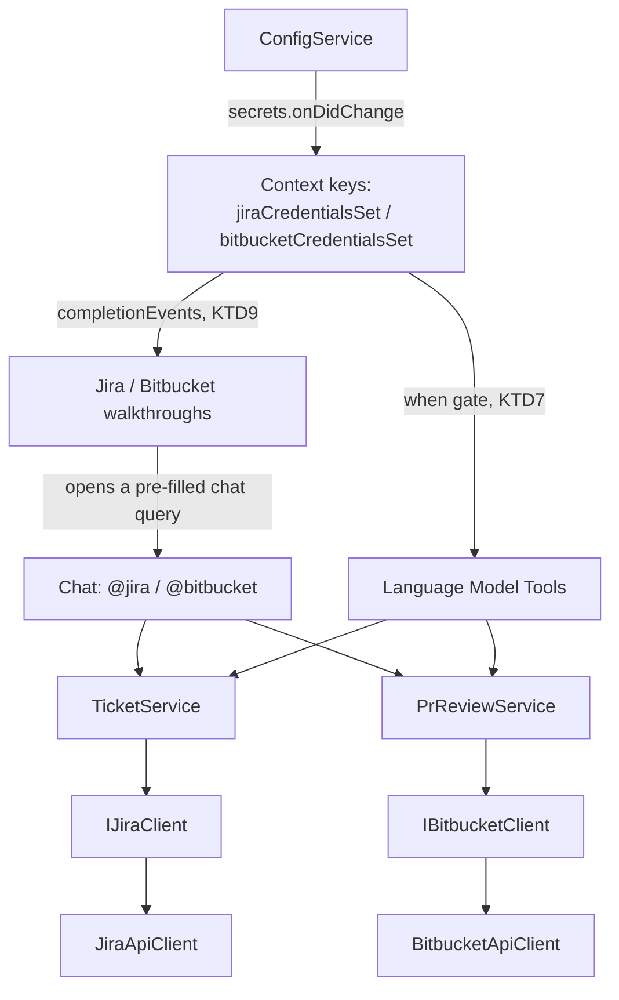

# Easier Entry Onboarding - Plan

## Goal Capsule

- **Objective:** A first-time user of `@jira`/`@bitbucket` can discover what the extension can do and successfully complete a first ticket and a first PR review without needing to read the README first.
- **Means:** Add a Getting-Started walkthrough, Language Model tools, slash commands, follow-up suggestions, `disambiguation` metadata, and a friendlier first-touch fallback — layered onto the existing natural-language-routed architecture for both participants.
- **Product authority:** Every new entry point (tools, slash commands) stays a shortcut into the existing intent-routed flows, never a parallel mechanism a user has to learn separately; every write stays behind an explicit confirmation. This plan owns the discoverability/onboarding cluster only — the issue-type-guessing fix and the template-generation-from-a-ticket feature are separate plans (see How This Work Fits Together).
- **Open blockers:** None. Both prerequisites are merged into `main` — see How This Work Fits Together.

---

## Product Contract

### Summary

Adds a cluster of discoverability mechanisms to both `@jira` and `@bitbucket`: single-object Language Model tools usable from plain Agent Mode, slash commands and follow-up suggestion chips on the existing chat flows, `disambiguation` metadata, a friendlier first-touch response delivered through the same follow-up-chip mechanism, and two Getting-Started walkthroughs (Jira, Bitbucket) that each end in a real, working first action. Multi-ticket writes (bulk field update, cleanup-batch transitions) and the full multi-pass PR review pipeline stay chat-only for this pass — see Planning Contract.

### Problem Frame

Today, everything the extension can do lives only in the README. Neither `@jira` nor `@bitbucket` defines slash commands, `disambiguation` metadata, or follow-up suggestions in `package.json`, and there's no `contributes.walkthroughs` entry — a new user's only path to discovering commands is reading external documentation before ever opening chat.

The two participants are also asymmetric today: `@bitbucket` already responds to a bare `@bitbucket` with a concrete example and a `check` hint, while `@jira` routes everything through its LLM intent parser and, when that parser can't classify the prompt, prints the literal string `"Unrecognised operation."` with no guidance — exactly the moment a lost first-timer is most likely to hit.

Separately, VS Code's Language Model Tools API (`contributes.languageModelTools`) lets an extension's operations be called directly by Copilot Agent Mode, without the user ever invoking `@jira`/`@bitbucket` — a second entry point this extension doesn't use at all today.

### Requirements

**Language Model tools**

R1. Jira and Bitbucket read operations (get/show a ticket, search, a PR review, etc.) are available as Language Model tools that Agent Mode can call directly, without the user invoking `@jira`/`@bitbucket`.

R2. Jira and Bitbucket write operations (create/update a ticket, post a PR comment, etc.) are also available as tools, but each write shows its own confirmation naming the concrete change about to be made before it executes — a tool call never writes silently.

R3. Tool operations reuse the same underlying service logic — and its existing safeguards, such as never guessing an issue type — as the `@jira`/`@bitbucket` chat flows use today; there is no separate, divergent implementation of the same operation for tools.

R4. When a tool is called and credentials aren't configured, it returns a clear, actionable result naming the missing setup step instead of a raw error — the same information `@jira`'s and `@bitbucket`'s existing "not configured" chat messages give, in a form Agent Mode can relay to the user.

**In-chat discoverability**

R5. Both `@jira` and `@bitbucket` gain a slash command for each major capability, shown in the participant's own autocomplete. Every slash command remains a shortcut into the existing natural-language-routed flow — never a separate mechanism a user must learn on its own.

R6. Both participants offer follow-up suggestion chips after every major response, proposing a likely next action (e.g. after loading a ticket: add a comment, transition it; after a PR review: add findings to review, ask about a finding).

R7. Both participants declare `disambiguation` metadata (category, description, example prompts) so Copilot can route ambiguous prompts and surface real usage examples.

R8. When `@jira` receives a prompt it cannot classify, it no longer shows the bare `"Unrecognised operation."` message — it shows a helpful, example-driven message instead, mirroring `@bitbucket`'s existing no-PR-URL guidance.

R9. Both participants detect an empty invocation or an obvious greeting/help-shaped prompt (e.g. "help", "hi", "what can you do") before attempting to classify it as a real command, and respond with orientation instead of routing it through the LLM intent parser.

**Getting-Started walkthrough**

R10. A VS Code Getting-Started walkthrough introduces the extension: Jira base URL and credentials, a default project, and that project's ticket types/workflow, ending with creating a first ticket using the project's real template-generation capability.

R11. The walkthrough includes a parallel Bitbucket track: credentials setup and a first PR review.

R12. Each walkthrough step links to (or runs) the real command/setting it describes, and marks itself complete only when that action actually happened — never a static checklist disconnected from the extension's real state.

### Key Decisions

- **Every write-capable tool call shows its own confirmation naming the concrete change, never silent.** (session-settled: user-directed — chosen over read-only-only tools or skipping tools entirely: read+write tools were wanted, with the same safety bar `@jira`'s existing create-preview flow already has.) Governs R2.
- **Extend, don't replace.** Slash commands and tools funnel into the same natural-language-routed operations the existing architecture already has — no user is required to learn a new mechanism to keep working the old way. Governs R3, R5.
- **Follow-ups roll out to every major response, not a narrow starting set.** (session-settled: user-directed — chosen over starting with just the two highest-traffic flows: broader day-one consistency preferred over incremental rollout.) Governs R6.
- **Build order is a prerequisite, not a parallel track.** This plan depended on the issue-type-guessing fix and the template-generation-from-a-ticket feature landing first, so the walkthrough's final step uses their real, finished behavior rather than a stand-in. Both are merged (see How This Work Fits Together). Governs R10.
- **Both participants get identical treatment.** Tools, slash commands, follow-ups, disambiguation, and a walkthrough apply to `@bitbucket` exactly as they do to `@jira`, rather than `@jira` first with parity later. (session-settled: user-directed.) Governs R1, R5, R6, R7, R11.

### Actors

- A1. A new or infrequent user of `@jira`/`@bitbucket` who doesn't yet know the extension's commands or setup steps.
- A2. Copilot Agent Mode, which can call registered tools autonomously while completing an unrelated task.
- A3. The Jira and Bitbucket APIs — source of real data and target of writes, reached the same way for both chat flows and tools.

### Key Flows

- F1. **Tool call, read or write**
  - **Trigger:** Agent Mode (or a `#toolname` reference) invokes a Jira or Bitbucket tool.
  - **Actors:** A1, A2, A3
  - **Steps:** VS Code checks the tool's `when` clause (configuration-state context key) before offering it at all. If offered and called, and the operation writes, VS Code shows the tool's confirmation naming the concrete change before it runs. Either way, execution goes through the same service logic the chat flows already use.
  - **Outcome:** A1 either never sees an unusable tool offered, sees a concrete confirmation before a write, or sees a read result — never a silent write or a raw error.
  - **Covers:** R1, R2, R3, R4

- F2. **First-touch orientation**
  - **Trigger:** A1 sends `@jira` or `@bitbucket` an empty, greeting-shaped, or unclassifiable prompt.
  - **Actors:** A1
  - **Steps:** An empty or greeting-shaped prompt is recognized before any LLM call and answered with orientation, delivered as follow-up chips, directly. Anything else still goes to the intent parser; only if that returns no usable operation does the example-driven fallback fire, also as chips.
  - **Outcome:** A1 never sees a bare, unexplained error on their first message, and can act on the orientation with one click.
  - **Covers:** R6, R8, R9

- F3. **Getting-Started walkthroughs**
  - **Trigger:** A1 opens the Jira walkthrough (auto-shown on install) or the Bitbucket walkthrough (from VS Code's Get Started page).
  - **Actors:** A1
  - **Steps:** Jira track — base URL → credentials → default project → that project's ticket types/workflow → create a first ticket via the real template-generation capability. Bitbucket track — credentials → a first PR review. Each step completes itself once its real action happens, not on a manual checkbox.
  - **Outcome:** A1 reaches one real, working ticket and one real, working PR review without leaving VS Code's own UI.
  - **Covers:** R10, R11, R12

### Acceptance Examples

- AE1. **Given** Agent Mode calls a Jira "create ticket" tool, **when** the tool is about to execute, **then** the user sees a confirmation naming the concrete ticket (project, type, summary) before anything is written to Jira. Covers R2.
- AE2. **Given** credentials are not configured, **when** Agent Mode calls any Jira or Bitbucket tool, **then** the tool's result names the missing setup step instead of a raw connection/auth error. Covers R4.
- AE3. **Given** a prompt `@jira` genuinely cannot classify (not empty, not a greeting), **when** the intent parser returns no usable operation, **then** the response shows concrete example prompts as follow-up chips instead of `"Unrecognised operation."`. Covers R8.
- AE4. **Given** a bare `@jira` or a greeting like "hi"/"help", **when** the user sends it, **then** the response orients them without ever calling the LLM intent parser. Covers R9.
- AE5. **Given** the walkthrough's ticket-types/workflow step, **when** the user completes the action it points at, **then** that step is marked done automatically — not left for the user to check off by hand. Covers R12.

<!-- ce-section: work-relationships -->
### How This Work Fits Together

This plan owns the discoverability/onboarding cluster (Language Model tools, slash commands, follow-ups, disambiguation, first-touch fallback, walkthroughs) for both `@jira` and `@bitbucket`. Both build-order prerequisites are merged into `main`:

- Never-guess-issue-type fix — `docs/plans/2026-08-30-1029-fix-never-guess-issue-type-plan.md` — merged (PR #43, commit `286fed6`). The walkthrough's ticket-creation step and the `createTicket`/`listTemplates` tools reuse this safeguard (KTD4).
- Template-generation-from-a-ticket feature — `docs/plans/2026-08-30-1135-feat-template-generation-from-ticket-plan.md` — merged (PR #42, commit `1724c0e`; handler at `src/participant/jira/templateGenerationHandler.ts`). The walkthrough's final Jira step drives this real flow.

### Scope Boundaries

- Deferred for later: the template-generation-from-a-ticket feature's own enhancements (guided field-visibility configuration) — a separate follow-up plan, unrelated to this one.
- Outside this plan: the issue-type-guessing fix's own requirements — already shipped as a separate, complete plan.

#### Deferred to Follow-Up Work

- `bulkUpdateField` and cleanup-batch transitions as Language Model tools (KTD2) — a multi-ticket write confirmation surface this plan doesn't build.
- The full multi-pass PR review pipeline as a Language Model tool (KTD8), and the extraction out of `BitbucketParticipant.ts` it would need.
- Retrofitting the existing chat `updateField` confirmation to show a diff, matching the new tool's stricter bar (KTD3) — the chat flow itself is unchanged by this plan.
- An Agent-Mode-driven "apply the fix a review found" workflow, and grounding a `@bitbucket` review against a workspace file's content (e.g. "does this PR fix the issue in `dir/file.md`") — both raised during this plan's scoping discussion; no requirement here covers either.

### Sources / Research

- `docs/plans/2026-08-30-1029-fix-never-guess-issue-type-plan.md` — prerequisite plan, merged.
- `docs/plans/2026-08-30-1135-feat-template-generation-from-ticket-plan.md` — prerequisite plan, merged.
- `docs/solutions/logic-errors/combined-create-list-silently-guesses-issue-type-and-drops-no-template-fallback.md` — the never-guess pattern R3/KTD4 require tools to reuse; also the reason `vscode`-coupled units in this plan need a `/code-review` pass, not just `npm test`.
- `docs/solutions/logic-errors/confirm-cancel-word-list-broadening-swallows-domain-name-collisions.md` — order a specific/live-domain match before a generic keyword match; relevant if greeting/help detection (R9) ever collides with a real operation keyword.
- VS Code Chat Participant API guide (`commands`, `disambiguation`, follow-ups): https://code.visualstudio.com/api/extension-guides/ai/chat
- VS Code Language Model Tool API guide (`contributes.languageModelTools`, `prepareInvocation`/confirmation messages): https://code.visualstudio.com/api/extension-guides/ai/tools
- VS Code Walkthroughs guide and `contributes.walkthroughs` reference: https://code.visualstudio.com/api/ux-guidelines/walkthroughs , https://code.visualstudio.com/api/references/contribution-points#contributes.walkthroughs
- Verified in this repo: `package.json:24-39` (`contributes.chatParticipants` — no `commands`, `disambiguation`, or follow-up wiring); `src/extension.ts:143-368` (`activate()` — no `ChatFollowupProvider`, no `languageModelTools`/`walkthroughs` registration; `createJiraParticipant`/`createBitbucketParticipant` already return their participant); `src/participant/JiraParticipant.ts:1169` (current `"Unrecognised operation."` fallback — corrected from the stale `1099-1100` citation, code shifted after the two prerequisite PRs); `src/participant/JiraParticipant.ts:59-83` (existing "not configured" messages, `MarkdownString` + trusted command links); `src/participant/BitbucketParticipant.ts:550-575` (no-PR-URL guidance and not-configured message); `src/services/TicketService.ts` (27 public methods — the Now-scope tool candidate list); `src/services/PrReviewService.ts` (only 3 public methods; the review orchestration itself is inline in `BitbucketParticipant.ts`, not callable — why the PR-review tool is deferred, KTD8); `src/services/ConfigService.ts` (no `isConfigured()` helper today; Cloud-vs-DC check duplicated at `BitbucketParticipant.ts:246` and `:560`); `src/templates/TemplateService.ts` (`JiraTemplate` has no `project` field — `listTemplates` returns the whole workspace's templates); `src/services/WorkflowService.ts:69` (`discoverWorkflow` is a standalone exported function, not a `TicketService` method).

---

## Planning Contract

**Product Contract preservation:** unchanged in meaning. R1's "a PR review" example is narrowed by KTD8 to single-object Bitbucket read/write tools (R1's own wording — "read operations… available as tools" — already permits this); the full-pipeline review tool moves to Deferred to Follow-Up Work rather than rewriting R1. No R-ID was added, split, or renumbered.

### Key Technical Decisions

- KTD1. Tool confirmations use VS Code's native `prepareInvocation`/`confirmationMessages` — single-shot and stateless — not the existing `workspaceState` multi-turn session/tag mechanism the chat flows use. There is no in-repo precedent for this shape; it is new code. `confirmationMessages` is always populated explicitly for a write tool — omitting it does not reliably mean "no prompt", and the user-level `chat.tools.autoApprove` setting can bypass it entirely regardless of what the tool declares (VS Code issue #253039). Because of that, `invoke()` itself — not the confirmation dialog — is each write tool's real safety boundary: it re-validates its own inputs rather than trusting that a confirmation was seen. Governs R2.
- KTD2. Now-scope Language Model **write** tools touch exactly one ticket (or one PR) per call. Bulk field updates and cleanup-batch transitions stay chat-only, deferred to Later. Read tools aren't bound by this: `searchTickets` and workflow discovery (samples multiple tickets, writes nothing) are Now-scope. (session-settled: user-directed — chosen over adding a `bulkUpdateField` tool with an itemized, capped confirmation: multi-ticket writes are excluded from the tool surface for this first cut; multi-ticket reads carry no write-confirmation risk and stay in.) Governs R1, R2.
- KTD3. A tool-driven single-field update reads the ticket's current value for that field before building its confirmation, and shows current → new — a stricter bar than the existing chat flow's confirmation, which never fetches the old value first. The chat flow itself is not retrofitted (see Scope Boundaries). (session-settled: user-approved.) Governs R2.
- KTD4. The `createTicket` tool's `modelDescription` steers the calling model to prefer `templateName` over a bare `issueType`, since a template carries the process's default field values. A new `listTemplates` read tool (wrapping `TemplateService.loadTemplates()`) lets the model see what's available before choosing. When `issueType`/`templateName` is missing or unresolved, the tool returns the valid options (`TicketService.getIssueTypes` / `listTemplates`) instead of guessing — the never-guess-issue-type safeguard, adapted from `showInputBox` to a returned list. (session-settled: user-directed.) Governs R1, R2, R3.
- KTD5. Tool handlers construct `TicketService`/`PrReviewService` with the same `onDiag` binding the chat handlers use, so tool-invoked writes are audited the same way chat writes are — an explicit construction requirement, not left to the construction site's discretion. Governs R3.
- KTD6. Tools carry no session memory. Every call takes fully-specified parameters (ticket key, project key, PR project/repo/id) — there is no last-ticket or branch-derived context the way chat handlers get from `ticketContext.ts`/`branchParser.ts`. Governs R1-R4.
- KTD7. Each Language Model tool's `when` clause gates on a configuration-state context key (`ticketSidekick.jiraCredentialsSet` / `ticketSidekick.bitbucketCredentialsSet`), set by a new `context.secrets.onDidChange` listener — Agent Mode's tool picker doesn't offer a tool until credentials exist. The same context keys drive the walkthrough's credential-step completion (KTD9). (session-settled: user-approved.) Governs R1-R4, R12.
- KTD8. Bitbucket's Language Model tools are Now-scoped to single-object read (`getPullRequest`, `getPullRequestDiff`) and write (`postComment`). Triggering the full multi-pass review pipeline as a tool is deferred — that orchestration lives inline in `BitbucketParticipant.ts`, not as a callable `PrReviewService` method, and extracting it is its own follow-up plan. (session-settled: user-directed — the stated primary use case is the existing `@bitbucket <url>` chat flow plus `#N explain` follow-ups, not Agent Mode autonomously triggering a review.) Governs R1.
- KTD9. Walkthrough step completion uses VS Code's native `completionEvents`: `onSettingChanged:<key>` for settings-only steps (base URL, default project), the KTD7 context-key listener for credential-storage steps, and a new `setContext` call threaded into the owning handler for action-based steps (workflow discovery, template-generation/create-ticket, PR review). Governs R12.
- KTD10. Two separate walkthrough contributions — "Ticket Sidekick: Jira" and "Ticket Sidekick: Bitbucket" — rather than one combined entry, since the two setup tracks are independent. (session-settled: user-directed.) Governs R10, R11.
- KTD11. Only the Jira walkthrough auto-opens on first install, guarded by a `globalState` "seen" flag checked once in `activate()`; the Bitbucket walkthrough is reachable from Get Started like any other, never auto-opened. (session-settled: user-approved.) Governs R10, R11.
- KTD12. Slash commands dispatch on `request.command` at the top of each handler, mapped to the same shortcut path the existing `check` special-case already uses, checked before the multi-turn session-tag scan so an in-flight session still takes priority. Governs R5.
- KTD13. Each slash command declares a `sampleRequest` in its `package.json` entry so the participant's autocomplete previews real usage, not just a description. (session-settled: user-approved.) Governs R5.
- KTD14. R8's unclassifiable-prompt fallback and R9's greeting/empty-prompt response both deliver their example prompts as follow-up chips (R6's `provideFollowups` mechanism), capped at 2-3 and phrased as literal next prompts, rather than separate inline prose guidance. (session-settled: user-approved.) Governs R6, R8, R9.
- KTD15. New pure logic (greeting/empty-prompt detection, tool confirmation-message formatting, not-configured tool-result text, follow-up-suggestion computation) lives in `sessionState.ts`/`reviewSessionState.ts` so it gets Vitest coverage — `JiraParticipant.ts`/`BitbucketParticipant.ts` import `vscode` and can't be loaded by Vitest. Governs testability across every unit below.
- KTD16. `package.json`'s `engines.vscode` moves from `^1.90.0` to `^1.95.0` before this ships. `contributes.languageModelTools`/`vscode.lm.registerTool` and participant `disambiguation` auto-detection both stabilized in VS Code 1.95 (Oct-Nov 2024) — the current floor predates them and would misrepresent compatibility. `followupProvider` and slash commands only need 1.91, so 1.95 covers every surface this plan adds. Governs R1-R4, R7.

### High-Level Technical Design

Entry points converge on the same service layer both participants already use; only `ConfigService`'s new context-key signal is genuinely new shared infrastructure, feeding both the tool gate (KTD7) and the walkthrough (KTD9):



`createTicket`'s template-preference flow (KTD4) branches on whether the tool can resolve an issue type — this is the shape a `bare issueType`/`templateName` gap takes for Agent Mode, in place of the chat flow's numbered picker:

```mermaid
sequenceDiagram
  participant Agent as Agent Mode
  participant List as listTemplates tool
  participant Create as createTicket tool
  participant TS as TicketService

  Agent->>List: invoke()
  List-->>Agent: template names + issue types
  Agent->>Create: invoke({project, templateName or issueType, summary})
  Create->>Create: prepareInvocation confirmation
  alt issueType unresolved
    Create->>TS: getIssueTypes(project)
    TS-->>Create: valid types
    Create-->>Agent: actionable list, no ticket created
  else resolved
    Create->>TS: createTicket(...)
    TS-->>Create: new ticket key
    Create-->>Agent: confirmation result naming project/type/summary
  end
```

---

## System-Wide Impact

- **New auto-routing exposure surface.** `disambiguation` (R7) lets Copilot silently select `@jira`/`@bitbucket` for a plain-language prompt that never typed `@jira`/`@bitbucket` — today a user always explicitly invokes a participant. `category`/`examples` wording in each `disambiguation` block needs a deliberate pass, not boilerplate: weak text either over-triggers the participant on unrelated prompts or never gets it auto-selected at all.
- **Confirmation is advisory, not a guaranteed gate (KTD1).** `chat.tools.autoApprove` can bypass every write tool's `confirmationMessages`. Every write tool's `invoke()` must independently be safe to run without a human having seen the confirmation — this is a trust/control property that applies uniformly across U2 and U3, not a per-tool judgment call.
- **`engines.vscode` bump (KTD16) is a compatibility-surface change**, not an internal-only detail: it raises the minimum VS Code version every user of this extension needs, effective the moment this plan's first unit ships.

---

## Implementation Units

### Phase 1 — Foundation

### U1. Configuration-state signals & shared tool/orientation helpers

- **Goal:** Give later units a single source of truth for "is Jira/Bitbucket configured", a context-key signal both tools and the walkthrough can gate on, and pure "not configured" result builders.
- **Requirements:** R4; foundation for KTD7, KTD9, KTD16.
- **Dependencies:** none.
- **Files:**
  - `package.json` — bump `engines.vscode` from `^1.90.0` to `^1.95.0` (KTD16); every later unit in this plan depends on this change already being in place.
  - `src/services/ConfigService.ts` — add `isConfigured()` / `isBitbucketConfigured()`.
  - `src/extension.ts` — register two `context.secrets.onDidChange` listeners that call `vscode.commands.executeCommand('setContext', 'ticketSidekick.jiraCredentialsSet' | 'ticketSidekick.bitbucketCredentialsSet', boolean)`.
  - `src/participant/sessionState.ts` — add a pure Jira "not configured" tool-result text builder.
  - `src/participant/reviewSessionState.ts` — add the Bitbucket equivalent.
  - `src/participant/JiraParticipant.ts`, `src/participant/BitbucketParticipant.ts` — replace the existing inline `!config.baseUrl || !config.token` / Cloud-vs-DC checks with the new `ConfigService` methods.
  - `src/test/ConfigService.test.ts` (new).
  - `src/test/sessionState.test.ts`, `src/test/reviewSessionState.test.ts` (new) — extend/add.
- **Approach:**
  1. `isConfigured()` mirrors Jira's existing `!config.baseUrl || !config.token` check; `isBitbucketConfigured()` mirrors the existing Cloud-vs-DC asymmetry (`BitbucketParticipant.ts:246`/`:560`) — Cloud doesn't require `baseUrl`.
  2. The not-configured builders take the resolved config and return plain text naming the specific missing setting or command (no trusted `MarkdownString` command links — a `LanguageModelToolResult` can't carry those).
  3. The `secrets.onDidChange` listeners fire once at activation and again on every change; each re-reads its config and updates its context key.
- **Patterns to follow:** the existing inline configured-checks being replaced; `logDiag`/`onDiag` binding style for how `ConfigService` is already constructed once and shared.
- **Test scenarios:**
  - `isConfigured()` true for DC with both `baseUrl` and `token` set, false with either missing.
  - `isBitbucketConfigured()` true for Cloud with only `token` set, true for DC with both set, false otherwise.
  - Not-configured builder names the Jira DC vs Cloud setup command by name; same for Bitbucket.
  - Test expectation: none — the `secrets.onDidChange` listener wiring itself is `vscode`-only; covered by a `/code-review` pass and manual verification (store/clear a token, watch the context key via `contributes.menus`/`when` behavior).
- **Verification:** `npm test` green for the new pure helpers; `/code-review` pass on the `extension.ts` listener registration before merge.

---

### Phase 2 — Language Model Tools (R1-R4)

### U2. Jira Language Model tools

- **Goal:** Expose Jira read/write operations as `contributes.languageModelTools` entries Agent Mode can call directly, reusing `TicketService` via `IJiraClient`.
- **Requirements:** R1, R2, R3, R4 (Jira half). KTD1, KTD2, KTD3, KTD4, KTD5, KTD6, KTD7.
- **Dependencies:** U1.
- **Files:**
  - `package.json` — `contributes.languageModelTools` entries: read (`jira_getTicket`, `jira_searchTickets`, `jira_getComments`, `jira_listTemplates`, `jira_discoverWorkflow`), write (`jira_addComment`, `jira_updateField`, `jira_createTicket`, `jira_transitionTicket`); each `when`-gated per KTD7.
  - `src/tools/jiraTools.ts` (new) — tool registration, `prepareInvocation`/`invoke` implementations.
  - `src/participant/sessionState.ts` — confirmation-message builders (diff text for `updateField`, enumerated fields for `createTicket`, etc.).
  - `src/extension.ts` — `vscode.lm.registerTool(...)` calls in `activate()`, one `TicketService` instance shared with the chat participant's `onDiag` binding (KTD5).
  - `src/test/jiraTools.test.ts` (new) — tests the pure builders.
  - `docs/onboarding.md` (new) — "## Jira Language Model tools" section: each tool's purpose, required/optional input, and the never-guess fallback behavior.
- **Approach:**
  1. Read tools delegate straight to the matching `TicketService` method (`getTicket`, `searchTickets`, `getIssueComments`) or standalone function (`discoverWorkflow`, `TemplateService.loadTemplates` for `jira_listTemplates`).
  2. Write tools' `prepareInvocation()` builds the confirmation per KTD3/KTD4: `jira_updateField` reads the current value first and shows current → new; `jira_createTicket` names project/type/summary; `jira_addComment` names the ticket and comment text; `jira_transitionTicket` names the ticket and target status.
  3. `jira_createTicket`'s `modelDescription` tells the calling model to call `jira_listTemplates` first and prefer `templateName`; when `issueType`/`templateName` doesn't resolve, `invoke()` returns `TicketService.getIssueTypes(project)`'s result as the actionable list instead of creating anything.
  4. Every write `invoke()` constructs `TicketService` with the same `onDiag` binding `JiraParticipant.ts` already uses.
  5. Every write tool's `invoke()` re-validates its own inputs (issue key shape, field name, resolved values) independently of `prepareInvocation`'s confirmation — `chat.tools.autoApprove` can skip the confirmation entirely, so `invoke()` is the actual safety boundary (KTD1). Successful writes set `pastTenseMessage` (e.g. "Created PROJ-123") on the result.
- **Technical design:** directional only (see Planning Contract's sequence diagram for `jira_createTicket`/`jira_listTemplates`).
- **Patterns to follow:** `fieldHandler.ts`'s confirmation wording for tone; the existing `TicketService` construction site in `JiraParticipant.ts` for the `onDiag` binding.
- **Test scenarios:**
  - Happy path: `jira_getTicket` with a valid key returns the ticket via the mock client.
  - Happy path: `jira_updateField` confirmation text shows `"Critical → High"` given a current and new value.
  - Happy path: `jira_createTicket` with `templateName` resolves the template's `defaultFields`/`issueType` before creating.
  - Edge case: `jira_createTicket` with neither `issueType` nor a resolvable `templateName` returns the project's valid issue types and creates nothing. Covers AE1 in spirit — extends AE1's confirmation guarantee to the tool surface.
  - Edge case: `jira_listTemplates` on a workspace with no `.jira-templates.json` returns an empty list, not an error.
  - Error path: any write tool called with credentials unset returns the not-configured text from U1, not a raw `JiraApiError`. Covers AE2.
  - Integration scenario: a tool-invoked `jira_addComment` produces the same `logDiag('jira.ticketService', …)` line a chat-invoked comment does (KTD5) — provable only by checking the shared construction site.
- **Verification:** `npm test` covers the pure builders in `sessionState.ts`. `src/tools/jiraTools.ts` and its `extension.ts` registration are `vscode`-only: `/code-review` pass plus a manual Extension Development Host run of each tool from Agent Mode before merge.

### U3. Bitbucket Language Model tools

- **Goal:** Expose single-object Bitbucket read/write operations as tools, matching U2's shape.
- **Requirements:** R1, R2, R3, R4 (Bitbucket half). KTD1, KTD5, KTD6, KTD7, KTD8.
- **Dependencies:** U1.
- **Files:**
  - `package.json` — `contributes.languageModelTools`: read (`bitbucket_getPullRequest`, `bitbucket_getPullRequestDiff`), write (`bitbucket_postComment`); `when`-gated per KTD7.
  - `src/tools/bitbucketTools.ts` (new).
  - `src/participant/reviewSessionState.ts` — confirmation-message builder for `bitbucket_postComment`.
  - `src/extension.ts` — `vscode.lm.registerTool(...)` calls, shared `PrReviewService`/`IBitbucketClient` `onDiag` binding.
  - `src/test/bitbucketTools.test.ts` (new).
  - `docs/onboarding.md` — "## Bitbucket Language Model tools" section, explicitly naming the full-review-tool deferral (KTD8) so a reader isn't left wondering why "review a PR" isn't a tool.
- **Approach:**
  1. `bitbucket_getPullRequest`/`bitbucket_getPullRequestDiff` delegate to `IBitbucketClient` directly (mirrors `getPullRequest`/`getPullRequestDiff` already on the interface).
  2. `bitbucket_postComment`'s `prepareInvocation()` names the PR and the comment text; `invoke()` calls `PrReviewService.postCommentItems` for a single item.
  3. No `bitbucket_reviewPr` tool this pass (KTD8) — Now scope stops at these three.
  4. `bitbucket_postComment`'s `invoke()` re-validates its inputs independently of the shown confirmation, same rationale as U2's write tools (KTD1), and sets `pastTenseMessage` on success.
- **Patterns to follow:** `PrReviewService.postCommentItems`'s existing call shape; `BitbucketParticipant.ts`'s Cloud-vs-DC `effectiveUrl`/`apiVersion` resolution.
- **Test scenarios:**
  - Happy path: `bitbucket_getPullRequest` returns PR metadata via the mock client.
  - Happy path: `bitbucket_postComment` confirmation names the PR id and the comment text.
  - Error path: any tool called with credentials unset returns the not-configured text from U1. Covers AE2.
  - Integration scenario: `bitbucket_postComment` produces the same `logDiag('bitbucket.prReviewService', …)` line a chat-invoked comment post does (KTD5).
- **Verification:** `npm test` for the pure builder; `/code-review` pass plus manual Extension Development Host exercise for the registration code.

---

### Phase 3 — Chat discoverability (R5-R9)

### U4. Slash commands & disambiguation metadata

- **Goal:** Give each participant a discoverable slash command per major capability and `disambiguation` metadata for Copilot's routing.
- **Requirements:** R5, R7. KTD12, KTD13, KTD16.
- **Dependencies:** U1 (KTD16's `engines.vscode` bump — `disambiguation` auto-detection needs VS Code 1.95+).
- **Files:**
  - `package.json` — `contributes.chatParticipants[].commands` (one per major capability per participant, each with a `sampleRequest`) and `.disambiguation` (category, description, example prompts) for both entries.
  - `src/participant/JiraParticipant.ts` — dispatch on `request.command` before the existing session-tag scan, mapping each command to its existing NL-flow entry point.
  - `src/participant/BitbucketParticipant.ts` — same, mapped to its existing `check`/PR-review flow.
  - `docs/onboarding.md` — "## Slash commands" section listing each command, its target flow, and its `sampleRequest`.
- **Approach:**
  1. Command list mirrors the existing `Operation` union (`llmHelpers.ts`) for Jira, and `check`/review for Bitbucket — no new operations invented.
  2. Dispatch checks `request.command` first (a direct map to an existing handler call), falling through to the current session-tag scan and LLM intent parsing when absent — mirrors the existing `check` special-case regex already in `JiraParticipant.ts`.
- **Patterns to follow:** the existing `check` regex special-case in both participants.
- **Test scenarios:**
  - Happy path: `/check` command routes to the same handler the typed `@jira check` prompt does, for both participants.
  - Happy path: a command issued mid-session (an in-flight multi-turn tag present) still lets the session-tag scan take priority — KTD12's ordering.
  - Test expectation: dispatch logic itself lives in `vscode`-coupled participant files; covered by `/code-review` and `test:e2e`, not `npm test`.
- **Verification:** `/code-review` pass; manual Extension Development Host check of each command's autocomplete entry and `sampleRequest` text.

### U5. Follow-up suggestions & first-touch orientation

- **Goal:** Add follow-up chips after every major response, and reroute R8/R9's fallback and greeting handling onto that same chip mechanism (KTD14).
- **Requirements:** R6, R8, R9. KTD14, KTD15.
- **Dependencies:** none (independent of U2-U4; can run in parallel).
- **Files:**
  - `src/participant/JiraParticipant.ts`, `src/participant/BitbucketParticipant.ts` — set `participant.followupProvider` before `return participant` in each `create*Participant` function; add the pre-`parseIntent` greeting/empty check.
  - `src/participant/sessionState.ts` — pure `computeJiraFollowups(lastOperationOrState)` and `isGreetingOrEmpty(prompt)` helpers.
  - `src/participant/reviewSessionState.ts` — pure `computeBitbucketFollowups(...)` equivalent.
  - `src/test/sessionState.test.ts`, `src/test/reviewSessionState.test.ts` — extend.
  - `docs/jira-flows.md`, `docs/review-process.md` — one-line pointer each to `docs/onboarding.md`'s follow-up/fallback section.
- **Approach:**
  1. `isGreetingOrEmpty(prompt)` runs before the existing session-tag scan's LLM path — an in-flight session still takes priority (mirrors U4's ordering rule).
  2. Both the greeting response (R9) and the unclassifiable-prompt fallback (R8, replacing `JiraParticipant.ts:1169`'s `"Unrecognised operation."`) render 2-3 example prompts as follow-up chips via `computeJiraFollowups`, not separate prose (KTD14).
  3. `computeJiraFollowups`/`computeBitbucketFollowups` take the last operation/session-state shape and return 2-3 chips phrased as literal next prompts (e.g. after loading a ticket: "add a comment", "transition it"; after a PR review: "add findings to review", "explain finding #1").
- **Patterns to follow:** `sessionState.ts`'s existing tag-based state detection for what "the last operation was X" means.
- **Test scenarios:**
  - Happy path: `isGreetingOrEmpty("hi")`, `isGreetingOrEmpty("")`, `isGreetingOrEmpty("help")` all detect; `isGreetingOrEmpty("update PROJ-1 priority to high")` does not.
  - Happy path: `computeJiraFollowups` after a `loadTicket` response returns "add a comment"/"transition it"-shaped chips, capped at 3.
  - Happy path: `computeBitbucketFollowups` after a completed review returns "add findings to review"/"explain finding #1"-shaped chips.
  - Edge case: a prompt containing a real operation keyword that also resembles a greeting word (e.g. a ticket key literally named `"HI-1"`) is not misclassified as a greeting — apply the specific-before-generic ordering from `docs/solutions/logic-errors/confirm-cancel-word-list-broadening-swallows-domain-name-collisions.md`.
  - Error path: an unclassifiable, non-empty, non-greeting prompt returns the R8 fallback chips, not the bare old string. Covers AE3.
  - Test expectation: `followupProvider` registration itself is `vscode`-only; covered by `/code-review` and `test:e2e`.
- **Verification:** `npm test` for all four pure helpers; `/code-review` pass on the registration/dispatch code; manual check that AE3/AE4 hold in an Extension Development Host.

---

### Phase 4 — Getting-Started walkthroughs (R10-R12)

### U6. Jira Getting-Started walkthrough

- **Goal:** A walkthrough that takes a new user from zero Jira config to a real first ticket, each step completing on real state.
- **Requirements:** R10, R12. KTD9, KTD10, KTD11.
- **Dependencies:** U1 (context-key signal), the merged template-generation feature (already on `main`).
- **Files:**
  - `package.json` — `contributes.walkthroughs` entry "Ticket Sidekick: Jira" with five steps (base URL, credentials, default project, ticket types/workflow, first ticket).
  - `src/extension.ts` — `globalState` "seen" flag check + `workbench.action.openWalkthrough` call in `activate()` (KTD11, Jira only).
  - `src/participant/jira/workflowHandler.ts` — fire `setContext('ticketSidekick.workflowViewed', true)` when discovery actually completes.
  - `src/participant/jira/createHandler.ts`, `src/participant/jira/templateGenerationHandler.ts` — fire `setContext('ticketSidekick.firstTicketCreated', true)` on a real successful `createTicket` call.
  - `docs/onboarding.md` — "## Getting-Started walkthrough: Jira" section listing each step and its completion signal.
- **Approach:**
  1. Steps 1/3 (base URL, default project) use `completionEvents: ["onSettingChanged:ticketSidekick.jira.baseUrl"]` / `["onSettingChanged:ticketSidekick.jira.defaultProject"]` — no code, VS Code handles it natively.
  2. Step 2 (credentials) uses `completionEvents: ["onContext:ticketSidekick.jiraCredentialsSet"]`, reusing U1's context key.
  3. Steps 4/5 (workflow viewed, first ticket) use `onContext:` keys fired by the new `setContext` calls threaded into the owning handlers, at the point the real action completes — not at the point it's merely attempted.
  4. Each step's button opens Copilot Chat pre-filled with the relevant `@jira` query (or slash command once U4 ships).
- **Patterns to follow:** none in-repo — this is new infrastructure (no prior `globalState`/`setContext` usage exists in this codebase).
- **Test scenarios:**
  - Test expectation: none — walkthrough steps, `completionEvents`, and `setContext` wiring are entirely `vscode`/UI-driven and untestable by Vitest; verification is manual (open the walkthrough in an Extension Development Host, perform each step, confirm it checks off) plus `/code-review`.
  - The `setContext` call sites inside `workflowHandler.ts`/`createHandler.ts`/`templateGenerationHandler.ts` fire only on the real success path (not on an aborted/cancelled flow) — confirm by reading the call site, since this can't be asserted by a Vitest mock alone.
- **Verification:** manual Extension Development Host walkthrough run (AE5) plus `/code-review`.

### U7. Bitbucket Getting-Started walkthrough

- **Goal:** A separate, parallel walkthrough for Bitbucket setup ending in a real first PR review.
- **Requirements:** R11, R12. KTD9, KTD10, KTD11.
- **Dependencies:** U1.
- **Files:**
  - `package.json` — `contributes.walkthroughs` entry "Ticket Sidekick: Bitbucket" with three steps (base URL/Cloud, credentials, first PR review).
  - `src/participant/BitbucketParticipant.ts` — fire `setContext('ticketSidekick.firstReviewCompleted', true)` when a review run finishes successfully.
  - `docs/onboarding.md` — "## Getting-Started walkthrough: Bitbucket" section.
- **Approach:**
  1. Base-URL step's `completionEvents` covers both DC (`onSettingChanged:ticketSidekick.bitbucket.baseUrl`) and Cloud (`onContext:` fired once `authType` reads `cloud`), since Cloud doesn't need a base URL.
  2. Credentials step reuses U1's `ticketSidekick.bitbucketCredentialsSet` context key.
  3. Review step fires its `setContext` only when a review run actually completes, not on an aborted or failed one.
  4. This walkthrough is never auto-opened (KTD11) — reachable from Get Started only.
- **Patterns to follow:** U6's step shape, applied to Bitbucket's settings/secrets.
- **Test scenarios:**
  - Test expectation: none — same rationale as U6; manual verification plus `/code-review`.
- **Verification:** manual Extension Development Host walkthrough run (AE5) plus `/code-review`.

---

## Verification Contract

| Command | Applicability |
|---|---|
| `npm run compile` | All units — TypeScript type check, run before `npm test`. |
| `npm test` | Pure-logic additions: U1 (`ConfigService`, not-configured builders), U2/U3 (confirmation-message builders), U5 (greeting detection, follow-up computation). |
| `npm run test:e2e` | Not run in CI (needs a real VS Code instance); run manually for U2-U7's `vscode`-coupled registration and dispatch code. |
| `/code-review` (manual pass) | Required before merge on U1's listener registration, U2, U3, U4's dispatch code, U5's registration code, U6, U7 — all `vscode`-coupled and therefore Vitest-blind, per `docs/solutions/logic-errors/combined-create-list-silently-guesses-issue-type-and-drops-no-template-fallback.md`. |

## Definition of Done

- `npm run compile` and `npm test` pass with no new failures.
- `package.json`'s `engines.vscode` reads `^1.95.0` (KTD16) before any other unit's `contributes.*` entries are added.
- Every unit listed with a `/code-review` requirement above has one, with findings addressed or explicitly deferred.
- Manual Extension Development Host pass confirms: each of the 12 new tools (9 Jira + 3 Bitbucket) is offered only when its participant is configured (KTD7) and shows the expected confirmation before any write; each new slash command's autocomplete entry and `sampleRequest` render; follow-up chips appear after a ticket load, a field update, and a PR review; AE3/AE4 hold for `@jira`; both walkthroughs complete every step through real actions (AE5), and only the Jira one auto-opens on a fresh install.
- `docs/onboarding.md` exists with sections for Language Model tools (both participants), slash commands, follow-ups/first-touch, and both walkthroughs; `CLAUDE.md` carries a one-line pointer to it; `docs/jira-flows.md` and `docs/review-process.md` each carry a one-line pointer to the follow-up/fallback section.
- No dead code from an abandoned approach remains in the diff.
