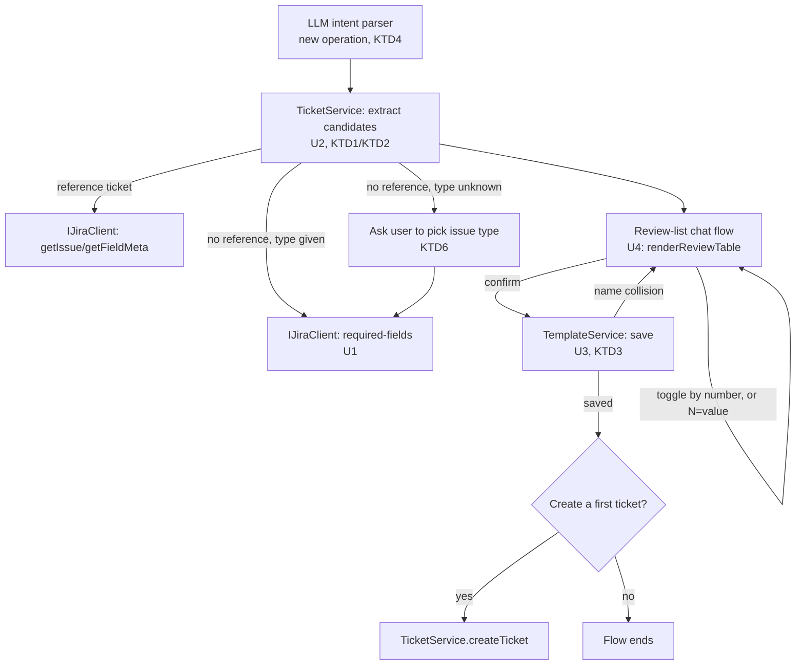

# Template Generation From Ticket - Plan

## Goal Capsule

- **Objective:** A user can get a reusable, correctly-shaped Jira template without hand-writing `.jira-templates.json` — grounded either in a real existing ticket or in the target project's own required fields.
- **Means:** A new `@jira` flow that pulls candidate fields from a reference ticket (or the project's create-metadata when no reference is given), lets the user include/exclude each via a review list, then saves the result as a template and offers to create a first ticket from it.
- **Product authority:** Every generated template is reviewed and confirmed before it's written to disk — never silently saved, never silently overwritten; fields pulled from a reference ticket are filtered to what's actually template-shaped, not everything the ticket happens to have set. This plan owns the template-generation feature only — the onboarding walkthrough that will eventually use it, and the issue-type-guessing fix, are separate plans (see How This Work Fits Together).
- **Open blockers:** None — this plan has no upstream dependency; it is the prerequisite the onboarding plan depends on.

---

## Product Contract

### Summary

Adds a new `@jira` flow that generates a reusable `.jira-templates.json` template — from an existing reference ticket's template-shaped fields, or from a project's required-fields metadata when no reference is given — reviewed as an include/exclude list, saved on confirmation, and optionally used immediately to create a first ticket.

### Problem Frame

Today templates are entirely hand-authored JSON: `src/templates/TemplateService.ts` only reads `.jira-templates.json`, there is no write path and no in-chat generation flow. Writing one from scratch requires knowing Jira field IDs, the `resolveFields` shape for sprint/team/user lookups, and which fields are worth defaulting — a real barrier for a new user, and the prerequisite the onboarding plan's Getting-Started walkthrough (`docs/plans/2026-08-30-1121-feat-easier-entry-onboarding-plan.md`) is waiting on for its final step.

### Requirements

R1. `@jira` can generate a template from an existing reference ticket: it fetches the ticket's fields and proposes only the ones that are template-shaped (priority, labels, components, and similar team/sprint-type custom fields) — never summary, description, comments, status, reporter, dates, or the ticket key, which are always per-ticket.

R2. Proposed fields already listed in the user's configured `hiddenDisplayFields` setting are excluded from the candidates before the user ever sees them.

R3. The remaining candidates are presented as an include/exclude review list, matching the existing Waltz/Veracode import review pattern — the user can toggle any field in or out before anything is saved.

R4. When no reference ticket is given, `@jira` proposes candidates from the target project's required-fields create-metadata instead of a blank template or refusing to run.

R5. The reviewed field set is only written to `.jira-templates.json` after the user explicitly confirms — never silently saved.

R6. Saving never silently overwrites an existing template with the same name — a name collision is surfaced to the user, who must choose a different name or explicitly confirm the overwrite.

R7. Once a template is saved, `@jira` offers to create a first ticket from it as its own confirm step — not auto-created without confirmation.

R8. The generated template's shape matches what `TemplateService`/`FieldResolver` already read today (`name`, `issueType`, `defaultFields`, `resolveFields`, `descriptionSections`) — a hand-authored template and a generated one are indistinguishable to the rest of the system.

### Key Decisions

- **Generation produces a real, persisted template, not a one-off field prefill.** (session-settled: user-directed — chosen over discarding the field set after one ticket: the point of "template" is reuse.) Governs R5.
- **Default candidates are template-shaped fields only, further filtered by the existing `hiddenDisplayFields` setting, with a review list for the rest.** (session-settled: user-directed — chosen over "start from everything the ticket has, prune down.") Governs R1, R2, R3.
- **No-reference generation pulls from Jira's own required-fields metadata**, not a blank template and not an unsupported case. (session-settled: user-directed.) Governs R4.
- **Reuse the existing review-list pattern** (Waltz/Veracode-style include/exclude) rather than invent a new selection UI. Governs R3.

### Actors

- A1. A user creating a template — with or without a reference ticket in mind.
- A2. The reference ticket (when given) — source of real, populated field values.
- A3. The target project's Jira create-metadata — source of required fields when there's no reference ticket.

### Key Flows

- F1. **Generate from a reference ticket**
  - **Trigger:** User asks `@jira` to generate a template from an existing ticket key.
  - **Actors:** A1, A2
  - **Steps:** Fetch the reference ticket's fields; filter to template-shaped fields (R1); drop any already in `hiddenDisplayFields` (R2); present the rest as an include/exclude review list (R3); on confirm, write the template (R5, R6, R8); offer to create a first ticket from it (R7).
  - **Outcome:** A saved, reusable template whose defaults came from a real ticket, not a guess.
  - **Covers:** R1, R2, R3, R5, R6, R7, R8

- F2. **Generate with no reference ticket**
  - **Trigger:** User asks for a new template with no existing ticket named.
  - **Actors:** A1, A3
  - **Steps:** Resolve the issue type — ask the user to pick from the project's available types (KTD6) when the request didn't name one; fetch the target project's required-fields create-metadata for that type (R4); present as the same include/exclude review list (R3); on confirm, write the template (R5, R6, R8); offer to create a first ticket from it (R7).
  - **Outcome:** A saved template grounded in Jira's own field requirements, even with nothing to copy from.
  - **Covers:** R3, R4, R5, R6, R7, R8

### Acceptance Examples

- AE1. **Given** a reference ticket with `priority`, `labels`, `assignee`, and `description` all set, **when** the template is generated, **then** only `priority` and `labels` (template-shaped) appear as review candidates — `assignee` and `description` never appear. Covers R1.
- AE2. **Given** `priority` is in the user's `hiddenDisplayFields` setting, **when** candidates are built from a reference ticket that has `priority` set, **then** `priority` is never offered in the review list. Covers R2.
- AE3. **Given** no reference ticket, **when** the user starts generation for a project, **then** the review list is built from that project's required fields, not left empty or refused. Covers R4.
- AE4. **Given** a template named "Billing Bug" already exists, **when** a new generated template also resolves to that name, **then** the user is asked to pick a different name or explicitly confirm overwriting it — it's never silently replaced. Covers R6.

<!-- ce-section: work-relationships -->
### How This Work Fits Together

This plan owns the template-generation feature itself. Two sibling plans relate to it:

- Never-guess-issue-type fix — `docs/plans/2026-08-30-1029-fix-never-guess-issue-type-plan.md`
  - Can proceed independently of this plan — unrelated mechanism, its own complete plan already
- Easier-entry onboarding — `docs/plans/2026-08-30-1121-feat-easier-entry-onboarding-plan.md`
  - Depends on this plan — its Getting-Started walkthrough's final step uses this feature's real capability instead of a stand-in
  - Build order: implement this plan before that one

### Scope Boundaries

- Outside this plan: the onboarding walkthrough and other discoverability work that will eventually call this feature — separate plan.
- Outside this plan: the issue-type-guessing fix — separate, already-planned, unrelated mechanism.
- Deferred for later: bulk/batch template generation (e.g. from several reference tickets at once) — this plan covers one template per generation run.

### Sources / Research

- `src/templates/TemplateService.ts` — confirms templates are read-only today, no write path exists.
- `src/templates/FieldResolver.ts` — `ResolveSpec` shape for sprint/team/user resolution, which R8 requires the generated template to stay compatible with.
- README's "Templates and cleanup rules" section — the template field shape (`name`, `issueType`, `defaultFields`, `resolveFields`, `descriptionSections`) R8 requires.
- `src/participant/jira/reportImportHandler.ts` and `src/utils/reportImport.ts` — the existing Waltz/Veracode include/exclude review-list pattern R3 reuses.
- `docs/plans/2026-08-30-1121-feat-easier-entry-onboarding-plan.md` — dependent plan (see How This Work Fits Together).
- `docs/plans/2026-08-30-1029-fix-never-guess-issue-type-plan.md` — sibling plan, no dependency.
- `src/services/WorkflowService.ts` — the `.jira-workflow-cache.json` write pattern (`writeFileSync`, `JSON.stringify(..., null, 2)`) KTD3 reuses for `.jira-templates.json`.
- `src/participant/sessionState.ts` — `renderReviewTable<TRow>(columns, rows)`, the shared review-table primitive R3/KTD5's review list reuses; `buildReviewTable`'s "key numbers to skip" toggle-reply footer as the reply-parsing pattern to follow.
- `src/services/TicketService.ts` — `getFieldMeta()` and `getIssue()` (returns raw `JiraIssue.fields`, unlike the Markdown-rendering `getTicket()`) as the shapes U2 builds candidate extraction on; `isMultiLine()` as the existing precedent for a fixed, named field-shape allowlist (cited by KTD1); the Sprint-field raw-value comment and `parseSprintItem`-style parsing KTD2's sprint/team exception reuses.

---

## Planning Contract

### Key Technical Decisions

- KTD1. **Template-shaped fields are a fixed, named allowlist** (priority, labels, components, and sprint/team-typed custom fields recognized the same way `FieldResolver`'s `ResolveSpec.type` already names them) — not inferred from Jira's field-schema metadata alone, which doesn't reliably distinguish "template-worthy" from "per-ticket." Mirrors the fixed-list precedent `TicketService`'s `isMultiLine()` already uses for a different field-shape decision. Governs R1.
- KTD2. **Generated templates always use literal `defaultFields` values, never `resolveFields` entries.** `resolveFields`' dynamic by-name lookup is a hand-authoring feature for a template that must adapt over time (e.g. "the current sprint"); a one-time snapshot from a reference ticket is more faithfully a literal copy. A user who wants dynamic resolution can hand-edit the generated JSON afterward. **Exception:** a sprint/team-typed field's raw fetched value is not itself a writable literal — Jira Data Center returns sprint values as serialized strings, not plain JSON — so U2 parses it down to a writable `{ id }` shape (reusing the codebase's existing sprint-value parser) before writing it as a literal `defaultFields` entry; this is still a literal snapshot, not a `resolveFields` lookup. Governs R1, R8.
- KTD3. **Persist via plain `fs.writeFileSync` to `.jira-templates.json` at the workspace root**, mirroring `WorkflowService.ts`'s existing `.jira-workflow-cache.json` write — no new persistence mechanism introduced. Governs R5.
- KTD4. **A new `Operation` value routes through the existing LLM intent parser** (`llmHelpers.ts`'s `ParsedIntent`), not a new fixed-syntax command — matches how every other `@jira` capability is triggered. Governs R1–R8 (entry point for the whole feature).
- KTD5. **A required field with no value to copy (the no-reference path) is filled inline in the same review step**, not a separate multi-turn detour — one review-and-confirm pass regardless of whether generation started from a reference ticket or from required-fields metadata. The review list's existing reply syntax is toggle-only (a list of row numbers to flip in/out); filling in a value needs its own syntax, so a reply like `3=High` sets row 3's value without toggling it, alongside the existing bare-number toggle syntax. Governs R3, R4.
- KTD6. **When the no-reference path's request doesn't name an issue type, `@jira` asks the user to pick from the project's available types** (reusing the existing `getIssueTypes` project fetch) before calling U1 — U1's required-fields fetch takes issue type as a mandatory input, so this resolution has to happen first. Governs R4.

### High-Level Technical Design

### Assumptions

- The target project's `createmeta`-equivalent endpoint on this codebase's Jira v2 API base path returns per-issue-type required fields with names Jira also uses elsewhere in this codebase (matching how `getProject()`'s `issueTypes` are named) — U1 verifies the exact request/response shape against the target Jira version during implementation, since this session did not load live Jira API docs for it.
- A generated template with zero fields selected (everything toggled out) is still a valid, save-able template — no special-cased minimum, consistent with the README's existing "Minimal — pre-populated fields" example.

---

## Implementation Units

### U1. Fetch required-fields create-metadata

- **Goal:** Add a Jira client capability to fetch a project's required fields for a given issue type, following CLAUDE.md's "Adding a new Jira operation" steps 1–4. Takes issue type as a mandatory input — resolving it when the caller doesn't have one yet is U4's job (KTD6), not this unit's or U2's: asking the user interactively is a chat-layer concern, and both U1 and U2 (`TicketService`) must stay `vscode`-free per CLAUDE.md's testing rule.
- **Requirements:** R4
- **Dependencies:** None
- **Files:** `src/jira/IJiraClient.ts`, `src/jira/JiraApiClient.ts`, `src/test/mocks/MockJiraClient.ts`, `src/test/fixtures/` (new create-metadata fixture)
- **Approach:**
  1. Add the interface method to `IJiraClient` returning required-field ids/names for a project + issue type.
  2. Implement in `JiraApiClient` against the v2 API base path (per CLAUDE.md's `<baseUrl>/rest/api/2/` convention), through the existing `fetchWithRetry` and typed `JiraApiError` handling — cite CLAUDE.md's Jira API conventions rather than restating them.
  3. Implement a fixture-backed return in `MockJiraClient`.
- **Test scenarios:**
  - Happy path: returns the required fields for a project/issue-type fixture.
  - Error path: a 404/401 response throws a typed `JiraApiError`, per the existing convention (not a silently empty result).
  - `MockJiraClient` returns its fixture data for `TicketService` (U2) tests to build on.
- **Verification:** `TicketService` (U2) can call this method and receive typed field data.

### U2. Template-shaped field extraction

- **Goal:** Business logic that, given a reference ticket or a project + issue type, produces the review-list candidate fields per R1/R2/R4.
- **Requirements:** R1, R2, R4
- **Dependencies:** U1
- **Files:** `src/services/TicketService.ts`, `src/services/TicketService.test.ts`
- **Approach:**
  1. Reference-ticket path: fetch the ticket via `getIssue` (returns raw `JiraIssue.fields`) plus `getFieldMeta`, filter to the KTD1 allowlist, then drop any field already in the user's configured `hiddenDisplayFields` (R2). `getTicket()` is not usable here — it returns a rendered Markdown block for chat display, not structured field values.
  2. Sprint/team-typed candidates get KTD2's exception: parse the raw fetched value down to a writable `{ id }` before it becomes a `defaultFields` entry, reusing the codebase's existing sprint-value parser.
  3. No-reference path: takes issue type as an already-resolved input parameter (the caller — U4 — resolves it interactively per KTD6 before calling in; U2 itself does no prompting, staying `vscode`-free), fetches required fields via U1, presents with no value (KTD5 fills them during review, not here).
  4. Return literal field values only (KTD2) — no `resolveFields` construction.
- **Test scenarios:**
  - Happy path: a reference ticket with `priority`, `labels`, `assignee`, `description` set yields only `priority`/`labels` as candidates.
  - Edge case: a template-shaped field also present in `hiddenDisplayFields` is excluded before the candidate list is built.
  - Edge case: every template-shaped field excluded leaves an empty, still-valid candidate set.
  - Edge case: a reference ticket's sprint field (a raw, non-JSON serialized value) is parsed down to a writable `{ id }` value, not copied verbatim.
  - No-reference path: candidates come from U1's required-fields fetch, each with no value.
  - No-reference path: given a resolved project + issue type, candidates come from U1's required-fields fetch, each with no value. (Resolving an unnamed issue type interactively is U4's concern, not this unit's — see U4's test scenarios.)
- **Verification:** Candidate list matches R1/R2/R4 for both entry paths, proven by unit tests — no `vscode` import, Vitest-loadable per CLAUDE.md's testing rule.

### U3. Template persistence and collision handling

- **Goal:** Add a save path to `TemplateService` that writes a new template into `.jira-templates.json`, per KTD3, with the collision handling R6 requires.
- **Requirements:** R5, R6, R8
- **Dependencies:** None
- **Files:** `src/templates/TemplateService.ts`, `src/templates/TemplateService.test.ts`
- **Approach:**
  1. Add a save method: read the existing file via the current `loadTemplates()` path (handles a missing file already), check the new template's name against existing entries, then write the merged set back with `writeFileSync`/`JSON.stringify(..., null, 2)` (KTD3).
  2. On a name collision, return a typed result the caller (U4) can turn into R6's "pick a different name or confirm overwrite" prompt — do not overwrite silently.
  3. The written shape matches `JiraTemplate` exactly (R8) — same fields `TemplateService`/`FieldResolver` already read.
- **Test scenarios:**
  - Happy path: writes a new template to a workspace with no existing `.jira-templates.json`.
  - Happy path: appends a new template to an existing file without altering other entries.
  - Edge case: a name collision is detected and reported, not silently overwritten.
  - Error path: a file-write failure surfaces a clear error, mirroring `loadTemplates()`'s existing read-error wrapping.
- **Verification:** A template saved by this path loads back correctly through the existing `loadTemplates()` — round-trip proven by test.

### U4. Review-list chat flow

- **Goal:** The multi-turn session that presents the include/exclude/fill-in review list, handles confirm-to-save, and offers to create a first ticket, per F1/F2. Also owns interactively resolving issue type for the no-reference path (KTD6) — U2 requires it as an already-resolved input and does no prompting itself.
- **Requirements:** R3, R4, R7
- **Dependencies:** U2, U3
- **Files:** `src/participant/jira/templateGenerationHandler.ts` (new), `src/participant/sessionState.ts`, `src/participant/sessionState.test.ts`
- **Approach:**
  1. Mirror `reportImportHandler.ts`'s session-flow shape (build session → stream review → confirm → act), but the reviewed items are candidate fields, not tickets.
  2. No-reference path, no issue type named: fetch the project's available issue types (existing `getIssueTypes`) and ask the user to pick one (KTD6) before calling U2's no-reference candidate extraction.
  3. Render the list with the shared `renderReviewTable` primitive; parse toggle replies the same way `buildReviewTable`'s "key numbers to skip" footer does, extended with a `<row-number>=<value>` reply form (KTD5) so a no-reference row's value can be set without toggling it.
  4. On confirm, call U3's save path; on a collision result, prompt per R6 instead of saving.
  5. After a successful save, offer to create a first ticket (R7) as its own confirm step — accepting flows into the same ticket-creation path `TicketService.createTicket` already provides.
  6. Keep all pure logic (session types, toggle parsing, list rendering) in `sessionState.ts` so it stays Vitest-loadable; only the `vscode`-coupled glue lives in the new handler file, per CLAUDE.md's testing rule.
- **Test scenarios:**
  - Happy path: toggling a field number excludes it from the saved template.
  - Happy path: confirming with nothing toggled saves every candidate.
  - Happy path: a `<row-number>=<value>` reply sets that row's value without excluding it, and the value lands in the saved template.
  - Happy path: no-reference generation with no issue type named prompts the user to pick one from the project's available types before fetching required fields.
  - Edge case: a name collision (from U3) prompts for a new name or explicit overwrite, per R6.
  - Edge case: declining the "create a first ticket" offer ends the flow cleanly with the template already saved.
  - Integration scenario: accepting the offer calls `TicketService.createTicket` with the new template's fields.
- **Execution note:** This unit's `sessionState.ts` additions get full Vitest coverage; the `templateGenerationHandler.ts` glue itself is `vscode`-coupled and, per this codebase's own documented precedent (`docs/solutions/logic-errors/combined-create-list-silently-guesses-issue-type-and-drops-no-template-fallback.md`), is best caught by a `/code-review` pass on the finished diff rather than relying on unit coverage.

### U5. Intent routing and docs

- **Goal:** Wire a new `Operation` for template generation into the existing LLM intent parser (KTD4), route it in `JiraParticipant.ts`, and document the flow.
- **Requirements:** R1–R8 (routing entry point)
- **Dependencies:** U4
- **Files:** `src/participant/jira/llmHelpers.ts`, `src/participant/JiraParticipant.ts`, `src/participant/JiraParticipant.test.ts`, `docs/jira-flows.md`, `README.md`
- **Approach:**
  1. Add the new operation to `ParsedIntent`/`INTENT_PROMPT`, extracting a reference ticket key when named, or a project key plus an issue type when the request names one — issue type is optional in the parsed intent, since KTD6 resolves it interactively when absent.
  2. Route the new operation in `JiraParticipant.ts` to U4's handler.
  3. Add a one-line summary and link in `docs/jira-flows.md`, per CLAUDE.md's "Where documentation belongs" — full flow detail lives in the handler and this plan, not duplicated there.
  4. Add a README "Core commands" table entry plus a short worked example (reference-ticket case, no-reference case, and the name-collision case), mirroring the transcripts confirmed in this plan's scoping synthesis.
- **Test scenarios:**
  - Happy path: `"generate a template from PROJ-123 called 'Billing Bug'"` parses to the new operation with `ticketKey: 'PROJ-123'`.
  - Happy path: `"generate a template for VSJI called 'Feature Request'"` parses with `projectKey: 'VSJI'`, no `ticketKey`, and no issue type — U4's handler then prompts for one per KTD6 before calling U1.
  - Integration scenario: the parsed intent routes to U4's handler, not to any existing operation.
- **Verification:** New prompts route correctly; existing intents are unaffected (no regression in `JiraParticipant.test.ts`'s existing intent-parsing coverage).

---

## Verification Contract

| Command | Applies to | What it proves |
|---|---|---|
| `npm run compile` | All units | TypeScript type-checks clean. |
| `npm test` | U1, U2, U3, the `sessionState.ts` portion of U4, and the `llmHelpers.ts` portion of U5 | Vitest unit coverage — must be green before commit, per CLAUDE.md. |
| `npm run test:e2e` | U4, U5 (optional, not run in CI) | `vscode`-coupled participant/handler glue, manual/e2e only. |
| `/code-review` pass | U4, U5 | This codebase's documented load-bearing check for new multi-step `vscode`-coupled flow code (see U4's Execution note). |

---

## Definition of Done

- All five units implemented; `npm run compile` and `npm test` green.
- `docs/jira-flows.md` and `README.md` updated per U5.
- A `/code-review` pass run on the finished diff before merge.
- No dead or experimental code left from approaches that didn't pan out.
