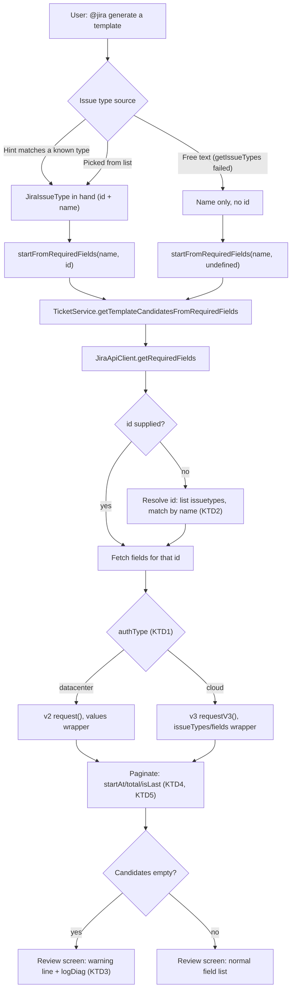

# Template Generation createmeta Fix - Plan

## Goal Capsule

- **Objective:** A developer running `@jira generate a template` against any currently-supported Jira Data Center or Cloud instance gets a working template-generation flow, not a 404.
- **Means:** Replace the removed bulk `createmeta` call with the platform-appropriate granular per-issue-type endpoints (KTD1, KTD2), and close a related silent-empty-template gap surfaced during planning (KTD3).
- **Product authority:** Restores prior behavior. `IJiraClient.getRequiredFields()`'s `JiraFieldMeta[]` return contract and the review-list UI stay unchanged, except the added empty-result warning (R4).
- **Open blockers:** None.

---

## Product Contract

### Summary

Fixes `@jira generate a template`, which 404s because `JiraApiClient.getRequiredFields()` calls a Jira endpoint Atlassian has removed. The fix swaps in the granular per-issue-type replacement endpoints, branched by platform, and adds one explicit warning line for the case where the fetch legitimately comes back empty.

### Problem Frame

`JiraApiClient.getRequiredFields()` (`src/jira/JiraApiClient.ts:392`) calls `GET /rest/api/2/issue/createmeta?projectKeys=...&issuetypeNames=...&expand=projects.issuetypes.fields`. Atlassian removed this bulk endpoint from Jira Data Center in Jira 9.0, and from Cloud on 2024-06-03 — confirmed by Atlassian's own removal notice. Every call to `@jira generate a template` against an issue type now 404s, logged as `[jira.templateGeneration] Could not fetch required fields`.

The official replacements are two granular, ID-keyed endpoints — `GET .../createmeta/{projectIdOrKey}/issuetypes` and `.../issuetypes/{issueTypeId}` — but Data Center serves them under `/rest/api/2/` and Cloud only under `/rest/api/3/` (confirmed by an Atlassian staff member: the v2 granular path "was never valid for Cloud" and 404s there). A prior plan (`docs/plans/2026-08-30-1135-feat-template-generation-from-ticket-plan.md:148`) already flagged this endpoint's exact shape as unverified at authoring time — that gap is what produced this bug.

### Requirements

**Endpoint fix**

R1. `@jira generate a template` succeeds against a Jira Data Center instance where the bulk `createmeta` endpoint is gone (e.g. 11.3.7+), instead of 404ing.

R2. `@jira generate a template` succeeds identically against Jira Cloud — the DC-only granular endpoint does not exist there, so a Cloud-unaware fix would trade one 404 for another.

R3. The generated template's contents (issue-type name, default fields) are unchanged for the same ticket/issue-type input — this restores prior behavior; it does not change what a template contains.

**Empty-result clarity**

R4. When the required-fields fetch legitimately returns nothing — the issue type genuinely has none, the caller lacks Create-issue permission on it, or the type could not be resolved — the review screen shows one explicit warning line instead of silently producing an empty, save-able template with no explanation.

### Key Decisions

- **Add an explicit warning when required-fields candidates come back empty**, rather than leaving the pre-existing silent-empty-save behavior untouched (session-settled: user-directed — chosen over deferring to a separate follow-up: cheap to close now, and flow analysis showed the empty-result case is reachable today and already silent). Governs R4.

### Acceptance Examples

AE1. Covers R4. **Given** an issue type with zero configured required fields, **When** the fetch runs, **Then** the review screen shows the warning line plus an empty, confirmable field list — saving still proceeds, now with an explanation.

AE2. Covers R4. **Given** an issue type with required fields but no Create-issue permission for the caller, **When** the fetch runs, **Then** the same warning line renders — the API gives no way to tell this case apart from AE1's, so the wording covers both rather than guessing which applies.

### Scope Boundaries

- Out of scope: `@jira check required fields on PROJ-123` — a separate code path (does not call `getRequiredFields`), unaffected.
- Out of scope: disambiguating *which* cause (zero fields / no permission / unresolved type) produced an empty result — KD above deliberately covers all three with one line rather than attempting API-side diagnosis.

#### Deferred to Follow-Up Work

- `createHandler.ts:256-257` and `jiraTools.ts:534` discard `JiraIssueType.id` the same way `templateGenerationHandler.ts` did — neither calls `getRequiredFields`, so neither is broken by this bug, but both are candidates for the same id-carrying treatment later.
- CLAUDE.md's Jira API section says "No current operations require [`requestV3()`]" — stale since `searchJql()` already uses it; a one-line doc fix, unrelated to this bug's mechanics.

### Sources

- [Atlassian: createmeta REST endpoint to be removed](https://confluence.atlassian.com/jiracore/createmeta-rest-endpoint-to-be-removed-975040986.html) — Data Center removal notice (Jira 9.0) and the two v2 granular replacement paths.
- [Atlassian: Creating an issue — examples](https://developer.atlassian.com/server/jira/platform/jira-rest-api-examples/#creating-an-issue-examples) — confirmed Data Center response shape for both granular endpoints (paginated, `values` wrapper).
- [Atlassian Cloud REST API v3 — Issues](https://developer.atlassian.com/cloud/jira/platform/rest/v3/api-group-issues/) and Cloud OpenAPI v3 spec — confirmed Cloud response shape (`issueTypes` wrapper on the list endpoint, `fields` wrapper on the per-type endpoint, no `isLast`).
- [Community thread, Atlassian staff confirmation](https://community.developer.atlassian.com/t/rest-api-2-issue-createmeta-projectidorkey-issuetypes-no-longer-working-on-jira-cloud-wrong-post-should-be-createmeta-copy-operation-entry-prevents-jira-rest-java-client-from-working/64597) — the v2 granular path 404s on Cloud; v3 required.
- `src/jira/JiraApiClient.ts:228-238` (`searchJql`) — existing precedent for branching `request()`/`requestV3()` by `authType` on a Cloud-vs-DC endpoint divergence.
- `src/jira/JiraApiClient.ts:323-339` (`getAllComments`) — existing pagination-loop precedent (`startAt`/`total`, `maxIterations` backstop).
- `src/jira/JiraApiClient.ts:270-314` (`getProjectStatuses`, `getSprintByName`, `getTeamByName`) — existing precedent for case-insensitive name→id resolution living inside `JiraApiClient` rather than `TicketService`.
- `src/participant/sessionState.ts:549-552` (`isSessionExpired`) — confirms `schemaVersion` gating is a `<` comparison, not exact-match; a version bump is required (not just defensive) to invalidate a pre-fix session shape.
- `src/participant/sessionState.ts:221-226` (`pickByNumberOrName`), `:862-865` (`parseIssueTypePick`) — confirms the pick helper is private, non-generic, and has exactly one relevant caller (`templateGenerationHandler.ts:246`).
- `docs/plans/2026-08-30-1135-feat-template-generation-from-ticket-plan.md:148` — prior plan's unverified-shape caveat that this bug confirms.

---

## Planning Contract

### Key Technical Decisions

KTD1. **Branch `getRequiredFields()` by `authType`** — Data Center calls the v2 granular endpoints via the existing `request()`; Cloud calls the v3 equivalents via the existing `requestV3()`. Mirrors `searchJql()`'s existing Cloud/DC split exactly (session-settled: user-directed — chosen over a single unbranched call: Atlassian confirms Cloud 404s on the v2 granular path despite an inconsistent OpenAPI listing that suggests otherwise).

KTD2. **Hybrid `issueTypeId` resolution.** `getRequiredFields()` gains an optional `issueTypeId` parameter. The two call sites that already have a `JiraIssueType` in hand (hinted-type match, pick-list selection) pass its `id`. The free-text fallback path — reached only when `getIssueTypes()` itself already failed — has no `JiraIssueType` to source an id from, so when `issueTypeId` is omitted, `getRequiredFields()` resolves it internally by calling the **same project-scoped** list-issuetypes endpoint (the createmeta family KTD5 describes, not a global issue-type list — kept consistent with `TicketService.getIssueTypes()`'s own project-scoped semantics) and matching by name (case-insensitive, same matching rule the current code uses). This mirrors an existing pattern already in `JiraApiClient` — `getTeamByName`, `getSprintByName`, and `getProjectStatuses` all resolve a name to an id internally rather than pushing that lookup into `TicketService` (session-settled: user-directed — chosen over always resolving internally: saves a round-trip on the two paths that already know the id; chosen over threading only: the free-text path structurally cannot supply one). Governs R1, R2, R3.

KTD3. **Empty-candidates warning, instantiating the Key Decision above.** `startFromRequiredFields()` checks the candidate list after fetch; when empty, it prepends one warning line to the streamed review output and logs via `logDiag('jira.templateGeneration', 'warn', ...)` with the project key and issue type. No attempt to distinguish zero-fields from no-permission from unresolved-type — the API gives no reliable signal to tell them apart (session-settled: user-directed). Governs R4.

KTD4. **Pagination mirrors `getAllComments`'s existing convention** — loop on `startAt`, stop on an empty page, `collected.length >= total`, or Data Center's `isLast` (Cloud's responses omit `isLast`, so `total`/`startAt` alone must drive termination there), with the same hard `maxIterations` backstop against a non-advancing response. Applies to both the list-issuetypes call and the per-type-fields call, each of which can legitimately span multiple pages.

KTD5. **Response parsing is normalized per platform, not assumed uniform.** Data Center wraps both endpoints' items under `values` and includes `isLast`. Cloud wraps the list endpoint under `issueTypes` and the per-type endpoint under `fields`, with no `isLast`. Confirmed against Atlassian's own examples page and OpenAPI v3 spec — not against Data Center's OpenAPI spec, which `$ref`s the wrong (unwrapped) schema for both operations and would mislead any codegen-driven type. Field-metadata objects (`fieldId`/`name`/`required`/`schema`) are shape-compatible across both platforms and share one internal type.

KTD6. **Bump `CURRENT_SESSION_SCHEMA_VERSION`** (`sessionState.ts:506`, currently `1`) as part of this change. `isSessionExpired()` (`sessionState.ts:549-552`) rejects a persisted session only when its stored `schemaVersion` is *less than* the current constant — not on exact mismatch — and performs no structural check of the session's actual shape. Without the bump, a `TemplateGenerationTypePickSession` persisted before this fix (old `availableIssueTypes: string[]`) would pass the expiry check unchanged and reach the new object-shaped parsing in U2. The bump is the only gate; there is no independent runtime shape validation to fall back on. The constant is shared, not scoped to template generation — `reportImportHandler.ts` stamps the same counter onto the Veracode and Waltz import review sessions, so this bump also expires any of those sessions a user has in flight at deploy time. Accepted as-is: it's the existing, already-coarse-grained behavior of a shared mechanism, not something this fix introduces.

### High-Level Technical Design

---

## Implementation Units

### U1. `JiraApiClient.getRequiredFields()` — endpoint and parsing replacement

**Goal:** Replace the removed bulk `createmeta` call with the platform-branched granular endpoints, preserving the existing `JiraFieldMeta[]` return contract.

**Requirements:** R1, R2, R3

**Dependencies:** None — this is the foundation unit.

**Files:**
- `src/jira/JiraApiClient.ts` — rewrite `getRequiredFields()`; add a private paginated-fetch helper mirroring `getAllComments`'s loop.
- `src/jira/IJiraClient.ts` — extend `getRequiredFields`'s signature with an optional `issueTypeId` parameter.
- `src/test/JiraApiClient.test.ts` — replace the `getRequiredFields` describe block.

`MockJiraClient` (`src/test/mocks/MockJiraClient.ts`) needs no change: TypeScript accepts its existing 2-parameter implementation against the new 3-parameter-optional interface method unchanged.

**Approach:**
1. Add the optional `issueTypeId` parameter (KTD2). When present, skip straight to the per-type-fields call.
2. When absent, call the list-issuetypes endpoint first, paginated (KTD4), and resolve the id by case-insensitive name match — same matching rule the current code already uses. The new private pagination helper is scoped to `getRequiredFields` only; it does not unify with `getAllComments`'s existing hand-rolled loop (KTD4 names the convention it mirrors, not a shared implementation).
3. Branch both calls by `this.authType` (KTD1): `request()` + `/rest/api/2/issue/createmeta/{projectKey}/issuetypes[/{id}]` for `datacenter`; `requestV3()` + `/rest/api/3/issue/createmeta/{projectKey}/issuetypes[/{id}]` for `cloud`.
4. Parse per platform (KTD5): Data Center reads `values` on both endpoints; Cloud reads `issueTypes` on the list call and `fields` on the per-type call. Neither list is guaranteed non-empty — an empty result (unmatched name, or a 200 with an empty array on missing Create permission) returns `[]`, unchanged from today.
5. Filter to `required: true`, map to `{id, name, schema}` exactly as the current implementation does — the return contract does not change.

**Patterns to follow:** `searchJql()` (`JiraApiClient.ts:228-238`) for the `authType` branch; `getAllComments()` (`JiraApiClient.ts:323-339`) for the pagination loop and `maxIterations` backstop.

**Test scenarios:**
- Happy path, Data Center, `issueTypeId` given: URL is `/rest/api/2/issue/createmeta/PROJ/issuetypes/10001`; required fields extracted correctly from a `values`-wrapped payload.
- Happy path, Cloud, `issueTypeId` given: URL is `/rest/api/3/issue/createmeta/PROJ/issuetypes/10001`; required fields extracted from a `fields`-wrapped array payload.
- Happy path, Data Center, no `issueTypeId`: first call hits `/rest/api/2/issue/createmeta/PROJ/issuetypes`, resolves the id by case-insensitive name match against `values[].name`, then calls the per-type endpoint with the resolved id.
- Happy path, Cloud, no `issueTypeId`: same sequence against `/rest/api/3/...`, matching against `issueTypes[].name`.
- Pagination, Data Center: list call spans two pages (`isLast: false` then `isLast: true`) before a match is found; both pages are fetched.
- Pagination, Cloud: per-type call spans two pages of `fields` (`total`/`startAt`, no `isLast`); all pages are collected before filtering.
- Empty result (no create permission or issue type absent): a 200 response with an empty `values`/`issueTypes`/`fields` array returns `[]` — no throw.
- Unmatched issue-type name during internal resolution: list call returns issue types, none match the given name — returns `[]` (preserves current behavior).
- Runaway pagination guard: a page response that never advances `startAt` and never reports completion is capped by `maxIterations` and returns rather than hanging.
- 404 and 401 still throw `JiraApiError` with the correct `.status` — existing error-handling convention preserved unchanged.

**Verification:** `npm run compile` passes with the new signature; the rewritten `getRequiredFields` describe block in `JiraApiClient.test.ts` is green, covering both platforms and both id-known/id-unknown paths.

---

### U2. Thread `issueTypeId` through `TicketService` and the template-generation handler

**Goal:** Supply `issueTypeId` to `getRequiredFields()` from the two call sites where it's already available, and confirm the free-text path passes none.

**Requirements:** R1, R2, R3

**Dependencies:** U1

**Files:**
- `src/services/TicketService.ts` — `getTemplateCandidatesFromRequiredFields()`.
- `src/participant/jira/templateGenerationHandler.ts` — issue-type-list building, `startFromRequiredFields()`, its three call sites.
- `src/participant/sessionState.ts` — `TemplateGenerationTypePickSession.availableIssueTypes` and the pick-by-number-or-name helper it uses.
- `src/test/TicketService.test.ts`, `src/test/JiraParticipant.test.ts` (pure-helper coverage for the `sessionState.ts` change).
- `src/test/templateGenerationSessionState.test.ts` — its existing `parseIssueTypePick` coverage asserts a bare matched string against a `string[]` fixture; update it to pass `{id, name}[]` plus a `nameOf` selector and assert on the matched entry.

**Approach:**
1. `TicketService.getTemplateCandidatesFromRequiredFields(projectKey, issueType, issueTypeId?)` — add the optional parameter, pass through to `IJiraClient.getRequiredFields()` unchanged otherwise.
2. `templateGenerationHandler.ts`'s issue-type-list building (currently `.map(t => t.name)`) keeps the full `JiraIssueType[]` so the hinted-match call site can forward `matched.id`.
3. `startFromRequiredFields()` gains an optional `issueTypeId` parameter and forwards it.
4. The free-text fallback call site (reached only when `getIssueTypes()` already failed) has no `JiraIssueType` and passes no id — `getRequiredFields()` resolves it internally per KTD2.
5. `TemplateGenerationTypePickSession.availableIssueTypes` changes from `string[]` to `{id, name}[]`. `pickByNumberOrName` (`sessionState.ts:221-226`) is private, non-generic, and returns a plain matched string — generalize it with a `nameOf` selector so `parseIssueTypePick` (`sessionState.ts:862-865`, its only relevant caller) can operate on `{id, name}[]` and return the matched entry. `parseResolutionSelection` (`sessionState.ts:228`, the helper's only other caller) keeps calling it with an identity selector on its unrelated `string[]` `resolutionOptions` — unaffected by this change.
6. Bump `CURRENT_SESSION_SCHEMA_VERSION` per KTD6, so a session persisted before this fix is rejected by `isSessionExpired()` rather than reaching the new object-shaped parsing.

**Patterns to follow:** `pickByNumberOrName`/`parseIssueTypePick` in `sessionState.ts` for the generalization; `isSessionExpired()`'s existing version-gate shape for the bump.

**Test scenarios:**
- `getTemplateCandidatesFromRequiredFields` forwards a supplied `issueTypeId` to `client.getRequiredFields` unchanged, and forwards `undefined` when none is given.
- Hinted-match call site resolves the matched entry to a full `JiraIssueType` and forwards its `id`.
- Free-text fallback call site forwards no id.
- Pick-list flow: picking by number or by name resolves both the display name and its `id`; both are forwarded to `startFromRequiredFields`.
- `parseResolutionSelection` (the pick helper's unrelated caller) still resolves plain `string[]` `resolutionOptions` correctly after the generalization — regression guard.
- A session persisted with the pre-fix `schemaVersion` (`1`) is treated as expired by `isSessionExpired()` after the bump to `2` (KTD6) — confirms a stale session never reaches the new `{id, name}[]` parsing.

**Verification:** `npm run compile` passes; `TicketService.test.ts` and the relevant `JiraParticipant.test.ts` cases are green; manual trace of all three call sites confirms each passes the id it actually has.

---

### U3. Empty-candidates warning

**Goal:** Surface one explicit line when the required-fields fetch legitimately returns nothing, instead of silently producing an empty, save-able template.

**Requirements:** R4

**Dependencies:** U2

**Files:**
- `src/participant/jira/templateGenerationHandler.ts` — `startFromRequiredFields()`.
- `src/test/JiraParticipant.test.ts` (or the e2e suite, per the existing split between pure-helper and VS Code-coupled coverage).
- `docs/jira-flows.md` — one line noting the warning, if the template-generation flow's existing entry there describes this behavior in enough detail to need it.

**Approach:**
1. After `getTemplateCandidatesFromRequiredFields()` returns, check for an empty result.
2. When empty, log via `logDiag('jira.templateGeneration', 'warn', ...)` with the project key and issue type (KTD3), and prepend one warning line to the streamed review output before the (empty) review list renders.
3. The review/confirm flow itself is unchanged — an empty list remains confirmable (AE1, AE2); the warning only adds context, it never blocks.

**Patterns to follow:** Existing `logDiag` usage elsewhere in `templateGenerationHandler.ts`; the review-screen streaming shape already in `streamReview()`.

**Test scenarios:**
- Empty candidates: the streamed output includes the warning line, and `logDiag` is called with `'warn'` and the project/issue-type context.
- Covers AE1 / AE2: the warning renders identically whether the empty result came from zero configured required fields or from a permission-denied empty response — no attempt to distinguish them.
- Non-empty candidates: no warning line appears — regression guard against the addition firing unconditionally.
- Empty-with-warning still allows save: confirming an empty, warned review list proceeds to save exactly as an empty unwarned list did before this fix.

**Verification:** `npm test` green on the new/updated scenarios above; manual read-through of `startFromRequiredFields()` confirms the warning path and the normal path both reach `streamReview()` unchanged otherwise.

---

## Verification Contract

| Command | Purpose |
|---|---|
| `npm run compile` | TypeScript type check — catches signature drift from the `issueTypeId` threading change across `IJiraClient`, `TicketService`, and the handler. |
| `npm test` | Vitest unit suite — must stay green, including `JiraApiClient.test.ts`, `TicketService.test.ts`, and `JiraParticipant.test.ts`. |

## Definition of Done

- `npm run compile` passes with no errors.
- `npm test` passes, including all new and updated scenarios in U1–U3.
- `searchJql`'s existing Data Center/Cloud branch tests still pass unchanged — confirms the `authType`-branch pattern reuse didn't regress its origin.
- No leftover dead-end code from approaches explored during implementation (e.g., an abandoned parsing attempt) remains in the diff.

---

## Risks & Dependencies

- **External API risk:** Atlassian could change these endpoints again. Mitigated by testing against officially-confirmed response shapes (Sources above) rather than assumption, and by keeping all parsing behind `JiraApiClient` so a future change is a contained fix.
- **Silent-empty semantics:** a 200 with an empty array (no Create permission) looks identical to "genuinely zero required fields" at the API level — R4/KTD3 accept this rather than attempting unreliable disambiguation.
- **Dependency:** none upstream; no other in-flight plan depends on or blocks this fix.
