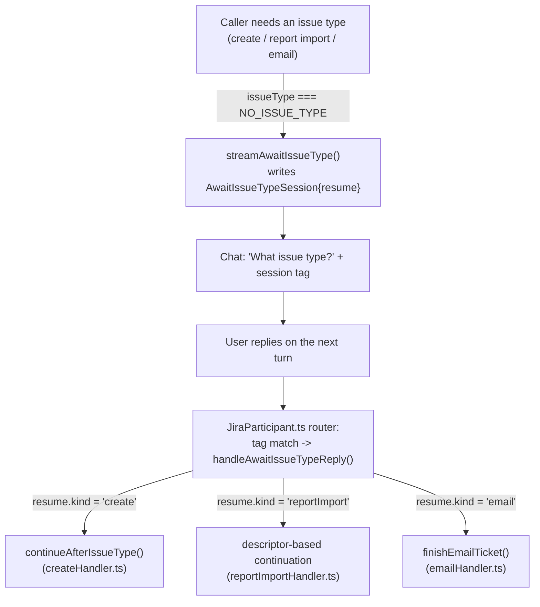

# Onboarding Chat Flow Continuity - Plan

## Goal Capsule

- **Objective:** A user working through the onboarding walkthrough (or the template-generation, PR-review, direct-create, email-import, and report-import flows it triggers) stays inside the Copilot Chat conversation for every step — no command fails for a reason the chat itself doesn't explain, no native VS Code UI element pulls the user out of the conversation to answer a question the flow could ask in chat, and every walkthrough step that needs user-specific input (a project, a URL) offers a ready-to-edit example in chat rather than side-panel prose alone.
- **Product authority:** Restores/completes intended onboarding behavior; touches no other Jira/Bitbucket flow. Two existing buttons/prompts are broken (R1-R3) and two more walkthrough spots get a new button extending the same fix (R4, R5); flow analysis found a third occurrence of the same "missing info → native input box" anti-pattern shared by every flow that resolves an issue type before creating a ticket, which the user directed be converted in this same pass (R6). Every other chat-open trigger and `showInputBox` call across the walkthroughs and `extension.ts` was checked and needs no change.
- **Open blockers:** None.

---

## Product Contract

### Summary

Fixes two onboarding-flow breaks — the "discover workflow" walkthrough button auto-sends an incomplete command Jira has to reject, and `@jira generate a template`'s two missing-info prompts interrupt the chat with a native VS Code input box — extends the fix's placeholder-token pattern to two more walkthrough spots that share the same shape, and converts a third native-input-box occurrence of the same anti-pattern shared by every flow that resolves an issue type before creating a ticket.

### Problem Frame

The Getting-Started walkthrough (PR #44) drives flows from PR #42's template-generation feature, the existing workflow-discovery command, and the Bitbucket PR-review flow. Testing the walkthrough end-to-end surfaced the workflow-discovery button opening chat with `@jira discover workflow ` — a trailing space, no project or issue type — and, because `workbench.action.chat.open`'s `query` auto-submits unless `isPartialQuery: true` is set, sending it immediately, before the user can type anything. The reply then has to reject it: `workflowHandler.ts` already replies "Please specify a project and issue type…", but only after a failed round trip the user never asked for. The identical broken command URI is also duplicated in `package.json`'s own compact walkthrough-step `description` string (shown in the step list before a user opens the full markdown page), so fixing only the markdown file would leave a second, earlier copy of the same bug live. Separately, `@jira generate a template` — the walkthrough's own next-step button — opens a native `vscode.window.showInputBox` for the template name whenever the initial prompt doesn't include one, and a second `showInputBox` for a free-text issue type when the type list can't be fetched; both interrupt the chat with a different UI surface entirely. Checking the rest of the walkthrough for the same "hint lives only in panel prose" shape found two more spots with no button at all: the Bitbucket walkthrough's PR-review step (paste a URL yourself, per prose only) and the Jira walkthrough's direct `@jira create` alternative (mentioned only in passing prose). Flow analysis of the R2/R3 conversion surfaced a third, wider occurrence of the same native-input-box anti-pattern: `resolveIssueTypeOrPrompt()` in `ticketContext.ts` is a shared helper called from six sites across four files — `@jira create`'s combined template/issue-type selection (`JiraParticipant.ts`, `createHandler.ts`), Veracode/Waltz report import (`reportImportHandler.ts`, shared by both descriptors), and all three issue-type-resolution points in email-to-ticket (`emailHandler.ts`) — every one of which still pops a native input box when no issue type is otherwise resolvable, including through R5's new direct-create button. The user directed this be converted in the same pass rather than deferred.

### Requirements

**Chat-open trigger stays unsent until complete**

R1. The "discover workflow" walkthrough button opens chat with the query text `@jira discover workflow <PROJECT> <ISSUE_TYPE>` and does not send it — the user replaces the placeholders and sends it themselves.

R4. The Bitbucket walkthrough's PR-review step gains a second button, alongside the existing "check your connection" button, that opens chat with `@bitbucket <URL>` and does not send it.

R5. The Jira walkthrough's first-ticket step gains a second button, alongside the existing "generate a template" button, that opens chat with `@jira create <TYPE> in <PROJECT>: 
` and does not send it.

**Missing info is asked in chat, not a native input box**

R2. When `@jira generate a template` has no template name in the prompt, the flow asks for the name via a chat reply-and-continue step instead of `vscode.window.showInputBox`.

R3. When the issue-type list can't be fetched and no issue type is otherwise known, the free-text issue-type entry also asks via a chat reply-and-continue step instead of `vscode.window.showInputBox`.

R6. Every flow that calls `resolveIssueTypeOrPrompt()` when no issue type is otherwise resolvable — `@jira create` (including R5's new direct-create button), Veracode report import, Waltz report import, and all three issue-type-resolution points in email-to-ticket — asks for the free-text issue type via a chat reply-and-continue step instead of `vscode.window.showInputBox`, with each flow resuming exactly where it left off once the type is known.

### Key Decisions

- **Populate an incomplete or missing chat-open trigger's query with visible placeholder tokens instead of a bare incomplete string or no button at all, and don't auto-send it** (session-settled: user-directed — chosen over sending a fabricated complete example: the hint travels with the pre-filled text itself, and nothing gets sent the user didn't ask for). Applied to the one existing button that was broken (R1) and extended, on the same reasoning, to two spots that had no button and relied on side-panel prose alone (R4, R5). Governs R1, R4, R5.
- **Fix `package.json`'s duplicate command URIs alongside the corresponding markdown files, and add R4/R5's new buttons there too** (unlabeled — directly inferred from the plan's own stated intent: `package.json`'s `contributes.walkthroughs` step `description` strings are byte-identical copies of the same `command:workbench.action.chat.open` URIs the markdown files use, discovered by flow analysis and not previously listed in Sources; leaving them unfixed would ship a half-fixed R1 and omit R4/R5 from the panel a user sees before opening the full page). Governs R1, R4, R5.
- **Guard against an unedited placeholder token reaching the LLM intent parser or a real API call** — before R1/R4/R5's target handlers (`workflowHandler.ts`'s discover-workflow parse, the Bitbucket URL parse, `@jira create`'s intent parse) act on a resolved value, treat one that still matches the literal placeholder shape (e.g. `<PROJECT>`, `<ISSUE_TYPE>`) the same as "missing," rather than passing it through (unlabeled — flow analysis found this is not guaranteed to fail cleanly on its own: `<URL>` fails `new URL()` parsing deterministically, but `<PROJECT> <ISSUE_TYPE>` and `<TYPE> in <PROJECT>: 
` go through an LLM-based intent parser with no deterministic contract for literal angle-bracket text, risking a confusing downstream API error instead of today's clean "please specify" message). Governs R1, R5 (R4 already fails cleanly via URL parsing and needs no guard).
- **Move both `showInputBox` prompts in the template-generation flow into chat, matching this flow's own existing issue-type pick-list pattern** (session-settled: user-directed — chosen over softening the native box with extra context instead: keeps the whole interaction inside the chat surface). Governs R2, R3.
- **Every new chat-reply-and-continue step accepts only an explicit `(c)` token as cancellation, not the full generic cancel-word list** (unlabeled — research-derived from a prior learning: a brand-new template name or freshly-typed issue type/free text has no live list to check first, unlike existing pick-list parsers that can check a real value before falling back to the generic cancel-word check; reusing the full `isCancellation()` word set here would make a real value that collides with a common word, e.g. a template literally named "Stop," permanently unenterable). Governs R2, R3, R6.
- **Convert `resolveIssueTypeOrPrompt()`'s native input box for every caller in this same pass, not just template generation** (session-settled: user-directed, choosing "convert it in this plan" over deferring — closes the "everything lives in chat" gap in one pass across `@jira create`, report import, and email-to-ticket, rather than leaving R5's own new button able to hit a native box through this one shared fallback). Introduces R6. A shared "await issue type in chat" session step, parameterized by which caller is resuming (mirroring `reportImportHandler.ts`'s existing `ReportImportDescriptor` parameterization for Veracode/Waltz), replaces the single shared `showInputBox` call so every caller keeps resuming through its own existing continuation function (`continueAfterIssueType`, `handleImportTemplateSelection`'s post-resolution logic, `finishEmailTicket`) — see High-Level Technical Design.

### Acceptance Examples

AE1. Covers R1. **Given** a user clicks the walkthrough's "Ask @jira to discover the workflow" button, **When** chat opens, **Then** the input box shows `@jira discover workflow <PROJECT> <ISSUE_TYPE>`, unsent and ready to edit.

AE2. Covers R2. **Given** a user sends `@jira generate a template` with no name, **When** the flow needs the name, **Then** chat asks for it and waits for the user's reply — no native input box appears.

AE3. Covers R3. **Given** `getIssueTypes` fails or returns nothing during template generation and the user hasn't given a resolvable issue type, **When** the flow falls back to free-text entry, **Then** chat asks for it and waits for the user's reply — no native input box appears.

AE4. Covers R4. **Given** a user clicks the Bitbucket walkthrough's new "review a PR" button, **When** chat opens, **Then** the input box shows `@bitbucket <URL>`, unsent, ready to paste a real PR URL over the placeholder — the existing "check your connection" button is unchanged.

AE5. Covers R5. **Given** a user clicks the Jira walkthrough's new direct-create button, **When** chat opens, **Then** the input box shows `@jira create <TYPE> in <PROJECT>: 
`, unsent, ready to edit — offered alongside the existing "generate a template" button, not replacing it.

AE6. Covers R6. **Given** any of `@jira create`, a Veracode/Waltz report import, or the email-to-ticket flow has no issue type otherwise resolvable, **When** the flow needs it, **Then** chat asks for it and waits for the user's reply — no native input box appears — and the ticket (or batch) is created exactly as it would have been had the type come from a native box.

### Scope Boundaries

- Out of scope: the other five walkthrough buttons that open VS Code Settings or run a credential-setup command directly (base URL ×2, credentials ×2, default project) — not chat; there is no chat session for them to interrupt.
- Out of scope: the existing `@jira generate a template`, `@bitbucket check`, and Veracode/OSS-import/create-from-email chat-open triggers — verified against source; all send a complete, valid command already and stay unchanged.
- Out of scope: the other `showInputBox` calls in `extension.ts` (Jira/Bitbucket credential entry, default project key) — Command Palette config actions invoked outside any chat session, not a flow the user is mid-conversation with.
- Out of scope: `resolveProjectKey()`'s own `showInputBox` (`ticketContext.ts`) — a separate helper from `resolveIssueTypeOrPrompt()`, not named in R6, and can immediately follow R2's new chat-based name ask in the same command; left as a residual UI-surface mix, noted below rather than silently expanded into.
- In scope (documentation): `docs/jira-flows.md`'s session-type table and detection-order list gain rows for R2/R3/R6's new session step(s), per CLAUDE.md's own convention for new multi-turn session types.

#### Deferred to Follow-Up Work

- A CLAUDE.md convention capturing the broader principle this brainstorm settled on — an onboarding/chat flow stays inside the chat surface, with no native VS Code UI to continue it, unless the user asks otherwise — is a documentation follow-up, not part of this plan's code changes.
- `resolveProjectKey()`'s `showInputBox` (`ticketContext.ts:27-43`) — the same anti-pattern, one step earlier in the same flows R6 touches; not converted here since it wasn't named in scope, but worth the same treatment in a follow-up.
- `templateGenerationHandler.ts`'s pre-existing message-conflation bug (flagged by flow analysis, not introduced by this plan): when the issue-type fetch fails (vs. legitimately returning empty) after a caller-supplied hint didn't match, the user sees `_"X" isn't one of PROJ's issue types_` immediately followed by the free-text fallback prompt — the first sentence is misleading when the real cause was a fetch failure, not a genuine mismatch. R3 converts the input surface only; the underlying message stays as-is.
- `continueAfterIssueType()`'s `vscode.window.showQuickPick` for template field-resolution errors (`createHandler.ts:87-90`) — a third, narrower native-UI-interrupt-chat surface noticed while reading this code for R6, but not part of any confirmed requirement; left untouched to avoid unbounded scope creep.

### Sources

- `walkthroughs/jira/workflow.md:3` — the incomplete `@jira discover workflow ` chat-open query.
- `package.json` (`contributes.walkthroughs`, `jiraWorkflow`/`jiraFirstTicket`/`bitbucketFirstReview` step `description` fields, ~lines 793, 804, 844) — the duplicate command URIs in the compact step-list panel, not previously cited.
- `src/participant/jira/workflowHandler.ts:15-18` — the graceful (but only-after-auto-send) missing-project/type reply.
- `src/participant/jira/templateGenerationHandler.ts:82`, `:130` — the two `showInputBox` calls in scope for R2/R3.
- `walkthroughs/bitbucket/first-review.md:3-5` — the existing (unchanged) `@bitbucket check` button plus the prose-only PR-URL instruction R4 adds a button for.
- `walkthroughs/jira/first-ticket.md:3-5` — the existing (unchanged) "generate a template" button plus the prose-only `@jira create` mention R5 adds a button for.
- `src/extension.ts:141,340` — the other chat-open triggers (Veracode/OSS import, create-from-email), verified complete, confirmed out of scope.
- `src/participant/jira/ticketContext.ts:49-60` — `resolveIssueTypeOrPrompt()`, the shared `showInputBox` helper R6 converts; its `''`/`NO_ISSUE_TYPE` never-guess sentinel and the `sessionWasSuperseded()` async-supersession guard are preserved, not changed.
- `src/participant/JiraParticipant.ts:265`, `src/participant/jira/createHandler.ts:279`, `src/participant/jira/reportImportHandler.ts:253`, `src/participant/jira/emailHandler.ts:301,336,458` — the six `resolveIssueTypeOrPrompt()` call sites R6 converts, and their existing continuation functions (`continueAfterIssueType`, `handleImportTemplateSelection`'s post-resolution logic, `finishEmailTicket`) that resume unchanged once the type is known.
- `src/participant/jira/veracodeHandler.ts`, `src/participant/jira/waltzHandler.ts` — the two `ReportImportDescriptor` instances R6's shared report-import session step is parameterized by, mirroring how each already re-exports `handleImportTemplateSelection` bound to its own descriptor.
- `docs/jira-flows.md:121-131` — the session-type table and detection-order list R2/R3/R6's new session step(s) extend, per CLAUDE.md convention.
- [VS Code community discussion confirming `workbench.action.chat.open`'s `isPartialQuery` behavior](https://github.com/microsoft/vscode-discussions/discussions/2480) — default (unset) auto-submits; `isPartialQuery: true` populates without sending.

---

## Planning Contract

### Key Technical Decisions

KTD1. **A pure placeholder-shape guard, not per-handler ad hoc checks.** Add one small pure predicate (e.g. `looksLikeUnfilledPlaceholder(value)`, matching a literal `<UPPER_CASE>` token) alongside the existing LLM-intent utilities, and call it wherever a resolved field from R1's/R5's target parse is checked for presence, treating a match the same as "missing." A single shared predicate keeps the three placeholder vocabularies (`<PROJECT>`, `<ISSUE_TYPE>`, `<TYPE>`, `
`) consistent and unit-testable in one place instead of duplicated regexes per call site. Governs R1, R5.

KTD2. **Mirror `TemplateGenerationAwaitSummarySession`'s existing shape for R2/R3's new chat-ask steps** (session-settled: user-directed — chosen over inventing a new session shape: this flow already has a working free-text ask-and-continue precedent in the same file, so the new steps stay consistent with its four siblings rather than introducing a second pattern). Each new session type carries `schemaVersion: CURRENT_SESSION_SCHEMA_VERSION` like every other type in `sessionState.ts`; no version bump is needed since these are new types, not a reshape of an existing one. Governs R2, R3.

KTD3. **New chat-reply parsers treat only an explicit `(c)` reply as cancellation, checked before any other interpretation of the reply — a deliberate, one-time divergence from `handleAwaitSummaryReply`'s own unmodified `isCancellation()` check, not an extension of an existing pick-list-only pattern.** `handleAwaitSummaryReply` (KTD2's own mirrored precedent) is itself a free-text ask with no live list to check, and its `isCancellation()` call already treats a literal "Stop" as cancellation — so a template or issue type named "Stop" is unenterable there today. R2/R3/R6's new parsers intentionally do not carry that behavior forward: they check only `(c)`, matching what their own prompt text advertises. This plan does not retrofit `handleAwaitSummaryReply` itself. Governs R2, R3, R6 (Key Decision above; this is the implementation mechanism).

KTD4. **A shared `AwaitIssueTypeSession` parameterized by a serializable `resume` payload, not three independent session types** (session-settled: user-directed — chosen over converting each of the three call-site families with its own bespoke session type: a shared step keeps the ask/cancel/expiry/re-prompt logic in one place, and mirrors how `reportImportHandler.ts` already parameterizes shared logic over a `ReportImportDescriptor` for Veracode vs. Waltz). Each family's `resume` payload carries the *identity* of what the user picked before the detour, not a pre-resolved object — the actual template/field resolution the continuation needs still happens after the type is known, in the same place it runs today:

  - `{ kind: 'create', projectKey, summary, description, extraFields?, pickedTemplateName: string | null }` — `pickedTemplateName` is looked up again at resume time via the same by-name lookup-with-fallback-warning `JiraParticipant.ts` already uses before its `resolveIssueTypeOrPrompt` call, so a template renamed or removed mid-ask degrades the same way it does today.
  - `{ kind: 'reportImport', descriptorKind: 'veracode' | 'waltz', pickedKind: 'template' | 'issueType', pickedName: string, ...the rest of that flow's `ImportTemplateSelectionSession` }` — `ImportTemplateSelectionSession` itself carries no picked-item field (the pick is parsed fresh from each reply), so the payload adds it explicitly.
  - `{ kind: 'email', session: EmailContentSession, pickedTemplateName: string | null }` — not a pre-computed `overrides`: the resume handler still calls `FieldResolver.resolve()` only after the type is known, preserving `emailHandler.ts`'s existing ordering ("resolve the issue type before doing any template-field resolution... a cancelled input box must not have paid for or waited on work it then discards") — moving that API call earlier would spend it on asks the user may still cancel.

  So each family resumes through its own existing continuation function (`continueAfterIssueType`, report import's post-resolution logic, `finishEmailTicket`) once the type is known, re-deriving whatever the continuation needs from the picked identity rather than persisting pre-resolved objects. `resolveIssueTypeOrPrompt()`'s `''`/`NO_ISSUE_TYPE` never-guess sentinel and its callers' `sessionWasSuperseded()` checks are preserved unchanged — only the UI surface for the ask itself moves to chat. The live `request.model`/`token` a resumed flow may need (e.g. inside `continueAfterIssueType`'s template field resolution) come from the turn that carries the reply, the same way every other existing multi-turn resume in `JiraParticipant.ts` already sources them — never persisted in the session. Governs R6.

### High-Level Technical Design

The R6 mechanism fans one shared ask-and-resume step out to three caller families, each keeping its own continuation:

---

## Implementation Units

### Phase A: Walkthrough chat-open buttons

### U1. Fix and extend the walkthrough chat-open buttons

- **Goal:** R1's button stops auto-sending and gains placeholder tokens; R4 and R5 add new buttons with the same shape; `package.json`'s duplicate description strings match.
- **Requirements:** R1, R4, R5. Covers AE1, AE4, AE5.
- **Dependencies:** None.
- **Files:**
  - `walkthroughs/jira/workflow.md`
  - `walkthroughs/jira/first-ticket.md`
  - `walkthroughs/bitbucket/first-review.md`
  - `package.json` (`contributes.walkthroughs` step `description` fields for `jiraWorkflow`, `jiraFirstTicket`, `bitbucketFirstReview`)
- **Approach:**
  1. In `workflow.md` and its `package.json` counterpart, set `isPartialQuery: true` on the `workbench.action.chat.open` command and change the query to `@jira discover workflow <PROJECT> <ISSUE_TYPE>` (matching R1/AE1 exactly, no trailing space).
  2. In `first-ticket.md`, add a second button labeled as the shortcut (e.g. "Or ask @jira to create directly"), placed after the existing "generate a template" button and its explanatory prose — replacing the current "You can also skip straight to `@jira create`" sentence rather than duplicating it — query `@jira create <TYPE> in <PROJECT>: 
`, `isPartialQuery: true`. Mirror the same label into `jiraFirstTicket`'s `package.json` description.
  3. In `first-review.md`, add a second button placed after the "Once your connection checks out…" sentence, so ordering still implies check-connection-first, alongside the existing "check your connection" one, query `@bitbucket <URL>`, `isPartialQuery: true`. Mirror it into `bitbucketFirstReview`'s `package.json` description.
- **Patterns to follow:** The existing `@jira generate a template` and `@bitbucket check` buttons (unchanged) show the correct complete-command shape; the JSON-encoded `command:` URI syntax is identical across all three files.
- **Test scenarios:** Test expectation: none — markup/content only, no executable logic. Verify by manually opening each walkthrough step in VS Code and confirming the chat box populates unsent with the stated text (not Vitest-testable; `test:e2e` is not in CI either, per CLAUDE.md).
- **Verification:** Each button's `command:` URI, read from the file, decodes to the exact query text stated in R1/R4/R5 with `isPartialQuery: true`; `package.json` and its markdown counterpart agree.

### Phase B: Placeholder-token guard

### U2. Guard R1/R5's handlers against an unedited placeholder token

- **Goal:** A literal `<PROJECT>`/`<ISSUE_TYPE>`/`<TYPE>`/`
` token reaching the discover-workflow or direct-create parse is treated as missing, not as a real value.
- **Requirements:** R1, R5 (KTD1).
- **Dependencies:** U1 (the placeholder text this guards against).
- **Files:**
  - `src/participant/jira/llmHelpers.ts` (new pure predicate)
  - `src/participant/jira/workflowHandler.ts` (apply to discover-workflow's project/type check)
  - `src/participant/jira/createHandler.ts` (apply to direct-create's resolved project/summary/type fields)
  - `src/test/llmHelpers.test.ts` or the repo's existing test file for this module
- **Approach:**
  1. Add `looksLikeUnfilledPlaceholder(value: string | null | undefined): boolean` to `llmHelpers.ts`, matching a literal `<UPPER_CASE_WITH_UNDERSCORES>` shape.
  2. In `workflowHandler.ts`, extend the existing `if (!projectKey || !issueType)` guard to also treat a placeholder-shaped value as absent, so the existing "Please specify a project and issue type" reply fires instead of an LLM call on unedited text.
  3. In `createHandler.ts`'s direct-create path, apply the same guard to whichever resolved fields came from R5's button text before they reach a real API call.
- **Test scenarios:**
  - Happy path: a normal value (e.g. `"VSJI"`) is not flagged.
  - Edge: the literal placeholder text (`"<PROJECT>"`, `"<ISSUE_TYPE>"`) is flagged.
  - Edge: a real value that happens to contain angle brackets outside the exact placeholder shape (e.g. `"<Urgent> Bug"`) is not flagged.
  - Integration: sending `@jira discover workflow <PROJECT> <ISSUE_TYPE>` unedited reproduces today's clean "please specify" reply, not an LLM call or API error.
- **Verification:** `npm test` covers the new predicate; a manual trace confirms the unedited R1 button text still produces the existing graceful reply.

### Phase C: Template-generation chat-based asks

### U3. Move template generation's two missing-info prompts into chat (R2, R3)

- **Goal:** `@jira generate a template` asks for a missing name, and for a free-text issue type when the type list can't be fetched, via chat reply-and-continue instead of `vscode.window.showInputBox`.
- **Requirements:** R2, R3 (KTD2, KTD3). Covers AE2, AE3.
- **Dependencies:** None.
- **Files:**
  - `src/participant/sessionState.ts` (two new session types + pure reply parsers)
  - `src/participant/jira/templateGenerationHandler.ts` (remove both `showInputBox` calls; add the two new stream/handle function pairs; factor the post-name-resolution remainder of `handleGenerateTemplate` into its own resumable function)
  - `src/participant/JiraParticipant.ts` (two new router blocks, alongside the existing template-gen family at ~lines 611-656)
  - `src/test/templateGenerationSessionState.test.ts`
  - `docs/jira-flows.md` (new session rows — see U7)
- **Approach:**
  1. New session type for the name ask, carrying `TemplateGenerationRequest`'s three fields other than `templateName` (`projectKeyHint`, `sourceTicketKey`, `issueTypeHint`) — everything else `handleGenerateTemplate` needs (`workspaceRoot`, `hiddenDisplayFields`, `ticketService`) is re-derived fresh on the resuming turn, the same way every other resume already works.
  2. New session type for the free-text issue-type ask, carrying `templateName` and `projectKey` (both already resolved by the time this ask fires today).
  3. Both reply handlers follow `handleAwaitSummaryReply`'s overall shape — expiry check, then a cancel check, then an empty-reply re-prompt, then clear the session and call back into the resumable remainder of `handleGenerateTemplate` / `startFromRequiredFields` — except the cancel check itself: use KTD3's `(c)`-only check here, not `handleAwaitSummaryReply`'s unmodified `isCancellation()` (see KTD3's note on this intentional divergence).
- **Patterns to follow:** `TemplateGenerationAwaitSummarySession` / `handleAwaitSummaryReply` (`sessionState.ts`, `templateGenerationHandler.ts`) — the existing free-text ask-and-continue precedent in this same flow.
- **Test scenarios:**
  - Happy: a valid name reply resumes template generation past the name step.
  - Happy: a valid free-text issue type reply resumes into `startFromRequiredFields`.
  - Edge: an empty reply re-prompts without clearing the session.
  - Edge: a reply exactly `"Stop"` is accepted as a literal template name / issue type, not treated as cancellation (KTD3).
  - Cancellation: a `(c)` reply clears the session and reports cancelled.
  - Expiry: a stale `schemaVersion` produces the expired-session message and clears the session.
- **Verification:** `@jira generate a template` with no name, and with an unfetchable issue-type list, both complete end-to-end via chat replies with no native input box; `npm test` and `npm run compile` clean.

### Phase D: Shared issue-type chat ask (R6)

### U4. Shared `AwaitIssueTypeSession` mechanism + `@jira create` wiring

- **Goal:** Introduce the shared chat-based issue-type ask (KTD4) and convert `@jira create`'s combined template/issue-type selection off `showInputBox`.
- **Requirements:** R6 (KTD4). Covers AE6 (create path).
- **Dependencies:** None (independent of U1-U3; can land before or after).
- **Files:**
  - `src/participant/sessionState.ts` (`AwaitIssueTypeSession` type + reply parser)
  - `src/participant/jira/ticketContext.ts` (replace `resolveIssueTypeOrPrompt`'s `showInputBox` body with the chat-detour trigger; add `streamAwaitIssueType` / `handleAwaitIssueTypeReply`)
  - `src/participant/jira/createHandler.ts` (the `resume.kind === 'create'` branch)
  - `src/participant/JiraParticipant.ts` (the two existing `resolveIssueTypeOrPrompt` call sites at ~line 265 and ~line 279, plus the new router block)
  - `src/test/templateGenerationSessionState.test.ts` or a new `src/test/ticketContext.test.ts` for the shared parser
- **Approach:**
  1. Define `AwaitIssueTypeSession { resume: ...KTD4's discriminated union..., schemaVersion }` in `sessionState.ts`.
  2. Replace the body of `resolveIssueTypeOrPrompt` (or its call sites) so that when `issueType === NO_ISSUE_TYPE`, it persists the session with the caller's `resume.kind: 'create'` payload — `pickedTemplateName` from whichever template/entry the user already picked, per KTD4 — streams the chat ask, and returns — the caller's current synchronous "await and continue" shape becomes "detour and return" for this case.
  3. Add the router block; `handleAwaitIssueTypeReply` dispatches on `resume.kind`, and for `'create'` re-resolves `selectedTemplate` from `pickedTemplateName` using the same by-name lookup-with-fallback-warning `JiraParticipant.ts` already runs before its `resolveIssueTypeOrPrompt` call, then calls `continueAfterIssueType(...)` exactly as the two existing call sites do today, sourcing `model`/`token` from the current turn.
  4. Preserve `sessionWasSuperseded()`'s check right after the resume, per its existing comment.
- **Patterns to follow:** `TemplateGenerationAwaitSummarySession` (ask/cancel/expiry shape); `reportImportHandler.ts`'s `ReportImportDescriptor` (parameterization precedent).
- **Test scenarios:**
  - Happy: a typed issue type resumes `continueAfterIssueType` and creates the ticket exactly as the native box would have.
  - Edge: empty reply re-prompts.
  - Cancellation: `(c)` cancels, matching `resolveIssueTypeOrPrompt`'s existing cancel copy.
  - Expiry: stale session produces the expired message.
  - Integration: a second `@jira create` started while the first is awaiting its issue type reply supersedes the first (`sessionWasSuperseded()` still fires on resume).
- **Verification:** `@jira create` with no resolvable issue type, including via R5's new button, completes via chat with no native input box; `npm test` clean.

### U5. Wire Veracode/Waltz report import onto the shared mechanism

- **Goal:** Report import's issue-type fallback (shared by both descriptors) resumes through `AwaitIssueTypeSession` instead of `showInputBox`.
- **Requirements:** R6 (KTD4). Covers AE6 (report import path).
- **Dependencies:** U4 (the shared session type and router block it introduces).
- **Files:**
  - `src/participant/jira/reportImportHandler.ts` (extract the post-resolution logic in `handleImportTemplateSelection` into its own named continuation; add the `resume.kind === 'reportImport'` branch)
  - `src/participant/jira/veracodeHandler.ts`, `src/participant/jira/waltzHandler.ts` (re-export the new resume path bound to each descriptor, mirroring the existing `handleImportTemplateSelection` re-export)
  - Existing Veracode/Waltz test files covering this flow
- **Approach:**
  1. Extract everything in `handleImportTemplateSelection` after the `resolveIssueTypeOrPrompt` call into a named function taking the resolved issue type, the picked template/issue-type identity, and the rest of the session, generic over `<TItem, TRow>` like its siblings.
  2. On the `NO_ISSUE_TYPE` path, persist `resume: { kind: 'reportImport', descriptorKind: 'veracode' | 'waltz', pickedKind: 'template' | 'issueType', pickedName: string, ...remaining `ImportTemplateSelectionSession` fields }` (per KTD4, `pickedKind`/`pickedName` capture the pick this session type doesn't otherwise carry) and stream the ask.
  3. `handleAwaitIssueTypeReply`'s `'reportImport'` branch reconstructs the right descriptor from `descriptorKind` and calls the extracted continuation with the picked identity.
  4. Preserve the existing `sessionWasSuperseded()` check and its batch-scope comment.
- **Patterns to follow:** U4's `'create'` branch; the existing `veracodeHandler.ts`/`waltzHandler.ts` descriptor re-export pattern.
- **Test scenarios:**
  - Happy: a typed issue type resumes into the dedup/review flow for both Veracode and Waltz.
  - Edge: empty reply re-prompts; `(c)` cancels; stale session expires.
  - Integration: a newer import started while the first awaits its type reply supersedes the first, aborting it (existing comment's documented race).
- **Verification:** A Veracode or Waltz import that can't fetch issue types completes via chat with no native input box; `npm test` clean.

### U6. Wire email-to-ticket onto the shared mechanism

- **Goal:** All three issue-type-resolution points in email-to-ticket resume through `AwaitIssueTypeSession` instead of `showInputBox`.
- **Requirements:** R6 (KTD4). Covers AE6 (email path).
- **Dependencies:** U4.
- **Files:**
  - `src/participant/jira/emailHandler.ts` (the three call sites at ~lines 301, 336, 458; unify their shared `finishEmailTicket(...)`-with-overrides continuation)
  - Existing email-handler test file covering this flow
- **Approach:**
  1. All three sites already converge on `finishEmailTicket({ ...session, issueType, ...overrides })`, where `overrides` for the template-pick site additionally requires a `FieldResolver.resolve()` call — persist `resume: { kind: 'email', session: EmailContentSession, pickedTemplateName: string | null }` once (per KTD4, `pickedTemplateName` null for the confirm-as-is and no-options call sites, which have no pick), reused by all three call sites.
  2. `handleAwaitIssueTypeReply`'s `'email'` branch re-derives `overrides` from `resume.pickedTemplateName` — including the `FieldResolver.resolve()` call, run here for the first time rather than pre-computed, matching today's ordering — then calls `finishEmailTicket({ ...resume.session, issueType: resolvedType, ...overrides }, ...)`.
  3. Preserve the `STALE_EMAIL_SESSION_MESSAGE` / `sessionWasSuperseded()` check on resume, and the no-options-fallback preview text (`streamEmailContentPreview`'s existing branch) ahead of the ask.
- **Patterns to follow:** U4's `'create'` branch.
- **Test scenarios:**
  - Happy: each of the three original call sites (template pick, confirm-as-is, no-options fallback) resumes correctly with the typed issue type.
  - Edge: empty reply re-prompts; `(c)` cancels; stale session expires.
  - Integration: a superseded session aborts with `STALE_EMAIL_SESSION_MESSAGE` instead of proceeding on stale data.
- **Verification:** Each of the three email-to-ticket issue-type gaps completes via chat with no native input box; `npm test` clean.

### Phase E: Documentation

### U7. Document the new session types

- **Goal:** `docs/jira-flows.md`'s session-type table and detection-order list cover R2/R3/R6's new session steps, per CLAUDE.md's documented convention.
- **Requirements:** R2, R3, R6 (documentation only).
- **Dependencies:** U3, U4, U5, U6 (documents their final session-type names).
- **Files:** `docs/jira-flows.md`
- **Approach:** Add one row per new session type (name, `workspaceState` key, response tag) to the existing table, and extend the detection-order prose sentence to include them, following the format of the existing template-generation and Veracode/Waltz rows.
- **Test scenarios:** Test expectation: none — documentation only.
- **Verification:** Every session type introduced by U3-U6 has a corresponding row.

---

## Verification Contract

| Command | Applies to | Notes |
|---|---|---|
| `npm run compile` | All units | TypeScript type check; run before `npm test` per CLAUDE.md. |
| `npm test` | U2, U3, U4, U5, U6 | Vitest unit tests; must be green before every commit per CLAUDE.md. Covers the new pure predicate (U2) and all new session-state parsers (U3-U6). |
| `npm run test:e2e` | U1 | Not run in CI; the manual VS Code trace in U1's Test Scenarios substitutes, consistent with how the rest of the walkthrough was verified in PR #44. |

No new external dependencies, environment variables, or CI configuration changes. All six requirements are exercised by the existing test file conventions this repo already uses for Jira multi-turn session logic (`src/test/templateGenerationSessionState.test.ts` and siblings) — `JiraParticipant.ts`, `templateGenerationHandler.ts`, `ticketContext.ts`, `createHandler.ts`, `reportImportHandler.ts`, and `emailHandler.ts` import `vscode` and stay e2e-only per CLAUDE.md's Testing section; their pure logic (session shapes, reply parsers) lives in `sessionState.ts` and is what `npm test` actually exercises.

---

## Risks & Dependencies

- **Session-tag collision risk (low, mitigated by design):** R2's new "await name" session and the existing "await summary" session live in the same flow with similar shapes. Flow analysis confirmed the router dispatches on distinct tags with a single-match-per-turn invariant, so no misrouting risk exists as designed — each new session type in U3/U4/U5/U6 must keep a tag distinct from every sibling in its family, matching the existing convention.
- **Async supersession (existing, preserved not introduced):** `ticketContext.ts`'s documented race — a second run starting while the first awaits its issue-type reply — already has a guard (`sessionWasSuperseded()`). U4/U5/U6 must call it right after the chat-based resume, in the same place the native-box version called it after `showInputBox` resolved, or the mitigation silently regresses.
- **LLM intent-parser behavior on placeholder text (addressed by U2, verify manually):** U2's guard is a deterministic pre-check, not a change to the LLM parser itself — it should make R1/R5's actual LLM behavior on unedited placeholder text moot, but the manual trace in U2's Verification is still worth running once, since it is the only way to catch a case the guard's regex doesn't anticipate.

---

## Definition of Done

- All of R1-R6's Acceptance Examples (AE1-AE6) hold when manually exercised in VS Code.
- `npm run compile` and `npm test` are green.
- No `vscode.window.showInputBox` call remains in `templateGenerationHandler.ts` or on the `resolveIssueTypeOrPrompt` path.
- `walkthroughs/jira/workflow.md`, `walkthroughs/jira/first-ticket.md`, `walkthroughs/bitbucket/first-review.md`, and their `package.json` counterparts all show `isPartialQuery: true` with the stated placeholder text.
- `docs/jira-flows.md` lists every new session type introduced.
- No dead code from an abandoned design path (e.g., an unused intermediate session shape) remains in the diff.
