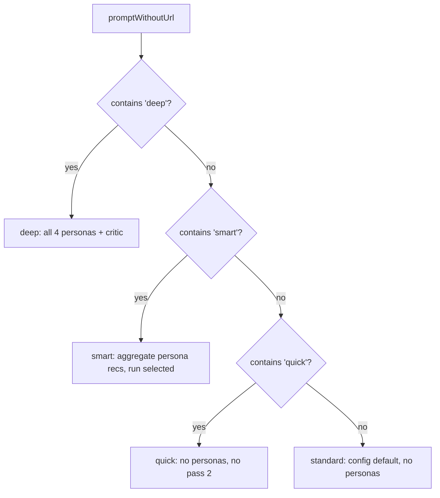
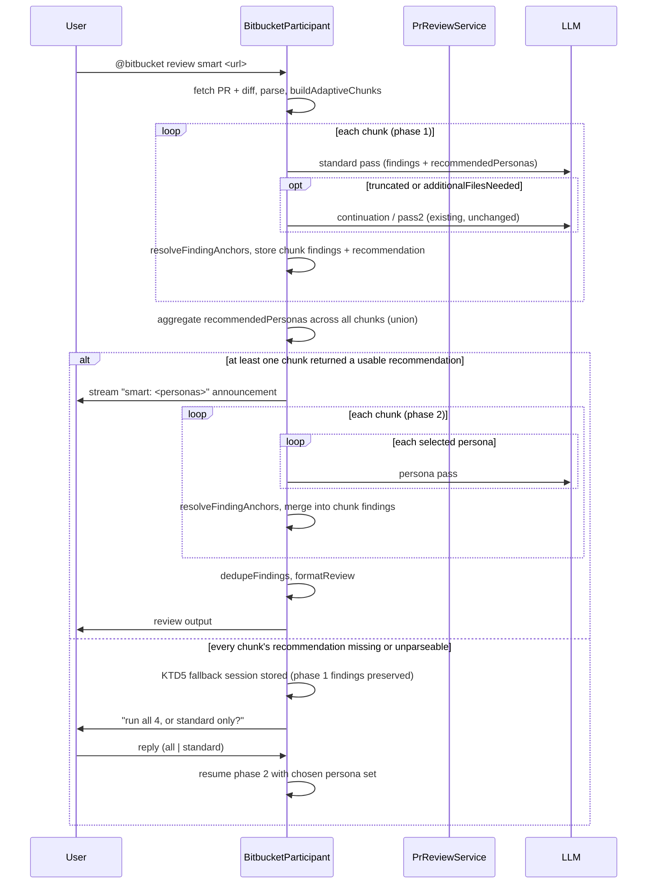
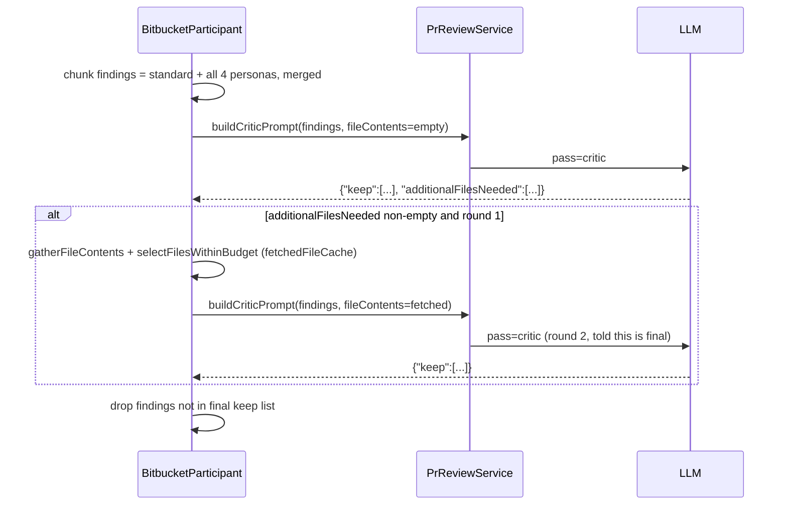

# Bitbucket Persona-Coverage Review - Plan

## Goal Capsule

- **Objective:** A Bitbucket PR review surfaces specialist findings — security, performance, reliability, maintainability — that today's single generalist pass tends to miss, without the reviewer running a separate tool.
- **Means:** Add persona-lens LLM passes to the existing review pipeline, following the persona-panel pattern used by `compound-engineering-plugin`'s code review skill (KTD3).
- **Product authority:** This work's shape was directed by the requesting user across the originating brainstorm and this planning session.
- **Execution profile:** Standard depth. No high-risk topic (auth, payments, migrations, external data) — the change is internal to the Bitbucket review pipeline of a VS Code extension.
- **Stop conditions:** Stop and ask before changing the anchor/dedup/confidence pipeline's public shape (`resolveFindingAnchors`, `dedupeFindings`, `formatReview`) beyond what R2 requires — those functions are shared with the standard/quick/deep paths and a signature change is a wider blast radius than this plan intends.
- **Tail ownership:** Implementer runs `npm run compile` and `npm test` before considering any unit done; `docs/review-process.md` updates (U6) are part of Definition of Done, not follow-up work.

## Product Contract

**Product Contract preservation:** changed — R4, R6, and R7's mechanism were revised during planning, per user direction, from a dedicated whole-PR classification call to persona recommendations derived from the standard pass's own output and aggregated across chunks. No requirement's intent (persona selection is PR-wide, announced before persona passes run, and failure surfaces a choice to the user) changed, and no R-ID was renumbered.

### Summary

Two Bitbucket review depths gain persona-lens passes on top of today's generalist pass: a new `smart` mode derives a relevant subset of security/performance/reliability/maintainability lenses from the standard pass's own read of the diff, and `deep` mode runs all four unconditionally, with its critic pass gaining the ability to pull in additional files to verify a finding.

### Problem Frame

Today's review pipeline sends every chunk through one generalist prompt that has to split attention across every kind of concern at once — logic bugs, security, performance, reliability, maintainability — in a single call. `compound-engineering-plugin`'s code review skill addresses the same problem by spawning a panel of persona-specific reviewer passes (security, performance, reliability, maintainability, and others), each asking one focused question instead of one prompt asking everything, with a core generalist pass (`correctness`) always running alongside them and personas selected by relevance to the diff rather than always running.

### Requirements

**Persona passes**

- R1. A fixed catalog of four persona lenses — security, performance, reliability, maintainability — mirrors `compound-engineering-plugin`'s persona set. Each lens is an independent LLM call over the same numbered diff chunks the standard pass already uses, with a persona-specific prompt focused on that lens's concerns.
- R2. Persona-pass findings merge with the standard pass's findings and flow through the existing anchor-verification, cross-batch dedup, and confidence-fold pipeline unchanged. Findings are not tagged with their originating persona in the output.

**`smart` mode**

- R3. `smart` is a new review depth positioned between `standard` and `deep` (`@bitbucket review smart <url>`), ordered quick < standard < smart < deep by capability, not by keyword-match priority — see KTD1 for keyword precedence.
- R4. In `smart` mode, persona selection is derived from the standard pass's own output rather than a separate classification call: each chunk's standard pass additionally recommends which persona lenses apply, based on the chunk's actual diff content, and recommendations from every chunk are aggregated into one PR-wide selected set before any persona pass runs. Only the selected personas run.
- R5. `smart` mode does not run the critic pass.
- R6. After aggregating recommendations across all chunks and before running any persona pass, `smart` streams a line announcing which personas were selected, in the same style as today's status lines (e.g. `_Fetching PR…_`); when aggregation selects zero personas, the announcement says so explicitly rather than rendering an empty list.
- R7. If every chunk's standard pass fails to return a usable persona recommendation — call failure or an unparseable recommendation field on every chunk — the chat surfaces the choice to the user in that moment: run all 4 personas, or fall back to the standard pass only, rather than silently defaulting either way.

**`deep` mode**

- R8. `deep` mode gains all four persona passes unconditionally (no selection call), on top of its existing standard pass and critic pass.
- R9. `deep`'s critic pass gains the ability to request additional files to verify a candidate finding, the same mechanism Pass 1's `additionalFilesNeeded` already uses to widen context.

### Key Decisions

- **Personas are additive to the standard pass, never a replacement.** A single generalist prompt underweights specialist concerns; the standard pass keeps catching general logic bugs while personas supplement it. (session-settled: user-directed — chosen over personas replacing the standard pass) Governs R1, R2.
- **No per-finding persona tag in the output.** Merged findings stay indistinguishable from the standard pass's own findings — simplicity over per-finding provenance. (session-settled: user-directed — chosen over tagging each finding with its originating persona) Governs R2.
- **`deep` accepts the full cost increase (2 → 6 LLM calls per chunk) rather than capping itself to selected personas.** Deep is already the expensive, explicitly opt-in mode. (session-settled: user-directed — chosen over deep also running persona-selection) Governs R8.
- **`smart`'s persona selection is derived from the standard pass's own output, aggregated once across all chunks, rather than a separate classification call.** The standard pass already reads each chunk's full diff content — a far richer signal than a bounded summary could give a dedicated classifier, and it avoids the blind spot where a leading import-heavy hunk crowds out the change that actually mattered. Aggregating across chunks keeps selection PR-wide and consistent rather than per-chunk. (session-settled: user-directed — chosen over a separate lightweight classification call, because the standard pass's full-content view avoids a truncation/import-block blind spot a bounded content sample can't fully escape) Governs R4, R6, R7.
- **Critic-pass file-pulling ships as part of this work, not deferred.** Persona-specific findings — security in particular — may need to see a file the diff alone doesn't show. (session-settled: user-directed — chosen over leaving the critic pass unchanged) Governs R9.
- **A failed persona-selection signal surfaces the choice to the chat user rather than defaulting.** Fits the interactive chat interface — the reviewer decides in the moment instead of the tool silently guessing fail-open or fail-closed. (session-settled: user-directed — chosen over an automatic fail-open or fail-closed default) Governs R7.

### Key Flows

- F1. `smart` mode review
  - **Trigger:** `@bitbucket review smart <url>`
  - **Steps:** Fetch PR + diff → parse & chunk (existing) → phase 1: for each chunk, run the standard pass, collecting both its findings and its persona recommendations → aggregate recommendations across all chunks into one selected persona set → announce selected personas → phase 2: for each chunk, run each selected persona pass → merge all findings into the existing anchor/dedup/confidence pipeline → format & stream the review.
  - **Covers:** R3, R4, R6, R2.

- F2. `deep` mode review (updated)
  - **Trigger:** `@bitbucket review deep <url>`
  - **Steps:** Fetch PR + diff → parse & chunk → for each chunk, run the standard pass plus all 4 persona passes → merge that chunk's raw findings → run one critic pass over the merged set, which may request additional files → drop unconfirmed findings → concatenate across chunks → dedup / confidence-fold / format.
  - **Covers:** R8, R9, R2.

- F3. Persona-recommendation failure
  - **Trigger:** In F1's phase 1, every chunk's standard pass fails outright or returns an unparseable/missing recommendation field, leaving nothing to aggregate.
  - **Steps:** Chat presents the user a choice — run all 4 personas, or fall back to the standard pass only — and proceeds only after the user answers.
  - **Covers:** R7.

### Acceptance Examples

- AE1. **Given** a PR that only touches documentation files, **when** `@bitbucket review smart <url>` runs, **then** every chunk's standard pass returns no persona recommendation, the aggregated selection is empty, and only the standard pass's findings are returned. Covers R4.

- AE2. **Given** a PR that touches an authentication middleware file and a database query builder, **when** `@bitbucket review smart <url>` runs, **then** at least one chunk's standard pass recommends security and at least one recommends performance; the aggregated selection includes both — applied once for the whole PR, not per chunk — and their persona-pass findings merge with the standard pass's through the existing dedup/confidence pipeline. Covers R4, R2.

- AE3. **Given** every chunk's standard pass returns an unparseable or missing recommendation field, **when** `@bitbucket review smart <url>` runs, **then** the chat presents the choice between running all four personas or falling back to the standard pass only, and proceeds only after the user answers. Covers R7.

- AE4. **Given** `@bitbucket review deep <url>` on a PR touching a retry handler, **when** the critic pass verifies a reliability-persona finding that references a config file not included in the diff, **then** the critic pass can request and receive that file before deciding whether to keep the finding. Covers R8, R9.

### Scope Boundaries

- Deferred for later: the remaining `compound-engineering-plugin` personas (adversarial, testing, api-contract, data-migration) — only security, performance, reliability, and maintainability ship now.
- Deferred for later: a user-configurable persona catalog (settings-driven add/remove) — the four-persona catalog is fixed in code for v1.

### Dependencies / Assumptions

- Builds on the existing `PrReviewService` / `reviewSessionState.ts` pipeline (`resolveFindingAnchors`, `dedupeFindings`, confidence-fold) and the VS Code Language Model API call pattern already used for Pass 1 and the critic pass — no new infrastructure is assumed.

---

## Planning Contract

### Key Technical Decisions

- **KTD1. Mode-keyword precedence: `deep` > `smart` > `quick` > `standard` (default).** Detection reuses the existing `promptWithoutUrl` string (the upfront question already stripped before keyword checks) and checks `deep` first, then `smart`, then `quick`, falling back to the configured default when none match. (session-settled: user-directed — chosen over `quick` retaining today's top priority, because on an ambiguous prompt containing two mode keywords, failing toward the more thorough mode is safer than silently downgrading a `deep` request) Governs R3.
- **KTD1b. `reviewMode` widens to a true 4-value type (`'quick' | 'standard' | 'smart' | 'deep'`), replacing today's two-value `reviewMode` plus a separate `criticEnabled` boolean.** Today `deep` is represented as `reviewMode: 'standard'` with `criticEnabled` set independently — this plan makes mode a single source of truth instead of three related concepts spread across separate variables. Every `reviewMode`-gated check (e.g. the Pass 2 `reviewMode !== 'quick'` gate) and the `reviewMode` config type derive `criticEnabled`/`activePersonas` from the widened value rather than carrying their own flags. (session-settled: user-directed — chosen over keeping `deep`/`smart` as flags layered on the existing two-value field, for one source of truth over a smaller diff) Governs R3, R5, R8.
- **KTD2. The standard pass's NDJSON trailer gains an optional `recommendedPersonas` key alongside `additionalFilesNeeded`, in the same object (`{"additionalFilesNeeded":[...],"recommendedPersonas":[...]}`), emitted only in `smart` mode; a new aggregation step filters each chunk's returned ids against the fixed 4-persona catalog (R1) and unions the survivors into one PR-wide selected set after all chunks' standard passes return.** `parseNdjsonFindings`'s meta-line detection (`src/participant/reviewSessionState.ts`) widens from "exactly one key" to "every key present is a known meta key" so the combined trailer still parses as one meta line, keeping `hasMetaLine`/truncation detection working for `smart`-mode responses. No separate classification prompt or call — this reuses the standard pass's own read of each chunk's full diff content, instead of a bounded summary a dedicated classifier would need, so a chunk whose leading hunk is mostly import statements does not crowd out a smaller, more diagnostic change later in the same chunk. Governs R4.
- **KTD3. Persona prompts are new sibling builder methods on `PrReviewService`, reusing `buildPrompt`'s existing scaffolding.** One shared internal helper assembles the grounding rules, untrusted-content fencing, and NDJSON output contract that `buildPrompt` already uses; each persona builder supplies only its focus paragraph and persona id. This avoids five near-duplicate prompt-building methods. Governs R1.
- **KTD4. The critic pass gains a `fileContents` parameter and an `additionalFilesNeeded` trailer in its response contract, mirroring Pass 1's mechanism exactly, capped to one extra fetch round per chunk.** Reuses `gatherFileContents`, `selectFilesWithinBudget`, and the existing per-run `fetchedFileCache` rather than inventing new fetch/caching code. The one-round cap prevents an unbounded back-and-forth if the model keeps requesting new files. The second-round critic prompt tells the model no further files will be provided, so its `keep` decision is final rather than another unresolved request the cap silently discards. Governs R9.
- **KTD5. R7's fallback question is a new lightweight multi-turn session in `workspaceState`, following the existing `ReviewSession` pattern, because VS Code chat participants have no blocking-question primitive.** The session stores enough of the in-flight review (PR reference, fetched diff, chunk boundaries, and phase 1's already-collected standard-pass findings) to resume phase 2 once the user replies `all` or `standard`; an unrecognized reply re-prompts without losing the session. (session-settled: user-directed — chosen over a hardcoded fail-open/fail-closed default, because the interactive chat surface can ask instead of guessing) Governs R7.
- **KTD6. New persona-pass LLM calls reuse the existing `logReview`/`formatCallLine`/`handleAttemptFailure` diagnostic triplet with their own `pass:` tag values, and fold into the existing findings funnel's `raw` count — no new hard-drop stage.** The standard pass's `recommendedPersonas` output and the aggregation step that follows it get one additional diagnostic line each rather than a separate `pass:` tag, since neither is its own LLM call. Personas do not introduce a new filtering stage; they flow through the same two hard drops (anchor-unlocatable, critic-unconfirmed) as the standard pass. Governs R1, R6.

### High-Level Technical Design

**Mode precedence (KTD1):**

**`smart` mode review sequence (F1):**

**`deep` mode critic file-pull loop (F2, KTD4):**

---

## Implementation Units

### U1. Persona prompt builders

- **Goal:** Add four persona-specific prompt builders (security, performance, reliability, maintainability) that reuse `buildPrompt`'s existing scaffolding.
- **Requirements:** R1 (KTD3)
- **Dependencies:** none
- **Files:**
  - `src/services/PrReviewService.ts` — add a persona catalog constant and persona prompt builder(s)
  - `src/test/PrReviewService.test.ts` — new tests
- **Approach:**
  1. Add a small exported persona catalog (id, display name, focus description) so `smart`'s recommendation trailer and `deep` mode both reference the same persona ids.
  2. Factor `buildPrompt`'s shared scaffolding (grounding rules, untrusted-content fencing, NDJSON output contract) into an internal helper if not already separable, and add a persona-aware builder that swaps in the persona's focus paragraph in place of the generalist instructions.
- **Test scenarios:**
  - Each of the 4 persona builders produces a prompt containing the grounding rules and untrusted-content markers, unchanged from `buildPrompt`.
  - Each persona builder's prompt contains that persona's focus text and no other persona's focus text.
  - The NDJSON output contract instruction is present and unchanged in every persona prompt.
- **Patterns to follow:** `PrReviewService.buildPrompt` (`src/services/PrReviewService.ts`) and its existing test `describe('PrReviewService.buildPrompt', ...)`.
- **Verification:** `npm test` passes; a manual read of one persona prompt's output confirms it reads as a focused, single-lens review instruction.

### U2. Mode dispatch and widened `reviewMode` type

- **Goal:** Wire the new `deep > smart > quick > standard` precedence into mode dispatch on a widened 4-value `reviewMode` type, replacing today's two-value field plus separate `criticEnabled` boolean.
- **Requirements:** R3, R5 (KTD1, KTD1b)
- **Dependencies:** none
- **Files:**
  - `src/bitbucket/IBitbucketClient.ts` — widen the `reviewMode` config field type to `'quick' | 'standard' | 'smart' | 'deep'`
  - `package.json` — widen `ticketSidekick.bitbucket.reviewMode`'s `enum` (currently `["standard", "quick"]`) and description to include `"smart"` and `"deep"`, matching the widened type
  - `src/participant/reviewSessionState.ts` — mode-keyword detection helper (pure, testable), returning the widened type
  - `src/participant/BitbucketParticipant.ts` — invoke the new detection helper; derive `criticEnabled` and the active persona set from the resolved mode instead of a separate flag; update the Pass 2 `reviewMode !== 'quick'` gate and log lines for the widened type
- **Approach:**
  1. Replace today's `quick`-first ternary and the separate `criticEnabled` boolean with a pure helper implementing KTD1's `deep > smart > quick > standard` precedence over `promptWithoutUrl`, returning one of the widened `reviewMode` values (KTD1b).
  2. Derive `criticEnabled` (`true` only for `deep`) and which of `smart`/`deep`/neither's persona logic applies directly from the resolved mode, with no independent flags left over.
- **Test scenarios:**
  - Mode detection resolves `deep` when both `deep` and `smart` keywords are present.
  - Mode detection resolves `smart` when only `smart` is present.
  - Mode detection falls back to the configured default when no keyword matches.
  - Mode `deep` derives `criticEnabled: true`; modes `quick`, `standard`, `smart` derive `criticEnabled: false` (Covers KTD1b).
- **Patterns to follow:** the existing mode-keyword regex checks in `BitbucketParticipant.ts`, replaced by one pure precedence helper.
- **Verification:** `npm test` passes.

### U3. Per-chunk persona pass execution and merge

- **Goal:** Run a given set of active personas alongside the standard pass in each chunk, merging findings into the existing pipeline unchanged. Used by `deep` mode directly and by `smart` mode's phase 2 (U7).
- **Requirements:** R1, R2, R8
- **Dependencies:** U1
- **Files:**
  - `src/participant/BitbucketParticipant.ts` — per-chunk persona execution helper
  - `src/test/PrReviewService.test.ts`
- **Approach:**
  1. For a given chunk and a given set of active personas, issue one LLM call per persona via U1's builders, routed through the same `withEasierRetry` retry/halving wrapper pass1 already uses (identical retry, then a split-easier third try), each logged with `pass: '<persona-id>'` (KTD6).
  2. Run `resolveFindingAnchors` on each persona pass's raw findings exactly as done for the standard pass, then append into the same `chunkFindings`/`allFindings` accumulation the standard pass already uses — no new merge function, confirmed by research that `resolveFindingAnchors`/`dedupeFindings` are already pass-agnostic.
- **Test scenarios:**
  - A security-persona finding with no standard-pass counterpart survives to the final formatted review.
  - A security-persona finding and a standard-pass finding on the same file, line, and title collapse to one via the existing `dedupeFindings`, keeping the stronger by severity then confidence (Covers R2).
  - An anchor-unlocatable persona finding is dropped the same way an anchor-unlocatable standard finding is dropped.
  - A transient failure on a persona call's first attempt succeeds on retry via `withEasierRetry`, same as pass1's existing retry behavior.
- **Patterns to follow:** the existing pass1 call sequence (`withEasierRetry` → `callLLMOnceWithProgress` → `logReview`/`formatCallLine` → `resolveFindingAnchors`) in `BitbucketParticipant.ts`.
- **Verification:** `npm test` passes; a manual `deep` review confirms 4 extra `pass:` lines per chunk appear in the output channel.

### U4. Smart-mode selection-failure fallback session

- **Goal:** When U7's aggregation finds no usable persona recommendation from any chunk, ask the user (all 4 personas, or standard pass only) via a new multi-turn session, then resume phase 2 with the chosen path.
- **Requirements:** R7 (KTD5)
- **Dependencies:** U3 (consumed by U7)
- **Files:**
  - `src/participant/reviewSessionState.ts` — new session type + pure reply-parsing helper
  - `src/participant/BitbucketParticipant.ts` — session storage/detection wiring, resume logic
- **Approach:**
  1. Define a new session type, keyed and tagged like the existing `ReviewSession`, holding enough in-flight state (PR reference, fetched diff, chunk boundaries, and phase 1's already-collected standard-pass findings) to resume phase 2 once answered.
  2. On U7's aggregation finding no usable signal from any chunk, stream a message naming the two choices and store the session instead of proceeding.
  3. On the next turn, detect the tag ahead of the existing `ReviewSession` follow-up check (same detection-order discipline `BitbucketParticipant.ts` already applies), parse the reply into `all` / `standard` / unrecognized, and either resume phase 2 with the chosen persona set or re-prompt without discarding the session.
- **Test scenarios:**
  - Every chunk's standard pass throwing an error creates the fallback session and streams the expected two-choice message.
  - Every chunk's standard pass returning an unparseable `recommendedPersonas` field does the same.
  - A reply of `all` resumes phase 2 with all 4 personas active.
  - A reply of `standard` resumes with zero personas active (phase 1's standard-pass findings alone are formatted).
  - An unrecognized reply re-prompts and leaves the session intact.
- **Patterns to follow:** the `ReviewSession` `workspaceState` storage, tagging, and detection-order pattern documented in `docs/review-process.md` ("Follow-ups"), and the general multi-turn session shape documented in `docs/jira-flows.md`.
- **Verification:** pure parse/session helpers covered by `npm test`; the VS Code-dependent wiring in `BitbucketParticipant.ts` is verified manually (per `CLAUDE.md`, that file is not Vitest-loadable).

### U5. Deep mode: unconditional personas + critic file-pulling

- **Goal:** `deep` mode runs all four personas unconditionally (no recommendation/aggregation step) and its critic pass gains the ability to request additional files.
- **Requirements:** R8, R9 (KTD4)
- **Dependencies:** U1, U2, U3
- **Files:**
  - `src/services/PrReviewService.ts` — `buildCriticPrompt` gains a `fileContents` parameter and an `additionalFilesNeeded` instruction/trailer; response parser extended to extract it
  - `src/participant/BitbucketParticipant.ts` — `deep` mode sets the active persona set to all four directly for every chunk; critic-pass fetch loop
  - `src/test/PrReviewService.test.ts`
- **Approach:**
  1. When mode resolves to `deep`, set the active persona set to the full catalog for every chunk, with no recommendation or aggregation step.
  2. Merge that chunk's standard + all-4-persona findings (per U3) before invoking the critic, as today.
  3. Extend `buildCriticPrompt` with an optional `fileContents` parameter mirroring `buildPrompt`'s conditional context-note block, and add an instruction for the model to emit `{"keep":[...],"additionalFilesNeeded":[...]}`.
  4. If `additionalFilesNeeded` is non-empty and this is the chunk's first critic round, fetch via the existing `gatherFileContents` / `selectFilesWithinBudget` / `fetchedFileCache` machinery and re-invoke `buildCriticPrompt` once with `fileContents` populated (KTD4's one-round cap). The second-round prompt tells the model this is its last chance to decide, using only the files it now has; use that response's `keep` list as final.
- **Test scenarios:**
  - `deep` mode's active persona set is all four with no recommendation or aggregation call (Covers AE4, "all four" half).
  - A critic response with no `additionalFilesNeeded` parses the keep list exactly as before (regression).
  - A critic response requesting one file triggers exactly one fetch-and-reinvoke round, and the second response's keep list is final (Covers AE4).
  - A critic response requesting files on the (already-fetched) second round does not trigger a third round — the one-round cap holds.
- **Patterns to follow:** the existing Pass 1 → Pass 2 `additionalFilesNeeded` → `gatherFileContents` → `selectFilesWithinBudget` flow in `BitbucketParticipant.ts`.
- **Verification:** `npm test` passes; a manual `deep` review against a PR whose finding references an out-of-diff config file confirms the critic fetches it.

### U7. Smart mode: persona recommendations, aggregation, and two-phase execution

- **Goal:** Derive `smart` mode's persona selection from the standard pass's own per-chunk output instead of a separate call, aggregate across all chunks into one PR-wide set, announce it, then run the selected persona passes.
- **Requirements:** R4, R6, R7 (KTD2, KTD5)
- **Dependencies:** U1, U2, U3, U4
- **Files:**
  - `src/services/PrReviewService.ts` — `buildPrompt` gains an optional `recommendedPersonas` NDJSON trailer instruction, emitted only when mode is `smart`, combined into the same trailer object as `additionalFilesNeeded`
  - `src/participant/reviewSessionState.ts` — `parseNdjsonFindings`'s meta-line detection widens from "exactly one key" to "every present key is a known meta key"; new aggregation helper (pure, testable): filters each chunk's `recommendedPersonas` against the fixed catalog (R1) and unions the survivors across all chunks' standard-pass responses
  - `src/participant/BitbucketParticipant.ts` — restructure `smart` mode's review into two phases: phase 1 runs the standard pass on every chunk, collecting findings and recommendations; phase 2 (after aggregation and the announcement) runs U3's per-chunk persona execution for the selected personas
  - `src/test/PrReviewService.test.ts`
- **Approach:**
  1. In `smart` mode, `buildPrompt`'s NDJSON trailer includes `recommendedPersonas` in the same object as `additionalFilesNeeded`; `parseNdjsonFindings` accepts the combined trailer as one meta line.
  2. Phase 1: loop over all chunks, running the standard pass with today's existing truncation-continuation and whole-file-context Pass 2 sub-passes unchanged (same as `standard`/`deep` mode), collecting `chunkFindings` and each chunk's `recommendedPersonas` (or a failure/unparseable marker).
  3. Aggregate: filter each chunk's `recommendedPersonas` against the fixed 4-persona catalog (dropping unrecognized ids, surfaced only via the diagnostic line), then union the survivors into one PR-wide set. If every chunk failed or returned an unparseable/missing recommendation, route to U4's fallback instead of proceeding.
  4. Stream the "smart: `<personas>`" announcement, or "smart: no persona lenses selected — running standard pass only" when the selected set is empty.
  5. Phase 2: loop over the chunks again, running U3's per-chunk persona execution for the selected set, merging into the same findings accumulation phase 1 already started.
- **Test scenarios:**
  - A chunk whose diff touches auth code returns `recommendedPersonas` including security; a chunk with only documentation changes returns an empty recommendation.
  - Aggregating 3 chunks where only chunk 2 recommended performance still includes performance in the final selected set (Covers AE2).
  - A chunk returning an unrecognized persona id (misspelled or hallucinated) has that id dropped from aggregation rather than reaching phase 2's dispatch.
  - Aggregation with every chunk's recommendation missing or unparseable routes to U4's fallback (Covers R7, AE3).
  - The combined `{"additionalFilesNeeded":[...],"recommendedPersonas":[...]}` trailer still parses as one meta line (Covers KTD2, R4).
  - Aggregation resolving to zero personas streams the empty-selection announcement wording, not an empty list (Covers R6, AE1).
  - The announcement streams after aggregation completes and before any persona pass runs (Covers R6).
  - Phase 1's standard-pass findings and phase 2's persona-pass findings both appear in the final merged, deduped output.
- **Patterns to follow:** the existing pass1/continuation/pass2 sequencing in `BitbucketParticipant.ts` for how per-chunk loops accumulate findings across multiple passes.
- **Verification:** `npm test` passes; a manual `smart` review shows two distinguishable phases in the diagnostic timeline — per-chunk standard-pass lines, then an aggregation/announcement line, then per-chunk persona-pass lines.

### U6. Diagnostics, funnel, and docs/review-process.md update

- **Goal:** Extend the diagnostic timeline and findings funnel for the new pass tags, and bring `docs/review-process.md` in sync per `CLAUDE.md`'s "Adding a new Bitbucket operation" checklist.
- **Requirements:** R1, R6 (KTD6)
- **Dependencies:** U1, U2, U3, U4, U5, U7
- **Files:**
  - `src/participant/BitbucketParticipant.ts` — funnel-counts object
  - `src/participant/reviewSessionState.ts` — `formatFindingsFunnel` (extend if a new field is warranted)
  - `docs/review-process.md` — pipeline diagram, `## Modes` table, `## Filtering: only two hard drops`, `### Always-on diagnostic timeline`, `## Token estimate`, `## Follow-ups`
- **Approach:**
  1. Add `pass:` tag values for each of the 4 personas to every new `logReview`/`formatCallLine` call site (U3, U5, U7); add one diagnostic line for the aggregation result (selected personas, or "no usable recommendation") rather than a separate `pass:` tag, since aggregation is not its own LLM call.
  2. Confirm persona-sourced findings fold into the existing `raw` funnel count with no new stage (KTD6); extend `formatFindingsFunnel` only if a reader would otherwise be unable to tell a persona-heavy run apart from a standard one.
  3. Update `docs/review-process.md`: add `smart` to the pipeline mermaid diagram and the `## Modes` table; note personas flow through the same two hard drops; add the new `pass:` tags and the aggregation-result line to the diagnostic-timeline description; add the persona passes to the `## Token estimate` list; describe U4's fallback session in `## Follow-ups`.
- **Test scenarios:**
  - `formatFindingsFunnel` renders correctly when persona-sourced findings are folded into `raw`.
  - `Test expectation: none -- documentation-only changes to docs/review-process.md have no automated coverage.`
- **Patterns to follow:** existing `formatCallLine`/`formatFindingsFunnel` tests in `src/test/PrReviewService.test.ts` / `src/test/reviewSessionState.test.ts`.
- **Verification:** `npm test` passes; `docs/review-process.md` is read against the implemented behavior from U1–U5 and U7 to confirm nothing drifted.

---

## Verification Contract

| Command | Applies to | Gate |
|---|---|---|
| `npm run compile` | All units | TypeScript type check must pass before `npm test` |
| `npm test` | U1–U7 | Vitest unit suite must be green — required before every commit per `CLAUDE.md` |

`npm run test:e2e` is not required (not run in CI) but is the only way to exercise U4's `BitbucketParticipant.ts`-side session wiring end-to-end; run it manually if VS Code is available.

## Definition of Done

- `npm run compile` and `npm test` are green.
- Each of U1–U7's test scenarios has a corresponding test, except U6's documentation-only item, which is verified by re-reading `docs/review-process.md` against the shipped behavior.
- `docs/review-process.md` reflects `smart` mode, the persona passes, the new mode-keyword precedence, and the critic pass's file-pulling — no section left describing pre-change behavior.
- No dead-end or experimental code from approaches that did not pan out remains in the diff.
- A manual `smart` review and a manual `deep` review each ran once against a real PR in this repo (or a sample fixture PR) and produced the expected persona announcement / all-four-persona coverage.
