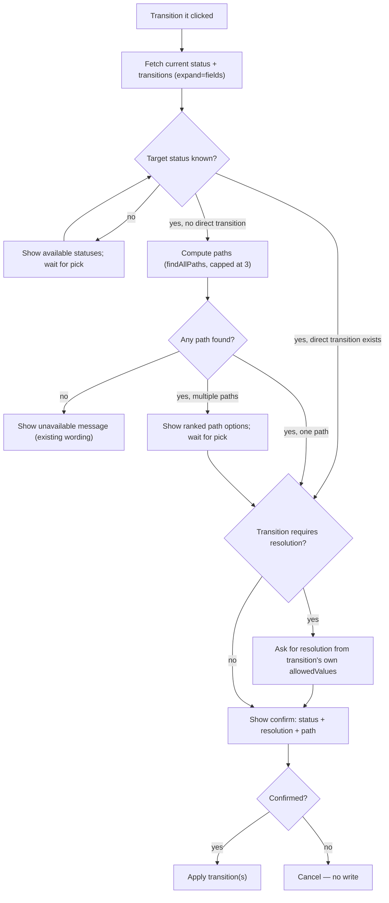

## Goal Capsule

- **Objective:** every follow-up chip and search-result action offered by `@jira`/`@bitbucket` either completes the action it names in one click, or opens a real guided flow toward it — none dead-end on missing information or point at a value guaranteed not to exist.
- **Product authority:** the invoking brainstorm session's dialogue (user-directed throughout; see Key Decisions).
- **Open blockers:** none.
- **Product Contract preservation:** unchanged — no R-ID's meaning was altered or restructured during planning.

## Product Contract

### Summary

Remove or rebuild every `@jira`/`@bitbucket` follow-up chip that can dead-end on click, and give the search-results table per-row action links so common next steps don't require a chip at all. "Transition it" becomes a real guided flow with ranked multi-hop path choices and per-transition resolution requirements read straight from Jira; two new `loadedTicket` chips (create a template, discover workflow) reuse an already-loaded ticket's real values; greeting and fallback chips stop ever offering a fabricated ticket key.

### Problem Frame

`@jira`'s `loadedTicket` follow-up chip "Transition it" sends the literal prompt `transition {key}` with no target status. The `transition` operation has no status to act on, so it returns a static `'Please specify a target status...'` message and stops — the chip promised a completed action but produced a required-but-unsupplied-parameter error instead. The review that followed found the same defect shape recurring across both participants: a chip is reliable exactly when it already carries every value its target operation needs, and unreliable whenever it's missing one — visible in the "Add a comment" chip (needs comment text), the greeting/fallback "show me PROJ-123" chip (needs a real, existing ticket key), and Bitbucket's "ask a question about this PR" chip (needs an actual question). `discoverWorkflow` has an identical dead-end (no project/issue-type prompt), reached only if a chip were ever built to trigger it blind.

### Key Decisions

- **Fix-by-completing over fix-by-erroring:** every chip either supplies a value real enough to succeed outright, or opens a genuine multi-turn flow that asks for what's missing with real choices — never a static "please specify X" message with no way to continue except retyping. Governs R1, R2, R6, R7, R9.
- **Drop the "Add a comment" chip rather than fix its context capture** (session-settled: user-directed — chosen over building a reliable content-capture session for it: participant-mode comment-context detection has not worked well in testing; VS Code Agent Chat mode already covers this need). Governs R1.
- **Enumerate discovered transition paths rather than auto-picking one** (session-settled: user-directed — chosen over silently keeping today's single first-shortest-hit behavior: the workflow graph has no notion of path "relevance," so surfacing every path found, up to a cap, and letting the user choose is more honest than an arbitrary pick). Governs R2.
- **Confirm before applying a transition resolved from a chip** (session-settled: user-approved — chosen over auto-executing once a status is picked: the flow starts from an ambiguous single click, so it gets the same safety net bulk transition already has). Governs R2.
- **Template/workflow-discovery suggestions live on `loadedTicket`, not on greeting** (session-settled: user-directed — chosen over surfacing them at first contact: both need a concrete ticket's real project/issue-type/key already in view; greeting has none of that). Governs R6, R7.
- **Drop Bitbucket's "ask a question" chip with no replacement chip** (session-settled: user-directed — chosen over rewording or replacing it: a real one-click Q&A follow-up needs its own separate review; asking a question is relevant mid-review, not as a post-review suggestion). Governs R9 (Bitbucket section), R10.
- **The saved-filter hint renders as static prose, not a chip** (session-settled: user-approved — chosen over a clickable filter chip: no client capability exists today to look up which filters a user actually has; a chip would need a fabricated filter name, which is exactly the failure mode this plan removes elsewhere). Governs R5.

### Requirements

**Jira — chip removal and repair**

- R1. The "Add a comment" follow-up chip is removed from every Jira chip set that currently offers it (`loadedTicket` and `fallback`; `greeting` never included it). The `addComment` operation and its existing `@jira add a comment to <key>: <text>` command are unchanged.
- R2. The `loadedTicket` "Transition it" chip opens a guided transition flow instead of sending a bare `transition {key}` prompt: it shows the ticket's current status and its real available target statuses; if the chosen transition requires a resolution, it asks for one using that transition's own valid resolution list; if reaching the target requires more than one hop, it computes and shows the discovered paths (capped, ranked shortest-first) as clickable options and the user picks one; a confirm step names the resolved status, resolution (if any), and path before any Jira write happens. An unmatched reply at the status, resolution, or path step re-shows that step's current options as clickable choices with a "didn't understand that" message, rather than erroring or silently dropping the turn.
- R3. `discoverWorkflow`'s own missing-project/issue-type dead-end message is not modified by this plan — it remains unreachable from any chip because R7's chip always supplies both values.

**Jira — greeting and fallback chips**

- R4. `greeting` shows 2 chips ("Create a ticket", "Search my open tickets"), or 3 when the current git branch resolves to a real ticket key (adding "Show me {key}"). `fallback` shows 1 chip ("Search my open tickets" alone), or 2 under the same branch-resolution rule. Neither set is ever filled with a placeholder key when the branch doesn't resolve.
- R5. Both `greeting` and `fallback` responses append a static (non-clickable) tip suggesting saved-filter usage, e.g. `search from filter 'My open bugs'` or `search filter 12345` — informational text, not a chip, since no client capability exists to discover a user's actual filters.

**Jira — new `loadedTicket` chips**

- R6. `loadedTicket` gains a "Create a template from {key}" chip that invokes `generateTemplate` with the loaded ticket as the reference ticket — a complete, one-click action.
- R7. `loadedTicket` gains a "Discover workflow for {project}/{issueType}" chip that invokes `discoverWorkflow` with the loaded ticket's own project key and issue type — both already known, so no missing-parameter path is ever reached.
- R8. The existing `JIRA_MAX_FOLLOWUPS` cap (3) is unchanged; the `loadedTicket` state's full chip set (Transition it, Create a template, Discover workflow) fits it without needing to raise the cap, now that the comment chip is gone.

**Jira — search-results table actions**

- R9. The search-results table (`TicketService.searchTickets`) gains a per-row "Actions" column with three independent, immediately-firing links, each paired with a short visible text label (not icon-only, since a chat markdown table has no reliable hover-tooltip rendering): an eye icon labeled "view" that runs `getTicket` on that row's key, a `⤓` icon labeled "load" that runs `loadTicket` (full context + attachments) on that row's key, and a globe icon labeled "open" that links to the real Jira browse URL — moved out of the Key column, which becomes plain text. The two action icons use the extension's existing clickable-command-link mechanism; the response is wrapped in the extension's existing trusted-markdown gate before being streamed, and any untrusted per-row text (summary, assignee) is sanitized against markdown-link injection before that gate is applied, mirroring the pattern the existing bulk-transition review table already uses for the same reason.

**Bitbucket**

- R10. The `reviewCompleted` (0 findings) follow-up chip "ask a question about this PR" is removed with no replacement chip for that state.

### Key Flows

- F1. **Guided transition via chip.** **Trigger:** user clicks "Transition it" on a loaded ticket. **Actors:** user, `@jira`. **Steps:** fetch current status + available transitions → user picks a target status (chip or reply) → if the chosen transition requires a resolution, ask for it from that transition's own valid list, rendered as clickable options (mirrors the existing resolution-selection pattern) → if multiple hops needed, compute and show the discovered paths (capped, ranked shortest-first) as clickable options, user picks one → show a confirm summary (status, resolution, path) → on confirm, apply the transition(s); on cancel, take no action. **Covers R2.**
- F2. **Chip-driven ticket-scoped template/workflow actions.** **Trigger:** user clicks "Create a template from {key}" or "Discover workflow for {project}/{issueType}" after a ticket is loaded. **Actors:** user, `@jira`. **Steps:** the chip's prompt already carries every value its operation needs, so each runs to completion (or its own existing further-input flow, e.g. template naming) without a missing-parameter dead end. **Covers R6, R7.**
- F3. **Row actions on a search result.** **Trigger:** user clicks an eye, `⤓`, or globe link on a search-result row. **Actors:** user, `@jira`. **Steps:** eye → `getTicket` on that row's key; `⤓` → `loadTicket` (downloads context + attachments) on that row's key; globe → opens the ticket's real Jira URL. **Covers R9.**

### Acceptance Examples

- AE1. **Given** a loaded ticket in "In Progress" with a target reachable only via 2 hops through two different intermediate statuses of equal length, **when** the user clicks "Transition it" and picks that target, **then** the bot shows both 2-hop paths (and any further path found up to the cap) and waits for a pick before applying anything. **Covers R2.**
- AE2. **Given** a loaded ticket, **when** the user clicks "Discover workflow for {project}/{issueType}", **then** workflow discovery runs immediately with those exact values — no "please specify a project and issue type" message is ever shown. **Covers R3, R7.**
- AE3. **Given** the current git branch name does not contain a resolvable ticket key, **when** the chip set renders, **then** `greeting` shows exactly 2 chips and `fallback` shows exactly 1 — no fabricated ticket key ever appears as a chip. **Covers R4.**
- AE4. **Given** a search result table renders 3 tickets, **when** the user clicks the `⤓` link on the second row, **then** `loadTicket` runs for that row's key specifically (context + attachments downloaded), independent of the other rows' links. **Covers R9.**

### Scope Boundaries

- `addComment`'s underlying literal/generated-content pipeline is unchanged — only the chip that led into its no-context dead end is removed.
- Bitbucket's broader follow-up Q&A mechanism (`parseFollowUpIntent`'s `explain` path) is unchanged — only the chip that triggered it with an empty question is removed. A real Q&A follow-up chip is explicitly deferred to a separate review.
- A working "use one of your saved Jira filters" chip is out of scope — it would require adding a new client capability to fetch the user's actual filters, which does not exist today.
- `discoverWorkflow`'s standalone missing-parameter error path is not changed at its source; it is simply never reached via any chip after this plan.
- Bulk transition's existing single-path behavior (`resolveAndApplyTransition`, `TransitionBatchSession`) is untouched — the new multi-path enumeration and per-transition resolution lookup are additive capabilities used by the new single-ticket guided flow only.

---

## Planning Contract

### Key Technical Decisions

- KTD1. **Read each candidate transition's real resolution requirement via `?expand=transitions.fields`** (session-settled: user-directed — chosen over reusing bulk-transition's closed-state-name heuristic: gives an accurate per-transition requirement and its own valid resolution list instead of guessing from the target status's name). `JiraTransition` gains an optional `fields.resolution: { required: boolean; allowedValues: { name: string }[] }`; `JiraApiClient.getTransitions` requests the expansion; `MockJiraClient` and its fixture gain a transition exercising the required-resolution case. Governs R2.
- KTD2. **Cap enumerated transition paths at 3 shortest distinct routes, depth-limited past the shortest** (session-settled: user-directed — chosen over unbounded enumeration: keeps the picker readable and avoids runaway search on a cyclic workflow graph). A new `findAllPaths` function in `WorkflowService.ts` performs a depth-bounded DFS with per-path (not global) visited tracking, so it can find more than one route to the same target, unlike the existing global-visited `findPath` BFS. `findPath` itself is unchanged; bulk transition keeps using it. Governs R2.
- KTD3. **Search-table row actions reuse the existing clickable-command-link + trusted-markdown pattern**, and untrusted per-row text (ticket summary, assignee name) is sanitized with the extension's existing markdown-link-neutralizing sanitizer before the table is wrapped as trusted — the same defense `buildReviewTable` already applies to ticket summaries for the identical reason (a crafted summary must not become a live, auto-firing command link once the response is trust-gated). Governs R9.
- KTD4. **The new `loadedTicket` chips carry the just-viewed ticket's project key and issue type directly in the followup state**, read once from the already-fetched ticket at the point the state is built, rather than re-fetching them when the chip fires — keeps `computeJiraFollowups` a pure function of its input state, consistent with its existing shape. Governs R6, R7.
- KTD5. **Multi-hop path options and per-transition resolution options both render as clickable choices, not plain numbered text requiring a typed reply** (session-settled: user-directed — chosen over a text-only numbered list: mirrors this repo's existing clickable-reply convention already used for resolution selection elsewhere). Governs R2.
- KTD6. **An unmatched reply at any of the guided flow's three choice points reuses the existing `'invalid'`-reply convention** (session-settled: user-directed — chosen over inventing new error wording: `JiraParticipant.ts` already re-shows the current options as clickable choices with a "didn't understand that" message on an unmatched reply at every other multi-choice session — resolution selection, filter selection, bulk-update review — so the guided transition flow's status/resolution/path steps follow the same pattern instead of a new one). Governs R2.

### High-Level Technical Design

The guided transition flow (R2/F1) has enough branching (status pick → optional resolution ask → optional multi-path pick → confirm → apply) to warrant a flow diagram:

### Assumptions

- The Jira Data Center/Cloud transitions endpoint honors `?expand=transitions.fields` on both auth modes this extension already supports; if a target instance omits `fields` even when requested, the flow treats the transition as not requiring a resolution (same as today's absent-metadata case) rather than failing.

---

## Implementation Units

### U1. Transition metadata and path-enumeration foundation

**Goal:** give the guided transition flow (U2) real per-transition resolution requirements and a bounded set of ranked multi-hop paths to offer.

**Requirements:** R2 (foundation), KTD1, KTD2

**Dependencies:** none

**Files:**
- `src/jira/IJiraClient.ts` — extend `JiraTransition` with optional `fields.resolution`
- `src/jira/JiraApiClient.ts` — `getTransitions` requests `?expand=transitions.fields` and maps the new shape
- `src/test/mocks/MockJiraClient.ts` — updated fixture return including a resolution-required transition
- `src/test/fixtures/` — new or updated fixture JSON matching the expanded transitions shape
- `src/services/WorkflowService.ts` — add `findAllPaths`
- `src/test/WorkflowService.test.ts` — new test cases

**Approach:**
1. Extend `JiraTransition.fields.resolution` as `{ required: boolean; allowedValues: { name: string }[] } | undefined`; absent means "not required" (today's implicit behavior).
2. `JiraApiClient.getTransitions` adds the `expand=transitions.fields` query parameter and passes the returned `fields` through unchanged.
3. Add `findAllPaths(graph, from, to, { maxPaths: 3 })` to `WorkflowService.ts`: depth-bounded DFS, per-path visited set (so cycles in the graph don't block finding a second, different route), depth ceiling set a little past the shortest path found so far, sorted shortest-first, capped at `maxPaths`. Leave `findPath` and its callers (`resolveAndApplyTransition`, bulk transition) untouched.

**Test scenarios:**
- Happy path: single-path graph returns exactly that one path from `findAllPaths`.
- Two shortest paths of equal length both returned, in a deterministic order.
- A longer, valid path is included only if the cap has not been reached.
- Cap enforcement: a graph with more than 3 distinct routes returns exactly 3.
- Cyclic graph: `findAllPaths` terminates and does not revisit a status within the same candidate path.
- No path exists: returns an empty array (not `null`), distinct from `findPath`'s `null`.
- `getTransitions` parses a transition with `fields.resolution.required: true` and its `allowedValues`.
- `getTransitions` parses a transition with no `fields.resolution` (older instance or omitted expansion) as not requiring a resolution.

### U2. Single-ticket guided transition flow

**Goal:** replace the "Transition it" dead end with the guided flow in F1/HTD: status pick, resolution ask when required, multi-path pick when needed, confirm, apply.

**Requirements:** R2; Covers AE1

**Dependencies:** U1

**Files:**
- `src/participant/sessionState.ts` — new session type for the in-progress guided transition, plus its pure reply-parsing helpers
- `src/participant/JiraParticipant.ts` — rebuild the `transition` case's zero-target-status branch into the guided flow; handle the new session's continuation turns
- `src/participant/jira/ticketContext.ts` — register the new session kind for `getActiveJiraSession` detection
- `src/test/sessionState.test.ts` — new test cases for the pure helpers
- `docs/jira-flows.md` — one-line summary and link, per this repo's convention for new multi-step Jira flows

**Approach:**
1. On "Transition it" (no target status given), fetch current status and available transitions (U1's expanded shape); if a target status is already named, skip straight to step 2.
2. If the target is a direct transition, check its `fields.resolution.required`; if true, ask using that transition's own `allowedValues` (mirrors the existing resolution-selection reply/number-or-name parsing already used elsewhere).
3. If no direct transition matches, call `findAllPaths`; zero paths falls back to today's existing "unavailable" wording; one or more paths are shown as numbered, clickable options.
4. Show a confirm step naming the resolved status, resolution (if any), and path; apply only on confirmation, otherwise cancel with no write.
5. Reuse the existing `transitionAlongPath` call for the actual write once confirmed.
6. At each choice point (status, resolution, path), an unmatched reply follows the existing `'invalid'`-reply convention (per KTD6): re-show that step's current options as clickable choices with a "didn't understand that" message, and keep the session alive.

**Test scenarios:**
- Direct transition, no resolution required: flow goes straight to confirm, then applies on confirmation.
- Direct transition, resolution required: flow asks using that transition's own valid resolutions, then confirms and applies the chosen one.
- Multi-hop, single path found: confirm shows that one path.
- Multi-hop, multiple paths found: user is shown all (up to the cap) and their pick determines what's applied.
- Cancel at the confirm step: no Jira write happens.
- Already at the target status: short-circuits with the existing "already there" message, no guided flow shown.
- No direct transition and no cached workflow graph: shows today's existing "no transition available, run discover workflow" guidance rather than a new dead end.
- Covers AE1: two equal-length paths through different intermediates are both shown before any write occurs.
- An unmatched reply at the status, resolution, or path step re-shows that step's clickable options with a "didn't understand that" message and keeps the session alive, rather than erroring or dropping the turn.

### U3. Jira chip set updates

**Goal:** remove the "Add a comment" chip everywhere, add the two new `loadedTicket` chips, and fix the greeting/fallback placeholder ticket key.

**Requirements:** R1, R4, R5, R6, R7, R8; Covers AE3

**Dependencies:** none

**Files:**
- `src/participant/sessionState.ts` — `computeJiraFollowups`, `JiraFollowupState`
- `src/participant/JiraParticipant.ts` — resolve the branch-derived key and the loaded ticket's project/issue type when building followup state; append the saved-filter tip text alongside greeting/fallback chip responses
- `src/test/sessionState.test.ts` — updated and new test cases

**Approach:**
1. Remove the comment-chip entries from the `loadedTicket` and `fallback` branches of `computeJiraFollowups` (`greeting` has no comment chip to remove).
2. Add `branchKey?: string` to the `greeting`/`fallback` state shapes; `JiraParticipant.ts` resolves it once via the existing branch-ticket resolver and only includes the "Show me {key}" chip when it's present.
3. Add `projectKey`/`issueType` to the `loadedTicket` state shape (per KTD4), sourced from the already-fetched ticket; add the two new chip entries, respecting the existing `justDid` exclusion convention.
4. Append the static saved-filter tip as plain markdown text alongside the greeting/fallback chip-producing responses (not part of `computeJiraFollowups`'s chip array).

**Test scenarios:**
- `loadedTicket` chip set no longer includes "Add a comment" under any `justDid` value.
- `loadedTicket` includes "Create a template" and "Discover workflow" chips built from the state's `projectKey`/`issueType`.
- `justDid: 'transition'` still excludes only the transition chip, not the two new ones.
- `greeting` with a resolved branch key shows 3 chips including the real key; without one, shows exactly 2.
- `fallback` mirrors the same branch-key rule and no longer offers "Add a comment".
- Chip count for every state stays within `JIRA_MAX_FOLLOWUPS`.

### U4. Bitbucket chip removal

**Goal:** drop the "ask a question about this PR" chip with no replacement.

**Requirements:** R10

**Dependencies:** none

**Files:**
- `src/participant/reviewSessionState.ts` — `computeBitbucketFollowups`
- `src/test/reviewSessionState.test.ts` — updated test case

**Approach:** `reviewCompleted` with `findingCount === 0` returns an empty array instead of the "Ask a question" suggestion. The `findingCount > 0` branch is unchanged.

**Test scenarios:**
- `reviewCompleted` with `findingCount: 0` returns no chips.
- `reviewCompleted` with `findingCount > 0` is unaffected (regression guard on "Add findings to review" / "Explain finding #1").

### U5. Search-results table row actions

**Goal:** add per-row view/load/browse action links to the search-results table.

**Requirements:** R9; Covers AE4

**Dependencies:** none

**Files:**
- `src/services/TicketService.ts` — `searchTickets` column definitions
- `src/participant/JiraParticipant.ts` — the `searchJql` case streams its result as trusted markdown
- `src/test/TicketService.test.ts` — new test cases

**Approach:**
1. Change the Key column to plain `issue.key` text; add an "Actions" column producing three labeled links per row (icon plus a short visible word, e.g. "👁 view", "⤓ load", "🌐 open" — never icon-only): a view link and a load link built with the extension's existing clickable-command-link helper (targeting `getTicket`/`loadTicket` respectively on that row's key), and a browse link to the Jira URL (plain markdown link, unchanged from today's `formatKeyLink` behavior, omitted when no `baseUrl` is configured).
2. Sanitize the Summary and Assignee cell values against markdown-link injection (KTD3) before the table is assembled.
3. In `JiraParticipant.ts`, the `searchJql` case now streams its `result` through the trusted-markdown wrapper instead of plain markdown, since the table can contain command links; no other case's plain-markdown streaming changes.

**Test scenarios:**
- A rendered row's Actions cell contains three distinct links, each keyed to that row's own ticket key.
- A ticket summary containing markdown-link-like syntax renders as inert text, not a live link, in the assembled table.
- No `baseUrl` configured: the browse link is omitted (or degrades exactly as `formatKeyLink` does today) while the two command links remain.
- Zero search results: unchanged `'No tickets found.'` output, no Actions column rendered.
- Covers AE4: the `⤓` link on one row's data is scoped to that row's key, verified independent of the other rows' link targets.

---

## Verification Contract

| Command | Applicability | Done signal |
|---|---|---|
| `npm run compile` | All units | TypeScript check passes with no errors, including the `JiraTransition` interface change propagated through `JiraApiClient`/`MockJiraClient` |
| `npm test` | All units | Vitest suite green, including new/updated cases in `WorkflowService.test.ts`, `sessionState.test.ts`, `reviewSessionState.test.ts`, `TicketService.test.ts` |

`npm run test:e2e` is not run in CI (requires a real VS Code instance) and is not required for this plan, but a manual e2e/smoke pass on the new guided-transition chat flow (U2) is recommended before release, since it's the one new interactive multi-turn flow this plan introduces and the VS Code-glue portions of `JiraParticipant.ts` are only covered by that suite.

## Definition of Done

- All five units implemented; `npm run compile` and `npm test` both green.
- No chip in any state (`greeting`, `fallback`, `loadedTicket`, Bitbucket `reviewCompleted`) can produce a static "please specify X" message with no session continuation — verified against R1–R10 and their Acceptance Examples.
- The old hardcoded zero-target-status branch of the `transition` case is replaced by the guided flow, not left dead alongside it.
- `docs/jira-flows.md` carries a one-line summary and link for the new guided-transition flow (U2), per this repo's documentation convention for new multi-step Jira flows.
- No abandoned experimental code (e.g., an unused intermediate path-enumeration attempt) remains in the diff.
