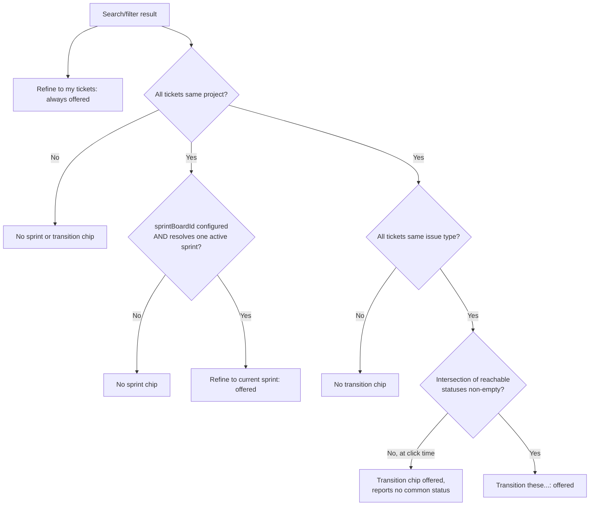

# Favorite Filter Search - Plan

## Goal Capsule

- **Objective:** A user can find and run the Jira filters they already rely on (favourites and owned) from `@jira` chat, optionally narrowed to a fixVersion/sprint/assignee, and act on a tightly-scoped result without leaving chat or hand-writing JQL.
- **Product authority:** `ce-brainstorm` dialogue, this session.
- **Open blockers:** none.

---

## Product Contract

**Product Contract preservation:** restructured, no scope change — R10 and R11 are new (favourites/owned partial-fetch-failure behavior, ambiguous-constraint-match resolution), surfaced by planning-time flow analysis and confirmed with the user. R8 and R9 were tightened: R8 now resolves the active sprint only via a configured `sprintBoardId` (no multi-board discovery); R9's status options are the intersection of every qualifying ticket's reachable transitions, not a union. R1-R7 unchanged in ID and core intent.

### Summary

`@jira` gains first-class support for a user's saved Jira filters — favourites and owned, deduped into one list — surfaced in chat and as Agent Mode tools. A filter can be run standalone, combined in one message with a fixVersion/sprint/assignee constraint, or narrowed by a follow-up message after running. The greeting gets a "Show my filters" chip that opens an on-demand pick-list; qualifying search results get contextual refine and transition chips.

### Requirements

**Filter discovery**

- R1. `@jira` can list the current user's favourite and owned Jira filters, deduped into one set, on request — as a chat command and as an equivalent read-only languageModelTool.
- R2. The greeting response carries a static "Show my filters" follow-up chip; selecting it invokes the R1 listing rather than fetching filters as part of every greeting.
- R3. When the listing has more than one filter, the user picks one from a numbered list, reusing the existing multi-filter-match selection UI; a listing with exactly one filter runs it directly, mirroring the existing single-match short-circuit for filter name resolution.
- R10. If one of the two underlying fetches (favourites, owned) fails while the other succeeds, the listing shows the succeeded half with an explicit note naming which source failed, rather than presenting a partial list as if it were complete. If both fail, the listing fails with a clear error.

**Combining a filter with a constraint**

- R4. A user can reference a saved filter (by id or name) together with a fixVersion, sprint, and/or assignee constraint in one message; the constraint(s) are AND-ed onto the filter's JQL before running — also exposed as a read-only languageModelTool.
- R5. A user can narrow an already-run filter or search result with a follow-up message naming a fixVersion, sprint, and/or assignee, reusing the existing search-result session.
- R6. Combining is limited to fixVersion, sprint, and assignee; other phrasing alongside a filter reference does not combine onto the filter's JQL.
- R11. When a named fixVersion, sprint, or assignee matches more than one candidate, the chat flow presents a numbered pick list (reusing the existing selection-session pattern) and waits for a choice; the equivalent languageModelTool returns the candidate list as text instead of guessing, matching the existing never-guess-issue-type precedent.

**Search-result follow-up chips**

- R7. A search/filter result offers a "Refine to my tickets" chip (assignee = current user) unconditionally.
- R8. A search/filter result offers a "Refine to current sprint" chip only when every ticket in the result resolves to the same project and `ticketSidekick.jira.sprintBoardId` is configured with a resolvable active sprint on that board. No chip appears when the setting is unset — there is no board-discovery fallback, since guessing among a project's boards risks narrowing to the wrong sprint silently.
- R9. A search/filter result offers a "Transition these…" chip only when every ticket in the result shares the same project and issue type. Selecting it computes the status options as the **intersection** of every qualifying ticket's reachable transitions — every offered choice is guaranteed to apply to the whole result. If the intersection is empty, the chip's flow says so and points the user to a typed bulk transition instead. Once a status is chosen, applying it reuses the existing per-ticket transition-path logic, which already tolerates tickets sitting at different current statuses.

### Key Decisions

- **Favourites + owned, deduped.** (session-settled: user-directed — chosen over favourites-only and owned-only — broader coverage than Jira's own "favourites" concept alone.) Governs R1.
- **Greeting chip is static; filters fetch only on demand.** (session-settled: user-directed — chosen over fetching favourites/owned on every greeting — keeps the greeting instant and removes a per-turn network failure surface.) Governs R2.
- **Combine scope is fixed to fixVersion/sprint/assignee.** (session-settled: user-directed — chosen over accepting any JQL condition alongside a filter reference — keeps the parser's job bounded and avoids unexpected interaction with a filter's own JQL.) Governs R4, R6.
- **Sprint and transition chips use separate, stricter commonality checks rather than one shared rule.** (session-settled: user-directed — chosen over relaxing the transition chip to single-project-only — a single-project, mixed-issue-type result can lack one target status valid for every ticket, which would make the chip dead-end for some.) Governs R8, R9.
- **List-filters and run-filter-with-constraint are also exposed as read-only languageModelTools; the transition-picker chip stays chat-only.** (session-settled: user-directed — no bulk-write languageModelTool exists today, so a bulk transition has no safe tool equivalent to expose.) Governs R1, R4, R9.
- **The current-sprint chip requires a configured `sprintBoardId`; no multi-board discovery fallback.** (session-settled: user-directed — chosen over falling back to "exactly one active sprint across the project's discovered boards" when unconfigured — keeps the resolution unambiguous rather than picking among boards.) Governs R8.
- **The transition chip's offered statuses are the intersection of every qualifying ticket's reachable transitions, not the union.** (session-settled: user-directed — chosen over a union with per-ticket partial-success reporting — every offered choice is then guaranteed to apply cleanly to the whole result, at the cost of sometimes offering nothing.) Governs R9.
- **Favourites/owned fetch failures degrade visibly rather than silently, and ambiguous constraint matches are never guessed.** (session-settled: user-approved — matches the codebase's existing fault-tolerant-but-labeled and never-guess-issue-type precedents.) Governs R10, R11.

### Key Flows

- F1. List and run a favourite/owned filter
  - **Trigger:** user clicks "Show my filters" or types an equivalent request.
  - **Actors:** User, `@jira`.
  - **Steps:** Fetch and dedupe favourites and owned filters → present a numbered pick list (or run directly if only one) → user picks → the chosen filter's JQL runs as a search.
  - **Covers:** R1, R2, R3.

- F2. Combine a filter with a constraint in one message
  - **Trigger:** "run my Bugs filter for sprint 24".
  - **Steps:** Intent parsing resolves both the filter reference and the constraint(s) → each constraint resolves to a JQL clause → clause(s) AND-ed onto the filter's JQL → search runs.
  - **Covers:** R4, R6, R11.

- F3. Narrow a prior result by follow-up
  - **Trigger:** after any search or filter run, the user sends a follow-up naming a constraint, or clicks a refine chip.
  - **Steps:** Read the stored search-result JQL → AND the new constraint → re-run.
  - **Covers:** R5, R7, R8, R11.

- F4. Transition a same-project/type result
  - **Trigger:** user clicks "Transition these…" on a qualifying result.
  - **Steps:** Status options are presented via the existing guided-transition picker → user picks a target status (and resolution, if the target closes the ticket) → the existing bulk-transition per-ticket path logic applies it across the result.
  - **Covers:** R9.

### Acceptance Examples

- AE1. Given the user has 2 favourite filters and 1 owned (non-favourite) filter, when they click "Show my filters", then they see 3 deduped entries to pick from. Covers R1, R3.
- AE2. Given exactly one favourite filter and no owned filters, when they click "Show my filters", then that filter runs directly with no pick-list step. Covers R1, R3.
- AE3. Given "show my Bugs filter for sprint 24" and a sprint named "24" exists in that filter's project, when the message is sent, then the search runs the filter's JQL AND the sprint clause together. Covers R4.
- AE4. Given "show my Bugs filter for sprint 24" but no sprint named "24" exists in that project, when resolution fails, then the user gets a clear not-found message rather than a partial or malformed search. Covers R4.
- AE5. Given a search result spanning two projects, when it renders, then only "Refine to my tickets" appears — no current-sprint or transition chip, since both require a single project. Covers R7, R8, R9.
- AE6. Given a search result confined to one project but spanning two issue types, when it renders, then the current-sprint chip appears (if `sprintBoardId` is configured and resolves an active sprint) but the transition chip does not. Covers R8, R9.
- AE7. Given a qualifying single-project/type result, when the user clicks "Transition these…" and picks a target status that closes tickets, then the existing resolution-selection step runs exactly as it does for a typed "transition them to Done" bulk transition. Covers R9.
- AE8. Given a qualifying result whose tickets sit at different current statuses with no status reachable from all of them, when the user clicks "Transition these…", then the flow reports that no common target status exists and suggests a typed bulk transition instead of offering an empty or partially-valid picker. Covers R9.
- AE9. Given the favourites fetch succeeds but the owned-filter fetch fails, when the user clicks "Show my filters", then they see the favourites with a note that owned filters could not be loaded, not an unlabeled partial list. Covers R10.
- AE10. Given "show my Bugs filter for assignee bob" and two users match "bob", when the message is sent, then the chat flow presents a numbered pick list of the matching users and waits for a choice, and the equivalent tool call returns both candidates as text instead of picking one. Covers R11.

### Scope Boundaries

- No fixVersion refine chip — no safe way to guess which version the user wants.
- No transition chip on a mixed-project or mixed-issue-type result — stays a typed follow-up, unchanged from today.
- No eager filter fetch on every greeting.
- The combine mechanism accepts fixVersion, sprint, and assignee only — not arbitrary JQL conditions.
- No new bulk-write languageModelTool — the transition-picker chip stays chat-only.
- No cap on the size of a result the "Transition these…" chip applies to — same as `bulkTransition` today.
- No multi-board discovery for the current-sprint chip — it only ever resolves via a configured `sprintBoardId`.

All four items previously deferred here (owned-filter query shape, chip wording, issue-type field plumbing, AND-builder consolidation) are resolved below in the Planning Contract; none block implementation readiness.

---

## Planning Contract

### Key Technical Decisions

- KTD1. **Two new `IJiraClient` capabilities, added the full way** — `getMyFilters()` (favourites + owned, deduped, with a per-source failure signal) and `getActiveSprintForBoard(boardId)` (filters a board's sprints client-side for `state === 'active'`) go through the full "Adding a new Jira operation" checklist (interface → `JiraApiClient` DC+Cloud → `MockJiraClient` fixture → fixture file → `TicketService` test) rather than being folded into tool/chat glue. (session-settled: user-approved — matches the codebase's stated three-layer rule; skipping the checklist for these two is how gaps like this stay invisible.) Governs R1, R8.
  - Favourites: `GET /filter/favourite`. Owned: no dedicated endpoint exists on either DC or Cloud — `getMyFilters()` runs a `GET /filter/search` scoped to the current user's owner identifier (DC: username; Cloud: `accountId`, from the already-existing `getCurrentUser()`), mirroring the DC/Cloud branching `getTeamByName` already uses. Exact query parameter name per API version is an implementation-time lookup against Jira's REST docs, not a planning blocker.
  - `getMyFilters()` returns a shape that separates "favourites fetch failed" from "owned fetch failed" (e.g. `{ filters: JiraFilter[]; failedSources: ('favourites' | 'owned')[] }`) so R10's partial-failure note can name the actual failed source rather than a generic message.
- KTD2. **One shared, pure AND-clause builder** for fixVersion/sprint/assignee constraints, generalizing `buildTeamJql`'s `(base) AND (extra)` pattern (`sessionState.ts:787-790`) into a typed function (e.g. `buildConstraintJql(baseJql, { fixVersion?, sprint?, assignee? })`) used by F2 (combine), F3 (refine chips), and both new tools (U7) — one implementation, not four. (session-settled: user-approved — the agent-native review flagged this as the Veracode/Waltz-drift risk CLAUDE.md already documents.) Governs R4, R5, R6, R7, R11.
  - Each constraint value is quoted and escaped before interpolation (a single internal escaping helper, analogous in spirit to `pathSafety.ts`'s role for URL segments) — required because a combine-tool call's constraint values can originate from an LLM's inference, not only human-typed chat text.
  - `assignee = "me"` (or equivalent chat phrasing) resolves to the same `assignee = currentUser()` JQL literal R7's chip already uses — one assignee-resolution path, not two.
- KTD3. **`SearchResultSession` gains optional per-ticket project/issue-type metadata**, populated by adding `issuetype` to the `extraFields` argument of the `ticketService.searchTicketsRaw(resolvedJql)` call that actually builds `raw`/`SearchResultSession` in the `searchJql` case (`JiraParticipant.ts:1526-1530`) — not the separate `ticketService.searchTickets(...)` call on the next line, which only returns a formatted display string and never exposes its underlying issues to the caller. Both calls run the same JQL today; only the `searchTicketsRaw` one is a source of truth for session state. `bulkTransition`'s existing per-ticket fetch loop (`JiraParticipant.ts:1600-1627`) is unchanged; the new metadata exists only to let the `searchJql` handler compute R8/R9's eligibility (single-project, single-project+issue-type) before it returns. Governs R8, R9.
- KTD4. **A new `JiraFollowupState` variant (`'searchResults'`)** carries the precomputed chip eligibility (assignee-refine always true; sprint-refine when `sprintBoardId` resolves an active sprint; transition when project+issue-type match). `computeJiraFollowups` stays pure/synchronous — all async eligibility work happens in the `searchJql` handler before it returns `{ metadata: { jiraFollowup: ..., jiraSession: ... } }` instead of today's bare `return;` (`JiraParticipant.ts:1533-1539`). Governs R7, R8, R9.
- KTD5. **A new multi-ticket guided-transition session type**, not an overload of the existing single-ticket `GuidedTransitionSession` (`sessionState.ts:341-367`) — the shapes diverge enough (a `tickets: {key, currentStatus}[]` list and an intersection-computed `statusOptions`) that overloading would force every existing single-ticket step to branch on ticket count. The status-pick and (when applicable) resolution-pick steps reuse the existing session's UI pattern; the final apply step is extracted from `bulkTransition`'s existing per-ticket path-building loop (`JiraParticipant.ts:1600-1627`) into a shared helper both intents call, so there is one per-ticket-apply implementation, not two. (session-settled: user-directed — intersection-only status list, confirmed during planning.) Governs R9.
- KTD6. **Two new read-only languageModelTools** (`jira_listMyFilters`, `jira_searchByFilter`) follow the existing `jiraTools.ts` read-tool shape exactly: `tryGetConfiguredContext`, delegation to `TicketService`, a `sessionState.ts` pure formatter, `onDiag`/`logDiag('jira.tools', ...)` on failure, and a `package.json` entry gated on `ticketSidekick.jiraCredentialsSet`. Neither tool falls back to an interactive pick-list on an ambiguous filter/sprint/assignee match (per R11 — tools carry no session memory); each returns the candidate list as its result text instead. `jira_searchByFilter`'s input schema uses structured fields (`filterId?`, `filterName?`, `fixVersion?`, `sprint?`, `assignee?`), not a free-text string, so R6's constraint-type limit is enforced by the schema itself. Governs R1, R4, R6, R11.

### Assumptions

- Jira DC and Cloud both expose an owner-scoped filter search sufficient to build "owned filters" (KTD1); if a target instance's API version lacks it, `getMyFilters()` degrades to favourites-only with the same failure-note mechanism R10 already defines, rather than a new error shape.
- A project's board configured via `sprintBoardId` is a Scrum board (accepts `/board/{id}/sprint`); a Kanban board configured there simply never resolves an active sprint, which R8 already treats as "no chip."

### High-Level Technical Design

The search-result chip set is a branching gate over three independent eligibility checks (KTD3, KTD4). This runs once per `searchJql`/refine response, before it returns:

The transition chip's own status-intersection check (F/F1/F2 above) runs lazily, at click time — computing it eagerly for every result would mean fetching every qualifying ticket's transitions on every search, not just the ones a user actually tries to transition.

### Risks & Dependencies

- **JQL-injection surface.** The combine flow and both new tools interpolate user- or LLM-supplied fixVersion/sprint/assignee values into JQL sent to Jira. Mitigated by KTD2's mandatory escaping helper — no call site interpolates a raw value.
- **DC/Cloud API divergence for owned filters.** No Jira REST version guarantees an owner-scoped filter search identically across DC and Cloud. Mitigated by KTD1's Assumptions entry (graceful favourites-only degradation) rather than a hard dependency.
- **Shared-helper extraction risk (U6).** Extracting `bulkTransition`'s per-ticket path-building loop into a helper both flows call risks a regression to the existing typed bulk-transition path. Mitigated by U6's `Execution note` (extract first, confirm `bulkTransition`'s existing tests stay green, then wire the new entry point) and the Definition of Done's explicit check.

---

## Implementation Units

### U1. Client capabilities: favourites/owned filters + active-sprint-by-board

- **Goal:** Add the two missing `IJiraClient` read operations (KTD1) so every later unit has data to work with.
- **Requirements:** R1, R8, R10.
- **Dependencies:** none.
- **Files:**
  - `src/jira/IJiraClient.ts` — add `getMyFilters(): Promise<{ filters: JiraFilter[]; failedSources: ('favourites' | 'owned')[] }>` and `getActiveSprintForBoard(boardId: number): Promise<{ id: number; name: string } | null>`.
  - `src/jira/JiraApiClient.ts` — implement both; `getMyFilters` calls `/filter/favourite` and an owner-scoped `/filter/search` in parallel, catching each independently to populate `failedSources`; `getActiveSprintForBoard` reuses the `/board/{boardId}/sprint?state=active,future` call shape already in `getSprintByName`/`findSprints`, filtering for `state === 'active'` and returning `null` on zero or more-than-one match (never guesses).
  - `src/test/mocks/MockJiraClient.ts` — fixture returns for both methods.
  - `src/test/fixtures/` — new fixture file(s) for `/filter/favourite` and the owner-scoped filter search response shape.
  - `src/services/TicketService.ts` — thin passthroughs, matching `getFilterById`/`searchFiltersByName` (`TicketService.ts:594-599`).
  - `src/services/TicketService.test.ts` — tests below.
- **Approach:**
  1. Mirror `getTeamByName`'s DC/Cloud branching (`JiraApiClient.ts:309-319`) for the owner identifier used in the owned-filter search.
  2. `getMyFilters` runs both fetches, dedupes by filter `id`, and never lets one fetch's failure suppress the other's result (per KTD1).
- **Patterns to follow:** `getFilterById`/`searchFiltersByName` (`JiraApiClient.ts:362-371`) for filter shape; `getSprintByName`/`findSprints` (`JiraApiClient.ts:281-525`) for board/sprint iteration and non-Scrum-board tolerance.
- **Test scenarios:**
  - Happy path: both fetches succeed with overlapping filters → `getMyFilters` returns the deduped union.
  - Happy path: `getActiveSprintForBoard` returns the one active sprint on a Scrum board.
  - Edge case: board has zero active sprints → returns `null`.
  - Edge case: board has more than one active sprint → returns `null` (never guesses).
  - Error path: owned-filter search fails, favourites succeeds → `failedSources: ['owned']`, favourites still returned. Covers AE9.
  - Error path: both fetches fail → both failures surfaced (not swallowed).
  - Error path: `getActiveSprintForBoard` on a non-Scrum board → treated like `getSprintByName`'s existing non-Scrum tolerance (`onDiag` warn, no throw), matching auth errors still rethrowing.
- **Verification:** `npm test` covers `TicketService`'s new passthroughs and `JiraApiClient`'s branching via `MockJiraClient`; `npm run compile` passes.

### U2. Shared constraint-JQL builder

- **Goal:** One pure function building and escaping a fixVersion/sprint/assignee AND-clause, per KTD2.
- **Requirements:** R4, R5, R6, R7, R11.
- **Dependencies:** none (pure, no client dependency).
- **Files:**
  - `src/participant/sessionState.ts` — add `buildConstraintJql(baseJql, constraints)`, generalizing `buildTeamJql` (`sessionState.ts:787-790`), plus the internal value-escaping helper.
  - `src/participant/sessionState.test.ts` (or `TicketService.test.ts`, matching existing test file conventions) — unit tests below.
- **Approach:**
  1. Accept a base JQL string and an object of already-resolved constraint values (fixVersion name, sprint id, assignee identifier) — resolution (name → id, ambiguity handling) is U4/U5's job, not this unit's.
  2. Quote/escape every interpolated value so a value containing a quote or backslash can't break out of its JQL clause.
- **Patterns to follow:** `buildTeamJql` (`sessionState.ts:787-790`) for the `(base) AND (extra)` wrapping shape.
- **Test scenarios:**
  - Happy path: one constraint (sprint) ANDs cleanly onto a base filter JQL.
  - Happy path: all three constraints combine in one call.
  - Edge case: no constraints → base JQL returned unchanged.
  - Error/security path: a constraint value containing a double quote or backslash is escaped, not interpolated raw — the resulting JQL string cannot terminate its clause early.
- **Verification:** `npm test` passes with full branch coverage on the escaping helper.

### U3. Chat: filter discovery (list, greeting chip, pick-list)

- **Goal:** `@jira` can list and run favourite/owned filters via chat, and the greeting offers it as a chip.
- **Requirements:** R1, R2, R3, R10.
- **Dependencies:** U1.
- **Files:**
  - `src/participant/jira/llmHelpers.ts` — extend `ParsedIntent`/`INTENT_PROMPT` with a `listMyFilters`-shaped operation (or reuse an existing operation with a new sentinel — implementer's call at code-review time).
  - `src/participant/sessionState.ts` — a `ListedFiltersSession` type (parallel to `FilterSelectionSession`, `sessionState.ts:585-588`) and its picker, reusing `parseFilterSelection`'s exact-match-before-cancellation-word ordering (`sessionState.ts:685-699` — see `docs/solutions/logic-errors/confirm-cancel-word-list-broadening-swallows-domain-name-collisions.md`).
  - `src/participant/sessionState.ts` — extend `JiraFollowupState`'s `'greeting'` case (or add the chip unconditionally) with the "Show my filters" chip in `computeJiraFollowups`.
  - `src/participant/JiraParticipant.ts` — wire the new intent to `TicketService.getMyFilters()`-backed listing, render the R10 partial-failure note when `failedSources` is non-empty, and reuse the existing numbered `buildChatCommandLink` list UI (`JiraParticipant.ts:1506-1512`) for >1 result.
  - `docs/jira-flows.md` — one-line summary + link, per CLAUDE.md's "Adding a new Jira operation" step 9.
- **Approach:**
  1. Greeting: add the static chip in `computeJiraFollowups`'s `'greeting'` case (`sessionState.ts:1679-1696`), capped by `JIRA_MAX_FOLLOWUPS`.
  2. List command: call `TicketService.getMyFilters()`; 0 results → plain message; 1 → run directly (AE2); >1 → `ListedFiltersSession` + numbered pick-list (AE1); any `failedSources` entries render as a note above the list.
  3. Picking a filter re-enters the existing `searchJql`-style run path (U4 shares this).
- **Patterns to follow:** `FilterSelectionSession`/`parseFilterSelection` (`sessionState.ts:585-588`, `685-699`); `JiraParticipant.ts:1493-1513`'s existing filter-by-name resolution flow for the 0/1/many branching shape.
- **Test scenarios (Vitest, pure logic only — chat wiring is e2e/manual):**
  - Happy path: `computeJiraFollowups({kind: 'greeting', ...})` includes the "Show my filters" chip.
  - Happy path: `ListedFiltersSession` picker resolves an exact-name match. Covers AE1.
  - Edge case: a filter literally named a cancellation word (e.g. "Stop") is still selectable by exact name (regression guard per the linked learning).
  - Edge case: single-result listing sentinel signals direct-run, not a pick-list. Covers AE2.
- **Execution note:** Add the exact-match-before-cancellation-word test first — this is the exact regression class a past learning names.
- **Verification:** `npm test` for the picker/chip logic; `npm run test:e2e` (or manual) for the greeting chip and chat rendering, since `JiraParticipant.ts` imports `vscode`.

### U4. Chat: combine a filter with a constraint

- **Goal:** One message can name a filter and a fixVersion/sprint/assignee constraint together, ANDed via U2.
- **Requirements:** R4, R5, R6, R11.
- **Dependencies:** U2 (filter-by-id/name resolution already exists pre-plan; only the constraint-combination logic is new).
- **Files:**
  - `src/participant/jira/llmHelpers.ts` — extend `ParsedIntent`/`INTENT_PROMPT` so `filterId`/`filterName` can coexist with fixVersion/sprint/assignee fields instead of the current `jql: null` exclusivity (`llmHelpers.ts:74`).
  - `src/participant/sessionState.ts` — one ambiguous-match pick-list session type parameterized by constraint kind (`fixVersion` | `sprint` | `assignee`), not a separate session type per kind — R11's picker behavior is identical across all three, so a kind discriminator avoids three near-duplicate types.
  - `src/participant/JiraParticipant.ts` — in the `searchJql` case, resolve the filter (existing logic, `JiraParticipant.ts:1493-1513`) and any named constraints, call U2's `buildConstraintJql`, and run.
- **Approach:**
  1. Resolve a `projectKey` before any sprint/fixVersion lookup, since both require one and `JiraFilter` itself carries none (only `{id, name, jql}`): extract a `project = X` clause from the filter's own JQL. When the filter's JQL doesn't scope to a single project, fixVersion/sprint constraints can't resolve — report this clearly (same never-guess principle as R11) rather than guessing a project. Assignee resolution needs no project and is unaffected.
  2. Constraint resolution: fixVersion name → project's versions (existing field-meta lookups, using the resolved `projectKey`); sprint name → `findSprints`/`getSprintByName` (same); assignee name/`"me"` → `findUser`/`currentUser()`. Zero matches → clear not-found message (AE4). One match → proceed (AE3). Multiple → R11's pick-list (AE10).
  3. AND the resolved values onto the filter's JQL via U2.
- **Patterns to follow:** `useMyTeamJql`/`buildTeamJql` branch (`JiraParticipant.ts:1514-1522`) for the overall shape of "resolve then AND onto a base JQL."
- **Test scenarios:**
  - Happy path: filter + sprint constraint in one message runs the ANDed JQL. Covers AE3.
  - Happy path: filter + fixVersion + assignee all three combine.
  - Error path: named sprint doesn't exist → clear not-found message, no partial search. Covers AE4.
  - Ambiguity path: named assignee matches two users → pick-list session created, resolves on reply. Covers AE10.
  - Edge case: filter reference with no constraint still runs as before (no regression to F1's plain filter run).
  - Edge case: filter's JQL has no single-project scope and a sprint/fixVersion constraint is named → clear message explaining the project can't be determined, no guessed project.
- **Verification:** `npm test` for parsing/resolution logic; `npm run test:e2e` for the full chat round-trip.

### U5. Chat: search-result refine chips

- **Goal:** Search/filter results carry "Refine to my tickets" and "Refine to current sprint" chips per their eligibility rules.
- **Requirements:** R5, R7, R8.
- **Dependencies:** U1 (`getActiveSprintForBoard`), U2 (refine-chip AND logic).
- **Files:**
  - `src/participant/sessionState.ts` — extend `SearchResultSession` (`sessionState.ts:590-596`) with optional per-ticket `projectKey`/`issueType`; add the `'searchResults'` `JiraFollowupState` variant and its `computeJiraFollowups` case.
  - `src/participant/JiraParticipant.ts` — add `issuetype` to the `extraFields` argument of the `searchTicketsRaw(resolvedJql)` call in the `searchJql` case (`JiraParticipant.ts:1526`), the call that populates `SearchResultSession` — not the separate `searchTickets(...)` render call, whose issues never reach the caller.
  - `src/participant/JiraParticipant.ts` — in `searchJql` (`JiraParticipant.ts:1490-1539`), after building `SearchResultSession`, compute R7 (always true)/R8 (project match + `getActiveSprintForBoard`)/R9's project+issue-type match (U6 consumes this), and return `{ metadata: { jiraFollowup, jiraSession } }` instead of the current bare `return;`.
  - Same wiring for F3's follow-up-narrow path (a bare message naming a constraint, reusing U2/U4's resolution).
- **Approach:**
  1. Project match: derive from ticket-key prefixes (`extractProjectKeyFromTicketKey`, `sessionState.ts:1305`) — no extra fetch.
  2. Sprint chip: only when `sprintBoardId` is configured and `getActiveSprintForBoard` resolves (KTD1's `null` cases both mean "no chip").
  3. Refine chip click reuses U2's `buildConstraintJql` against the stored `SearchResultSession.jql`.
- **Patterns to follow:** `computeJiraFollowups`'s existing `'loadedTicket'` case (`sessionState.ts:1704-1730`) for the shape of a followup-state case with conditional chips.
- **Test scenarios:**
  - Happy path: single-project result with `sprintBoardId` resolving → both refine chips present. Covers AE6 (sprint half).
  - Edge case: multi-project result → only "Refine to my tickets". Covers AE5.
  - Edge case: `sprintBoardId` unset → no sprint chip regardless of project uniformity.
  - Edge case: single-project result spanning two issue types → sprint chip eligible, transition chip not. Covers AE6 (transition half).
  - Happy path: clicking "Refine to my tickets" re-runs with `assignee = currentUser()` ANDed on.
- **Verification:** `npm test` for the eligibility/chip logic; `npm run test:e2e` for the rendered chips.

### U6. Chat: multi-ticket transition chip

- **Goal:** A same-project/issue-type result offers a guided transition across all its tickets.
- **Requirements:** R9.
- **Dependencies:** U5 (project+issue-type eligibility from `SearchResultSession` metadata).
- **Files:**
  - `src/participant/sessionState.ts` — new multi-ticket guided-transition session type (KTD5) and its status-pick/resolution-pick/confirm steps, reusing `GuidedTransitionSession`'s per-step shape (`sessionState.ts:341-405`) at the type level without merging into it.
  - `src/participant/JiraParticipant.ts` — extract `bulkTransition`'s per-ticket path-building loop (`JiraParticipant.ts:1600-1627`) into a shared helper; a new entry point computes the status-options intersection (fetch each qualifying ticket's direct transitions, intersect by target status name) and starts the new session; the existing `continueGuidedTransition`-style dispatch drives it to completion, calling the shared apply helper at `confirm`.
- **Approach:**
  1. Eligibility (project+issue-type match) comes from U5; this unit starts from "eligible, chip clicked."
  2. Status list = intersection of each ticket's `getTransitions()` target names. Empty intersection → message per AE8, no session opened.
  3. The confirm step explicitly lists every affected ticket key and its current status before applying — the same confirm-step guarantee `bulkTransition`'s own review screen already gives (no Jira write happens without the user seeing the full scope first), which matters more here than in the single-ticket flow since the picker's status list was computed from an intersection the user hasn't seen ticket-by-ticket.
  4. Apply step calls the shared per-ticket path-building helper (now used by both this flow and `bulkTransition`), so behavior — including subtask handling and the closed-state resolution-pick — matches a typed bulk transition exactly (AE7).
- **Patterns to follow:** `startGuidedTransition`/`continueGuidedTransition` (`JiraParticipant.ts:235-379`) for session step shape; `bulkTransition`'s existing loop (`JiraParticipant.ts:1600-1627`) for the apply logic to extract and share.
- **Test scenarios:**
  - Happy path: tickets at different current statuses share a common target status → picker offers it, applies across all. Covers AE7.
  - Edge case: no common target status across all qualifying tickets → clear message, typed-transition suggestion, no picker opened. Covers AE8.
  - Happy path: chosen status closes tickets → resolution-pick step fires, matching `bulkTransition`'s existing closed-state branch (`JiraParticipant.ts:1642-1657`).
  - Integration: subtasks of qualifying tickets are still included via the shared apply helper, unchanged from `bulkTransition`'s current subtask handling (`JiraParticipant.ts:1613-1621`).
- **Execution note:** Extract the shared apply helper from `bulkTransition` first, with `bulkTransition`'s existing tests still green, before wiring the new entry point to it — keeps the refactor's correctness independently verifiable.
- **Verification:** `npm test` for the intersection/status-list logic; `npm run test:e2e` for the full guided flow; confirm `bulkTransition`'s existing test suite is unaffected by the extraction.

### U7. Agent Mode tools: list filters + search by filter

- **Goal:** Expose R1's listing and R4's combine capability as read-only languageModelTools (KTD6).
- **Requirements:** R1, R4, R6, R11.
- **Dependencies:** U1, U2, U4 (constraint resolution).
- **Files:**
  - `src/tools/jiraTools.ts` — `ListMyFiltersTool` (`jira_listMyFilters`, no input) and `SearchByFilterTool` (`jira_searchByFilter`, structured input per KTD6), both following the existing `SearchTicketsTool` shape (`jiraTools.ts:140-169`).
  - `package.json` — two new `contributes.languageModelTools` entries, gated on `ticketSidekick.jiraCredentialsSet`, matching every existing tool entry's shape.
  - `docs/onboarding.md` — add both tools to the "Read tools" table.
- **Approach:**
  1. Both tools call the same `TicketService`/U2 logic U3/U4 use — no reimplementation.
  2. On an ambiguous constraint match, `jira_searchByFilter` returns the candidate list as result text (never an interactive pick, since tools carry no session memory).
- **Patterns to follow:** `SearchTicketsTool`/`registerJiraTools()` (`jiraTools.ts:140-169`, `801-815`).
- **Test scenarios:**
  - Happy path: `jira_listMyFilters` returns the deduped list as formatted text.
  - Happy path: `jira_searchByFilter` with an unambiguous constraint runs and returns results.
  - Ambiguity path: `jira_searchByFilter` with an ambiguous assignee returns the candidate list as text, makes no guess, and modifies nothing. Covers AE10 (tool half).
  - Not-configured path: either tool invoked with credentials unset returns the standard `buildJiraNotConfiguredMessage` text.
- **Verification:** `npm test` for the tool-level logic reachable without `vscode`; manual Agent Mode invocation (or `npm run test:e2e` if the harness covers tool invocation) for the `vscode.lm.registerTool` wiring.

---

## Verification Contract

| Command | Applies to | Notes |
|---|---|---|
| `npm run compile` | All units | TypeScript type check; run before `npm test` per CLAUDE.md. |
| `npm test` | U1-U7 (pure logic) | Vitest; must be green before commit per CLAUDE.md. Covers `IJiraClient`/`JiraApiClient`/`MockJiraClient`/`TicketService` (U1), `sessionState.ts` pickers and chip logic (U2, U3, U5, U6), and tool-reachable logic (U7). |
| `npm run test:e2e` | U3, U4, U5, U6 (chat/`vscode` wiring) | `@vscode/test-electron`; not run in CI, run manually before merging chat-flow changes per CLAUDE.md. |

No new external dependency, migration, or CI change — the existing three-command verification loop covers this plan.

---

## Definition of Done

- All seven units implemented; `npm run compile` and `npm test` green.
- `npm run test:e2e` run manually at least once covering the new greeting chip, filter listing, combine flow, refine chips, and the multi-ticket transition chip.
- `bulkTransition`'s existing test suite still passes unchanged after U6's shared-helper extraction (no silent behavior change to the typed bulk-transition path).
- `docs/jira-flows.md` carries the one-line summary + link for this feature (per CLAUDE.md's documentation convention), and `docs/onboarding.md`'s tool tables list the two new tools.
- No dead-end code from an abandoned approach remains (e.g., if KTD5's session type is reshaped mid-implementation, the earlier shape is removed, not left alongside).
- Every AE (AE1-AE10) has a corresponding test scenario in some unit above.
