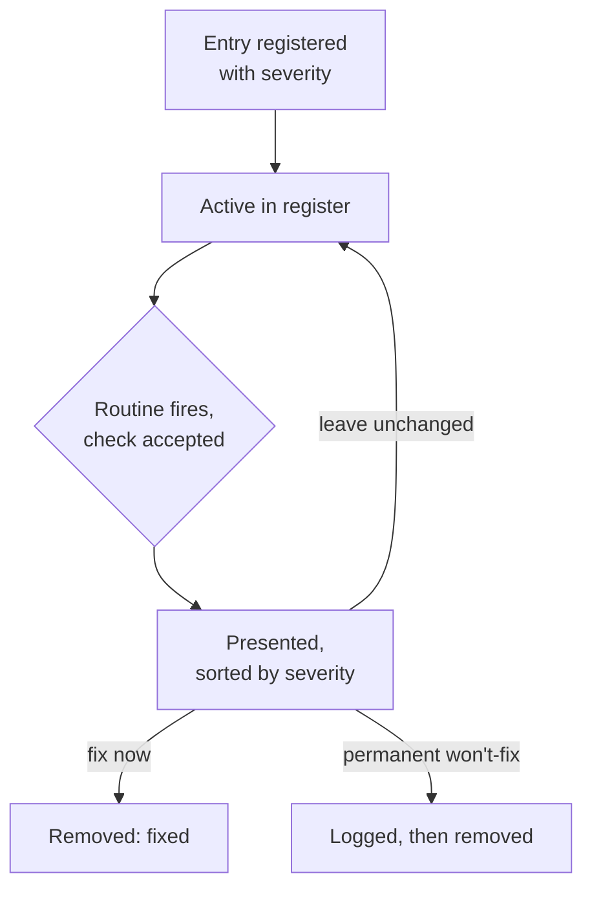

# Known-Limitation Revisit Register - Plan

## Goal Capsule

- **Objective:** A consciously-deferred known limitation in this codebase gets surfaced on a schedule for the maintainer to prioritize, instead of sitting indefinitely until a bug forces a re-read.
- **Means:** A central register file of deferred-limitation entries, each carrying a severity, paired with a scheduled Routine that checks in roughly every 30 days and shows the maintainer the active register sorted by severity to act on at their own discretion.
- **Product authority:** the repo's solo maintainer — this is a personal-workflow tooling decision, not a multi-stakeholder product call.
- **Open blockers:** none. All key decisions were settled during scoping dialogue; see Outstanding Questions for items deferred to planning.

## Product Contract

### Summary

A central register records known limitations this codebase's maintainer has consciously decided not to fix right now — not every deferred item, only the ones knowingly chosen to defer. Each entry carries a severity alongside its found date. A scheduled Routine checks in roughly every 30 days, asks permission before proceeding, and when accepted shows the full active register sorted by severity so the maintainer decides what to address on their own priority — nothing is forced.

### Problem Frame

The Waltz OSS report importer shipped with a documented, correctly-flagged known limitation: its schema was validated against a single real export, with no test coverage for drift. That note sat in `docs/report-import.md` untouched until a real user's export broke the parser in production, becoming `docs/solutions/integration-issues/waltz-oss-report-unzip-failure-on-real-world-xlsx.md`. The limitation was known and written down the entire time; nothing ever brought it back into view.

This repo already externalizes deferred-scope signal well in prose — `CLAUDE.md`'s "Known limitation" notes, plan docs' Scope Boundaries sections, `docs/solutions/` Prevention notes — but none of it carries a mechanism that forces a second look. A prose-only "known limitation" with nothing periodically resurfacing it decays into accepted risk nobody actually chose to accept.

### Key Decisions

- **Register only consciously-deferred survivors, not every known limitation.** (session-settled: user-directed — chosen over registering every deferred item, and over a resolve-or-kill-now norm banning open-ended deferrals entirely: most limitations should still be resolved or permanently killed at the moment they're found; only the few genuinely kept open get tracked.) Governs R1, R4.
- **A scheduled Routine is the enforcement mechanism, not CI or `ce-compound-refresh`.** (session-settled: user-directed — `ce-compound-refresh` turned out to be a shared marketplace plugin skill with a hardcoded `docs/solutions/` scope and no repo-specific extension hook, so it cannot be extended from this repo; a CI check was the fallback, rejected in favor of an on-demand-confirmed Routine.) Governs R5.
- **The register is a single central file, not markers inline at each limitation's original text.** (session-settled: user-directed — one place to scan is worth the cost of a second copy of context to keep in sync.) Governs R1.
- **Entries are prioritized by severity, not resolved by an automatic due date.** (session-settled: user-directed — chosen over a revisit-by-date model that forces one of three outcomes on every due entry: the maintainer wants to judge priority fresh at each check-in rather than have the register schedule decisions on a timer. Every active entry is shown at every accepted check-in, sorted by severity, and "leave unchanged" is a first-class outcome alongside fix-now and won't-fix.) Governs R1, R6, R7.
- **Declining the Routine's check-in is a legitimate outcome with no escalation.** (session-settled: user-directed — "not now" is a standing legitimate maintainer call, every time.) Governs R5.
- **The register launches seeded with today's full known-open-item list, not only the items already written as prose.** (session-settled: user-directed — chosen over seeding only the already-documented `CLAUDE.md`/`docs/report-import.md` limitations, so the register launches already covering the complete list this scoping conversation surfaced.) Governs R3.
- **The Routine's stored prompt points at a stable convention doc describing the register, rather than embedding the register's file path and fields directly.** (session-settled: user-directed — chosen over embedding those details in the prompt itself: a later format or path change then only touches the convention doc, never the Routine's own stored prompt.) Governs R5.
- **R3's seed list includes a seventh entry — a denylist-sanitizer-exhaustiveness watch item — surfaced by planning research.** (session-settled: user-directed — chosen over leaving the six items settled during brainstorming: it's a second, independent instance of this register's exact motivating failure pattern already present in this repo's own history, and leaving it out would undercut the register on day one.) Governs R3.
- **A permanent won't-fix decision is logged durably before its entry is removed from the register.** (session-settled: user-directed — chosen over treating the register's git history as the record: a durable log makes the decision and its reason discoverable without archaeology, so a limitation already declined isn't re-registered from scratch later.) Governs R6.
- **One combined file holds the convention notes, the live register, and the won't-fix log — not three separate files.** (session-settled: user-directed — chosen over splitting them: one file for the Routine's prompt to reference, and no risk of the pieces drifting apart.) Governs R1, R5.
- **The Routine's ~30-day cadence runs as a recurring, self-sustaining schedule, not an exact self-rescheduling chain.** (session-settled: user-directed — a recurring schedule keeps firing on its own; a self-rescheduling chain is more precise but a single missed reschedule step would silently end all future check-ins.) Governs R5.
- **Severity uses a fixed three-level scale — High / Medium / Low.** (session-settled: user-directed — chosen over a more granular numeric scale: matches how the maintainer eyeballs priority during a check-in, with an obvious sort order and no calibration needed between adjacent levels.) Governs R1.

### Requirements

**Register**

- R1. A central register file records every consciously-deferred known limitation as a single entry carrying: the limitation's description or a pointer to where it's documented, the date found, a severity, and the reason it wasn't resolved immediately.
- R2. *(Retired — a fixed revisit-by-date default no longer applies; entries carry severity instead, per the Key Decision above.)*
- R3. At launch, the register is seeded with seven entries: the two existing known-limitation notes in `docs/report-import.md` (the Veracode data-path gap, the Waltz single-fixture schema-drift gap); the four still-open items from the 2026-08-20 technical-debt ideation run — Waltz's parse-timeout lacking real cancellation, no independent-producer sentinel `.xlsx` fixture, no `@jira` token/context budget parity with `@bitbucket`, and the render-safety plan's deferred macro-injection verification (`docs/plans/2026-08-14-001-fix-jira-wiki-render-safety-plan.md`, KTD3 / its Verification Contract's deferred manual check); and the denylist-sanitizer-exhaustiveness watch item on `sanitizeCellText()`/`markdownToJiraWiki()` named in `docs/solutions/security-issues/waltz-oss-report-markdown-injection-in-jira-wiki-converter.md`'s Prevention section — a second, independent case of the same decay pattern this register exists to close, surfaced during planning research.
- R4. A new consciously-deferred limitation discovered after launch is added to the register at the time it's identified, with a severity assigned at registration, following a documented convention — the register is a living list, not a one-time snapshot.

**Check-in mechanism**

- R5. A scheduled Routine fires roughly every 30 days. Each firing first asks whether to proceed with a check; declining ends that firing with no further action, and the Routine fires again at its next scheduled interval regardless of how the previous firing was answered. The Routine's stored prompt references a short, stable convention doc describing the register's location and fields rather than embedding them directly, so a later change to either only requires updating that doc.
- R6. When the maintainer accepts a firing's check, the Routine reads the register and presents every active entry sorted by severity, highest first; for each, the maintainer may fix it now and remove it from the register, convert it to a permanent won't-fix — recorded in a durable won't-fix log before removal, so the decision and its reason survive the deletion — or leave it unchanged in the register with no forced decision.
- R7. A firing whose register holds no active entries reports that and ends without prompting further action.

### Actors

- A1. **Maintainer** — the repo's solo owner, who writes register entries with a severity, responds to the Routine's check-in prompt, and decides what to address each time based on priority.
- A2. **Revisit Routine** — the scheduled process that fires roughly every 30 days, asks permission, and shows the active register sorted by severity when accepted.

### Key Flows

- F1. **Routine check-in.**
  - **Trigger:** The Routine's ~30-day schedule fires.
  - **Actors:** A2, A1.
  - **Steps:** The Routine asks the maintainer whether to check now. On decline, it ends and waits for the next scheduled firing. On accept, it reads the register; if it holds no active entries, it reports that and ends; otherwise it presents every entry sorted by severity and lets the maintainer choose fix-now / won't-fix / leave-unchanged independently for each, before ending.
  - **Covers:** R5, R6, R7.

### Scope Boundaries

- Implementing the five technical items seeded into the register at launch (Waltz parse-timeout cancellation, the sentinel fixture policy, `@jira` token-budget parity, the deferred macro-injection verification, the denylist-sanitizer-exhaustiveness watch item) is out of scope — this plan tracks them as register entries, it does not fix them.
- A CI check, and any change to the shared `ce-compound-refresh` plugin skill, are out of scope.
- Escalating behavior after repeated declines of the Routine's check-in is out of scope.
- Retroactively registering every historical "Scope Boundaries"/"out of scope" note across past plan docs is out of scope — only the items named in R3 are seeded at launch; anything else enters later through R4's ongoing convention.

### Acceptance Examples

- AE1. **Covers R5, R7.** Given the register holds no active entries, when the Routine fires and the maintainer accepts the check, then it reports the register is empty and ends without further prompts.
- AE2. **Covers R5.** Given the Routine fires, when the maintainer declines the check, then no entries are read or presented, and the Routine still fires again at its next scheduled interval.
- AE3. **Covers R6.** Given the register holds at least one active entry, when the maintainer accepts a firing's check, then the Routine presents every entry sorted by severity and lets the maintainer choose fix-now, won't-fix, or leave-unchanged independently for each, with no entry forced to a decision.
- AE4. **Covers R1, R3.** Given the register is freshly created, when it is seeded, then it contains exactly seven entries — the two existing `docs/report-import.md` known limitations, the four still-open ideation items, and the sanitizer-exhaustiveness watch item, all named in R3 — each with a description or pointer, a found date, a severity, and a deferral reason.

### Dependencies / Assumptions

- Assumes the combined file's internal structure (table columns, section layout) is decided during planning — this plan states required fields, not layout.
- Assumes the Routine reads the register file fresh on each firing rather than needing its contents embedded in the Routine definition itself.
- Assumes the ~30-day cadence runs as a recurring, monthly-ish schedule (see Key Decision above), which may drift a few days depending on the month.

### Sources / Research

- `docs/ideation/2026-08-20-open-technical-debt-ideation.html` — the prior ideation run this brainstorm re-verified against current code and drew its R3 seed list from.
- `docs/report-import.md:55-58, 76-78` — the two currently-documented "Known limitation" notes seeded at R3.
- `docs/solutions/integration-issues/waltz-oss-report-unzip-failure-on-real-world-xlsx.md` — the concrete failure case in the Problem Frame: a documented-but-unrevisited limitation that reached production.
- `src/utils/waltzReport.ts:220-233` — confirms the parse-timeout item seeded at R3 is still open (`Promise.race`, no real cancellation).
- `scripts/fixtures/build-waltz-report-fixture.mjs` — confirms the sentinel-fixture item seeded at R3 is still open (only fixture generator, same ecosystem as the removed reader).
- `src/participant/jira/contentHandler.ts` compared with `src/participant/BitbucketParticipant.ts`'s `contextBudgetRatio` usage — confirms the `@jira` token-budget-parity item seeded at R3 is still open.
- Commit `5686646` (2026-09-11, `fix(jira): propagate ChatResult from email/report-import dispatch branches`) — confirms the bug in `docs/issues/create_from_email-2026-09-11.md` is already fixed; that issue doc is now stale and worth cleaning up, separately from this plan.
- `docs/solutions/security-issues/waltz-oss-report-markdown-injection-in-jira-wiki-converter.md` and its successor `docs/solutions/security-issues/jira-native-wiki-trigger-neutralization-in-shared-markdown-converter.md` — a second, independent precedent of a predicted-but-unfixed risk decaying into a real vulnerability; source of R3's seventh seed row, added during planning research.
- `docs/plans/2026-08-14-001-fix-jira-wiki-render-safety-plan.md` — source of R3's sixth seed row (KL6); its Dependencies/Assumptions and KTD3 name the deferred, non-blocking manual check of whether Jira's own renderer re-interprets wiki-markup trigger sequences inside `{{monospace}}`/`{code}`/`{noformat}` macros.

---

**Product Contract preservation:** changed R3, AE4, R6 — planning research (`learnings-researcher`) surfaced a second, independent precedent of this register's motivating failure pattern beyond the Problem Frame's Waltz example; the user confirmed adding it as a seventh seed row rather than leaving R3 at the six items settled during brainstorming. Separately, `spec-flow-analyzer` found that R6's original "convert to won't-fix and remove" gave a permanent decision no durable record, indistinguishable a month later from "never registered"; the user confirmed logging the decision before removal rather than treating deletion itself as the record. Further changed: during Phase 5.1.5 scoping-synthesis dialogue, the user redirected the core check-in mechanism from an automatic revisit-by-date model (R2, and the original R6/R7) to severity-based entries with manual, priority-driven check-ins — no date drives what surfaces, every active entry is shown at every accepted firing sorted by severity, and "leave unchanged" is a first-class outcome alongside fix-now and won't-fix. R2 is retired; R1, R6, R7, Key Decisions, Actors, Key Flows, Acceptance Examples, and Dependencies were rewritten to match.

---

## Planning Contract

- KTD1. **File path and internal layout.** The combined file lives at `docs/known-limitations.md`, sibling to the repo's other domain docs (`docs/report-import.md`, `docs/jira-flows.md`). Top to bottom: a `## Convention` section (what qualifies as an entry, required fields, the severity scale, how the Routine uses the file), a `## Active Register` table, and a `## Won't-Fix Log` table. Matches this repo's established domain-doc shape (H1 → intro → H2 sections) confirmed by repo research. Instantiates the "single central file" and "one combined file" Key Decisions (Governs R1, R5).
- KTD2. **Entry ID scheme.** Each Active Register row carries a stable `KL<N>` ID (next unused number; never reused; gaps after removal are fine), mirroring the `R<N>`/`U<N>` convention already used throughout `docs/plans/`. A Won't-Fix Log row keeps its original `KL<N>` for traceability. Lets the Routine and the maintainer refer to a specific entry unambiguously during a check-in. Governs R1, R6.
- KTD3. **Write persistence: batched at the end of a check-in.** (session-settled: user-directed — chosen over persisting each decision immediately: the maintainer accepted that an interrupted check-in can lose that session's in-progress decisions, preferring the simpler batch-write model over per-decision writes.) The Routine collects every fix-now/won't-fix outcome during the walkthrough and writes them to the file once, after the maintainer has gone through every presented entry. Governs R6. See Risks & Dependencies for the accepted trade-off this carries.
- KTD4. **Malformed entry handling: best-effort auto-repair.** (session-settled: user-directed — chosen over flagging-and-skipping or halting the firing: the maintainer wants a malformed entry fixed automatically wherever a reasonable interpretation exists.) A missing or invalid severity defaults to Medium; a missing or malformed found-date is set to today's date; a missing description/reason is included in that entry's presentation with an inline "description missing" note rather than silently dropped. A row that cannot be parsed as an entry at all (no extractable ID or description) is skipped, and that firing's summary names how many rows were skipped this way so nothing vanishes unnoticed. Repairs are included in that firing's presentation and written back as part of KTD3's batch write. Governs R6.
- KTD5. **Missing or unreadable register file is reported distinctly from an empty register.** If `docs/known-limitations.md` doesn't exist, or can't be parsed at all, when a firing is accepted, the Routine reports that specific condition rather than folding it into R7's "no active entries" message — so the maintainer can always tell "nothing to review" apart from "something is wrong with the file itself." Not session-settled: the safer default given this feature's whole purpose is not letting a gap decay unnoticed. Governs R6, R7.
- KTD6. **Routine cadence: recurring monthly cron, not exact 30-day steps.** Implements the "recurring, self-sustaining schedule" Key Decision as a standard cron-style Routine evaluated on a monthly cadence (drifting a few days from a literal 30-day step depending on the month), rather than a self-rescheduling one-shot chain. Governs R5.
- KTD7. **Won't-Fix Log row shape.** A row carries: the original `KL<N>` ID, description/pointer, found date, severity, the won't-fix reason, and the date it was declined. Append-only — the Routine never edits or removes a Won't-Fix Log row. Instantiates the durable-won't-fix-log Key Decision. Governs R6.
- KTD8. **Session mode and persistence: fresh session per firing, with an explicit commit-and-push step.** Not session-settled — resolves a gap `ce-doc-review`'s adversarial pass found: without a defined path back into git, KTD3's batch write could be lost or invisible to the next firing's "fresh read." The Routine spawns a fresh session on each firing rather than self-binding to one persistent session — the register file, not conversation history, is the durable state, so nothing is gained by accumulating months of session context. Each accepted firing's prompt: pulls the tracked branch's current `docs/known-limitations.md` before reading, so KTD3's batch write never applies on top of stale content; after the walkthrough, commits the updated file — naming which `KL<N>` IDs were fixed, won't-fixed, or left unchanged — and pushes directly to the branch (a solo-maintainer docs update needs no PR). A push failure (e.g. a conflicting concurrent edit) is reported explicitly in that firing's summary rather than silently discarding the session's decisions. Governs R5, R6.

## Implementation Units

### U1. Create the combined register file

- **Goal:** Create `docs/known-limitations.md` with the Convention section and empty Active Register / Won't-Fix Log tables.
- **Requirements:** R1, R4 (KTD1, KTD2, KTD7).
- **Dependencies:** none.
- **Files:**
  - `docs/known-limitations.md` (new)
- **Approach:**
  1. H1 title, one-paragraph intro (what the register is, per the Summary).
  2. `## Convention` — states: what qualifies as an entry (consciously deferred, not every known limitation, per the Product Contract's Key Decision); required fields (`KL<N>` ID, description/pointer, found date, severity, reason); the severity scale (High / Medium / Low); a one-line note that the scheduled Routine reads this file on each accepted check-in and writes back any fix-now/won't-fix decisions after the walkthrough (KTD3).
  3. `## Active Register` — table columns: ID, Description / Pointer, Found, Severity, Reason.
  4. `## Won't-Fix Log` — table columns: ID, Description / Pointer, Found, Severity, Reason, Declined (KTD7).
- **Patterns to follow:** the domain-doc shape used by `docs/report-import.md` and `docs/jira-flows.md` (H1 → intro → H2 sections, cross-linked from `CLAUDE.md`); the `R1.`/`U1.` plain-ID-prefix convention used throughout `docs/plans/*.md`, adapted to `KL<N>`.
- **Test scenarios:** Test expectation: none -- pure documentation content, no executable logic.
- **Verification:** the file exists at the stated path; both tables are present with the stated columns and are empty; the Convention section states the severity scale and the register's qualification rule.

### U2. Seed the register with the seven entries

- **Goal:** Populate the Active Register with `KL1`–`KL7` per R3.
- **Requirements:** R1, R3, AE4.
- **Dependencies:** U1.
- **Files:**
  - `docs/known-limitations.md` (modify)
- **Approach:**
  1. One row per seed item, each citing its source with a repo-relative pointer: `KL1` Veracode data-path gap (`docs/report-import.md:55-58`); `KL2` Waltz single-fixture schema-drift gap (`docs/report-import.md:76-78`); `KL3` Waltz parse-timeout lacking real cancellation (`src/utils/waltzReport.ts:220-233`); `KL4` no independent-producer sentinel fixture (`scripts/fixtures/build-waltz-report-fixture.mjs`); `KL5` no `@jira` token/context budget parity (`src/participant/jira/contentHandler.ts` vs. `src/participant/BitbucketParticipant.ts`); `KL6` render-safety plan's deferred macro-injection verification (`docs/plans/2026-08-14-001-fix-jira-wiki-render-safety-plan.md`, KTD3 / its deferred manual check); `KL7` denylist-sanitizer-exhaustiveness watch item (`docs/solutions/security-issues/waltz-oss-report-markdown-injection-in-jira-wiki-converter.md`).
  2. Found date: the date this unit ships.
  3. Severity: propose one per entry at implementation time — `KL3`, `KL4`, `KL7` lean High (each is security- or resource-exhaustion-adjacent per its own source doc's framing); `KL1`, `KL2`, `KL5`, `KL6` lean Medium. This is a judgment call left to the implementer, not fixed by this plan.
- **Test scenarios:** Test expectation: none -- pure documentation content.
- **Verification:** exactly seven rows exist in the Active Register, matching R3's list (AE4); each row's pointer resolves to a real, currently-existing file or section.

### U3. Add the CLAUDE.md pointer

- **Goal:** A one-line pointer and link to the register, following `CLAUDE.md`'s own "Where documentation belongs" convention.
- **Requirements:** R1 (discoverability); the single-central-file Key Decision.
- **Dependencies:** U1.
- **Files:**
  - `CLAUDE.md` (modify)
- **Approach:** Add a short paragraph near the existing `## Documented Solutions` section naming the register's purpose and linking `docs/known-limitations.md`, matching that section's one-line-plus-link shape.
- **Test scenarios:** Test expectation: none -- documentation-only change.
- **Verification:** `CLAUDE.md` contains a working relative link to `docs/known-limitations.md`.

### U4. Set up the scheduled Routine

- **Goal:** A recurring Routine that fires roughly monthly (KTD6), checks in with the maintainer, and walks the severity-sorted register per R5–R7.
- **Requirements:** R5, R6, R7 (KTD3, KTD4, KTD5, KTD6, KTD8).
- **Dependencies:** U1, U3.
- **Files:** none — this unit configures a Routine external to the repo (Claude Code's scheduled-trigger mechanism), not a source file. Note this explicitly at implementation time so it isn't mistaken for a missed file.
- **Approach:**
  1. Create a recurring trigger, monthly cadence (KTD6), bound to fire into a session in this repo's environment.
  2. Its stored prompt: asks whether to check now; on decline, ends with no further action.
  3. On accept: opens `docs/known-limitations.md`, reads `## Convention` for the current fields/severity scale rather than assuming them, then reads `## Active Register`.
  4. If the file is missing or unreadable, reports that distinctly (KTD5) and ends.
  5. If the Active Register has no rows, reports that and ends (R7).
  6. Otherwise, best-effort-repairs any malformed row (KTD4), presents every row sorted High → Medium → Low, and lets the maintainer choose fix-now / won't-fix / leave-unchanged independently per row.
  7. For a won't-fix choice, appends a row to `## Won't-Fix Log` (KTD7) before removing it from the Active Register.
  8. Writes every change from that firing back to the file once, after the walkthrough ends (KTD3), then commits and pushes it directly to the tracked branch (KTD8), reporting explicitly if the push fails.
- **Execution note:** Routine/prompt configuration, not application code — verify with a manual trigger fire (not the schedule) once U1 and U3 land.
- **Test scenarios** (manual verification; no test framework applies to prompt configuration):
  - Register holds one Medium-severity entry only; firing accepted → entry is presented; choosing leave-unchanged leaves it present and unchanged afterward. Covers AE3.
  - Register empty; firing accepted → reports empty, nothing presented. Covers AE1.
  - Firing declined → nothing read, nothing presented. Covers AE2.
  - Register holds several entries; fix-now chosen on one → only that entry is removed; all others (including any left-unchanged) are unaffected.
  - Won't-fix chosen on one entry → it appears in the Won't-Fix Log with its original ID, reason, and today's date, and is removed from the Active Register.
  - Register holds one entry each of High, Medium, and Low → presented in that order.
  - A row is missing its severity → the Routine defaults it to Medium, includes it in that firing's presentation, and the repaired value is written back.
  - The register file is missing (deleted before a firing) → the Routine reports it as missing/unreadable, distinct from "no active entries" (KTD5), rather than erroring silently.
  - A firing is interrupted after resolving one of several presented entries, before the walkthrough ends → at the next firing, none of the interrupted session's in-progress decisions appear (expected under KTD3's batch model — confirms the accepted trade-off rather than a silent partial write).
  - A firing resolves at least one entry → the batch write is followed by a commit and push to the tracked branch (KTD8); a fresh `git log`/`git show` on that branch shows the change, and a second firing started afterward reads the updated file rather than the pre-firing state.
- **Verification:** every scenario above behaves as described on a manual fire; the Routine's stored prompt names the file path and points at `## Convention` rather than restating fields inline.

## Risks & Dependencies

- **Batch-write trade-off (accepted, KTD3).** An interrupted check-in loses that session's in-progress decisions; they simply re-present at the next firing. This is a deliberate simplicity-over-robustness choice, not an oversight.
- **The Routine lives outside this repo's git history.** Its schedule and stored prompt are Claude Code account/environment state, not a committed file. If this environment or account access changes, the Routine may need to be recreated; `docs/known-limitations.md` itself is unaffected and remains the source of truth for the register's content — provided each firing actually commits and pushes its changes per KTD8, rather than leaving them in a container that gets reclaimed.
- **No schema-check tooling exists in this repo for a hand-edited Markdown table** (confirmed by repo research: no lint/validation script covers any `docs/*.md` file today). A malformed row is possible from manual edits; KTD4's best-effort repair mitigates this but doesn't eliminate it.
- **The Goal Capsule's Objective describes what the mechanism offers, not a guarantee against indefinite non-review.** Because declining a firing is a legitimate outcome with no escalation (Key Decisions; Scope Boundaries), a maintainer who declines every firing never sees the register's contents — the Routine only guarantees a recurring, undeclined-by-default *ask*, not that any limitation actually gets looked at. This is the accepted consequence of those settled decisions, not a defect to fix.

## Verification Contract

This plan adds no TypeScript source — verification is manual, per each unit's **Verification** field and U4's **Test scenarios**, run by manually firing the Routine rather than waiting for its schedule.

| Check | Command / Method | Applies to |
|---|---|---|
| No regression in existing suite | `npm test` | Sanity check — no source files are touched by this plan |
| Type check unaffected | `npm run compile` | Sanity check — no source files are touched by this plan |
| Register file structure | Manual read of `docs/known-limitations.md` | U1, U2 |
| CLAUDE.md link resolves | Manual click-through | U3 |
| Routine behavior | Manual trigger fire against each U4 scenario | U4 |

## Definition of Done

- `docs/known-limitations.md` exists with `## Convention`, `## Active Register` (seven seeded rows, `KL1`–`KL7`), and an empty `## Won't-Fix Log`.
- `CLAUDE.md` links to `docs/known-limitations.md`.
- A recurring Routine exists on a monthly cadence and every U4 test scenario passes on a manual fire.
- `npm test` and `npm run compile` remain green.
- No experimental or abandoned content left in the diff.
