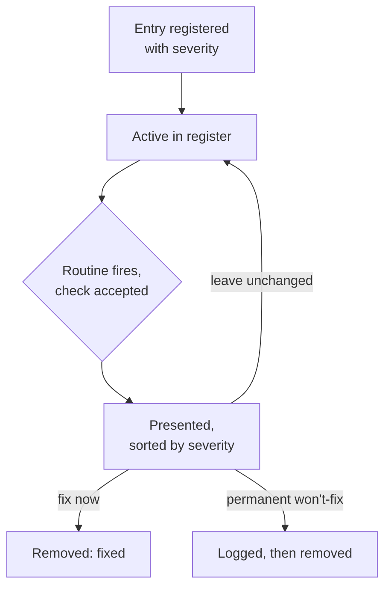

# Known-Limitation Revisit Register - Plan

## Goal Capsule

- **Objective:** A consciously-deferred known limitation in this codebase gets surfaced on a schedule for the maintainer to prioritize, instead of sitting indefinitely until a bug forces a re-read.
- **Means:** A central register file of deferred-limitation entries, each carrying a severity, paired with a scheduled Routine that checks in roughly every 30 days and shows the maintainer the active register sorted by severity to act on at their own discretion.
- **Product authority:** the repo's solo maintainer — this is a personal-workflow tooling decision, not a multi-stakeholder product call.
- **Open blockers:** none. All key decisions were settled during scoping dialogue; see Outstanding Questions for items deferred to planning.

## Product Contract

### Summary

A central register records known limitations this codebase's maintainer has consciously decided not to fix right now — not every deferred item, only the ones knowingly chosen to defer. Each entry carries a severity alongside its found date. A scheduled Routine checks in roughly every 30 days, asks permission before proceeding, and when accepted shows the full active register sorted by severity so the maintainer decides what to address on their own priority — nothing is forced.

### Problem Frame

The Waltz OSS report importer shipped with a documented, correctly-flagged known limitation: its schema was validated against a single real export, with no test coverage for drift. That note sat in `docs/report-import.md` untouched until a real user's export broke the parser in production, becoming `docs/solutions/integration-issues/waltz-oss-report-unzip-failure-on-real-world-xlsx.md`. The limitation was known and written down the entire time; nothing ever brought it back into view.

This repo already externalizes deferred-scope signal well in prose — `CLAUDE.md`'s "Known limitation" notes, plan docs' Scope Boundaries sections, `docs/solutions/` Prevention notes — but none of it carries a mechanism that forces a second look. A prose-only "known limitation" with nothing periodically resurfacing it decays into accepted risk nobody actually chose to accept.

### Key Decisions

- **Register only consciously-deferred survivors, not every known limitation.** (session-settled: user-directed — chosen over registering every deferred item, and over a resolve-or-kill-now norm banning open-ended deferrals entirely: most limitations should still be resolved or permanently killed at the moment they're found; only the few genuinely kept open get tracked.) Governs R1, R4.
- **A scheduled Routine is the enforcement mechanism, not CI or `ce-compound-refresh`.** (session-settled: user-directed — `ce-compound-refresh` turned out to be a shared marketplace plugin skill with a hardcoded `docs/solutions/` scope and no repo-specific extension hook, so it cannot be extended from this repo; a CI check was the fallback, rejected in favor of an on-demand-confirmed Routine.) Governs R5.
- **The register is a single central file, not markers inline at each limitation's original text.** (session-settled: user-directed — one place to scan is worth the cost of a second copy of context to keep in sync.) Governs R1.
- **Entries are prioritized by severity, not resolved by an automatic due date.** (session-settled: user-directed — chosen over a revisit-by-date model that forces one of three outcomes on every due entry: the maintainer wants to judge priority fresh at each check-in rather than have the register schedule decisions on a timer. Every active entry is shown at every accepted check-in, sorted by severity, and "leave unchanged" is a first-class outcome alongside fix-now and won't-fix.) Governs R1, R6, R7.
- **Declining the Routine's check-in is a legitimate outcome with no escalation.** (session-settled: user-directed — "not now" is a standing legitimate maintainer call, every time.) Governs R5.
- **The register launches seeded with today's full known-open-item list, not only the items already written as prose.** (session-settled: user-directed — chosen over seeding only the already-documented `CLAUDE.md`/`docs/report-import.md` limitations, so the register launches already covering the complete list this scoping conversation surfaced.) Governs R3.
- **The Routine's stored prompt points at a stable convention doc describing the register, rather than embedding the register's file path and fields directly.** (session-settled: user-directed — chosen over embedding those details in the prompt itself: a later format or path change then only touches the convention doc, never the Routine's own stored prompt.) Governs R5.
- **R3's seed list includes a seventh entry — a denylist-sanitizer-exhaustiveness watch item — surfaced by planning research.** (session-settled: user-directed — chosen over leaving the six items settled during brainstorming: it's a second, independent instance of this register's exact motivating failure pattern already present in this repo's own history, and leaving it out would undercut the register on day one.) Governs R3.
- **A permanent won't-fix decision is logged durably before its entry is removed from the register.** (session-settled: user-directed — chosen over treating the register's git history as the record: a durable log makes the decision and its reason discoverable without archaeology, so a limitation already declined isn't re-registered from scratch later.) Governs R6.
- **One combined file holds the convention notes, the live register, and the won't-fix log — not three separate files.** (session-settled: user-directed — chosen over splitting them: one file for the Routine's prompt to reference, and no risk of the pieces drifting apart.) Governs R1, R5.
- **The Routine's ~30-day cadence runs as a recurring, self-sustaining schedule, not an exact self-rescheduling chain.** (session-settled: user-directed — a recurring schedule keeps firing on its own; a self-rescheduling chain is more precise but a single missed reschedule step would silently end all future check-ins.) Governs R5.

### Requirements

**Register**

- R1. A central register file records every consciously-deferred known limitation as a single entry carrying: the limitation's description or a pointer to where it's documented, the date found, a severity, and the reason it wasn't resolved immediately.
- R2. *(Retired — a fixed revisit-by-date default no longer applies; entries carry severity instead, per the Key Decision above.)*
- R3. At launch, the register is seeded with seven entries: the two existing known-limitation notes in `docs/report-import.md` (the Veracode data-path gap, the Waltz single-fixture schema-drift gap); the four still-open items from the 2026-08-20 technical-debt ideation run — Waltz's parse-timeout lacking real cancellation, no independent-producer sentinel `.xlsx` fixture, no `@jira` token/context budget parity with `@bitbucket`, and the render-safety plan's deferred macro-injection verification; and the denylist-sanitizer-exhaustiveness watch item on `sanitizeCellText()`/`markdownToJiraWiki()` named in `docs/solutions/security-issues/waltz-oss-report-markdown-injection-in-jira-wiki-converter.md`'s Prevention section — a second, independent case of the same decay pattern this register exists to close, surfaced during planning research.
- R4. A new consciously-deferred limitation discovered after launch is added to the register at the time it's identified, with a severity assigned at registration, following a documented convention — the register is a living list, not a one-time snapshot.

**Check-in mechanism**

- R5. A scheduled Routine fires roughly every 30 days. Each firing first asks whether to proceed with a check; declining ends that firing with no further action, and the Routine fires again at its next scheduled interval regardless of how the previous firing was answered. The Routine's stored prompt references a short, stable convention doc describing the register's location and fields rather than embedding them directly, so a later change to either only requires updating that doc.
- R6. When the maintainer accepts a firing's check, the Routine reads the register and presents every active entry sorted by severity, highest first; for each, the maintainer may fix it now and remove it from the register, convert it to a permanent won't-fix — recorded in a durable won't-fix log before removal, so the decision and its reason survive the deletion — or leave it unchanged in the register with no forced decision.
- R7. A firing whose register holds no active entries reports that and ends without prompting further action.

### Actors

- A1. **Maintainer** — the repo's solo owner, who writes register entries with a severity, responds to the Routine's check-in prompt, and decides what to address each time based on priority.
- A2. **Revisit Routine** — the scheduled process that fires roughly every 30 days, asks permission, and shows the active register sorted by severity when accepted.

### Key Flows

- F1. **Routine check-in.**
  - **Trigger:** The Routine's ~30-day schedule fires.
  - **Actors:** A2, A1.
  - **Steps:** The Routine asks the maintainer whether to check now. On decline, it ends and waits for the next scheduled firing. On accept, it reads the register; if it holds no active entries, it reports that and ends; otherwise it presents every entry sorted by severity and lets the maintainer choose fix-now / won't-fix / leave-unchanged independently for each, before ending.
  - **Covers:** R5, R6, R7.

### Scope Boundaries

- Implementing the five technical items seeded into the register at launch (Waltz parse-timeout cancellation, the sentinel fixture policy, `@jira` token-budget parity, the deferred macro-injection verification, the denylist-sanitizer-exhaustiveness watch item) is out of scope — this plan tracks them as register entries, it does not fix them.
- A CI check, and any change to the shared `ce-compound-refresh` plugin skill, are out of scope.
- Escalating behavior after repeated declines of the Routine's check-in is out of scope.
- Retroactively registering every historical "Scope Boundaries"/"out of scope" note across past plan docs is out of scope — only the items named in R3 are seeded at launch; anything else enters later through R4's ongoing convention.

### Acceptance Examples

- AE1. **Covers R5, R7.** Given the register holds no active entries, when the Routine fires and the maintainer accepts the check, then it reports the register is empty and ends without further prompts.
- AE2. **Covers R5.** Given the Routine fires, when the maintainer declines the check, then no entries are read or presented, and the Routine still fires again at its next scheduled interval.
- AE3. **Covers R6.** Given the register holds at least one active entry, when the maintainer accepts a firing's check, then the Routine presents every entry sorted by severity and lets the maintainer choose fix-now, won't-fix, or leave-unchanged independently for each, with no entry forced to a decision.
- AE4. **Covers R1, R3.** Given the register is freshly created, when it is seeded, then it contains exactly seven entries — the two existing `docs/report-import.md` known limitations, the four still-open ideation items, and the sanitizer-exhaustiveness watch item, all named in R3 — each with a description or pointer, a found date, a severity, and a deferral reason.

### Dependencies / Assumptions

- Assumes severity uses a small fixed scale (e.g. High / Medium / Low); the exact levels and how they're assigned are decided during planning.
- Assumes the combined file's internal structure (table columns, section layout) is decided during planning — this plan states required fields, not layout.
- Assumes the Routine reads the register file fresh on each firing rather than needing its contents embedded in the Routine definition itself.
- Assumes the ~30-day cadence runs as a recurring, monthly-ish schedule (see Key Decision above), which may drift a few days depending on the month.

### Outstanding Questions

- **Deferred to Planning:** Exact register file path, its internal layout (table columns/sections), and the severity scale's exact levels.

### Sources / Research

- `docs/ideation/2026-08-20-open-technical-debt-ideation.html` — the prior ideation run this brainstorm re-verified against current code and drew its R3 seed list from.
- `docs/report-import.md:55-58, 76-78` — the two currently-documented "Known limitation" notes seeded at R3.
- `docs/solutions/integration-issues/waltz-oss-report-unzip-failure-on-real-world-xlsx.md` — the concrete failure case in the Problem Frame: a documented-but-unrevisited limitation that reached production.
- `src/utils/waltzReport.ts:220-233` — confirms the parse-timeout item seeded at R3 is still open (`Promise.race`, no real cancellation).
- `scripts/fixtures/build-waltz-report-fixture.mjs` — confirms the sentinel-fixture item seeded at R3 is still open (only fixture generator, same ecosystem as the removed reader).
- `src/participant/jira/contentHandler.ts` compared with `src/participant/BitbucketParticipant.ts`'s `contextBudgetRatio` usage — confirms the `@jira` token-budget-parity item seeded at R3 is still open.
- Commit `5686646` (2026-09-11, `fix(jira): propagate ChatResult from email/report-import dispatch branches`) — confirms the bug in `docs/issues/create_from_email-2026-09-11.md` is already fixed; that issue doc is now stale and worth cleaning up, separately from this plan.
- `docs/solutions/security-issues/waltz-oss-report-markdown-injection-in-jira-wiki-converter.md` and its successor `docs/solutions/security-issues/jira-native-wiki-trigger-neutralization-in-shared-markdown-converter.md` — a second, independent precedent of a predicted-but-unfixed risk decaying into a real vulnerability; source of R3's seventh seed row, added during planning research.

---

**Product Contract preservation:** changed R3, AE4, R6 — planning research (`learnings-researcher`) surfaced a second, independent precedent of this register's motivating failure pattern beyond the Problem Frame's Waltz example; the user confirmed adding it as a seventh seed row rather than leaving R3 at the six items settled during brainstorming. Separately, `spec-flow-analyzer` found that R6's original "convert to won't-fix and remove" gave a permanent decision no durable record, indistinguishable a month later from "never registered"; the user confirmed logging the decision before removal rather than treating deletion itself as the record. Further changed: during Phase 5.1.5 scoping-synthesis dialogue, the user redirected the core check-in mechanism from an automatic revisit-by-date model (R2, and the original R6/R7) to severity-based entries with manual, priority-driven check-ins — no date drives what surfaces, every active entry is shown at every accepted firing sorted by severity, and "leave unchanged" is a first-class outcome alongside fix-now and won't-fix. R2 is retired; R1, R6, R7, Key Decisions, Actors, Key Flows, Acceptance Examples, and Dependencies were rewritten to match.
