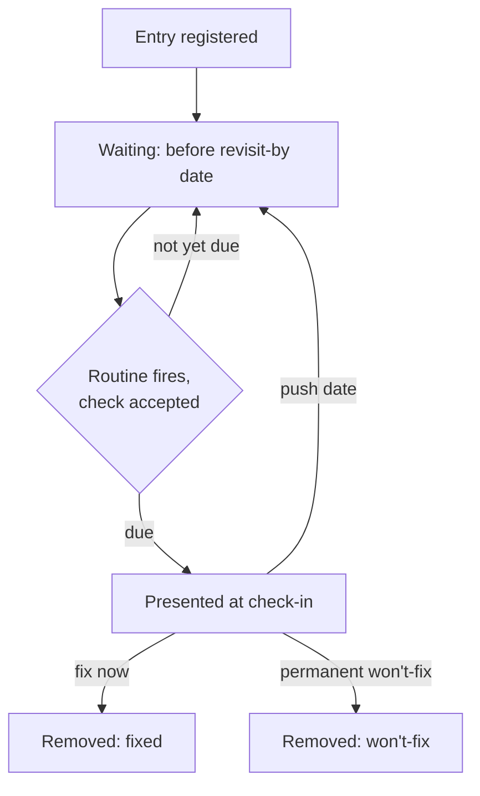

# Known-Limitation Revisit Register - Plan

## Goal Capsule

- **Objective:** A consciously-deferred known limitation in this codebase gets a scheduled, on-demand-confirmed chance to be revisited, instead of sitting indefinitely until a bug forces a re-read.
- **Means:** A central register file of deferred-limitation entries, paired with a scheduled Routine that checks in every 30 days and walks the maintainer through any due entries.
- **Product authority:** the repo's solo maintainer — this is a personal-workflow tooling decision, not a multi-stakeholder product call.
- **Open blockers:** none. All key decisions were settled during scoping dialogue; see Outstanding Questions for items deferred to planning.

## Product Contract

### Summary

A central register records known limitations this codebase's maintainer has consciously decided not to fix right now — not every deferred item, only the ones knowingly chosen to defer. Each entry carries a default revisit-by date. A scheduled Routine checks in every 30 days, asks permission before proceeding, and when due entries exist, walks through each one until the maintainer picks fix-now, push-the-date, or a permanent won't-fix.

### Problem Frame

The Waltz OSS report importer shipped with a documented, correctly-flagged known limitation: its schema was validated against a single real export, with no test coverage for drift. That note sat in `docs/report-import.md` untouched until a real user's export broke the parser in production, becoming `docs/solutions/integration-issues/waltz-oss-report-unzip-failure-on-real-world-xlsx.md`. The limitation was known and written down the entire time; nothing ever brought it back into view.

This repo already externalizes deferred-scope signal well in prose — `CLAUDE.md`'s "Known limitation" notes, plan docs' Scope Boundaries sections, `docs/solutions/` Prevention notes — but none of it carries a mechanism that forces a second look. A prose-only "known limitation" with no revisit trigger decays into accepted risk nobody actually chose to accept.

### Key Decisions

- **Register only consciously-deferred survivors, not every known limitation.** (session-settled: user-directed — chosen over registering every deferred item, and over a resolve-or-kill-now norm banning open-ended deferrals entirely: most limitations should still be resolved or permanently killed at the moment they're found; only the few genuinely kept open get tracked.) Governs R1, R2, R4.
- **A scheduled Routine is the enforcement mechanism, not CI or `ce-compound-refresh`.** (session-settled: user-directed — `ce-compound-refresh` turned out to be a shared marketplace plugin skill with a hardcoded `docs/solutions/` scope and no repo-specific extension hook, so it cannot be extended from this repo; a CI check was the fallback, rejected in favor of an on-demand-confirmed Routine.) Governs R5.
- **The register is a single central file, not markers inline at each limitation's original text.** (session-settled: user-directed — one place to scan is worth the cost of a second copy of context to keep in sync.) Governs R1.
- **A due entry forces one of three explicit outcomes, not a passive list.** (session-settled: user-directed — a due entry must resolve to fix-now, a pushed date, or a permanent won't-fix before the check-in ends.) Governs R6.
- **Declining the Routine's check-in is a legitimate outcome with no escalation.** (session-settled: user-directed — "not now" is a standing legitimate maintainer call, every time.) Governs R5.
- **Revisit-by date defaults to a fixed interval per entry, not a per-item judgment call.** (session-settled: user-directed — simple and predictable, no case-by-case decision needed at write time.) Governs R2. The exact interval was not confirmed by the user; see Assumptions.
- **The register launches seeded with today's full known-open-item list, not only the items already written as prose.** (session-settled: user-directed — chosen over seeding only the already-documented `CLAUDE.md`/`docs/report-import.md` limitations, so the register launches already covering the complete list this scoping conversation surfaced.) Governs R3.
- **The Routine's stored prompt points at a stable convention doc describing the register, rather than embedding the register's file path and fields directly.** (session-settled: user-directed — chosen over embedding those details in the prompt itself: a later format or path change then only touches the convention doc, never the Routine's own stored prompt.) Governs R5.
- **R3's seed list includes a seventh entry — a denylist-sanitizer-exhaustiveness watch item — surfaced by planning research.** (session-settled: user-directed — chosen over leaving the six items settled during brainstorming: it's a second, independent instance of this register's exact motivating failure pattern already present in this repo's own history, and leaving it out would undercut the register on day one.) Governs R3.
- **A permanent won't-fix decision is logged durably before its entry is removed from the register.** (session-settled: user-directed — chosen over treating the register's git history as the record: a durable log makes the decision and its reason discoverable without archaeology, so a limitation already declined isn't re-registered from scratch later.) Governs R6.

### Requirements

**Register**

- R1. A central register file records every consciously-deferred known limitation as a single entry carrying: the limitation's description or a pointer to where it's documented, the date registered, a revisit-by date, and the reason it wasn't resolved immediately.
- R2. A new entry's revisit-by date defaults to a fixed interval from its registration date (see Assumptions) unless explicitly overridden at write time.
- R3. At launch, the register is seeded with seven entries: the two existing known-limitation notes in `docs/report-import.md` (the Veracode data-path gap, the Waltz single-fixture schema-drift gap); the four still-open items from the 2026-08-20 technical-debt ideation run — Waltz's parse-timeout lacking real cancellation, no independent-producer sentinel `.xlsx` fixture, no `@jira` token/context budget parity with `@bitbucket`, and the render-safety plan's deferred macro-injection verification; and the denylist-sanitizer-exhaustiveness watch item on `sanitizeCellText()`/`markdownToJiraWiki()` named in `docs/solutions/security-issues/waltz-oss-report-markdown-injection-in-jira-wiki-converter.md`'s Prevention section — a second, independent case of the same decay pattern this register exists to close, surfaced during planning research.
- R4. A new consciously-deferred limitation discovered after launch is added to the register at the time it's identified, following a documented convention — the register is a living list, not a one-time snapshot.

**Revisit mechanism**

- R5. A scheduled Routine fires every 30 days. Each firing first asks whether to proceed with a check; declining ends that firing with no further action, and the Routine fires again at its next scheduled interval regardless of how the previous firing was answered. The Routine's stored prompt references a short, stable convention doc describing the register's location and fields rather than embedding them directly, so a later change to either only requires updating that doc.
- R6. When the maintainer accepts a firing's check, the Routine reads the register and, for every entry whose revisit-by date has passed, presents it and requires exactly one of: mark it fixed and remove it from the register, push its revisit-by date out with a new reason, or convert it to a permanent won't-fix — recorded in a durable won't-fix log before the entry is removed from the register, so the decision and its reason survive the deletion.
- R7. A firing that finds no due entries reports that and ends without prompting further action.

### Actors

- A1. **Maintainer** — the repo's solo owner, who writes register entries, responds to the Routine's check-in prompt, and resolves due entries.
- A2. **Revisit Routine** — the scheduled process that fires every 30 days, asks permission, and walks through due entries when accepted.

### Key Flows

- F1. **Routine check-in.**
  - **Trigger:** The Routine's 30-day schedule fires.
  - **Actors:** A2, A1.
  - **Steps:** The Routine asks the maintainer whether to check now. On decline, it ends and waits for the next scheduled firing. On accept, it reads the register; if no entries are due, it reports that and ends; if entries are due, it presents each in turn and waits for a fix-now / push-date / won't-fix decision before ending.
  - **Covers:** R5, R6, R7.

### Scope Boundaries

- Implementing the five technical items seeded into the register at launch (Waltz parse-timeout cancellation, the sentinel fixture policy, `@jira` token-budget parity, the deferred macro-injection verification, the denylist-sanitizer-exhaustiveness watch item) is out of scope — this plan tracks them as register entries, it does not fix them.
- A CI check, and any change to the shared `ce-compound-refresh` plugin skill, are out of scope.
- Escalating behavior after repeated declines of the Routine's check-in is out of scope.
- Retroactively registering every historical "Scope Boundaries"/"out of scope" note across past plan docs is out of scope — only the items named in R3 are seeded at launch; anything else enters later through R4's ongoing convention.

### Acceptance Examples

- AE1. **Covers R5, R7.** Given the register has no entries whose revisit-by date has passed, when the Routine fires and the maintainer accepts the check, then it reports no due entries and ends without further prompts.
- AE2. **Covers R5.** Given the Routine fires, when the maintainer declines the check, then no entries are read or presented, and the Routine still fires again at its next 30-day interval.
- AE3. **Covers R6.** Given one register entry's revisit-by date has passed, when the maintainer accepts a firing's check, then the Routine presents that entry and does not end the check-in until the maintainer has chosen fix-now, a pushed date, or a permanent won't-fix for it.
- AE4. **Covers R1, R3.** Given the register is freshly created, when it is seeded, then it contains exactly seven entries — the two existing `docs/report-import.md` known limitations, the four still-open ideation items, and the sanitizer-exhaustiveness watch item, all named in R3 — each with a description or pointer, a registration date, a revisit-by date, and a deferral reason.

### Dependencies / Assumptions

- Assumes a default revisit-by interval of 90 days per entry. This exact number was not confirmed by the user during dialogue; treat it as adjustable during planning, not fixed.
- Assumes the register file's storage shape (e.g. a Markdown table vs. a YAML list) and exact field set beyond those named in R1 are decided during planning — this plan states required fields, not file format.
- Assumes the Routine reads the register file fresh on each firing rather than needing its contents embedded in the Routine definition itself.

### Outstanding Questions

- **Deferred to Planning:** Exact register file format, its repo-relative path, and the repo-relative path of the convention doc the Routine's prompt references.
- **Deferred to Planning:** Exact default revisit-by interval (90 days assumed above) — confirm or adjust.

### Sources / Research

- `docs/ideation/2026-08-20-open-technical-debt-ideation.html` — the prior ideation run this brainstorm re-verified against current code and drew its R3 seed list from.
- `docs/report-import.md:55-58, 76-78` — the two currently-documented "Known limitation" notes seeded at R3.
- `docs/solutions/integration-issues/waltz-oss-report-unzip-failure-on-real-world-xlsx.md` — the concrete failure case in the Problem Frame: a documented-but-unrevisited limitation that reached production.
- `src/utils/waltzReport.ts:220-233` — confirms the parse-timeout item seeded at R3 is still open (`Promise.race`, no real cancellation).
- `scripts/fixtures/build-waltz-report-fixture.mjs` — confirms the sentinel-fixture item seeded at R3 is still open (only fixture generator, same ecosystem as the removed reader).
- `src/participant/jira/contentHandler.ts` compared with `src/participant/BitbucketParticipant.ts`'s `contextBudgetRatio` usage — confirms the `@jira` token-budget-parity item seeded at R3 is still open.
- Commit `5686646` (2026-09-11, `fix(jira): propagate ChatResult from email/report-import dispatch branches`) — confirms the bug in `docs/issues/create_from_email-2026-09-11.md` is already fixed; that issue doc is now stale and worth cleaning up, separately from this plan.
- `docs/solutions/security-issues/waltz-oss-report-markdown-injection-in-jira-wiki-converter.md` and its successor `docs/solutions/security-issues/jira-native-wiki-trigger-neutralization-in-shared-markdown-converter.md` — a second, independent precedent of a predicted-but-unfixed risk decaying into a real vulnerability; source of R3's seventh seed row, added during planning research.

---

**Product Contract preservation:** changed R3, AE4, R6 — planning research (`learnings-researcher`) surfaced a second, independent precedent of this register's motivating failure pattern beyond the Problem Frame's Waltz example; the user confirmed adding it as a seventh seed row rather than leaving R3 at the six items settled during brainstorming. Separately, `spec-flow-analyzer` found that R6's original "convert to won't-fix and remove" gave a permanent decision no durable record, indistinguishable a month later from "never registered"; the user confirmed logging the decision before removal rather than treating deletion itself as the record.
