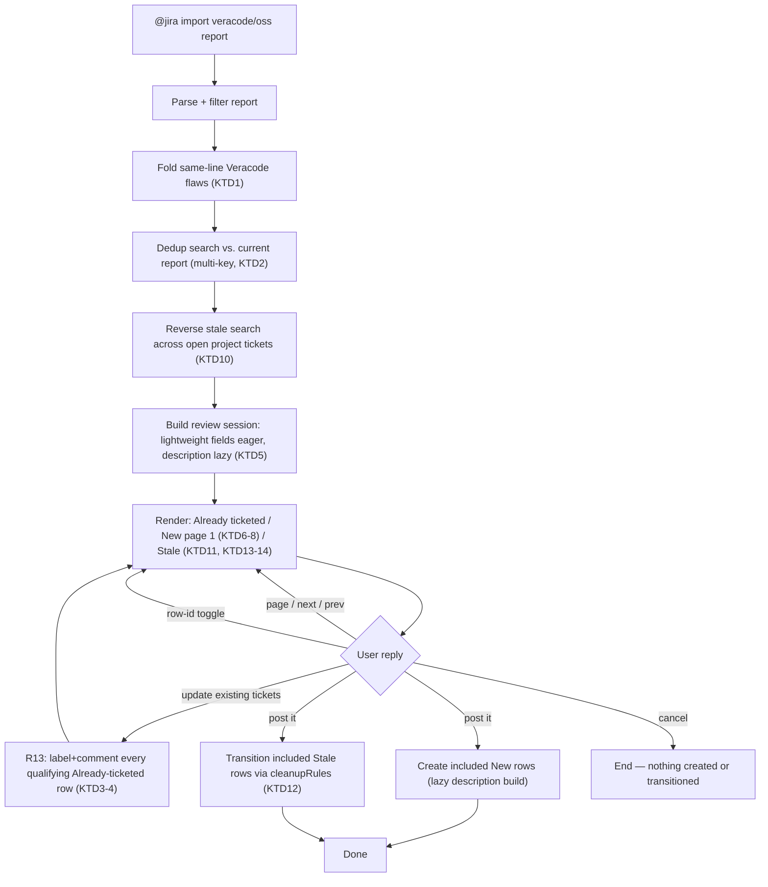

# Veracode Fold, Page & Stale Check - Plan

## Goal Capsule

- **Objective:** A support engineer running the Veracode (and Waltz) import can create one ticket per vulnerable line instead of one per flaw, browse and choose which batch of new candidates to create tickets from, and see — and close — open tickets whose findings have disappeared or been remediated, all without leaving the `@jira` chat flow.
- **Product authority:** `ce-brainstorm` dialogue plus `ce-plan` Phase 5.1.5 clarifications, this session.
- **Execution profile:** Standard code change to an existing VS Code extension; no migration, no new external dependency, no human approval gate beyond normal code review.
- **Who finishes:** `ce-work` or a human implementer, working Implementation Units U1-U7 below in order.
- **Stop conditions:** none currently blocking — see Dependencies / Assumptions for the one runtime precondition (a configured `cleanupRules` entry) that limits what R4/R13 can do per-project, not whether the work can be built.
- **Open blockers:** none.

---

## Product Contract

**Product Contract preservation:** changed: R13, its Key Decision, AE3, AE4, Scope Boundaries — Phase 5.1.5 planning clarification changed R13 from an automatic write on every import to a user-triggered "update existing tickets" reply on the review screen (added as Key Flow F3), so cancelling never leaves a stray write and no Jira write in this flow happens without an explicit user action. R1-R12 unchanged in ID and intent.

### Summary

The shared Veracode/Waltz report-import flow (`reportImportHandler.ts`) gains three related capabilities. Same-line Veracode findings fold into one review row and one ticket instead of one per flaw. The "New — will create" section of the review screen becomes pageable, so a user can browse to and confirm any page of new candidates without first creating the ones before it. Every import run also flags open tickets whose findings have vanished from the scan or been remediated, letting the user select and close them inline through the existing bulk-transition mechanism. Paging and the stale-ticket check extend to the Waltz OSS import; folding stays Veracode-only.

### Requirements

**Stale-ticket detection (Veracode + Waltz)**

- R1. On every Veracode import run, after the report is parsed, the flow searches the target project for open (`resolution is EMPTY`) tickets carrying the `veracode` label and compares each one's `veracode-issue-<id>` labels against the current report's flaws.
- R2. A ticket is flagged stale when every `veracode-issue-<id>` label it carries corresponds to a finding that is either absent from the raw parsed report or present but no longer matching `ticketSidekick.veracode.includeRemediationStatuses`. A single-label ticket is the one-finding case of this same rule; a multi-label (folded, see R9-R11) ticket needs all its findings gone.
- R3. Flagged tickets render in their own review section, one reply-driven toggle per ticket (the same "Include?" pattern as the new/already-ticketed rows), defaulting to unselected so nothing transitions without an explicit choice.
- R4. On confirm, selected stale tickets transition through the same `cleanupRules`-driven mechanism `@jira cleanup` already uses: match a rule by project + issue type, resolve the transition path, and prompt for resolution exactly as the existing cleanup flow does.
- R5. The same stale check runs during the Waltz OSS import: an open ticket carrying the `oss-dependency` label is flagged stale when its component is either absent from the current Waltz report or present but no longer matching `ticketSidekick.waltz.includeRemediationActions`.

**Pageable review screen (Veracode + Waltz)**

- R6. The "New — will create" section becomes navigable in pages of up to `BATCH_LIMIT` (50) rows; the user can move to the next, previous, or a specific page number without leaving the session.
- R7. Each page defaults every one of its rows to included; navigating away does not preserve toggles made on a page the user has left — confirming from whichever page is currently visible creates that page's included rows.
- R8. Paging applies to both the Veracode and Waltz review screens' "New" section. The "Already ticketed" section is unaffected — shown in full, as today.

**Same-line finding folding (Veracode only)**

- R9. Veracode flaws sharing the same source file and line number fold into a single review row and, on creation, a single ticket — regardless of CWE or category — instead of one row/ticket per flaw.
- R10. A folded ticket's description covers every folded flaw (severity, CWE, description, recommendation per flaw), and its labels include one `veracode-issue-<id>` per folded flaw plus one `cwe-<id>` per distinct CWE among them.
- R11. A folded line is treated as already-ticketed in dedup search as soon as any one of its flaws' `veracode-issue-<id>` labels matches an existing open ticket; it is not recreated, and the review screen shows the matched ticket the same way a single-flaw match does today.
- R12. A flaw missing a source file or line number is never folded with another flaw — it stays its own row/ticket, regardless of whether other flaws also lack a location.
- R13. The review screen offers a reply option ("update existing tickets") that, in one action, adds the new flaw's `veracode-issue-<id>` label and a summarizing comment (severity, CWE, description) to every already-ticketed row that has a finding not yet reflected on its ticket (the R11 already-ticketed case) — applied to all qualifying rows at once, with no per-row selection. Skipped per-row when that label is already present, so running it again never reposts the same comment.

### Key Decisions

- **A folded line is dedup'd and staled as one unit** — already-ticketed as soon as any of its findings has an existing ticket; not flagged stale until every finding at that line is gone. (session-settled: user-approved — chosen over per-finding dedup/staleness, which could open a duplicate ticket for a line still covered by an existing one.) Governs R2, R11.
- **Paging resets inclusion per page** rather than tracking a selection across the whole scan — confirming from whichever page is visible creates that page. (session-settled: user-approved — chosen over persistent cross-page selection state, which would allow mixing rows from different pages into one confirm at the cost of extra session-state complexity the "pick a page to create from" ask doesn't need.) Governs R7.
- **Stale-ticket transitions reuse the existing `cleanupRules` mechanism** instead of a new dedicated setting, so target status and resolution are configured in one place for both this flow and `@jira cleanup`. (session-settled: user-approved — chosen over a new `ticketSidekick.veracode` setting.) Governs R4.
- **"No longer on the scan" covers both outright absence and a remediation status the importer's filter now excludes**, not absence alone. (session-settled: user-approved.) Governs R2, R5.
- **The stale check runs automatically inside the existing import flow**, not as a separate command — the report is already parsed for ticket creation, so the same pass covers reconciliation. (session-settled: user-approved — chosen over a standalone audit command.) Governs R1, R5.
- **Stale tickets support inline selection and transition**, not just a list of links. (session-settled: user-directed — chosen over list-and-links-only: closing a ticket shouldn't require leaving chat.) Governs R3, R4.
- **Paging and stale-detection extend to the Waltz import; folding stays Veracode-only.** (session-settled: user-directed — chosen over scoping all three to Veracode only: the review/dedup machinery behind paging and staleness is already shared, and Waltz already creates one ticket per component, so there's no same-line case to fold.) Governs R5, R8, R9.
- **R13's ticket update is a user-triggered bulk reply, not an automatic write** — a single "update existing tickets" reply on the review screen applies the label+comment to every qualifying already-ticketed row at once, rather than firing on every import run or requiring a per-row toggle. (session-settled: user-directed — chosen over firing automatically during the import: keeps every Jira write in this flow behind an explicit user action, and over manual per-ticket follow-up: still applies to every qualifying row in one action.) Governs R13.

### Key Flows

- F1. **Import run, end to end.**
  - **Trigger:** user runs `@jira import veracode report` (or resumes an in-progress session).
  - **Steps:** parse + filter the report → dedup search against the current flaws (existing behavior) → reverse stale search across the project's open tickets (R1) → build review rows, folding same-line flaws (R9) → render three sections in order — Already ticketed, New (page 1 of R6-R7), Stale (R3) — then wait for the user to page, toggle, confirm, or reply "update existing tickets" (R13).
  - **Outcome:** included New rows create tickets; included Stale rows transition; "update existing tickets" applies R13's label+comment update to every qualifying Already-ticketed row, independent of the other two outcomes.
  - **Covered by:** R1, R3, R6, R9, R13.
- F2. **Paging the New section.**
  - **Trigger:** the user replies with a page-navigation command while a review session is active.
  - **Steps:** the session holds the full "new" row set (no longer pre-capped, unlike today) → the requested page's rows render, each defaulting to included → a toggle the user makes applies only to the currently visible page.
  - **Outcome:** confirming from that page creates its rows; a page the user has left keeps no toggle state.
  - **Covered by:** R6, R7.
- F3. **Bulk-updating already-ticketed rows.**
  - **Trigger:** the user replies "update existing tickets" on the review screen, any time it is showing (independent of the current page or of whether New/Stale rows are toggled).
  - **Steps:** every Already-ticketed row with a finding not yet reflected on its ticket is walked once → each gets its missing `veracode-issue-<id>` label added and a summarizing comment posted, skipped when the label is already present.
  - **Outcome:** every qualifying ticket is updated in one action; the reply does not create tickets or transition stale ones — those still need their own toggle-and-confirm.
  - **Covered by:** R13.

### Acceptance Examples

- AE1. **Covers R2.** Given a ticket labeled `veracode-issue-1001` and the current report's flaw 1001 now has a `remediationStatus` outside `includeRemediationStatuses` (e.g. "Fixed") — When the import runs — Then the ticket is flagged stale even though flaw 1001 still appears in the raw XML.
- AE2. **Covers R2, R11.** Given a folded ticket labeled `veracode-issue-2001` and `veracode-issue-2002` (same file+line) and the new report still contains flaw 2002 as active — When the import runs — Then the ticket is *not* flagged stale, because at least one finding it covers is still active.
- AE3. **Covers R11, R13.** Given flaw 3001 already has a ticket, and a new flaw 3002 appears on the same file+line as 3001 in this scan — When the import runs — Then that line's row shows in "Already ticketed" (not recreated) and 3002 is not separately ticketed; the ticket's label/comment are unchanged until the user replies "update existing tickets".
- AE4. **Covers R13.** Given the row from AE3 and the user replies "update existing tickets" — When that reply is processed, and again on a later run where flaw 3002 is unchanged and the update already ran once — Then the first run adds a `veracode-issue-3002` label and a comment describing flaw 3002; the later run posts no duplicate comment and leaves the label as-is.
- AE5. **Covers R7.** Given the user is viewing page 2 of the New section with three rows toggled off — When the user pages to page 3 and replies "post it" — Then only page 3's rows (all included by default) are created; page 2's toggles have no effect.
- AE6. **Covers R9, R12.** Given two flaws share a source file and line, and a third flaw has no source file — When review rows are built — Then the two same-line flaws fold into one row/ticket, and the flaw with no location stays its own separate row/ticket.

### Scope Boundaries

- Folding does not extend to Waltz — a Waltz ticket already covers a whole component, so there is no same-line case.
- Stale-ticket transitions never happen automatically; a ticket transitions only after the user explicitly selects it and confirms.
- R13's ticket update never happens automatically either; it requires the explicit "update existing tickets" reply, same as stale-ticket transitions.
- No new setting is added for the stale-ticket target status — `cleanupRules` in `.jira-templates.json` is the sole source, same as `@jira cleanup`.

### Dependencies / Assumptions

- Assumes `ticketSidekick.waltz.includeRemediationActions` plays the same per-item filter role for Waltz that `ticketSidekick.veracode.includeRemediationStatuses` plays for Veracode (`filterComponents()`, `src/utils/waltzReport.ts:307-312`) — R5 reuses it as the "filtered-out" half of the Waltz stale rule.
- Assumes the existing marker labels are sufficient to scope the reverse ticket search without a new label: `veracode` on every Veracode-created ticket (`buildLabels()`, `src/utils/veracodeReport.ts:242-246`) and `oss-dependency` on every Waltz-created ticket (`buildLabels()`, `src/utils/waltzReport.ts:346-347`).
- Assumes a cleanup rule (project + issue type) exists for a project where the stale check is meant to offer transitions — same precondition `@jira cleanup` already has; where none is configured, R4's transition step has nothing to run against for that project (a planning-time detail, not a new product behavior).

### Sources / Research

- `src/utils/reportImport.ts` — shared `findAlreadyTicketed`, `capNewRows`, `buildReviewRows`, `BATCH_LIMIT` (50) (`src/utils/reportImport.ts:19`).
- `src/participant/jira/reportImportHandler.ts` — shared session flow all three importers drive through `ReportImportDescriptor`; `capNewRows` currently caps "new" rows *before* the review session is built (`src/participant/jira/reportImportHandler.ts:402-416`), which R6-R7 changes to a pageable session instead.
- `src/utils/veracodeReport.ts` — `parseVeracodeReport`, `buildLabels` (`:242-246`), `VeracodeReviewRow` shape; flaws carry `sourceFile`/`sourceFilePath`/`line`, each nullable (`:16-18`).
- `src/utils/waltzReport.ts` — `filterComponents`/`WaltzFilterOptions` (`:295-312`), `buildLabels` (`:346-347`).
- `src/participant/jira/cleanupHandler.ts` — rule matching (`:104-108`, `(project, issueType)` lookup with no rule name), `TransitionBatchTicket`/`TransitionBatchSession` shape (`src/participant/sessionState.ts:91-100`), the resolution-prompt detour (`:225-246`), and `executeCleanupBatch()` (`:36-90`) are the exact mechanism R4 reuses; `resolution is EMPTY` is the project's existing convention for "open" (`:128`). Note `TransitionBatchTicket.included` defaults `true` there (`:186`) while R3 needs stale rows to default unselected — R4's construction must pass `included: false`, a deliberate divergence from cleanup's own default.
- `docs/report-import.md` — current Veracode/Waltz/email import flow description; update alongside this work per CLAUDE.md's "Where documentation belongs."
- `src/services/TicketService.ts` — `addComment()` (`:403-404`), `updateField()`/`client.updateIssue()` (`:413-445`), and `getIssue()` (label read before merge) already exist; `updateField('labels', …)` *replaces* the array rather than appending, and `buildArrayValue()` (`:648-690`) wraps items as `{name}`/`{value}` objects that would corrupt a plain-string `labels` field — neither is safe to call directly for R13's add.
- `src/test/reportImportHandler.test.ts`, `src/test/reportImport.test.ts`, `src/test/cleanupHandler.test.ts`, `src/test/veracodeReport.test.ts` — existing test conventions (generic test descriptor, pure-function `describe`-per-export, `TransitionBatchSession` fixtures) each new unit's tests should follow rather than inventing a new shape.

---

## Planning Contract

### Key Technical Decisions

- KTD1. **Folding happens on the Veracode side of the shared pipeline** — `VeracodeFlaw[]` groups into folded items in `veracodeReport.ts`/`veracodeHandler.ts` before dedup/build ever runs, so `reportImport.ts`'s generic `capNewRows`/`buildReviewRows` need no folding-awareness of their own. Governs R9, R12.
- KTD2. **A folded group's dedup search and lookup are both multi-key** — the descriptor's `searchLabelOf`/`dedupKeyOf` return every member flaw's label for a group, not one, and a match on any of them counts as already-ticketed; Waltz's existing single-label usage is unaffected (it returns a one-element list). Governs R11.
- KTD3. **"Update existing tickets" is a distinct reply keyword**, parsed alongside "post it"/"cancel"/a toggle list/a page command, that walks every Already-ticketed row shown that run with a finding not yet reflected on its ticket and applies R13's label+comment update to each — independent of, and not requiring, a "post it" confirm on the New/Stale sections. (session-settled: user-directed — instantiates the Product Contract's R13 Key Decision as a review-screen reply option, chosen over a separate `@jira` command decoupled from any particular import run.) Governs R13.
- KTD4. **R13's label update is read-merge-write**: fetch the ticket's current labels, append the missing `veracode-issue-<id>` if absent, then write the full merged array — per the Sources note above, neither a bare `updateField('labels', …)` call nor `buildArrayValue()` is safe for an additive change to a plain-string field. Governs R13.
- KTD5. **Lightweight row fields build eagerly for every "new" candidate; the full ticket description builds lazily**, only for a row the user actually confirms into creation — avoids a full Markdown-to-wiki conversion for candidates that may never be paged to. (session-settled: user-approved — chosen over building every description eagerly: avoids wasted work on a large report where most candidates are never paged to or created.) Governs R6, R7.
- KTD6. **Page-navigation replies use an unambiguous keyword syntax** (`page <n>`, `next`/`next page`, `prev`/`previous page`) that never overlaps a bare numeric row-id toggle; a bare number always resolves as today's toggle, so an off-page row stays toggleable by number without paging to it. Governs R6.
- KTD7. **`session.rows` keeps meaning "the visible page's rows"** so `executeImportBatch`'s existing included-filter-then-slice logic needs no rewrite; a separate field holds the full uncapped candidate set plus the current page index for navigation. Governs R6, R7.
- KTD8. **The "N more matched, re-run" message is replaced by page-position wording** ("Page X of Y") once paging exists; the per-confirm `BATCH_LIMIT`-tickets-per-run cap and its message are unchanged — a different concern (how many of the visible page's included rows get created this run). Governs R6.
- KTD9. **`CURRENT_SESSION_SCHEMA_VERSION` is bumped** so an in-flight, pre-upgrade review session expires cleanly via the existing `isSessionExpired` mechanism instead of rendering with fields it predates. Governs R6, R9.
- KTD10. **The reverse stale-ticket search is scoped to the current import's project**, chunked and JQL-built the same way as the existing dedup search (`chunkStrings`/`buildDedupJql`) over the importer's marker label (`veracode` / `oss-dependency`) with `resolution is EMPTY`, and fault-tolerant per chunk like `findAlreadyTicketed`. Governs R1, R5.
- KTD11. **Stale tickets render as a third, structurally separate review section**, shaped like `cleanupHandler.ts`'s `TransitionBatchTicket` rather than `ReviewRowBase`, toggled by full ticket-key tokens — a vocabulary that never collides with the New/Already-ticketed sections' `"1".."N"`/`"A1".."Am"` row-id tokens. Governs R3.
- KTD12. **One "post it" reply drives both ticket creation and stale-ticket transition** — the review session carries an optional stale-tickets list alongside its rows, and on confirm the handler runs the existing creation batch, then a transition pass reusing `cleanupHandler.ts`'s per-ticket transition-path/resolution logic rather than re-implementing it. (session-settled: user-approved — chosen over a separate confirm step for stale-ticket transitions: simpler for the user, review everything once, reply once.) Governs R3, R4.
- KTD13. **A stale ticket with no matching `cleanupRules` entry is still shown**, excluded-by-default with a note, rather than omitted — the finding really is gone, so hiding it would undercut R1's purpose — but it is not offered as a toggle, since there is no transition path to run. (session-settled: user-approved — chosen over hiding it entirely: transparency about a finding that's genuinely gone, even when nothing can close it from here yet.) Governs R4.
- KTD14. **Stale tickets are grouped by issue type within the project**, mirroring `cleanupHandler.ts`'s one-rule-per-request assumption; a resolution prompt, when a matched rule needs one, runs once per distinct group before the merged review screen renders, not once per ticket. Governs R4.

### High-Level Technical Design

**Session shape change** (`ReviewSession<TRow>`, `src/participant/sessionState.ts:1271-1282`):

| Field | Today | After this plan |
|---|---|---|
| `rows` | every "new" candidate up to `BATCH_LIMIT`, pre-capped | the *visible page's* rows only (KTD7) |
| `totalNewMatched` | count beyond the cap, drives "N more, re-run" | superseded by page position (KTD8) |
| *(new)* `allNewCandidates` / page index | — | full uncapped candidate list + current page (KTD5, KTD7) |
| *(new)* `staleTickets` | — | optional `TransitionBatchTicket[]` for the Stale section (KTD11, KTD12) |
| `VeracodeReviewRow.issueId: string` | one flaw per row | `issueIds: string[]` — one or more folded flaws per row (U1) |

### System-Wide Impact

The reverse stale-ticket search (KTD10) adds project-scoped Jira label search calls to every Veracode/Waltz import run, beyond the dedup search already there — bounded by the same chunking/fault-tolerance pattern, so the added load is proportional to project size, not report size. R13's bulk update adds a get-labels + update-labels + add-comment call per qualifying ticket, but only when the user explicitly triggers it (F3), not on every run.

### Risks & Dependencies

- R13's label update is read-then-write, not atomic (KTD4) — a concurrent edit to the same ticket's labels between the read and the write could be overwritten. Same risk profile as the codebase's existing bulk field-update flow; not a new exposure.
- R4 and R13 both depend on a project having a configured `cleanupRules` entry to offer a transition or, for R13, none — R13 has no such dependency (label/comment writes don't need a workflow rule); only R4 is limited when a rule is missing, per KTD13's excluded-with-note handling.
- Holding the full "new" candidate set in session state (KTD5/KTD7) scales with report size even with lazy descriptions; acceptable at the volumes these reports produce today (per Sources, `MAX_REPORT_BYTES` already bounds the input), revisit if real-world reports grow past the low thousands of matched flaws.

---

## Implementation Units

### U1. Fold same-line Veracode flaws into grouped ticket fields

- **Goal:** Group flaws sharing a source file and line into one set of ticket fields (labels, description, summary) covering every flaw in the group.
- **Requirements:** R9, R10, R12.
- **Dependencies:** none.
- **Files:**
  - `src/utils/veracodeReport.ts` — add a grouping function and group-aware `buildLabels`/`buildDescriptionWiki`/`buildSummary` variants; extend `VeracodeReviewRow` to carry `issueIds: string[]` (or equivalent) instead of a single `issueId`.
  - `src/test/veracodeReport.test.ts` — new test coverage.
- **Approach:**
  1. Add a pure grouping function keyed on `` `${sourceFilePath ?? ''}${sourceFile}:${line}` ``, only applied when both `sourceFile` and `line` are non-null (R12).
  2. Build the group's labels by unioning each flaw's own `buildLabels()` output and deduping (mirrors the existing per-flaw dedup in `buildLabels`).
  3. Build the group's description by combining each flaw's severity/CWE/description/recommendation under its own issue id, hoisting the shared file+line `### Location` once (per KTD1).
  4. Route every combined field through the existing `sanitizeCellText()`/`sanitizeStandaloneLine()` sanitizers before the combined Markdown reaches `markdownToJiraWiki()` — do not hand-build a shortcut string join that bypasses either sanitizer layer (see the wiki-injection precedent in the Sources note below).
- **Patterns to follow:** the existing per-flaw `buildLabels()`/`buildDescriptionWiki()` structure in `src/utils/veracodeReport.ts`; the shared sanitizers already used there.
- **Test scenarios:**
  - Two flaws sharing file+line produce one group with both issue ids in its labels and both flaws' sections in its description.
  - A flaw with `sourceFile: null` or `line: null` never groups with another flaw, even one at an identical line in a different file. Covers AE6.
  - Distinct CWEs across a group each contribute one `cwe-<id>` label; a repeated CWE across group members contributes only one.
  - A group's combined description routes every untrusted field (module, description, recommendation) through the existing sanitizers before conversion — no raw string concatenation bypasses them.
- **Verification:** `veracodeReport.test.ts` covers grouping, label union, and description combination; `npm run compile` passes with the updated `VeracodeReviewRow` shape.

### U2. Multi-key dedup for folded groups

- **Goal:** Let a folded group's dedup search and lookup match on any one of its member flaws' labels.
- **Requirements:** R11.
- **Dependencies:** U1.
- **Files:**
  - `src/utils/reportImport.ts` — extend `buildReviewRows`'s `dedupKeyOf` contract to accept a function returning multiple candidate keys per item.
  - `src/participant/jira/reportImportHandler.ts` — thread the multi-key search labels through to `findAlreadyTicketed`.
  - `src/participant/jira/veracodeHandler.ts` — supply the group-aware `searchLabelOf`/`dedupKeyOf`/`labelToDedupKey`.
  - `src/test/reportImport.test.ts` — new test coverage.
- **Approach:**
  1. `buildReviewRows`'s dedup-map lookup checks every key a group's `dedupKeyOf` returns and treats a match on any of them as already-ticketed (KTD2).
  2. `session.items.map(descriptor.searchLabelOf)` (currently one label per item) flattens across each group's multiple labels before chunking, so every member flaw's label is searched for.
  3. Waltz's descriptor passes a one-element list from its existing single-label functions — no behavior change there.
- **Patterns to follow:** the existing `findAlreadyTicketed`/`buildDedupJql`/`chunkStrings` shape in `src/utils/reportImport.ts`; keep the fault-tolerant-per-chunk behavior unchanged.
- **Test scenarios:**
  - A folded group where only one member flaw's label matches an existing ticket is treated as already-ticketed (not recreated). Covers AE2, AE3.
  - A folded group where no member flaw's label matches is treated as new.
  - Waltz's existing single-label dedup path is unchanged by the contract extension (regression coverage).
- **Verification:** `reportImport.test.ts` covers the multi-key lookup; existing Waltz dedup tests still pass unmodified.

### U3. "Update existing tickets" bulk action

- **Goal:** A single reply on the review screen adds the missing label and a summarizing comment to every Already-ticketed row with a finding not yet reflected on its ticket.
- **Requirements:** R13.
- **Dependencies:** U1, U2 (needs a folded row's multi-issue-id shape to know what "not yet reflected" means).
- **Files:**
  - `src/participant/sessionState.ts` — recognize the "update existing tickets" reply alongside the existing `parseReviewInput` outcomes; render a per-row indicator when a row was updated this way.
  - `src/participant/jira/reportImportHandler.ts` — the execution function: walk qualifying Already-ticketed rows, call `TicketService` per row.
  - `src/services/TicketService.ts` — a small helper (or direct calls to existing `getIssue`/`updateField`/`addComment`) implementing the read-merge-write label update (KTD4).
  - `src/test/sessionState.test.ts`, `src/test/reportImportHandler.test.ts`, `src/test/TicketService.test.ts` — new test coverage.
- **Approach:**
  1. Add a new reply outcome (distinct from `ok`/`cancel`/`toggle`/`setValue`) recognized before falling through to the existing toggle-list parsing.
  2. For each Already-ticketed row whose group has a flaw id not yet in the ticket's labels: read current labels, append the missing id(s), write the merged array, then post the summarizing comment (KTD4). Skip a row entirely once its labels already contain every id its group covers (idempotency, AE4).
  3. Report a per-row/summary count of tickets updated, mirroring the existing per-item progress-line convention in `executeImportBatch`.
- **Patterns to follow:** `executeImportBatch`'s per-item try/catch-and-report loop in `src/participant/jira/reportImportHandler.ts`; the existing `addComment`/`updateField` signatures in `TicketService.ts`.
- **Test scenarios:**
  - A ticket missing one of its group's flaw ids gets that id added to its labels and a comment posted. Covers AE3, AE4.
  - Running the action twice in a row against an unchanged ticket posts no second comment and leaves labels unchanged (idempotency). Covers AE4.
  - A ticket that already has every id its group covers is skipped entirely (no API calls).
  - A per-row failure (e.g. the comment post fails) is reported without aborting the rest of the batch, mirroring `executeImportBatch`'s existing per-row error handling.
  - The reply works regardless of which page of the New section is currently visible, and regardless of New/Stale toggle state.
- **Verification:** unit tests above pass; `npm run compile` passes with the new reply-outcome type.

### U4. Pageable review session for the New section

- **Goal:** The New section holds every matched "new" candidate and can be paged, rather than pre-capping at `BATCH_LIMIT` before the session is built.
- **Requirements:** R6, R7, R8.
- **Dependencies:** none (independent of U1-U3; touches the same session type as U3, so land after or coordinate on merge).
- **Files:**
  - `src/participant/sessionState.ts` — `ReviewSession<TRow>` gains a full-candidate-set field and a page index; `buildImportReviewTable` renders one page plus "Page X of Y"; a page-navigation reply parser sits ahead of `parseReviewInput`.
  - `src/utils/reportImport.ts` — rework or remove the pre-build `capNewRows` cap; keep dedup/`findAlreadyTicketed` untouched (orthogonal to paging, confirmed in research).
  - `src/participant/jira/reportImportHandler.ts` — wire the new session shape through `continueAfterImportIssueType`/`streamImportReview`/`handleImportReviewReply`; bump `CURRENT_SESSION_SCHEMA_VERSION` (KTD9).
  - `src/test/reportImport.test.ts`, `src/test/sessionState.test.ts`, `src/test/reportImportHandler.test.ts` — new/updated test coverage.
- **Approach:**
  1. Build every "new" candidate's lightweight fields (severity, CWE, summary, labels) eagerly; defer the full description build to creation time (KTD5) — see U5's note on where the deferred build call lives for Veracode's folded groups vs. Waltz's single components.
  2. `session.rows` continues to mean "the currently visible page" so `executeImportBatch`'s existing included-filter-then-slice logic is untouched (KTD7); a new field holds the full candidate list and current page index.
  3. Recognize `page <n>` / `next` / `prev` (KTD6) ahead of the existing toggle/ok/cancel parsing; a bare number is always a toggle, never a page jump.
  4. Replace the "N more matched, re-run" message with "Page X of Y" (KTD8); keep the `BATCH_LIMIT`-per-run creation cap message as-is.
  5. Bump `CURRENT_SESSION_SCHEMA_VERSION` so an in-flight pre-upgrade session expires via the existing mechanism (KTD9).
- **Patterns to follow:** the existing `isSessionExpired`/`CURRENT_SESSION_SCHEMA_VERSION` convention; `applyReviewToggle`'s pure-function shape for any new page-slice helper.
- **Test scenarios:**
  - Paging to a page and confirming creates only that page's included rows, discarding any earlier page's toggles. Covers AE5.
  - A bare numeric reply always toggles the matching row id, even when that row is on a different page than the one currently shown.
  - `page 3`/`next`/`prev` navigate correctly at the first, a middle, and the last page, including out-of-range requests.
  - A session stored under the previous schema version renders as expired rather than rendering with missing fields.
  - Waltz's New section pages identically to Veracode's (R8), using the same shared code path.
- **Verification:** unit tests above pass; manual/e2e check that a large candidate set (more than one page) renders and pages correctly in a live chat session.

### U5. Reverse stale-ticket search

- **Goal:** Find open tickets in the current project whose finding(s) are gone from the current report or excluded by the importer's own remediation filter.
- **Requirements:** R1, R2, R5.
- **Dependencies:** none.
- **Files:**
  - `src/utils/reportImport.ts` — a shared, pure function computing which of a set of marker-labeled open tickets are stale, given an "is this finding still active" predicate the caller supplies.
  - `src/participant/jira/veracodeHandler.ts`, `src/participant/jira/waltzHandler.ts` — supply the marker label (`veracode` / `oss-dependency`) and active-finding predicate (R2's absent-or-filtered-out rule, and its Waltz mirror using `includeRemediationActions`).
  - `src/test/reportImport.test.ts` — new test coverage.
- **Approach:**
  1. Search the project (chunked, `resolution is EMPTY` + the marker label) for candidate tickets, reusing `chunkStrings`/`buildDedupJql`'s pattern and `findAlreadyTicketed`'s fault-tolerance-per-chunk shape (KTD10).
  2. For each candidate ticket, extract its `veracode-issue-<id>` (or Waltz dedup-key) labels and check each against the current report via the caller-supplied active-finding predicate; a ticket is stale only when none of its ids are still active (mirrors R11's "any active keeps it non-stale" rule for folded groups).
  3. Veracode's predicate: a flaw id is active if it's present in the raw parsed report with a `remediationStatus` matching `includeRemediationStatuses`. Waltz's predicate: a component is active if present and matching `includeRemediationActions`.
- **Patterns to follow:** `findAlreadyTicketed`'s chunked, fault-tolerant search shape in `src/utils/reportImport.ts` — this is a reverse instance of the same problem shape (project-wide label search vs. per-chunk dedup search), so structure it as a sibling function, not a copy-pasted variant.
- **Test scenarios:**
  - A single-flaw ticket whose flaw id is absent from the raw report is flagged stale.
  - A single-flaw ticket whose flaw id is present but has a `remediationStatus` outside `includeRemediationStatuses` is flagged stale. Covers AE1.
  - A folded (multi-id) ticket with at least one still-active id is not flagged stale, even when its other ids are gone. Covers AE2.
  - A Waltz ticket whose component is present but excluded by `includeRemediationActions` is flagged stale, mirroring the Veracode case.
  - A failed search chunk degrades gracefully (partial results, not a thrown error), matching `findAlreadyTicketed`'s existing behavior.
- **Verification:** `reportImport.test.ts` covers the predicate and search shape for both importers' marker labels.

### U6. Stale-ticket review section and bulk transition

- **Goal:** Stale tickets render in their own review section and transition, on confirm, via the existing `cleanupRules` mechanism.
- **Requirements:** R3, R4.
- **Dependencies:** U5 (needs the stale-ticket list); coordinates with U4 on the shared review session/render additions.
- **Files:**
  - `src/participant/sessionState.ts` — render the Stale section using the `TransitionBatchTicket` shape and ticket-key toggle vocabulary (KTD11); an excluded-with-note row for a ticket with no matching `cleanupRules` entry (KTD13).
  - `src/participant/jira/reportImportHandler.ts` — `ReviewSession<TRow>` gains an optional stale-tickets field; `handleImportReviewReply`'s confirm path runs the existing creation batch then a transition pass.
  - `src/participant/jira/cleanupHandler.ts` — extract the per-ticket transition-path/resolution logic into a form `reportImportHandler.ts` can call, rather than duplicating it.
  - `src/test/reportImportHandler.test.ts`, `src/test/cleanupHandler.test.ts` — new/updated test coverage.
- **Approach:**
  1. Group stale tickets by issue type within the project (KTD14); for each group matching a `cleanupRules` entry that needs a resolution, run the existing resolution-ask once per group before the merged review screen renders.
  2. Build each stale ticket as a `TransitionBatchTicket` with `included: false` by default (R3's unselected-by-default, a deliberate divergence from cleanup's own `included: true` default — see the Sources note above).
  3. A ticket whose project+issue-type has no matching rule renders excluded, with a note, and is not offered as a toggle (KTD13).
  4. On "post it", run the existing ticket-creation batch, then transition every included stale ticket via the extracted per-ticket logic from `cleanupHandler.ts` (KTD12) — reuse, not reimplementation.
- **Patterns to follow:** `cleanupHandler.ts`'s existing rule-matching (`:104-108`), resolution-prompt detour (`:225-246`), and `executeCleanupBatch()` (`:36-90`); `applyTicketToggle`'s toggle-by-key shape.
- **Test scenarios:**
  - A stale ticket toggled included transitions to its rule's target state with its rule's resolution on confirm.
  - A stale ticket left at its default (unselected) does not transition on confirm.
  - A stale ticket with no matching `cleanupRules` entry renders excluded with a note and cannot be toggled in.
  - Two stale tickets under different issue types each get their own resolution-ask, run once per group, not once per ticket.
  - One "post it" reply both creates included New rows and transitions included Stale tickets in the same run.
  - A ticket-key toggle reply (e.g. `PROJ-123`) never collides with a New/Already-ticketed row-id toggle (e.g. `2`, `A1`).
- **Verification:** unit tests above pass; the mixed create+transition confirm path is covered end to end in `reportImportHandler.test.ts`'s generic-descriptor style.

### U7. Documentation updates

- **Goal:** `docs/report-import.md` and `docs/jira-flows.md` describe folding, paging, the stale-ticket check, and the "update existing tickets" action accurately.
- **Requirements:** none directly (documentation for R1-R13).
- **Dependencies:** U1-U6.
- **Files:**
  - `docs/report-import.md` — rewrite the Veracode/Waltz cap-and-resume paragraphs (the "'new' rows are capped… re-run to get them" language becomes stale once paging lands); add sections for same-line folding, the stale-ticket check, and the bulk-update action.
  - `docs/jira-flows.md` — update the session table with any new `workspaceState` keys or session kinds this work introduces.
- **Approach:**
  1. Verify each new fact lands in the doc individually rather than assuming a restructured paragraph "already covers" the new behavior.
  2. Keep the existing per-importer structure (Veracode section, Waltz section) rather than introducing a new document shape.
- **Test expectation:** none — documentation only.
- **Verification:** a fresh read of `docs/report-import.md` end to end contains no sentence describing pre-paging cap-and-resume behavior as current.

---

## Verification Contract

| Command | Applies to | Gate |
|---|---|---|
| `npm run compile` | All units | Must pass — TypeScript type check, run before `npm test` per CLAUDE.md |
| `npm test` | U1-U6 | Must be green — Vitest unit tests for every pure/vscode-free change (`veracodeReport.ts`, `reportImport.ts`, `sessionState.ts`, `TicketService.ts`) |
| `npm run test:e2e` | U3, U4, U6 | Not run in CI; recommended manually for the vscode-dependent reply-routing and multi-section render changes (`reportImportHandler.ts`, `cleanupHandler.ts` wiring), since these are only exercisable through `@vscode/test-electron` |

---

## Definition of Done

- All of U1-U7 implemented; every unit's test scenarios pass.
- `npm run compile && npm test` green.
- `CURRENT_SESSION_SCHEMA_VERSION` bumped (KTD9) so no in-flight session can render with a shape it predates.
- `docs/report-import.md`/`docs/jira-flows.md` updated (U7) — no remaining sentence describes pre-paging behavior as current.
- No dead code remains from any approach explored and abandoned during implementation (e.g., an earlier multi-key-dedup shape superseded by a later one).
