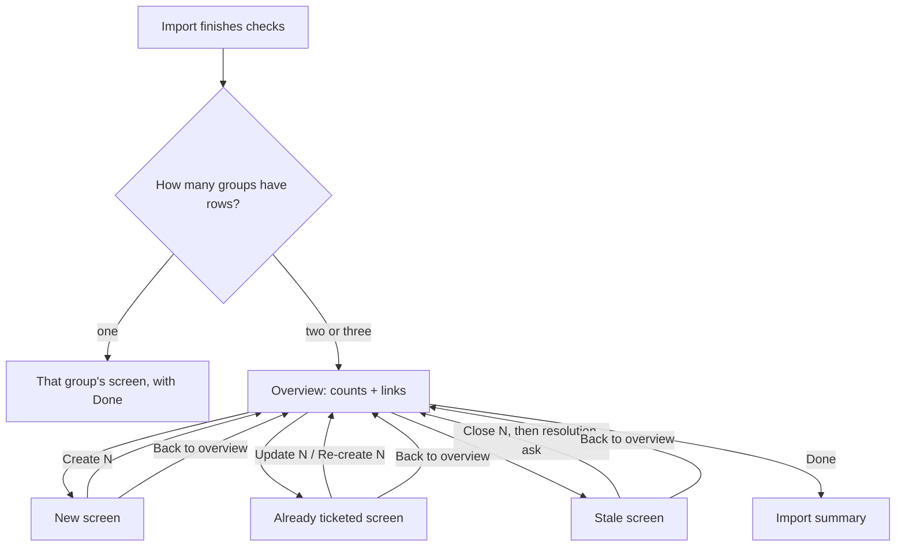

# Report Import Overview Hub - Plan

## Goal Capsule

- **Objective:** A user importing a Veracode or Waltz report can see what kinds of results the report produced and act on one kind at a time. It is always clear which results a reply or action affects, and nothing runs for a group the user did not open.
- **Means:** Replace the single combined review screen with an overview of result groups (New, Already ticketed, Stale), where each group opens its own screen with its own actions.
- **Product authority:** Decisions below were made with the repository owner in this brainstorm. Sorting or grouping rows within a table is not active scope.
- **Open blockers:** None.

---

## Product Contract

### Summary

After a Veracode or Waltz import, `@jira` shows an overview listing each non-empty result group with its count and a link to open it. Each group screen shows only that group's table, reply vocabulary and actions, plus a way back to the overview. The shared "Post it" confirmation is removed: every create, update, re-create or close runs only from inside its own group.

### Problem Frame

Today the review screen puts three sections in one chat response: "Already ticketed", "New — will create" and "Stale — no longer active". Each has a different interaction. Already-ticketed rows toggle with `A1`-style ids and offer "update existing tickets". New rows toggle with numbers and offer include/exclude all plus paging. Stale tickets toggle by ticket key and default to off. The Stale section renders below the footer that holds "Post it", so the main action sits mid-screen. A single "Post it" then creates the New rows, re-creates any Already-ticketed rows switched back on, and transitions the selected Stale tickets, all in one run. Users find the combination confusing: the sections sit close together, each works differently, and all of them are triggered at once.

A second friction point: when stale tickets need a resolution choice, that question is asked before any review screen appears, so users answer it before they have seen the results.

### Key Decisions

- **Overview hub, one group per screen.** The user chooses which group to handle and in what order, and can leave groups untouched. (session-settled: user-directed — chosen over guided sequential steps and over a single screen with per-section actions: the user wants free choice of group and order rather than a fixed sequence or one dense screen.) Governs R1–R5, R10.
- **Already ticketed keeps both update and re-create.** Re-create stays available for users who want a fresh ticket, as its own action separate from update. (session-settled: user-directed — chosen over update-only and over a read-only list: keeps the existing flexibility while separating the two actions.) Governs R8.
- **Stale resolution is asked inside the Stale group, after the user chooses to close.** Users who never close stale tickets are never asked. (session-settled: user-approved — chosen over keeping the ask before the overview: asking before the user has seen any results was part of the confusion.) Governs R9.
- **Single-group imports skip the overview.** An overview with one entry adds a turn and says nothing new. Governs R4.

### Requirements

**Overview**

- R1. After an import's duplicate and stale checks finish, `@jira` shows an overview listing each result group that has at least one row, with its count and a clickable link that opens that group.
- R2. The overview reflects what has already happened in this import, per group (for example "12 created · 38 left", "2 updated", "1 closed").
- R3. The overview offers a "Done" action that ends the import and posts a one-screen summary of everything created, updated, re-created and closed during it.
- R4. When exactly one group has rows, the import opens that group directly instead of showing the overview, and that group screen offers "Done" in place of "Back to overview".

**Group screens**

- R5. Each group screen shows only that group's table, its own toggle replies, its own action(s), and "Back to overview" (or "Done", per R4).
- R6. A reply is interpreted only against the vocabulary of the group screen currently shown. A token that belongs to another group's vocabulary is reported as not understood rather than acted on.
- R7. The New group keeps today's per-row include toggles, include all / exclude all, and 50-row paging. Its action, "Create N tickets", creates the included rows on the visible page.
- R8. The Already ticketed group offers two independent actions: "Update N tickets" (today's "update existing tickets" behavior, counting only rows with findings missing from their ticket) and "Re-create N", which acts only on rows the user toggled on (off by default).
- R9. The Stale group lists stale tickets with per-ticket toggles (off by default) and a "Close N" action. Any resolution question needed for the selected tickets is asked only after "Close N" is chosen, and the transitions run once it is answered.
- R10. After any group action completes, `@jira` reports the per-item results and returns to the overview (or, under R4, re-shows the single group).

**Scope and safety**

- R11. No reply or action creates, updates, re-creates or closes anything outside the group whose action was chosen. The combined "Post it" confirmation no longer exists for report imports.
- R12. Veracode and Waltz behave identically. Email import, which only ever has a New group, keeps its current experience through R4.
- R13. The existing per-action cap (at most 50 tickets created or re-created per action) stays in force within each group.
- R14. If the user moves on to an unrelated `@jira` prompt, the import session ends silently as it does today. Actions already run stay done, and groups not acted on stay untouched.

### Key Flows

- F1. Mixed-result import
  - **Trigger:** A Veracode report yields new findings, already-ticketed findings and stale tickets.
  - **Steps:** Overview shows three groups → user opens Stale, toggles `SEC-7`, chooses "Close 1" → resolution question → ticket transitions → overview shows "1 closed" → user opens New, chooses "Create 12 tickets" → overview updates → user chooses "Done" → summary.
  - **Covered by:** R1, R2, R3, R5, R9, R10

### Acceptance Examples

- AE1. **Covers R4, R12.** Given an email batch import (New only) or a first Veracode import with no existing or stale tickets, when the checks finish, then the New group screen is shown directly with no overview, and "Done" ends the import.
- AE2. **Covers R6, R11.** Given the New group screen is showing, when the user replies `SEC-7` (a stale ticket key) or `A1`, then nothing is toggled or run and the reply is reported as not understood on this screen.
- AE3. **Covers R9.** Given stale tickets whose target state needs a resolution, when the user opens the Stale group and returns to the overview without choosing "Close N", then no resolution question is asked.
- AE4. **Covers R8.** Given three already-ticketed rows, two with findings missing from their tickets, when the user chooses "Update 2 tickets", then only those two tickets get labels and a comment and no ticket is re-created. "Re-create N" stays at 0 until the user toggles a row on.
- AE5. **Covers R7, R2.** Given 62 new findings (two pages), when the user creates the 50 included rows on page 1, then the overview shows "50 created · 12 left", and reopening New shows the remaining rows.

### Success Criteria

- From any import screen, a user can tell which group an action affects without reading another section.
- No single reply can cause actions in more than one group.

### Scope Boundaries

- Sorting or sub-grouping rows inside a group (by severity, CWE, module or file) is deferred.
- Duplicate detection, stale detection, same-line folding, and ticket content (summary, description, labels) are unchanged.
- The "add email as a comment" flow and `@jira cleanup` are untouched.

### Outstanding Questions

**Deferred to Planning**

- Whether rows already created in the New group disappear from its table or stay visible marked as created.
- Whether a group whose rows are all handled stays in the overview (with its outcome) or drops off it.

### Sources / Research

- `src/participant/jira/reportImportHandler.ts` — `streamImportReview` joins the review table and the Stale section into one response; `streamStaleResolutionAsk`/`continueAfterStaleResolution` run the resolution ask before the merged review screen.
- `src/participant/sessionState.ts` — `buildImportReviewTable` (Already ticketed, New, the "Post it" footer), `buildStaleReviewSection`, `buildReviewPage` (paging), `parseStaleTicketToggle` (mixed-token handling, including an earlier code-review fix for replies that mixed vocabularies).
- `docs/report-import.md` — current review-screen, paging, bulk include/exclude, "update existing tickets" and stale-ticket behavior. Its rule that a behavior difference between importers on shared ground is a bug governs R12.
- `docs/plans/2026-09-14-1726-feat-veracode-fold-page-stale-plan.md` — origin of paging, stale detection and "update existing tickets".
- Rough layout sketches compared during the brainstorm: https://claude.ai/artifact/8zMyMuGTEepGJBPLZYBmQ9 (private).
