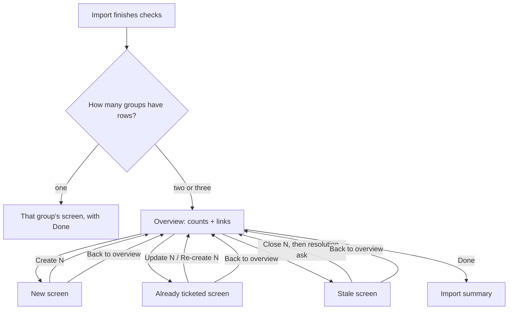
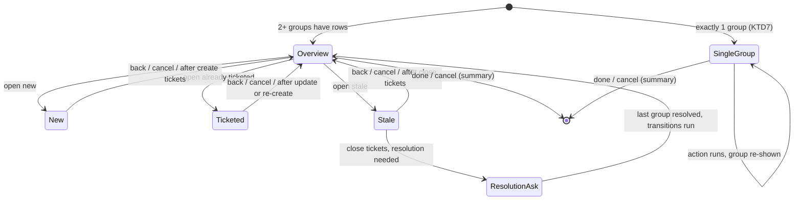

# Report Import Overview Hub - Plan

## Goal Capsule

- **Objective:** A user importing a Veracode or Waltz report can see what kinds of results the report produced and act on one kind at a time. It is always clear which results a reply or action affects, and nothing runs for a group the user did not open.
- **Means:** Replace the single combined review screen with an overview of result groups (New, Already ticketed, Stale), where each group opens its own screen with its own actions. The review session records which screen is showing and interprets replies only against it (KTD1, KTD2).
- **Product authority:** The Product Contract below wins on behavior; the Planning Contract wins on mechanism within it. Decisions were made with the repository owner. Sorting or grouping rows within a table is not active scope.
- **Execution profile:** Standard, 6 units, all inside the shared report-import flow (`src/participant/jira/reportImportHandler.ts`, `src/participant/sessionState.ts`) plus docs. No Jira API or client changes.
- **Stop conditions:** Stop and ask if implementing R11 would require changing how duplicates or stale tickets are detected, or if the email import can no longer reach ticket creation in the same number of turns as today.
- **Who finishes:** `ce-work` implements and verifies locally. Shipping (PR) is a separate user decision.
- **Open blockers:** None.

---

## Product Contract

### Summary

After a Veracode or Waltz import, `@jira` shows an overview listing each non-empty result group with its count and a link to open it. Each group screen shows only that group's table, reply vocabulary and actions, plus a way back to the overview. The shared "Post it" confirmation is removed: every create, update, re-create or close runs only from inside its own group.

### Problem Frame

Today the review screen puts three sections in one chat response: "Already ticketed", "New — will create" and "Stale — no longer active". Each has a different interaction. Already-ticketed rows toggle with `A1`-style ids and offer "update existing tickets". New rows toggle with numbers and offer include/exclude all plus paging. Stale tickets toggle by ticket key and default to off. The Stale section renders below the footer that holds "Post it", so the main action sits mid-screen. A single "Post it" then creates the New rows, re-creates any Already-ticketed rows switched back on, and transitions the selected Stale tickets, all in one run. Users find the combination confusing: the sections sit close together, each works differently, and all of them are triggered at once.

A second friction point: when stale tickets need a resolution choice, that question is asked before any review screen appears, so users answer it before they have seen the results.

### Key Decisions

- **Overview hub, one group per screen.** The user chooses which group to handle and in what order, and can leave groups untouched. (session-settled: user-directed — chosen over guided sequential steps and over a single screen with per-section actions: the user wants free choice of group and order rather than a fixed sequence or one dense screen.) Governs R1–R5, R10.
- **Already ticketed keeps both update and re-create.** Re-create stays available for users who want a fresh ticket, as its own action separate from update. (session-settled: user-directed — chosen over update-only and over a read-only list: keeps the existing flexibility while separating the two actions.) Governs R8, R16.
- **Stale resolution is asked inside the Stale group, after the user chooses to close.** Users who never close stale tickets are never asked. (session-settled: user-approved — chosen over keeping the ask before the overview: asking before the user has seen any results was part of the confusion.) Governs R9.
- **Single-group imports skip the overview.** An overview with one entry adds a turn and says nothing new. Governs R4.

### Requirements

**Overview**

- R1. After an import's duplicate and stale checks finish, `@jira` shows an overview listing each result group that has at least one row, with its count and a clickable link that opens that group.
- R2. The overview reflects what has already happened in this import, per group (for example "12 created · 38 left", "2 updated", "1 closed").
- R3. The overview offers a "Done" action that ends the import and posts a one-screen summary of everything created, updated, re-created and closed during it.
- R4. When exactly one group has rows, the import opens that group directly instead of showing the overview, and that group screen offers "Done" in place of "Back to overview".

**Group screens**

- R5. Each group screen shows only that group's table, its own toggle replies, its own action(s), and "Back to overview" (or "Done", per R4).
- R6. A reply is interpreted only against the vocabulary of the group screen currently shown. A token that belongs to another group's vocabulary is reported as not understood rather than acted on.
- R7. The New group keeps today's per-row include toggles, include all / exclude all, and 50-row paging. Its action, "Create N tickets", creates the included rows on the visible page.
- R8. The Already ticketed group offers two independent actions: "Update N tickets" (today's "update existing tickets" behavior, counting only rows with findings missing from their ticket) and "Re-create N", which acts only on rows the user toggled on (off by default).
- R9. The Stale group lists stale tickets with per-ticket toggles (off by default) and a "Close N" action. Any resolution question needed for the selected tickets is asked only after "Close N" is chosen, and the transitions run once it is answered.
- R10. After any group action completes, `@jira` reports the per-item results and returns to the overview (or, under R4, re-shows the single group).

**Scope and safety**

- R11. No reply or action creates, updates, re-creates or closes anything outside the group whose action was chosen. The combined "Post it" confirmation no longer exists for report imports.
- R12. Veracode and Waltz behave identically. Email import, which only ever has a New group, keeps its current experience through R4.
- R13. The existing per-action cap (at most 50 tickets created or re-created per action) stays in force within each group.
- R14. If the user moves on to an unrelated `@jira` prompt, the import session ends silently as it does today. Actions already run stay done, and groups not acted on stay untouched.
- R15. Rows created from the New group leave the New table. A group whose rows are all handled stays on the overview showing its outcome.
- R16. The "Update N tickets" action appears only for importers that support updating existing tickets (Veracode). Waltz's Already ticketed group offers "Re-create N" only.

### Key Flows

- F1. Mixed-result import
  - **Trigger:** A Veracode report yields new findings, already-ticketed findings and stale tickets.
  - **Steps:** Overview shows three groups → user opens Stale, toggles `SEC-7`, chooses "Close 1" → resolution question → ticket transitions → overview shows "1 closed" → user opens New, chooses "Create 12 tickets" → overview updates → user chooses "Done" → summary.
  - **Covered by:** R1, R2, R3, R5, R9, R10

### Acceptance Examples

- AE1. **Covers R4, R12.** Given an email batch import (New only) or a first Veracode import with no existing or stale tickets, when the checks finish, then the New group screen is shown directly with no overview, and "Done" ends the import.
- AE2. **Covers R6, R11.** Given the New group screen is showing, when the user replies `SEC-7` (a stale ticket key) or `A1`, then nothing is toggled or run and the reply is reported as not understood on this screen.
- AE3. **Covers R9.** Given stale tickets whose target state needs a resolution, when the user opens the Stale group and returns to the overview without choosing "Close N", then no resolution question is asked.
- AE4. **Covers R8.** Given three already-ticketed rows, two with findings missing from their tickets, when the user chooses "Update 2 tickets", then only those two tickets get labels and a comment and no ticket is re-created. "Re-create N" stays at 0 until the user toggles a row on.
- AE5. **Covers R7, R2.** Given 62 new findings (two pages), when the user creates the 50 included rows on page 1, then the overview shows "50 created · 12 left", and reopening New shows the remaining rows.

### Success Criteria

- From any import screen, a user can tell which group an action affects without reading another section.
- No single reply can cause actions in more than one group.

### Scope Boundaries

- Sorting or sub-grouping rows inside a group (by severity, CWE, module or file) is deferred.
- Duplicate detection, stale detection, same-line folding, and ticket content (summary, description, labels) are unchanged.
- The "add email as a comment" flow and `@jira cleanup` are untouched.

### Sources / Research

- `src/participant/jira/reportImportHandler.ts` — `streamImportReview` joins the review table and the Stale section into one response; `streamStaleResolutionAsk`/`continueAfterStaleResolution` run the resolution ask before the merged review screen.
- `src/participant/sessionState.ts` — `buildImportReviewTable` (Already ticketed, New, the "Post it" footer), `buildStaleReviewSection`, `buildReviewPage` (paging), `parseStaleTicketToggle` (mixed-token handling, including an earlier code-review fix for replies that mixed vocabularies).
- `docs/report-import.md` — current review-screen, paging, bulk include/exclude, "update existing tickets" and stale-ticket behavior. Its rule that a behavior difference between importers on shared ground is a bug governs R12.
- `docs/plans/2026-09-14-1726-feat-veracode-fold-page-stale-plan.md` — origin of paging, stale detection and "update existing tickets".
- Rough layout sketches compared during the brainstorm: https://claude.ai/artifact/8zMyMuGTEepGJBPLZYBmQ9 (private).
- `docs/solutions/logic-errors/confirm-cancel-word-list-broadening-swallows-domain-name-collisions.md` — the shared `isCancellation()` list includes `skip`, `stop` and `no`. Any new reply word must be checked against `isConfirmation()`/`isCancellation()` and against row-id and ticket-key tokens (governs KTD2).

**Product Contract preservation:** changed: R15, R16 added, resolving the two "Deferred to Planning" questions and clarifying R8 for Waltz. No existing R, F or AE changed meaning.

---

## Planning Contract

### Key Technical Decisions

- KTD1. **One review session per import, with a `view` field.** The existing `ReviewSession` gains the screen currently shown (`overview`, `new`, `ticketed`, `stale`), a fixed `singleGroup` flag, and per-group outcome counters. Session keys and `JiraSessionKind` values (`veracode-review`, `waltz-review`, `email-review`) stay the same, so `src/participant/JiraParticipant.ts` keeps its session-kind routing. Only the stale-resolution branch's call gains a `ticketService` argument (U5). `CURRENT_SESSION_SCHEMA_VERSION` goes from 5 to 6, so a session stored by the old build expires through the existing `isSessionExpired()` guard instead of being read with the new shape. Implements the overview-hub Key Decision (governs R1–R5, R10); inherits its label. (session-settled: user-directed — chosen over guided sequential steps and a single screen with per-section actions: the user wants free choice of group and order.)
- KTD2. **Replies are parsed per view, in a fixed order, with exact-match command words.** Each view has its own pure parser. Tokens outside that view's vocabulary produce a view-specific "didn't understand" message listing what this screen accepts (R6).
  - Overview: `open new`, `open already ticketed`, `open stale`, `done`. Cancellation words (`isCancellation()`) end the import the same way as `done`.
  - All group screens: `back` returns to the overview. Cancellation words also return to the overview without running anything. Under `singleGroup`, `back` is not offered and `done` / cancellation end the import.
  - New: numeric row toggles, `include all` / `exclude all`, page navigation (unchanged parsers), `create tickets`. `isConfirmation()` words alias to `create tickets`.
  - Already ticketed: `A<n>` toggles, `update tickets` (Veracode only, R16), `re-create tickets`. Confirmation words are rejected here because there are two actions.
  - Stale: ticket-key toggles (existing `parseStaleTicketToggle`), `close tickets`. Confirmation words alias to `close tickets`.
  - None of the new command words appear in `isConfirmation()` / `isCancellation()`, and none can be a row id (digits, `A<n>`) or ticket key (always hyphenated). A unit test pins this disjointness.
- KTD3. **The combined batch is split into three per-group actions.** `executeImportBatch` becomes `createNewRows` (included rows on the visible New page), `recreateTicketedRows` (toggled Already-ticketed rows) and `closeStaleTickets` (selected stale tickets). Each action is capped at `BATCH_LIMIT` (R13), reuses today's per-row try/catch and progress lines, updates the session's outcome counters and re-renders the overview (or the single group, R10). The session is no longer cleared on an action. It is cleared only on `done`, overview cancellation, or a superseding import (detected by a `sessionWasSuperseded()` guard at the top of `handleImportReviewReply`, mirroring the existing issue-type and stale-ask guards). After `closeStaleTickets`, each successfully transitioned ticket is marked closed: it has no toggle and is excluded from `Close N`, mirroring KTD4's re-created-row marking.
- KTD4. **Created New rows are removed from `allRows`; re-created rows stay but are marked.** Before re-deriving, the visible page's `included: false` states are written into `allRows`, so rows the user excluded stay excluded. Then successfully created rows leave `allRows` and `buildReviewPage` re-derives the page, so a repeated `create tickets` cannot create duplicates (R15). A re-created Already-ticketed row keeps its place, shows the new key, and is no longer toggleable.
- KTD5. **The "Update N" count comes from the dedup map at row-build time.** `buildReviewRows` sets a per-row flag when at least one of the row's dedup keys is missing from the dedup map (a folded group whose newer finding has no ticket label yet). N counts flagged rows not already marked `updatedExisting`. `executeUpdateExistingTickets` walks only flagged rows. `addMissingLabels()` stays the idempotency check. No extra Jira calls are needed to show N.
- KTD6. **Stale resolution is deferred until `close tickets`.** `continueAfterImportIssueType` no longer starts the resolution ask. It stores every eligible stale group in `staleTickets`, keeping the group's `resolutionOptions` where a resolution is still needed. Each group records whether its resolution was answered (an answer of `none` counts as answered), so it is never asked twice. On `close tickets`, only groups with at least one selected ticket and no answered resolution are asked, through the existing `StaleResolutionAskSession` chain. Its parked `reviewSession` is the live session, and once the last group resolves the transitions run and the overview renders. Implements the stale Key Decision (governs R9); inherits its label. (session-settled: user-approved — chosen over keeping the ask before the overview: asking before the user saw any results was part of the confusion.)
- KTD7. **`singleGroup` is decided once, when the session is built.** It is true when exactly one of New, Already ticketed and Stale (eligible plus ineligible tickets) has rows at build time. The initial view is then that group. The flag never flips mid-import, so a Veracode import whose New rows are all created does not suddenly grow an overview.
- KTD8. **Screen renderers are pure functions in `sessionState.ts`.** `buildImportOverview`, `buildNewGroupScreen`, `buildTicketedGroupScreen` and `buildStaleGroupScreen` replace `buildImportReviewTable` + `buildStaleReviewSection`, reusing `renderReviewTable`, `buildChatCommandLink` and each importer's `reviewColumns`. They stay vscode-free so Vitest covers them, and output still goes through `trustedChatMarkdown()`.

### High-Level Technical Design

Review-session view state (directional; prose above is authoritative):

### Assumptions

- The dedup map's keys are exactly the per-finding ids a row's `dedupKeyOf` returns, so "a key missing from the map" means "no ticket carries that finding's label yet" (KTD5). This holds for Veracode today (`veracodeLabelToIssueId`).
- Email imports never have Already-ticketed or Stale rows, so `singleGroup` is always true for email and its first screen is the New group.

### Sequencing

U1 → U2 → U3 → U4 → U5 → U6. U2 and U3 are independent of each other once U1 lands.

---

## Implementation Units

### U1. Session model: view, outcomes, single-group flag, unsynced-findings flag

**Goal:** Extend the review session and row types so later units can render and dispatch per group.
**Requirements:** R1, R2, R4, R15, R16; KTD1, KTD4, KTD5, KTD7.
**Dependencies:** none.
**Files:**
- `src/participant/sessionState.ts` (`ReviewSession`, `ReviewRowBase`, `ReviewSessionStale`/`StaleTicketGroup`, `CURRENT_SESSION_SCHEMA_VERSION`, new group-count helper)
- `src/utils/reportImport.ts` (`buildReviewRows` sets the unsynced-findings flag)
- `src/test/sessionState.test.ts`, `src/test/reportImport.test.ts`

**Approach:**
1. Add `view`, `singleGroup` and an outcomes record (created, recreated, updated, closed, failed counts) to `ReviewSession`.
2. Add an optional unsynced-findings flag and an optional recreated-key field to `ReviewRowBase`.
3. Let `StaleTicketGroup` carry optional `resolutionOptions` so a group can wait for its resolution inside the session (KTD6).
4. Add a pure helper that counts rows per group and derives the initial view and `singleGroup` (KTD7).
5. Bump the schema version to 6.

**Patterns to follow:** existing optional-field additions such as `updatedExisting` and `staleTickets`. `buildReviewPage` for derived state.
**Test scenarios:**
- A folded row whose two dedup keys are both in the dedup map is not flagged. A row with one key missing is flagged.
- A new row (no key in the map) is never flagged.
- Group-count helper with New only → `singleGroup` true, initial view `new`.
- New + Stale → `singleGroup` false, initial view `overview`.
- Already ticketed only → `singleGroup` true, initial view `ticketed`.
- Stale with only ineligible tickets counts as a group.
- A stored session with `schemaVersion: 5` is reported expired by `isSessionExpired()`.

**Verification:** Types compile. Helper tests pass. Existing paging and toggle tests stay green.

### U2. Screen renderers for overview and the three group screens

**Goal:** Pure markdown builders for the overview and each group screen.
**Requirements:** R1, R2, R3, R4, R5, R7, R8, R9, R15, R16; KTD8.
**Dependencies:** U1.
**Files:**
- `src/participant/sessionState.ts` (new `buildImportOverview`, `buildNewGroupScreen`, `buildTicketedGroupScreen`, `buildStaleGroupScreen`; remove `buildImportReviewTable`, fold `buildStaleReviewSection` into the Stale screen)
- `src/test/sessionState.test.ts`

**Approach:**
1. The overview lists each group that had rows when the session was built (R1 read at build time, same basis as KTD7), with its count, outcome text from the session counters, and a clickable `open …` link while it still has actionable rows. A group whose rows are all handled stays listed with its outcome and no link (R15). A `Done` link ends the list.
2. The New screen keeps today's table, include/exclude-all links and page line. It adds a `Create N tickets` link, where N is the included rows on the page, and `Back to overview` (or `Done` under `singleGroup`).
3. The Already-ticketed screen keeps today's table and "Updated?" column. It shows `Update N tickets` only when the importer supports it and N > 0 (KTD5, R16). `Re-create N` reflects toggled rows. Re-created rows show their new key without a toggle.
4. The Stale screen keeps today's ticket rows, ineligible notes and ticket-key toggles, and adds `Close N tickets`.
5. Every link uses `buildChatCommandLink` with the exact KTD2 command words. Row content keeps its existing `neutralizeMarkdownLinks` treatment.

**Patterns to follow:** current `buildImportReviewTable` and `buildStaleReviewSection` bodies, `formatKeyLink`, `REVIEW_BATCH_LIMIT` warning line.
**Test scenarios:**
- Overview with New 12, Already ticketed 4, Stale 2 lists three `open` links and a `Done` link, and no "Post it" text anywhere.
- Overview after 50 of 62 New rows were created shows "50 created · 12 left".
- Overview omits a group with zero rows at build time.
- After all New rows are created, the overview still lists New with its outcome ("12 created") and no `open new` link.
- The New screen under `singleGroup` shows `Done` and no `Back to overview`.
- New screen `Create N` equals included rows on the visible page after an exclude.
- Veracode Already-ticketed screen with two flagged rows shows `Update 2 tickets`. With none flagged, the Update link is absent.
- A Waltz Already-ticketed screen never shows an Update link (R16).
- `Re-create 0` when no row is toggled on. `Re-create 1` after toggling `A1`.
- The Stale screen lists ineligible tickets with their note and no toggle, and `Close 0 tickets` until a ticket is selected.
- A summary containing `[x](command:…)` is neutralized in every screen's table (regression on the existing link-injection guard).

**Verification:** Renderer tests pass. No renderer imports `vscode`.

### U3. Per-view reply parsing

**Goal:** One pure parser per view returning a typed action, with disjoint command words.
**Requirements:** R6, R11; KTD2.
**Dependencies:** U1.
**Files:**
- `src/participant/sessionState.ts` (new `parseOverviewReply`, `parseNewGroupReply`, `parseTicketedGroupReply`, `parseStaleGroupReply`, reusing `parseReviewPageNav`, `parseBulkNewRowReply`, `parseStaleTicketToggle`, `parseReviewInput`)
- `src/test/sessionState.test.ts`

**Approach:** Check command words before toggles in every parser, then the view's toggle vocabulary. Anything else is `invalid`. On the Stale screen, a reply mixing ticket keys with other tokens toggles the keys and rejects the remainder as invalid rather than guessing (this keeps the earlier mixed-token fix's intent).
**Patterns to follow:** `parseReviewPageNav`, `parseBulkNewRowReply` (exact-match, normalized lowercase).
**Test scenarios:**
- Overview: `open stale` → open stale. `DONE` → done. `cancel` → done. `3` → invalid. `post it` → invalid.
- New: `ok` / `post it` → create. `2 4` → toggle rows 2 and 4. `next` → page nav. `A1` → invalid. `PROJ-7` → invalid (Covers AE2). `back` → back. `skip` → back (cancellation word).
- Already ticketed: `A1` → toggle. `update tickets` → update. `re-create tickets` → re-create. `ok` → invalid. `3` → invalid.
- Stale: `SEC-7` → toggle SEC-7. `ok` → close. `A1` → invalid.
- Disjointness: no KTD2 command word is accepted by `isConfirmation()` or `isCancellation()`, and none matches the row-id or ticket-key pattern.

**Verification:** Parser tests pass. Existing parser tests unchanged.

### U4. Handler orchestration: dispatch by view and per-group actions

**Goal:** Route replies by view, run each group's action on its own, and end the import with a summary.
**Requirements:** R2, R3, R4, R7, R8, R10, R11, R12, R13, R14, R15, R16; F1; KTD3, KTD4, KTD5.
**Dependencies:** U1, U2, U3.
**Files:**
- `src/participant/jira/reportImportHandler.ts` (`continueAfterImportIssueType` sets initial view, `streamImportReview` renders by view, `handleImportReviewReply` dispatches by view, `executeImportBatch` split per KTD3, `executeUpdateExistingTickets` filtered per KTD5, new done-summary step with `logDiag`)
- `src/test/reportImportHandler.test.ts`, `src/test/emailHandler.test.ts`

**Approach:**
1. After `continueAfterImportIssueType` builds rows, compute the initial view (U1 helper) and render.
2. `handleImportReviewReply` calls the current view's parser and applies the action. Toggles and page moves re-render the same view. `open …` / `back` switch views. Actions run, update counters, then render the overview (or the single group).
3. `createNewRows` persists the page's exclusions into `allRows`, removes successfully created rows, and recomputes the page (KTD4).
4. `recreateTicketedRows` marks rows with their new key.
5. `done` (or overview cancellation) clears the session and streams one summary of the outcome counters, logged via `logDiag(descriptor.scope, …)`. The old "Cancelled — no tickets were created" message is removed for report imports, because the summary already reports zero when nothing ran.
6. Add a `sessionWasSuperseded(ws, descriptor.sessionKeys.templateSelection)` guard at the top of `handleImportReviewReply` that clears the review session and streams the "newer import was started" message, reusing the stale-ask guard's wording.

**Execution note:** Start by rewriting the existing "Stale-ticket review + transition" and paging handler tests against the new views, so the behavior shift is visible before the code moves.
**Patterns to follow:** existing `executeImportBatch` per-row loop and messages, `executeUpdateExistingTickets` bounded concurrency, `IMPORT_SESSION_KINDS` metadata return.
**Test scenarios:**
- Covers F1. Veracode import with new, ticketed and stale rows → first response is the overview. `open stale`, toggle, `close tickets` → the ticket transitions and the overview shows "1 closed". `open new`, `create tickets` → tickets created, overview updated. `done` → summary lists created and closed, and the session is cleared.
- Covers AE1. Email batch → first response is the New screen with `Done`. `ok` creates the included emails and re-shows the New screen, which lists only the emails the user excluded, still excluded. `done` ends the import.
- Covers AE2. On the New screen, reply `A1` → nothing toggled or created, "didn't understand" lists the New vocabulary.
- Covers AE4. Veracode with three ticketed rows, two flagged → `update tickets` calls `addMissingLabels` only for the two flagged tickets, and `createTicket` is never called.
- Covers AE5. 62 new rows → `create tickets` on page 1 creates 50. The overview reads "50 created · 12 left". `open new` shows the 12 remaining rows on page 1.
- Repeating `create tickets` right after a successful create does not re-create the same rows.
- Excluding row 3, then `create tickets`: row 3 stays in the New table, still excluded, and is not counted in `Create N`.
- `re-create tickets` with `A2` toggled creates exactly one ticket and marks A2 with the new key. A second `re-create tickets` creates nothing.
- A per-row `createTicket` failure is reported with ✗, counted as failed, and the row stays in the New table.
- Waltz import with ticketed rows → `update tickets` on the Already-ticketed screen is rejected as not understood (R16).
- An import whose only rows are Already ticketed opens straight into that screen with `Done` (R4).
- A reply arriving after a newer import superseded the session is ignored with the existing message.

**Verification:** Handler and email tests pass. Nothing in `src/participant/jira/` emits a "Post it" link for report imports.

### U5. Stale close with the resolution question deferred

**Goal:** Ask the stale resolution only when the user closes tickets, and only for groups with selected tickets.
**Requirements:** R9, R11; AE3; KTD6.
**Dependencies:** U4.
**Files:**
- `src/participant/jira/reportImportHandler.ts` (`continueAfterImportIssueType` stale block, `continueAfterStaleResolution`, new `closeStaleTickets`)
- `src/participant/sessionState.ts` (`StaleResolutionAskSession` carries the live review session)
- `src/participant/JiraParticipant.ts` (stale-resolution-selection branch passes `ticketService`), `src/participant/jira/veracodeHandler.ts` and `src/participant/jira/waltzHandler.ts` (`handleVeracodeStaleResolution` / `handleWaltzStaleResolution` thread `ticketService` into `continueAfterStaleResolution`)
- `src/participant/jira/cleanupHandler.ts` (only if `buildStaleTicketGroups`' pending/resolved split needs merging into one list; its logic stays)
- `src/test/reportImportHandler.test.ts`

**Approach:**
1. At session build, merge pending and resolved groups into `staleTickets.groups`, keeping `resolutionOptions` on groups still needing one.
2. On `close tickets`, collect groups with at least one selected ticket. If any of them still need a resolution, start the existing chained ask with only those groups.
3. When the last group resolves, run `transitionTickets` (with the threaded `ticketService`) for the selected tickets, mark transitioned tickets closed, update the counters, and render the overview.
4. Groups without selected tickets are never asked.

**Patterns to follow:** existing `streamStaleResolutionAsk` / `continueAfterStaleResolution` chain and its supersession guard. `transitionTickets` reuse.
**Test scenarios:**
- Covers AE3. Stale groups needing a resolution, the user opens Stale and goes `back` → no resolution question is streamed, and the import still renders the overview first.
- Selecting tickets from two issue-type groups where only one needs a resolution → one question asked. After answering, both groups' selected tickets transition.
- `close tickets` with nothing selected → "nothing selected" message and no transitions.
- Answering `none` to the resolution question transitions without a resolution (existing behavior kept). A later `close tickets` for that group does not ask again.
- A second `close tickets` after a successful close transitions nothing again, and the closed tickets show as closed with no toggle.
- A transition failure is listed with ✗ and the workflow hint, and counted in the overview outcome.

**Verification:** Stale tests pass. The first response of any stale-bearing import is never a resolution question.

### U6. Documentation

**Goal:** Docs describe the overview flow instead of the combined review screen.
**Requirements:** R1–R16 (documentation of behavior).
**Dependencies:** U4, U5.
**Files:**
- `docs/report-import.md` (Veracode steps 9–10, Waltz steps 8–9, email step 5–6, "Bulk include/exclude", "Update existing tickets", "Paging", "Stale-ticket detection")
- `docs/manual/report-imports.md` (user walkthrough step 4 for Veracode and Waltz)
- `docs/jira-flows.md` (the batch-review paragraph that says only "post it" runs the batch)
- `CLAUDE.md` (the `reportImportHandler.ts` key-files row: review screen → overview and per-group screens)

**Approach:** Replace the "one review screen + post it" description with the overview, group screens and per-group actions. Link this plan from `docs/report-import.md`'s consolidation paragraph.
**Test expectation:** none -- documentation only.
**Verification:** No doc still tells report-import users to reply "post it" or "ok" on a combined screen.

---

## Verification Contract

| Check | Command | Applies to |
|---|---|---|
| Type check | `npm run compile` | every unit |
| Unit tests | `npm test` | U1–U5 (must be green before every commit, per `CLAUDE.md`) |
| Manual smoke | Run `@jira import veracode report` against a report with new, already-ticketed and stale findings in a dev Jira project, following F1 | after U5, before shipping |

`npm run test:e2e` needs a real VS Code instance and is not required. The e2e suite does not cover the import review screen today.

## Definition of Done

- Every U1–U6 verification line holds, and `npm run compile` and `npm test` pass.
- Every Acceptance Example (AE1–AE5) and F1 has a passing test named in U3–U5.
- No report-import response contains a "Post it" link or relies on one reply to act on more than one group.
- `docs/report-import.md`, `docs/manual/report-imports.md`, `docs/jira-flows.md` and `CLAUDE.md` match the shipped behavior.
- No dead code from the old combined screen remains (`buildImportReviewTable`, the combined `executeImportBatch` path, the up-front stale ask), and no abandoned experimental code is left in the diff.
