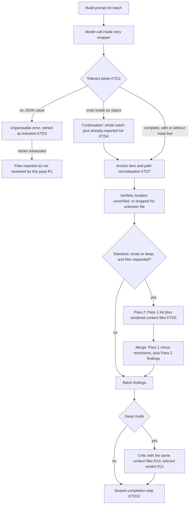

# Bitbucket Review Recall - Plan

## Goal Capsule

- **Objective:** A developer running `@bitbucket` on a pull request, in any mode, sees every real finding the model produced, with its location when it can be verified. When part of the PR could not be reviewed, the developer is told which part.
- **Means:** Fix each loss mechanism in place, and prove each fix with recorded model replies driven through the real chat handler (KTD1).
- **Product authority:** This plan covers the whole review pipeline: intake, Pass 1, truncation recovery, Pass 2, persona passes, critic, formatting, follow-ups and smart-mode resume. Everything listed under Scope Boundaries is excluded. The Product Contract owns behaviour; the Planning Contract owns mechanism.
- **Open blockers:** None.
- **Stop conditions:**
  - Stop and ask if a real Data Center diff response contradicts the truncation shape assumed in KTD8.
  - Stop and ask if a fix would require changing a session-settled Key Decision.
- **Execution profile:** Code change on one branch. Units land as separate commits in the Unit Index order. `npm run compile` and `npm test` stay green after every unit.
- **Who finishes:** `ce-work` implements. The developer spot-checks real PRs on Data Center and Cloud before merging.

---

## Product Contract

### Summary

Fix the code paths that make `@bitbucket` reviews lose findings, abort, or answer with less context than they have:
- Unreadable replies no longer end the review.
- Fetched context files actually reach Pass 2 and the critic.
- Pass 2 refines Pass 1 instead of replacing it.
- Findings with an unverifiable location are shown, not dropped.
- Truncated Data Center diffs are completed.
- Follow-ups keep the review's focus.

### Problem Frame

The developer suspects reviews miss real issues. There is no hard count behind that suspicion, but an audit of every review path found concrete mechanisms that would produce exactly that symptom. Each one loses findings with no message in chat, or with only an output-channel line.

The largest leaks are these:
- **Pass 2 never shows the files it fetched.** Only files already in the diff get their full content rendered, yet the prompt claims the files were provided. Pass 2's output then replaces Pass 1's findings wholesale.
- **A missing last line reads as truncation.** A reply that simply omits the trailing meta line is treated as truncated, which suppresses Pass 2 for that batch.
- **Anchor matching is exact.** A whitespace difference or a copied `L<n>` gutter drops the finding outright.
- **One unreadable reply aborts everything.** A single prose or empty reply from any pass ends the whole review and discards every earlier batch's findings.
- **The critic can fail closed.** Its verdict parsing turns numeric-string indices into "keep nothing".

The full list, with file and line evidence and probe results, is in Sources.

`docs/review-process.md` promises "a review never looks empty because filters stacked up", and STRATEGY.md's *Review quality* track needs output trustworthy enough to post. Today's behaviour breaks both.

### Key Decisions

- **All twelve audit areas are in scope as one plan**, not split into separately shipped groups. (session-settled: user-directed — chosen over "lost + vague results only", "only lost results" and "only follow-ups": one pass over the whole system.) Governs R1–R24.
- **Pass 2 refines Pass 1 rather than replacing it or only adding to it.** (session-settled: user-directed — chosen over "additive only" and "replace, but fixed": it keeps Pass 1's recall while letting real context disprove a finding.) Governs R7, R8.
- **A finding with an unlocatable anchor is kept, demoted, rather than dropped.** (session-settled: user-directed — chosen over "drop, but disclose" and "drop silently": nothing vanishes.) Governs R13.
- **A finding naming a file that is not in the PR diff at all is still dropped**, because it breaks grounding rule 1 (an invented path). It is counted under R14. Governs R13, R14.
- **Chunks shrink in every mode to trade cost for depth.** (session-settled: user-directed — chosen over "prompt-only" and "make it a setting": each file gets more of the model's reply.) Governs R15.
- **The smaller chunk cap applies to `deep` and `quick` too.** (session-settled: user-directed — chosen over exempting `deep` or `quick`: one rule, with the cost shown in the token estimate.) Governs R15.
- **Recall is proven by recorded-reply tests, one per failure shape.** (session-settled: user-directed — chosen over also building a planted-bug PR reviewed by a live model: deterministic and runs in CI.) See Success Criteria.
- **Truncated Data Center diffs are recovered, not only disclosed.** (session-settled: user-directed — chosen over "disclose only": full coverage on large PRs is worth the extra calls.) Governs R17.

### Requirements

**A bad reply never sinks the review**

- R1. A reply from any review call that cannot be parsed never ends the review. This covers Pass 1, continuation, Pass 2, persona passes and the critic. The reply is retried like any other failed attempt. If it still fails, only that batch's files are reported as not reviewed by that pass, and every other batch's findings are shown.
- R2. An empty reply counts as a failed attempt under R1, never as a crash.
- R3. Findings are recovered from every common JSON shape for the same content: one object per line, objects spread over several lines, a JSON array, a `{"findings": [...]}` wrapper, and any of these inside a code fence.
- R4. A reply that ends cleanly but lacks the trailing meta line is complete, not truncated. It gets no truncation warning, no continuation call, and stays eligible for Pass 2. "Truncated" means the reply stops mid-object or mid-line.
- R5. Truncation recovery re-reviews every file the cut-off reply did not finish, including the file it stopped inside, and applies to persona passes as well as Pass 1. A batch recovered this way stays eligible for Pass 2.

**Context actually reaches the model**

- R6. Every context file fetched for Pass 2 or critic round 2 that fits the budget appears in that prompt in full, whether or not the file is in the diff. A prompt never says files were provided when none were.
- R7. Pass 2 receives Pass 1's findings for its batch. It may add findings, and it may retract a Pass 1 finding only by explicitly referencing it. Pass 1 findings it does not mention are kept.
- R8. If Pass 2 fails or is truncated, the batch keeps Pass 1's findings plus any complete additions and explicit retractions Pass 2 managed to return.
- R9. A Pass 2 or critic prompt never exceeds the token budget. Context files that do not fit are skipped and named in the diagnostic timeline.
- R10. In `deep` mode the critic judges each finding with the same context files Pass 2 used for that batch.

**Critic verdicts**

- R11. A critic verdict listing indices as numeric strings is read as numbers. A verdict with any index outside 1..N, such as 0-based numbering, is treated as unparseable: the batch's findings are kept unverified, with the same notice a failed critic call shows today.

**Location verification**

- R12. Anchor matching tolerates the following differences, while verified line numbers still come only from the diff:
  - whitespace differences inside and around the line, including tabs vs spaces
  - a copied `L<n>` gutter
  - a leading `+`, `-` or space diff marker
  - the path spellings `./x`, `a/x`, `b/x` and `/x`
  - a file split across several pieces
- R13. A finding whose anchor still cannot be located is kept as a file-level finding marked "location unverified". It has no line number and is muted like a below-threshold confidence row. When posted, it goes to the activity feed, never inline.
- R14. When findings were dropped, the review output says so in one line with counts. This covers invented file paths (per the Key Decision) and critic drops. A review never shows "No issues found" alone after it dropped findings.

**Depth vs cost**

- R15. In every mode, a chunk is capped well below the model's input window, so each file gets a larger share of the model's reply. The token-estimate line keeps showing the resulting cost.
- R16. The review and persona prompts give one consistent set of length limits:
  - The conflicting code-example limits (3–15 lines vs ≤8 lines) are resolved.
  - The context-file request limit matches what the pipeline will actually fetch.
  - The prompts ask for every real issue while still excluding speculation, instead of saying a short list is better.

**Diff intake**

- R17. When Bitbucket Data Center marks a PR diff as truncated, each cut file's diff is fetched on its own and reviewed. If a single file's diff is still cut, the review states that the file was reviewed partially.

**Follow-ups and smart-mode resume**

- R18. Every follow-up answer receives the review's upfront question and the PR title and description. This covers `#N` explain, free-text finding match and general PR questions.
- R19. Free-text finding matching accepts the model naming a finding as `2`, `#2`, `Finding 2` or `2.`.
- R20. A message is treated as "add to review" only when it asks to add or post findings. A question that happens to contain "add" and "review" is answered as a question.
- R21. A finding on a removed line carries the diff excerpt around that removed line, so a follow-up about it sees the real code.
- R22. The diff stored for follow-ups holds only the files that were reviewed. When it must be shortened to fit the budget, it drops whole files, keeping files with findings first, and the follow-up prompt names the omitted files.
- R23. A smart-mode review resumed after the fallback question behaves like an uninterrupted smart review:
  - Persona passes get the same focus question and review instructions.
  - The stored session supports diff-aware follow-ups.
  - The partial-failure notice, the token estimate and the follow-up chips appear.

**Documentation**

- R24. `docs/review-process.md` and the "Findings funnel" entry in `CONCEPTS.md` describe the new behaviour: Pass 2 refines, unverified-location rows, dropped-count disclosure, the chunk cap and Data Center recovery. The `CONCEPTS.md` entry also loses its stale "folded into the collapsed section" wording.

### Acceptance Examples

- AE1. **Covers R1.** **Given** a `deep` review of a three-chunk PR, **when** the security persona answers chunk 2 with only "No security issues found." on both tries, **then** the review completes with every finding from all chunks and shows one notice that the Security pass could not review chunk 2's files.
- AE2. **Covers R4.** **Given** a Pass 1 reply with three complete finding lines and no meta line, **when** the batch is processed, **then** no truncation warning or continuation call happens, and the three findings count as that batch's result.
- AE3. **Covers R3.** **Given** a Pass 1 reply containing two findings as pretty-printed multi-line JSON objects, **when** it is parsed, **then** both findings reach anchor verification.
- AE4. **Covers R6, R7.** **Given** Pass 1 found findings #a and #b and asked for `src/util.ts`, which is not in the diff, **when** Pass 2 runs, **then** its prompt contains `src/util.ts` in full plus both findings. If Pass 2 explicitly retracts #b and adds #c, the batch shows #a and #c.
- AE5. **Covers R8.** **Given** the same batch, **when** the Pass 2 reply is cut off before any retraction, **then** the batch still shows #a and #b.
- AE6. **Covers R11.** **Given** a critic verdict `{"keep":["1","2"]}` for three findings, **then** findings 1 and 2 are kept and finding 3 is dropped. **Given** `{"keep":[0,1]}`, **then** all findings are kept unverified, with a notice.
- AE7. **Covers R12, R13.** **Given** a diff line indented with tabs and an `anchorCode` that uses spaces, **then** the finding gets the verified line. **Given** an `anchorCode` matching no diff line even after normalization, **then** the finding appears muted, marked "location unverified", with no line number.
- AE8. **Covers R14.** **Given** every raw finding in a review referenced a file outside the PR, **then** the output reads as "No issues found" plus a line saying N findings were dropped because they named files outside this PR.
- AE9. **Covers R17.** **Given** a Data Center PR whose diff response is marked truncated after 40 of 55 files, **when** the review runs, **then** the remaining 15 files are fetched and reviewed. A single file still cut on re-fetch is named as reviewed partially.
- AE10. **Covers R19, R20.** **Given** an active review session, **when** the user asks "Can you review whether #2 would add latency?", **then** they get an explanation of finding 2, not a comment preview. **When** the matcher answers "#2" to a free-text question, **then** finding 2 is explained.
- AE11. **Covers R23.** **Given** a smart review started with `-- does this break concurrent writes?` that hit the fallback question, **when** the user replies "all", **then** the persona passes see that question, and a later general follow-up is answered with the stored diff.

### Success Criteria

- Every failure shape the audit found (Sources, F1–F11) has a recorded-reply or recorded-response test in `npm test` that failed before the change and passes after it.
- The existing `npm test` suite and `npm run compile` stay green.
- The findings funnel in the output channel still adds up, with the new unverified-location and dropped-file counts shown as their own stages.

### Scope Boundaries

- No new review modes or personas, and no change to what the critic is asked to judge.
- No live-model recall benchmark or planted-bug PR. Real-world gains are judged by the developer's own spot checks.
- No automatic posting. Unverified-location findings follow the existing confirm-before-post flow.
- No change to concurrent-review session sharing: two reviews in one window still share one session slot.

**Deferred to Follow-Up Work**

- Moving the review orchestration out of `src/participant/BitbucketParticipant.ts` into a `vscode`-free module. KTD1 tests the handler as it is instead.
- A recorded-reply harness for `@jira`'s LLM flows. This plan builds it for `@bitbucket` only.

### Dependencies / Assumptions

- Bitbucket Data Center's PR diff response carries `truncated` flags at the response, file, hunk and segment levels, and a per-file PR diff can be requested separately. This has not been verified against a live server.
- Bitbucket Cloud's PR diff is assumed not to be truncated silently. If planning finds that it is, R17's disclosure applies to Cloud as well.
- VS Code's Language Model API still exposes no real token counts, so R9's and R15's budgets stay character-based estimates.

### Outstanding Questions

Every question deferred from the brainstorm is now resolved in the Planning Contract:
- The chunk cap for R15 → KTD6.
- Prose "no issues" replies under R1 → KTD3. A reply with no readable JSON is always a failed attempt, never a clean result.
- Pass 2 retraction format and invalid retractions → KTD5.
- Dedup of unverified-location findings → KTD7.
- The Data Center endpoint for R17 → KTD8. Its response shape is still an assumption, verified during U9.

**Deferred to Implementation**

- Exact helper names and where each new pure helper sits inside `src/participant/reviewSessionState.ts`.
- The final wording of the prompt changes in R16, tuned against the recorded-reply fixtures.

### Sources / Research

Audit findings, all verified against HEAD `ff4ceda`. Probe results came from running the helpers on crafted inputs.

- **F1 — an unreadable reply aborts the review.** Nothing catches `parseReviewResponse` in the Pass 1 loop (`src/participant/BitbucketParticipant.ts:1137`) or in persona passes (`:388`). It throws on prose or empty replies (`:253-258`). `callLLMOnce` returns `""` on an empty stream (`:117-142`).
- **F2 — a missing trailer reads as truncation.** `parseNdjsonFindings` sets `truncated: !hasMetaLine && …` (`src/participant/reviewSessionState.ts:524`). A truncated batch skips Pass 2 (`BitbucketParticipant.ts:1215`).
- **F3 — some JSON shapes parse as zero findings.** Pretty-printed objects and one-line arrays fall through to `extractJsonObject`, which picks the first finding object, so `findings` becomes `[]` (`BitbucketParticipant.ts:233-241`). Probe confirmed.
- **F4 — Pass 2 context is never rendered, and Pass 2 replaces Pass 1.** `assemblePrompt` renders full content only for diff files (`src/services/PrReviewService.ts:243-251`). The Pass 2 note is unconditional (`:256-259`). The test at `src/test/PrReviewService.test.ts:256-265` codifies the omission. Pass 2 replaces Pass 1 at `BitbucketParticipant.ts:1253-1254`. `selectFilesWithinBudget` always admits the first file (`reviewSessionState.ts:1125`).
- **F5 — the critic has the same rendering gap.** `buildCriticPrompt` renders content only for diff files (`PrReviewService.ts:288-295`).
- **F6 — critic verdict parsing fails closed.** `parseCriticKeep` keeps only integers (`reviewSessionState.ts:1008-1019`). Probe: `["1","2"]` gives an empty set, and `[0,1]` keeps the wrong finding.
- **F7 — anchor matching is exact.** `locateAnchor` requires exact equality after trimming (`reviewSessionState.ts:759-784`). Path lookup is exact and uses the first piece of a split file (`:977`).
- **F8 — truncation coverage is judged by "has a finding".** Coverage is decided by files with at least one finding (`BitbucketParticipant.ts:1157-1158`). Persona passes have no continuation.
- **F9 — follow-ups lose context.** `upfrontQuestion` is stored (`BitbucketParticipant.ts:1546`) but never read. The matcher uses `parseInt` (`:813`). `parseFollowUpIntent` triggers on "add" plus "review" (`reviewSessionState.ts:563-566`). `extractHunkAround` uses new-file ranges only (`:794-813`). The stored raw diff is cut by prefix (`BitbucketParticipant.ts:1534-1535`).
- **F10 — smart-fallback resume drops state.** `SmartFallbackSession` has no question or diff (`reviewSessionState.ts:90-102`). The resume path uses `config.reviewInstructions` only (`BitbucketParticipant.ts:637`).
- **F11 — Data Center truncation is ignored.** The diff types ignore truncation flags (`src/bitbucket/BitbucketApiClient.ts:8-21, 207-227`).
- **F12 — the prompts push toward fewer, shorter findings.** Prompt rule 6 and the conflicting length limits are in `PrReviewService.ts:13-78`. The chunk budget is 0.7 × the input window (`BitbucketParticipant.ts:946-950`).
- **Related docs:**
  - `docs/review-process.md`: the pipeline, and the "Filtering: only two hard drops" promise.
  - `CONCEPTS.md`: the "Findings funnel" entry.
  - `docs/plans/2026-08-26-2316-feat-bitbucket-review-diagnostics-plan.md`: the diagnostics timeline this work extends.
  - `docs/plans/2026-09-04-1350-feat-bitbucket-persona-review-plan.md`: persona passes and smart mode.

---

## Planning Contract

**Product Contract preservation:** meaning and IDs unchanged. The Goal Capsule gained Means, stop conditions, an execution profile and who finishes. Outstanding Questions were resolved in place by KTD3 and KTD5–KTD8. Scope Boundaries gained "Deferred to Follow-Up Work".

### Key Technical Decisions

- KTD1. **The recorded-reply tests drive the real chat handler with a local `vi.mock('vscode', …)` and scripted model replies. The pipeline is not extracted into a new module.** Follow the per-test-file convention in `docs/solutions/workflow-issues/vscode-mock-testing-convention-not-checked-before-inventing-new-one.md`:
  - The mock covers only what the handler touches: `chat.createChatParticipant` (to capture the handler), `LanguageModelChatMessage.User`, `window.withProgress` / `window.createOutputChannel`, `ChatResponseTurn`, `MarkdownString`, `ProgressLocation` and `commands.executeCommand`.
  - `BitbucketApiClient` is module-mocked to return `MockBitbucketClient`.
  - `request.model.sendRequest` replays a queue of scripted reply strings, and each call records its prompt so tests can assert on what the model saw.
  - Retry backoff runs under fake timers.

  Extracting the pipeline would give a cleaner seam, but it rewrites about 900 lines. That extraction is deferred as follow-up work (see Scope Boundaries).
- KTD2. **A single tolerant reply parser replaces the three parse paths.** It replaces the NDJSON path, the legacy single-object path and partial recovery. It scans the reply (after stripping fences) for every balanced top-level JSON value. Arrays are flattened, and a `{"findings": [...]}` wrapper is unpacked. Each object is then classified:
  - a finding when it has a string `file`
  - a meta line when every key is one of `additionalFilesNeeded`, `recommendedPersonas` or `retract`

  A reply is *truncated* only when it ends inside an unbalanced object or array. A missing meta line is not truncation (R4). `hasMetaLine` stays as its own signal: smart mode still reads it, and it is the only source of Pass 2 retractions.
- KTD3. **A reply with no readable JSON value throws an unparseable-reply error inside the retried call, and the retry layer treats that error as transient.** Parsing moves into the call closure that `withEasierRetry` / `withLmRetry` already wrap, so bad replies get the same retries, split and per-batch failure reporting as provider errors (R1, R2). A prose "no issues" reply is not special-cased: guessing intent from prose risks hiding real prose findings. The prompts instead state that a reply with no findings must still emit the meta line (R16).
- KTD4. **After a truncated reply, one continuation call re-reviews the whole batch and lists the findings already reported (file, line, title), asking only for findings not on the list.** Findings are ordered by severity, not by file, so no file can be proven finished. `dedupeFindings` removes overlaps. This applies to Pass 1 and persona passes, with at most one continuation per batch and pass (R5).
- KTD5. **Pass 2 shows Pass 1's findings as a numbered list, and retractions travel only on the meta line as `"retract":[n,…]`.** The merge for the batch is: Pass 1 findings minus explicit retractions, plus Pass 2's findings, then deduped. The rules around it:
  - Retraction indices that are out of range or not integers are ignored and logged.
  - With no parsed meta line there are no retractions. That makes a cut-off Pass 2 safe by construction (R7, R8).
  - The merge is a pure helper, so it can be unit-tested.
- KTD6. **The chunk cap is a fixed ceiling: `min(tokenBudget, 24 000)` estimated tokens.** It governs both chunk packing and oversized-file hunk splitting (R15). Pass 2 and critic context budgets still use the full `tokenBudget` minus the chunk's estimate, so the cap is what finally leaves room for context files (R9). A fixed ceiling was picked over a fraction of the window because the model's output limit, not its input window, is what gets divided across files. VS Code's LM API exposes no output limit, so 24k is a constant, kept in `src/participant/reviewSessionState.ts` next to the chunk estimates.
- KTD7. **Anchor matching runs in tiers, and the first tier with any match wins.** The tiers are:
  1. Exact trimmed text.
  2. Whitespace-collapsed text.
  3. Whitespace-collapsed text after removing a leading `L<n>` gutter and a leading diff marker.

  The finding's path is first normalised (strip `./`, `a/`, `b/` and a leading `/`). If no path matches, a unique suffix match among the batch's files is used. Every diff piece with that path is searched, so split files work.

  Findings that still don't match are handled like this:
  - They get `locationUnverified: true`, and `line`, `lineType` and `provenance` are cleared.
  - After dedup, an unverified finding is dropped when a verified, same-meaning finding exists for the same file. The same-meaning test is the existing `sameMeaning` gate.
  - A finding whose path matches no diff file at all is dropped and counted for R14.

  All of this applies to R12 and R13.
- KTD8. **Data Center recovery uses two new `IBitbucketClient` methods, and the existing `getPullRequestDiff` is unchanged.** The existing method keeps serving the `bitbucket_getPullRequestDiff` Language Model tool.
  - One new method returns the unified diff plus coverage: the files cut and whether the response was truncated.
  - The other fetches one file's PR diff (Data Center: `.../pull-requests/{id}/diff/{path}` with `contextLines`) and reports whether that file is still cut.
  - Cloud always reports no cut files.
  - The shape of the truncation flags is an assumption (see Assumptions), verified in U9 against a real server response.
- KTD9. **Follow-up prompts are built by pure helpers in `src/participant/reviewSessionState.ts`, not inline in the handler.** This covers `#N` explain, free-text match parsing, the diff-aware prompt with the upfront question, and the stored-diff builder, which keeps whole files and puts files with findings first. It follows the repo rule that pure logic lives where Vitest can load it (R18–R22).
- KTD10. **The main review and the smart-fallback resume share one completion step.** That step handles dedup, dropped-count notice, partial-failure banner, formatting, token estimate, session store and follow-up chips, so the two paths cannot drift again. `SmartFallbackSession` gains `upfrontQuestion`, `rawDiff`, `rawDiffTruncated`, the omitted-files list and the running counters (R23).

### High-Level Technical Design

Per-batch flow after the change, for one pass (Pass 1 or one persona):



How each reply is classified:

| Reply shape | Classified as | Effect |
| --- | --- | --- |
| Findings plus meta line | complete | normal; retractions honoured (Pass 2 only) |
| Findings, no meta line, ends cleanly | complete | normal; no retractions; smart mode gets no persona signal from this batch |
| Only a meta line | complete, zero findings | normal |
| Ends inside an unbalanced object or array | truncated | continuation (KTD4) |
| Empty, or prose with no JSON value | unparseable | retried; then files reported as not reviewed |

### Assumptions

- A Bitbucket Data Center PR diff response carries a `truncated` flag on the response and per file, hunk and segment. A per-file PR diff is served at `.../pull-requests/{id}/diff/{path}`. The Atlassian docs were unreachable from the planning environment. Search results confirm a default cap of about 10k lines, a per-file diff path and a line-limit parameter.
- A 24k-token chunk ceiling leaves enough of the reply for every file on the models Copilot currently exposes. It is a constant, so tuning it later is a one-line change.

### System-Wide Impact

- **Stored sessions across an upgrade.** A `ReviewSession` or `SmartFallbackSession` saved by the current version lacks the fields U10 and U11 add. Every new field is optional:
  - A resumed fallback session with no stored question or diff falls back to today's behaviour for those parts.
  - A review session with no omitted-files list still gets a diff-aware follow-up.
- **The `bitbucket_getPullRequestDiff` Language Model tool (`src/tools/bitbucketTools.ts`).** It keeps calling the unchanged `getPullRequestDiff` (KTD8). Its output and tests do not change. `MockBitbucketClient` gains the two new methods, so tool tests using it keep compiling.
- **Posting comments.** Unverified-location findings carry no `line`/`lineType`, so `PrReviewService.postCommentItems` and the comment preview already route them to the activity feed. No change is needed beyond `formatPrComment` omitting the line.
- **Diagnostics timeline.** New per-call statuses (`unparseable`), the dropped-outside-PR and unverified counts, and Data Center recovery calls go through `logReview`/`logDiag`. The structured record (`detailedDiagnostics`) picks them up without extra work.
- **Cost and latency.** Smaller chunks, parse retries, whole-batch continuations and Data Center per-file fetches all add calls on large or messy PRs. The token-estimate line (unchanged mechanism) shows the cost after every review.

### Risks & Dependencies

| Risk | Mitigation |
| --- | --- |
| Data Center truncation fields or the per-file endpoint differ from KTD8's assumption | Capture a real response as a fixture before finalising U9; stop condition in the Goal Capsule; fall back to naming cut files as not reviewed |
| Prompt wording changes (R16) shift finding quality in ways the recorded replies can't see | Keep wording changes minimal and in one unit (U4); the developer spot-checks each mode before merge |
| Tolerant parsing turns stray JSON in a prose reply (e.g. a quoted config snippet) into a bogus finding | Only objects with a string `file` become findings, and anchor verification still applies; an unknown file is dropped and counted |
| Whole-batch continuation re-reports issues under reworded titles | The already-reported list is in the prompt, and `dedupeFindings`' same-meaning gate merges near-duplicates on the same line |
| The 24k cap multiplies `deep`-mode calls on very large PRs | Accepted per the settled Key Decision; the constant is one line to tune |

### Sequencing

The parsing, anchor, prompt and budget helpers (U1–U5) come first because they have no dependencies. The harness (U6) comes before any handler change, so every handler unit lands with its recorded-reply test. Data Center recovery, follow-ups and smart resume come next. Docs come last.

---

## Implementation Units

| U-ID | Title | Key files | Depends on |
| --- | --- | --- | --- |
| U1 | Tolerant reply parser | `src/participant/reviewSessionState.ts` | — |
| U2 | Critic verdict parsing | `src/participant/reviewSessionState.ts` | — |
| U3 | Anchor tiers, unverified findings, drop counts | `src/participant/reviewSessionState.ts`, `src/services/PrReviewService.ts` | — |
| U4 | Prompt rendering and wording | `src/services/PrReviewService.ts` | — |
| U5 | Chunk cap and context budget | `src/participant/reviewSessionState.ts` | — |
| U6 | Recorded-reply handler harness | `src/test/bitbucketReviewFlow.test.ts` | — |
| U7 | Pass robustness and continuation | `src/participant/BitbucketParticipant.ts`, `src/utils/lmRetry.ts` | U1, U3, U5, U6 |
| U8 | Pass 2 refine and critic context | `src/participant/BitbucketParticipant.ts`, `src/participant/reviewSessionState.ts` | U2, U4, U7 |
| U9 | Data Center diff recovery | `src/bitbucket/*`, `src/test/mocks/MockBitbucketClient.ts` | U6, U7 |
| U10 | Follow-up context and routing | `src/participant/reviewSessionState.ts`, `src/participant/BitbucketParticipant.ts` | U6, U7 |
| U11 | Shared completion and smart-fallback resume | `src/participant/BitbucketParticipant.ts`, `src/participant/reviewSessionState.ts` | U8, U10 |
| U12 | Docs and glossary | `docs/review-process.md`, `CONCEPTS.md`, `CLAUDE.md` | U11 |

### U1. Tolerant reply parser

**Goal:** Every common reply shape yields its findings, and truncation means a mid-object cut only.

**Requirements:** R3, R4; supports R1, R5, R7.

**Dependencies:** none.

**Files:**
- Modify `src/participant/reviewSessionState.ts`: new parser per KTD2; `parseNdjsonFindings` and `extractPartialFindings` removed or turned into thin wrappers.
- Test `src/test/reviewSessionState.test.ts`, and migrate the existing NDJSON cases in `src/test/PrReviewService.test.ts`.

**Approach:**
- Build on the bracket-counting walk in `src/utils/extractJsonObject.ts`, extended to find every top-level value rather than the first.
- Return findings, the meta fields (`additionalFilesNeeded`, `recommendedPersonas`, `retract`), `hasMetaLine`, `truncated`, `danglingTail`, and whether any JSON value was found at all. U7 needs that last flag for KTD3.
- Keep `buildTruncationEvent`'s inputs available so the diagnostics timeline is unchanged.

**Patterns to follow:** `extractJsonObject` (string/escape-aware brace counting); the existing `NDJSON_META_KEYS` check.

**Test scenarios:**
- Covers AE2. Three finding lines with no meta line → three findings, `truncated: false`, `hasMetaLine: false`.
- Covers AE3. Two pretty-printed multi-line finding objects plus a pretty-printed meta object → two findings, meta parsed.
- A one-line JSON array of two findings → two findings.
- `{"findings":[…]}` wrapper, inside a ```json fence → findings unpacked.
- NDJSON inside a fence with prose before and after → findings parsed, prose ignored.
- The last finding cut mid-string → earlier findings kept, `truncated: true`, `danglingTail` set.
- Prose only ("No issues found.") → zero values found, flagged as no JSON.
- An empty string → flagged as no JSON.
- Meta line with `retract: [2]` → retract parsed; a meta line with an unknown key is not treated as meta.
- A finding whose `description` contains `{` and `}` inside a string → parsed intact.

**Verification:** every existing parser test still passes against the new parser (migrated, not deleted), and the new shapes pass.

### U2. Critic verdict parsing

**Goal:** A critic verdict never wipes or mis-keeps findings through type or index drift.

**Requirements:** R11.

**Dependencies:** none.

**Files:**
- Modify `src/participant/reviewSessionState.ts` (`parseCriticKeep`).
- Test `src/test/reviewSessionState.test.ts`.

**Approach:**
1. Coerce numeric strings to integers.
2. If any index falls outside 1..N, or an entry is neither an integer nor a numeric string, return "unparseable". The caller keeps all findings unverified and shows the existing notice.
3. Keep the fail-open behaviour for replies with no JSON.

**Test scenarios:**
- Covers AE6. `{"keep":["1","2"]}` with three findings → keep {1,2}.
- Covers AE6. `{"keep":[0,1]}` → unparseable, so all are kept, with a notice.
- `{"keep":[]}` → keep nothing (a legitimate "all wrong" verdict).
- `{"keep":[1,"x"]}` → unparseable.
- No JSON → keep all (unchanged).

**Verification:** the caller can tell the three outcomes apart: kept set, keep nothing, unparseable.

### U3. Anchor tiers, unverified findings, drop counts

**Goal:** Findings survive harmless quoting differences, unlocatable ones stay visible, and drops are counted.

**Requirements:** R12, R13, R14 (counting side), R21.

**Dependencies:** none.

**Files:**
- Modify `src/participant/reviewSessionState.ts`:
  - `locateAnchor` and `resolveFindingAnchors` (KTD7)
  - `ReviewFinding` gains `locationUnverified`
  - `dedupeFindings` post-pass
  - `extractHunkAround` handles removed lines
  - a pure dropped-notice formatter
- Modify `src/services/PrReviewService.ts`: `formatReview` marks unverified rows. `formatPrComment` omits `L` for them.
- Test `src/test/reviewSessionState.test.ts` and `src/test/PrReviewService.test.ts`.

**Approach:**
- `resolveFindingAnchors` returns the findings plus a count of findings dropped for naming a file outside the PR.
- The File · Line cell shows the path with "(location unverified)", and the confidence cell renders muted. Use the existing `formatSourceConfidence` muting, whatever the confidence value.
- The removed-line hunk lookup matches the `-start,span` range when the finding is a `REMOVED` line.

**Patterns to follow:** the existing tier-free `locateAnchor` walk; the `sameMeaning` gate in `dedupeFindings`.

**Test scenarios:**
- Covers AE7. A diff line indented with tabs and an `anchorCode` using spaces → verified line.
- `anchorCode` of `L12 +const x = 1;` → matched with the gutter stripped.
- A YAML line `- name: x` quoted exactly → matched at tier 1 and not mangled by marker stripping.
- A path given as `./src/a.ts`, `a/src/a.ts` or `/src/a.ts` → resolved to `src/a.ts`.
- A path given as `a.ts` with exactly one diff file ending in `/a.ts` → resolved; with two such files → not resolved.
- A split file: anchor in the second piece → verified.
- Covers AE7. Unmatchable anchor → finding kept with `locationUnverified`, no `line`, no `provenance`.
- An unverified finding plus a verified same-meaning finding in the same file → only the verified one is kept after dedup.
- A path matching no diff file → dropped, and the drop count increments.
- Covers AE8. Formatting with zero findings and a non-zero drop count → "No issues found" plus the dropped-count line.
- A removed-line finding → `diffHunk` covers the removed line.
- `formatReview` for an unverified finding → "(location unverified)" in the cell, muted confidence, no `L<n>`.

**Verification:** no finding with a real path disappears without being counted.

### U4. Prompt rendering and wording

**Goal:** Prompts show what they claim, carry Pass 1's findings into Pass 2, and ask for every real issue.

**Requirements:** R6, R7 (prompt side), R16; supports R5 and R10.

**Dependencies:** none.

**Files:**
- Modify `src/services/PrReviewService.ts`: `assemblePrompt`, `buildPrompt`, `buildPersonaPrompt`, `buildCriticPrompt` and the prompt constants.
- Test `src/test/PrReviewService.test.ts`. The test "omits full content for files not in the fileContents map" is rewritten to expect a context-file section.

**Approach:**
- Context files that are not diff files render in their own fenced "Context files (not part of this diff)" section. The Pass 2 note and critic note appear only when at least one file is rendered.
- `buildPrompt` accepts an optional numbered prior-findings list and the retraction contract (KTD5), plus an optional already-reported list for continuations (KTD4).
- Wording changes (R16):
  - one code-example limit
  - a context-file request limit matching `MAX_CONTEXT_FILES_PER_BATCH`
  - "report every real issue; omit speculation" in place of the short-list rule
  - "if there are no findings, output only the meta line"
- Everything author-controlled, including prior findings, stays inside the untrusted fence.

**Test scenarios:**
- Covers AE4. Pass 2 prompt with `src/util.ts` fetched but not in the diff → its content appears under the context-files section.
- A context file with the same path as a diff file → rendered once, as the file's full content.
- A Pass 2 prompt with no rendered context → no Pass 2 note.
- A Pass 2 prompt with two prior findings → a numbered list plus the `retract` instruction.
- A continuation prompt → the already-reported list appears and the task says to add only new findings.
- A critic prompt with context for a non-diff file → the content is rendered, and the context note is present only then.
- Default prompt text → a single code-example limit, no "short list" wording, the no-findings meta-line instruction present.

**Verification:** prompt snapshots show every fetched file exactly once and no claim without content.

### U5. Chunk cap and context budget

**Goal:** Chunks leave the model room to be thorough, and context never overflows the budget.

**Requirements:** R9, R15.

**Dependencies:** none.

**Files:**
- Modify `src/participant/reviewSessionState.ts`: `buildAdaptiveChunks`, the per-file split threshold, `selectFilesWithinBudget`, and a new cap constant (KTD6).
- Test `src/test/reviewSessionState.test.ts`.

**Approach:**
- Packing uses `min(tokenBudget, cap)`.
- `selectFilesWithinBudget` stops admitting a file that exceeds the remaining budget, including the first file, and returns the skipped paths so they can be logged.

**Test scenarios:**
- Diffs totalling 60k estimated tokens with a 128k window → several chunks, none above the cap.
- A `tokenBudget` below the cap → the budget governs, as today.
- A single file above the cap with several hunks → split by hunks under the cap.
- `selectFilesWithinBudget` whose first file exceeds the budget → nothing selected, that path reported as skipped.
- Several small files fitting the budget → all selected, smallest first (unchanged).

**Verification:** no chunk estimate exceeds the cap, and no Pass 2 or critic context selection exceeds its budget.

### U6. Recorded-reply handler harness

**Goal:** Scripted model replies can drive the real `@bitbucket` handler through a whole review.

**Requirements:** Success Criteria (recorded-reply proof); enables R1–R23 handler-level tests.

**Dependencies:** none.

**Files:**
- Create `src/test/bitbucketReviewFlow.test.ts`.
- Modify `src/test/mocks/MockBitbucketClient.ts` if a fixture setter is missing.

**Approach:** implement KTD1.
- A small in-file helper builds the request with a scripted model and a stream that captures every `markdown` call as text.
- Another builds the `ChatContext` with prior turns carrying `bitbucketSession` metadata.
- Reuse `src/test/fixtures/bitbucket-diff.json` and `bitbucket-pr.json`.

**Patterns to follow:** `src/test/cleanupHandler.test.ts` and `src/test/loadTicketCore.test.ts` (local `vi.mock('vscode')` plus `vi.hoisted` state).

**Test scenarios:**
- A standard review of the fixture PR with one clean reply → the output contains the finding row and the session is stored.
- Characterisation of today's behaviour that later units must keep: the partial-failure banner appears when a batch errors on every try.

**Verification:** the harness runs in plain `npm test` with no VS Code and no network, in under a few seconds with fake timers.

### U7. Pass robustness and continuation

**Goal:** No single reply can abort a review, missing trailers stop triggering recovery, and truncation recovery keeps the rest of a cut-off batch.

**Requirements:** R1, R2, R4, R5.

**Dependencies:** U1, U3, U5, U6.

**Files:**
- Modify `src/participant/BitbucketParticipant.ts`: the Pass 1 loop, `runPersonaPassesForChunk`, and the continuation block.
- Modify `src/utils/lmRetry.ts`: the unparseable-reply error class, recognised by `isTransientLmError`.
- Test `src/test/bitbucketReviewFlow.test.ts` and `src/test/lmRetry.test.ts`.

**Approach:**
- Parse inside the retried closures (KTD3).
- Log unparseable attempts with the existing per-call line, using status `unparseable`.
- Continuation per KTD4 for Pass 1 and personas. Pass 2 stays eligible after a continuation.
- Chunking uses U5 and anchors use U3. Dropped-file counts accumulate into the funnel.

**Execution note:** start each scenario as a failing recorded-reply test in the U6 harness.

**Test scenarios:**
- Covers AE1. Deep mode with three chunks, where the security persona answers chunk 2 with prose twice → the review completes with all other findings and one "Security pass could not review" notice.
- A standard review where chunk 1 returns an empty reply on every try → chunk 2's findings are shown and chunk 1's files are named as not reviewed.
- A prose reply on try 1 and valid NDJSON on try 2 → no notice, and the findings are shown.
- Covers AE2. A reply with no meta line → no truncation warning, no continuation call. The model receives exactly one Pass 1 call.
- A reply cut mid-object after two findings → one continuation call listing both findings. Its new finding is added and duplicates are merged.
- A persona reply cut mid-object → one continuation for that persona.
- `isTransientLmError` on the new error → true. On a `NoPermissions` error → false (unchanged).

**Verification:** no recorded reply leads to "Review failed" unless every batch failed or the PR fetch failed.

### U8. Pass 2 refine and critic context

**Goal:** Pass 2 improves Pass 1 without losing it, and the critic judges with the same context.

**Requirements:** R6 (wiring), R7, R8, R10, R14 (notice).

**Dependencies:** U2, U4, U7.

**Files:**
- Modify `src/participant/BitbucketParticipant.ts`: the Pass 2 block, `fetchAndBudgetContextFiles`, and the critic block.
- Modify `src/participant/reviewSessionState.ts`: a pure Pass 2 merge helper (KTD5).
- Test `src/test/bitbucketReviewFlow.test.ts` and `src/test/reviewSessionState.test.ts`.

**Approach:**
1. Keep each batch's selected context map.
2. Pass it to Pass 2 with Pass 1's resolved findings.
3. Merge per KTD5, then union the chunk's maps (budget-selected again) into the critic's round 1 prompt.
4. Critic "unparseable" from U2 keeps the findings unverified.
5. Emit the R14 dropped-count line from the combined counts. Critic drops keep their existing per-batch line.

**Test scenarios:**
- Covers AE4. Pass 1 findings a and b, where Pass 2 retracts b and adds c → the batch shows a and c. The Pass 2 prompt contains the context file and both findings.
- Covers AE5. A Pass 2 reply cut before its meta line → a and b are both kept, plus any complete Pass 2 finding.
- A Pass 2 call that fails on every try → Pass 1 findings kept, with the existing notice.
- A retraction index of 7 with two findings → ignored and logged.
- Deep mode where Pass 2 fetched `src/util.ts` → the critic prompt contains `src/util.ts`.
- Covers AE6 (handler level). A critic reply `{"keep":[0,1]}` → all kept, with a notice.
- Covers AE8. Every finding names a file outside the PR → "No issues found" plus a dropped-count line.

**Verification:** the funnel line adds up with the new stages (unverified, dropped-outside-PR).

### U9. Data Center diff recovery

**Goal:** Large Data Center PRs are reviewed in full, or the review says which file stayed partial.

**Requirements:** R17.

**Dependencies:** U6, U7.

**Files:**
- Modify `src/bitbucket/IBitbucketClient.ts`, `src/bitbucket/BitbucketApiClient.ts` (Data Center and Cloud branches) and `src/test/mocks/MockBitbucketClient.ts`.
- Modify `src/participant/BitbucketParticipant.ts` (intake).
- Create a truncated-diff fixture under `src/test/fixtures/`.
- Test `src/test/BitbucketApiClient.test.ts` and `src/test/bitbucketReviewFlow.test.ts`.

**Approach:**
- Follow CLAUDE.md's "Adding a new Bitbucket operation" steps for the two KTD8 methods. Keep `getPullRequestDiff` and `dcDiffToUnified` behaviour unchanged for the LM tool.
- At intake, the cut files are re-fetched one at a time and their diffs replace the cut entries before chunking.
- Files still cut are carried to the completion step as "reviewed partially".
- Recovery fetches go through `fetchWithRetry` like every other GET.

**Execution note:** before finalising the Data Center parsing, capture one real truncated PR-diff response and one per-file response from the developer's server as fixtures. If their shape contradicts the assumption, stop per the Goal Capsule.

**Test scenarios:**
- Covers AE9. A Data Center diff marked truncated with files 41–55 cut → 15 per-file calls, all 55 files reviewed, no partial notice.
- One of those files still cut on re-fetch → that file is named as reviewed partially.
- A non-truncated Data Center diff → no per-file calls.
- Cloud → no per-file calls, and coverage reports no cut files.
- `dcDiffToUnified` output for a non-truncated response → byte-identical to today.
- A per-file fetch that fails → that file is named as not reviewed, and the rest of the review continues.

**Verification:** `bitbucket_getPullRequestDiff` tool tests are unchanged and green.

### U10. Follow-up context and routing

**Goal:** Follow-ups answer with the review's focus and the right finding and code.

**Requirements:** R18, R19, R20, R22.

**Dependencies:** U6, U7.

**Files:**
- Modify `src/participant/reviewSessionState.ts`:
  - `buildPrContextPrompt` and `buildDiffAwarePrompt` include the upfront question
  - a new `#N` follow-up prompt builder with PR title/description and the upfront question
  - a match-reply parser
  - the `parseFollowUpIntent` add-rule
  - the stored-diff builder
  - `ReviewSession` gains an omitted-files list
- Modify `src/participant/BitbucketParticipant.ts`: use the builders and store the bounded diff.
- Test `src/test/PrReviewService.test.ts` (existing `parseFollowUpIntent` cases), `src/test/reviewSessionState.test.ts` and `src/test/bitbucketReviewFlow.test.ts`.

**Approach:**
- Add-intent requires `add … to (the) review`, or "post … to (the) review", and a message that isn't a question: no trailing `?` and no leading interrogative.
- The stored diff is rebuilt from the reviewed file diffs, not the raw fetch, with files that have findings first, and whole files dropped to fit.

**Test scenarios:**
- Covers AE10. "Can you review whether #2 would add latency?" → explain intent for #2.
- Every existing add-intent phrase in `src/test/PrReviewService.test.ts` still parses as add, including "add #2 to review blocking CI".
- Covers AE10. Match replies "2", "#2", "Finding 2" and "2." → 2. "none" → no match. "I think 3 or 4" → 3.
- `#N` prompt with an upfront question → contains the question, the PR title and the description.
- Diff-aware prompt with an upfront question → contains the question.
- Stored diff with an excluded file and a binary file → neither is included.
- Stored diff over budget → whole files dropped, files with findings kept, and the prompt names the omitted files.
- A handler follow-up turn with a stored session → the model receives the upfront question.

**Verification:** follow-ups never receive a diff cut mid-file.

### U11. Shared completion and smart-fallback resume

**Goal:** A resumed smart review ends exactly like an uninterrupted one.

**Requirements:** R23; consolidates R14's notice and the partial-failure banner.

**Dependencies:** U8, U10.

**Files:**
- Modify `src/participant/BitbucketParticipant.ts`: extract the completion step (KTD10); `askSmartFallbackChoice` and `resumeSmartReviewPhase2`.
- Modify `src/participant/reviewSessionState.ts` (`SmartFallbackSession` fields).
- Test `src/test/bitbucketReviewFlow.test.ts`.

**Approach:**
- The fallback session stores the upfront question, the bounded diff and its truncation/omission info, the counters, and whether any batch had failed.
- On resume, persona passes use `[reviewInstructions, upfrontQuestion]` like the main flow does.
- The completion step is called by both paths.

**Test scenarios:**
- Covers AE11. A smart review with `-- does this break concurrent writes?` where every chunk omits the trailer → fallback asked. Replying "all" → persona prompts contain the question. A later generic follow-up uses the stored diff.
- A resume after a phase-1 batch failure → the partial-failure banner appears.
- A resume → the token-estimate line and follow-up chips metadata are returned.
- An uninterrupted smart review → output unchanged by the extraction (same rows, banner and estimate as before).

**Verification:** the main and resumed paths produce the same output sections for the same findings.

### U12. Docs and glossary

**Goal:** Repo docs describe the pipeline as it now behaves.

**Requirements:** R24.

**Dependencies:** U11.

**Files:**
- Modify `docs/review-process.md`: filtering table, Pass 2 refine, continuation, chunk cap, unverified rows, dropped notice, Data Center recovery, follow-ups, mermaid overview.
- Modify `CONCEPTS.md`: the Findings funnel entry.
- Modify `CLAUDE.md`: the key-files rows for `reviewSessionState.ts` and `BitbucketParticipant.ts` stay accurate.

**Approach:** edit in place. Follow CLAUDE.md "Where documentation belongs": flow detail goes in `docs/review-process.md`, and at most one line changes in `CLAUDE.md`.

**Test expectation:** none — documentation only.

**Verification:** each behaviour in R1–R23 is findable in `docs/review-process.md`, and `CONCEPTS.md` no longer mentions folding.

---

## Verification Contract

| Gate | Command or check | Applies to |
| --- | --- | --- |
| Type check | `npm run compile` | every unit |
| Unit and recorded-reply tests | `npm test` | every unit |
| Failure-shape proof | each audit shape F1–F11 has a test in `src/test/bitbucketReviewFlow.test.ts`, `src/test/reviewSessionState.test.ts` or `src/test/BitbucketApiClient.test.ts` that fails on the pre-change code | U1–U11 |
| Existing behaviour | existing tests in `src/test/PrReviewService.test.ts` and `src/test/reviewSessionState.test.ts` pass. Only the context-file omission test changes, per U4 | U1–U5, U10 |
| Manual spot check | the developer reviews one real PR in each mode on Data Center, and one on Cloud, and confirms no "Review failed" and plausible findings | before merge |

`npm run test:e2e` is not required; it needs a live VS Code instance and is not run in CI.

---

## Definition of Done

- R1–R24 each trace to a merged unit, and every AE is covered by a named test.
- `npm run compile` and `npm test` are green on the final commit, matching CI (`.github/workflows/ci.yml`).
- The Data Center fixtures in U9 come from a real server response, or the assumption is recorded as still unverified in `docs/known-limitations.md`.
- No abandoned-attempt code, commented-out blocks or unused exports remain in the diff. That includes the old parser functions, if they are no longer referenced.
- `docs/review-process.md` and `CONCEPTS.md` match the shipped behaviour.
