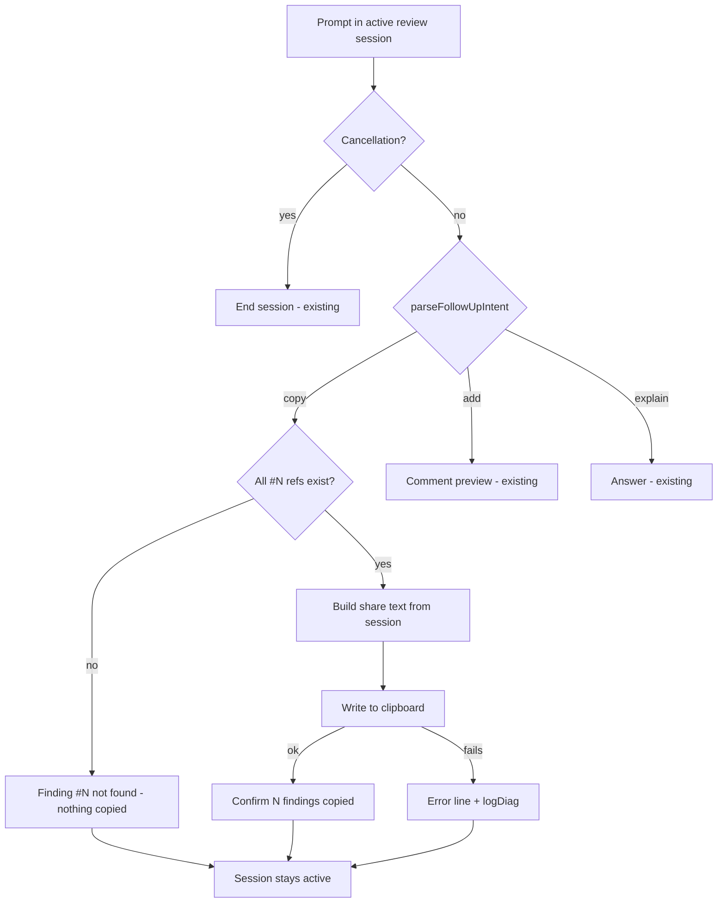

# Bitbucket Review Teams Export - Plan

## Goal Capsule

- **Objective:** A developer can share a completed `@bitbucket` PR review with colleagues in a Microsoft Teams chat in one action, and the pasted text reads cleanly without any hand-editing.
- **Means:** Copy the active review to the clipboard as one plain-text block, grouped by severity (KTD1, KTD4).
- **Product authority:** The Product Contract below wins on behavior. The Planning Contract wins on mechanism within it. `STRATEGY.md` boundaries still apply: nothing leaves the machine without the user doing it.
- **Execution profile:** Standard. Five units, all inside the `@bitbucket` participant and its pure helpers. No new dependency, setting or secret.
- **Stop conditions:** Stop and ask if implementing R5 turns out to require HTML clipboard output, or if the copy command cannot be told apart from existing follow-up phrasing without changing how `add … to review` or `#N` questions behave today.
- **Open blockers:** None.

---

## Product Contract

Product Contract preservation: restructured, no scope change. The brainstorm's three planning-deferred questions are resolved in place, into KTD2, KTD3 and KTD5.

### Summary

After a review, a "Copy for Teams" follow-up chip, or typing `copy`, puts the whole review on the clipboard as one plain-text block. Typing `copy #1 #3` copies only those findings. The block lists findings under Critical / Warning / Suggestion headings and is laid out to read correctly when pasted into Teams, where Markdown is not rendered.

### Problem Frame

A review now renders as up to three severity tables with five columns each. Sharing one in Teams means selecting and copying each table separately. The pasted Markdown tables arrive as raw pipes and separator rows. The clickable `#N` headings, bold markers and command links show up as noise. Colleagues end up with a pasted review that is hard to read, or the developer reformats it by hand.

### Key Decisions

- **Clipboard, not a Teams webhook.** Webhooks only post into channels, not 1:1 or group chats, and would send review content off the machine without a user step. Governs R1, R9. (session-settled: user-directed — chosen over posting via a Teams webhook and over saving a file: works for any chat and keeps sharing a user action)
- **Plain text, not rich formatting.** The VS Code extension clipboard API writes plain text only. Rich formatting would need extra machinery (a webview or OS-specific clipboard calls). Governs R4, R5. (session-settled: user-approved — chosen over rich HTML formatting: no extra mechanism, works on every OS)
- **Grouped list, not tables.** A list reads well in a narrow chat pane and on mobile, and pastes without layout breakage. Governs R3. (session-settled: user-directed — chosen over one combined table and over the current three tables)
- **Selection reuses the review's finding numbers.** `copy #1 #3` uses the same `#N` numbering as `add #1 #3 to review`, so there's nothing new to learn. Governs R7. (session-settled: user-directed — chosen over "always everything" and "everything except muted")

### Requirements

**Triggering**

- R1. After a review completes, a "Copy for Teams" follow-up chip is offered alongside the existing review follow-ups. Clicking it copies the whole review.
- R2. Typing `copy` (or a clear equivalent like "copy for teams") in an active review session copies the whole review. `copy` followed by `#N` references copies only those findings.

**Content and layout**

- R3. The copied text starts with the PR number, PR title, author, target branch and the PR URL. It then lists findings under Critical, Warning and Suggestion headings in that order, leaving out any empty group. Each group heading shows its count.
- R4. Each finding carries its `#N`, severity, file and line (when known), title and full recommendation, laid out so it reads as a distinct block in unformatted text.
- R5. The text contains no Markdown table syntax, no bold/italic markers, no chat command links and no escaping left over from the chat rendering. Emoji severity markers are allowed. The PR URL appears as a bare URL so Teams can auto-link it.
- R6. Low-confidence findings (below `confidenceThreshold`) and location-unverified findings stay in the text with a short visible marker, never silently dropped.
- R7. When specific findings are requested, only those appear, still grouped by severity. The header notes that it is a selection (e.g., "2 of 7 findings").
- R8. A review with no findings copies the header plus a "No issues found" line.

**Feedback and session**

- R9. Copying writes only to the local clipboard. Nothing is sent anywhere else.
- R10. After copying, chat shows a short confirmation naming how many findings were copied and suggesting to paste into Teams. The review session stays active so further follow-ups (`#N` questions, `add … to review`, another copy) keep working.
- R11. Unknown `#N` references in a copy request get the same "Finding #N not found. The review has findings #1–#M." answer the `add` path already gives. Nothing is copied in that case.

### Acceptance Examples

- AE1. **Covers R2, R3, R4, R10.** **Given** a review with 2 critical and 3 warning findings, **when** the user clicks "Copy for Teams", **then** the clipboard holds a header with the PR URL, a "Critical (2)" group and a "Warning (3)" group, no Suggestion group, and chat confirms "5 findings copied".
- AE2. **Covers R7.** **Given** a review with findings #1–#7, **when** the user types `copy #1 #3`, **then** only #1 and #3 are in the text, each under its own severity heading, and the header says 2 of 7.
- AE3. **Covers R6.** **Given** a finding whose anchor could not be located, **when** the review is copied, **then** that finding appears without a line number and with a "location unverified" marker.
- AE4. **Covers R11.** **Given** a review with findings #1–#4, **when** the user types `copy #9`, **then** nothing is copied and chat answers "Finding #9 not found. The review has findings #1–#4."
- AE5. **Covers R2.** **Given** the user moved on to another prompt so the review session expired, **when** they type `copy`, **then** it is not treated as a copy request (there is no review to copy). The user reruns the review to share it.

### Success Criteria

- Pasting the copied text into a Teams 1:1 or group chat (desktop and web) produces a readable message with no manual cleanup: no stray pipes, asterisks, backslashes or `command:` links.

### Scope Boundaries

- Sharing follow-up answers (`#N` explanations, diff-aware answers) is out of scope. Only the review's findings are exported.
- Posting to Teams directly (webhook or Graph API) and saving to a file are out of scope (see Key Decisions).
- Rich-text (HTML) clipboard output is out of scope.
- Other destinations (Slack, email, a Jira comment) are not goals. The plain text may happen to work there too.
- Changing how the review renders in VS Code chat is out of scope.
- A `copy` typed while an "add to review" comment preview awaits confirmation goes to that preview, which is existing detection order. The user confirms or cancels the preview first. No special handling is added.

### Dependencies / Assumptions

- Teams does not render Markdown pasted as plain text, but it does auto-link bare URLs and display emoji. The layout in R3–R5 assumes this.
- Copy relies on the stored review session (`bitbucket.session.review`), which already holds the numbered findings and PR reference. It never re-parses the rendered chat output.

### Sources / Research

- `src/services/PrReviewService.ts` — `formatReview()` renders the three severity tables and neutralizes untrusted strings for trusted chat Markdown. The copy text needs its own plain-text output, not these table rows.
- `src/participant/BitbucketParticipant.ts` — the review-completion step stores `ReviewSession` and returns the `reviewCompleted` follow-up state. The "2b. Multi-turn follow-up on an existing review" branch routes `parseFollowUpIntent` results and already emits the "Finding #N not found" wording.
- `src/participant/reviewSessionState.ts` — `ReviewSession`, `ReviewFinding` (raw, un-neutralized fields), `parseFollowUpIntent`, `computeBitbucketFollowups` (`BITBUCKET_MAX_FOLLOWUPS = 3`).
- `docs/review-process.md` "Follow-ups" — session lifetime and detection order a copy request slots into.
- `docs/solutions/logic-errors/confirm-cancel-word-list-broadening-swallows-domain-name-collisions.md` — a generic keyword matched too broadly swallowed real replies. This is the reason for KTD3's strict grammar.
- `docs/solutions/workflow-issues/vscode-mock-testing-convention-not-checked-before-inventing-new-one.md` — tests mock `vscode` per test file. `src/test/bitbucketReviewFlow.test.ts` is the recorded-reply harness to extend.
- `STRATEGY.md` Boundaries — no routing of content through third-party services without a user step.

---

## Planning Contract

### Key Technical Decisions

- KTD1. **A new pure formatter builds the share text from `ReviewSession`, next to the other review helpers in `src/participant/reviewSessionState.ts`.** `formatReview()` output is chat-specific, with tables, neutralized brackets and command-link targets, so reusing it would mean stripping it back down. Keeping the formatter pure and `vscode`-free lets Vitest cover R3–R8 directly. It reuses the same severity order and confidence-descending sort within each group that `formatReview()` uses, so the copy lists findings in the same order as the chat.
- KTD2. **The copy command is a strict whole-message grammar, parsed as a new `copy` kind of `FollowUpIntent` and checked before `add`.** The message must consist only of `copy` or `share`, optionally followed by `for teams` or `to teams`, filler words like `all`, `findings` or `review`, and `#N` references. Anything else falls through unchanged, so "can you copy the logic from #2?" is still answered as a question. `all` alongside numbers means everything, as in the `add` parser. Governs R2 mechanism. (Resolves the brainstorm's copy-wording question.)
- KTD3. **`ReviewSession` gains optional PR author and target-branch fields, set at the one review-completion site.** A session saved before this change lacks them, and its header then omits the "by … → branch" part rather than failing. That's acceptable degradation because review sessions are short-lived. (Resolves the brainstorm's session-fields question.)
- KTD4. **The clipboard write uses `vscode.env.clipboard.writeText`.** It is the only clipboard API an extension gets, and it is plain text on every OS (see the plain-text Key Decision, R5). If the write fails, chat shows an error line, logs through `logDiag('bitbucket.share', …)`, and the session stays active.
- KTD5. **Untrusted text is normalized, not neutralized.** Finding titles, recommendations, file paths and the PR title are copied verbatim, except that runs of whitespace and line breaks inside a field collapse to one space and control characters are removed. That keeps each finding a distinct block (R4). `neutralizeMarkdownLinks` is not applied: its fullwidth brackets exist to protect the trusted chat renderer and would leak visible noise into Teams (R5). The exact per-finding layout follows the directional sketch below and is confirmed by the manual Teams paste. (Resolves the brainstorm's layout question.)
- KTD6. **The low-confidence marker uses the current `confidenceThreshold` setting at copy time**, the same value `formatReview()` reads. A location-unverified finding always gets its own marker whatever its confidence, mirroring the muting rule in `formatReview()`.
- KTD7. **The chip is offered on every completed review, including one with no findings.** For findings > 0 it is the third chip, after "Add findings to review" and "Explain finding #1", which fits the existing 3-chip cap. For zero findings it is the only chip, because R8 makes sharing "No issues found" meaningful. The chip's prompt text is `copy for teams`, which KTD2's grammar accepts.

### High-Level Technical Design

Directional sketch of the copied text. The exact spacing and separators may change after the manual paste check (KTD5), as long as R3–R6 still hold.

```text
PR #42 — Fix login race condition
by Jane Doe → main · 2 of 7 findings
https://bitbucket.example.com/projects/PROJ/repos/app/pull-requests/42

🔴 Critical (1)

#1 🔴 src/auth/login.ts:L42 — SQL built from user input
   Recommendation: Use a parameterized query.

🟡 Warning (1)

#3 🟡 src/auth/session.ts (location unverified) — Session not invalidated on logout
   Recommendation: Clear the session cookie in the logout handler.
   (low confidence)
```

Copy request flow inside the existing review-session branch:



---

## Implementation Units

### U1. Plain-text share formatter

**Goal:** A pure function turns a `ReviewSession`, an optional finding selection and a confidence threshold into the plain-text share block.

**Requirements:** R3, R4, R5, R6, R7, R8. Settled decisions via their governed Rs: the plain-text and grouped-list Key Decisions.

**Dependencies:** None.

**Files:**
- Modify `src/participant/reviewSessionState.ts`
- Test `src/test/reviewSessionState.test.ts`

**Approach:**
1. Take the session's findings, filter to the selection when one is given, group them by severity in the order critical → warning → suggestion, and sort each group by confidence, highest first, keeping the original order for ties (KTD1).
2. Header: PR number and title, the author and target-branch line when present (KTD3), the "N findings" or "N of M findings" count (R7), then the bare PR URL.
3. Per finding: `#N`, severity emoji, `file:Lline` or `file (location unverified)`, title, then an indented recommendation line and marker line (KTD5, KTD6).
4. Zero findings: header plus "No issues found" (R8).
5. Normalize every untrusted field per KTD5.

**Patterns to follow:** The severity icons and group order in `PrReviewService.formatReview()`. The `formatSourceConfidence` threshold semantics for "low confidence".

**Test scenarios:**
- Covers AE1. A session with 2 critical and 3 warning findings produces Critical (2) and Warning (3) groups in that order, with no Suggestion group, and the header contains the PR URL on its own line.
- Covers AE2. Selecting #1 and #3 out of 7 includes only those two, each under its own severity heading, and the header says "2 of 7 findings".
- Covers AE3. A location-unverified finding shows no line number and shows "location unverified".
- A finding below the threshold shows a "low confidence" marker. One at or above the threshold does not.
- A finding with no confidence value shows no "low confidence" marker, matching how `formatSourceConfidence` treats it.
- Zero findings produce the header and "No issues found", with no group headings.
- Output contains no `|`, `**`, `](`, `command:` or fullwidth brackets, even when a title contains `[link](command:x)` or `**bold**` (R5).
- A recommendation with embedded line breaks stays on one recommendation line.
- A session without author/branch fields still produces a valid header without the "by" line.
- Within a group, higher-confidence findings come first, and findings with no confidence come last.

**Verification:** All scenarios pass, and the output for a sample session matches the directional sketch.

### U2. Copy command parsing

**Goal:** `parseFollowUpIntent` recognizes a copy request per KTD2 and returns its targets.

**Requirements:** R2, R7. The selection Key Decision via R7.

**Dependencies:** None.

**Files:**
- Modify `src/participant/reviewSessionState.ts`
- Test `src/test/PrReviewService.test.ts` (where the existing `parseFollowUpIntent` tests live)

**Approach:** Add a `copy` variant with `targets: number[] | 'all'`, checked before the `add` test. Match with an anchored, case-insensitive whole-message pattern. Deduplicate `#N` references as `add` does.

**Patterns to follow:** The existing `add` branch of `parseFollowUpIntent` (target extraction, `all` handling).

**Test scenarios:**
- `copy`, `Copy for Teams`, `copy all`, `share` and `copy to teams` all give `copy` with targets `all`.
- `copy #1 #3` and `copy #3, #1` give targets [1, 3] and [3, 1]. `copy #2 #2` gives [2].
- `copy all #2` gives `all`.
- "can you copy the logic from #2?" gives `explain` with findingRef 2.
- "copy this to the review" does not give `copy`.
- `add #1 to review` still gives `add`, and `#2 is this real?` still gives `explain`: no regressions.

**Verification:** New and existing `parseFollowUpIntent` tests pass.

### U3. Store PR author and target branch in the review session

**Goal:** The session carries what R3's header needs.

**Requirements:** R3.

**Dependencies:** None.

**Files:**
- Modify `src/participant/reviewSessionState.ts` (`ReviewSession`)
- Modify `src/participant/BitbucketParticipant.ts` (the review-completion step that writes `bitbucket.session.review`)
- Test `src/test/bitbucketReviewFlow.test.ts`

**Approach:** Add two optional fields to `ReviewSession` and fill them from the fetched `BitbucketPR` (`author.displayName`, `targetBranch`) in `completeReview`, the single completion step the main review and the smart-fallback resume share (KTD3).

**Test scenarios:**
- After a standard review, the stored session holds the mock PR's author display name and target branch.

**Verification:** The stored session in the harness carries both fields. Compile is clean.

### U4. Copy routing, clipboard write and chip

**Goal:** A copy request in an active review session writes the share text to the clipboard and confirms. The follow-up chip is offered after every review.

**Requirements:** R1, R2, R7, R9, R10, R11. The clipboard Key Decision via R1 and R9. KTD4, KTD7.

**Dependencies:** U1, U2, U3.

**Files:**
- Modify `src/participant/BitbucketParticipant.ts` (review-session follow-up branch)
- Modify `src/participant/reviewSessionState.ts` (`computeBitbucketFollowups`)
- Test `src/test/reviewSessionState.test.ts` (chips)
- Test `src/test/bitbucketReviewFlow.test.ts` (end to end; add `env.clipboard.writeText` to that file's `vscode` mock, backed by `vi.hoisted` state)

**Approach:**
1. In the review-session branch, handle `intent.kind === 'copy'` before `add`. For an explicit target list, report the first unknown `#N` with the existing not-found wording and return without copying (R11).
2. Build the text with U1 using `config.confidenceThreshold`, write it with `vscode.env.clipboard.writeText`, and confirm with "Copied N findings — paste into Teams." (or "N of M") (R10).
3. On a write failure, show an error line and log it (KTD4).
4. Every outcome returns the review-session metadata so the session stays live (R10).
5. Log a successful copy at `info` with the count only, never the text.
6. `computeBitbucketFollowups`: add the `copy for teams` / "Copy for Teams" chip per KTD7.

**Execution note:** Start with the end-to-end harness scenario for AE1. It exercises the chip prompt, parser, formatter and clipboard together.

**Patterns to follow:** The `add` handling in the same branch (target resolution, `reviewSessionResult`). The `bitbucketReviewFlow.test.ts` harness (`createHarness`, `turn`, `sessionTurn`).

**Test scenarios:**
- Covers AE1. After a review with findings, turn `copy for teams` puts the full share text on the mocked clipboard, and the chat text says how many findings were copied.
- Covers AE2. `copy #1 #2` on a multi-finding review copies only those, and the confirmation says "2 of N".
- Covers AE4. `copy #9` on a 2-finding review leaves the clipboard untouched, and chat shows "Finding #9 not found. The review has findings #1–#2."
- The result of a copy turn carries `bitbucketSession.kinds` containing `review-session`, and a following `#1` question is still answered from the session.
- Covers AE5. `copy` with no active review-session metadata in history is not treated as a copy (no clipboard write).
- When the clipboard mock rejects, chat shows an error line, the session stays active, and nothing throws.
- `computeBitbucketFollowups` with findingCount 3 returns three chips, the last being "Copy for Teams". With findingCount 0 it returns only "Copy for Teams".
- The existing `reviewCompleted` chip tests are updated to the new expectations.

**Verification:** The harness scenarios pass, and a full `npm test` run shows no regressions in the U6–U11 flow suites.

### U5. Documentation

**Goal:** Users and future agents can find the copy command.

**Requirements:** R1, R2 (discoverability).

**Dependencies:** U4.

**Files:**
- Modify `docs/review-process.md` ("Follow-ups": copy intent, its place in detection order, the plain-text rationale)
- Modify `docs/manual/bitbucket-pr-review.md` ("Follow-ups and posting comments": `copy`, `copy #1 #3`, Teams paste)
- Modify `README.md` (the `@bitbucket` command table)
- Modify `CLAUDE.md` (the `reviewSessionState.ts` key-files row names the share formatter)

**Approach:** Add short entries only, following "Where documentation belongs" in `CLAUDE.md`.

**Test expectation:** none — documentation only.

**Verification:** Every doc mentions the copy command the same way the parser accepts it (KTD2).

---

## Verification Contract

| Gate | Command / action | Applies to |
| --- | --- | --- |
| Type check | `npm run compile` | U1–U4 |
| Unit and flow tests | `npm test` (Vitest, incl. `src/test/reviewSessionState.test.ts`, `src/test/PrReviewService.test.ts`, `src/test/bitbucketReviewFlow.test.ts`) | U1–U4 |
| CI | `.github/workflows/ci.yml` (`npm ci` → compile → test) green on the branch | all |
| Manual paste check | Run a real review in the Extension Development Host, click "Copy for Teams", paste into a Teams chat on desktop and web, and confirm the Success Criteria | U1, U4 |

`npm run test:e2e` is not required. The recorded-reply harness covers the handler path.

---

## Definition of Done

- Every R1–R11 is covered by a passing test or, for the Teams rendering itself, by the manual paste check.
- `npm run compile` and `npm test` are green, and CI is green on the pushed branch.
- The manual Teams paste on desktop and web shows no stray Markdown, escapes or command links.
- The docs in U5 are updated.
- No leftover code from abandoned approaches (e.g., an HTML clipboard attempt) remains in the diff.
