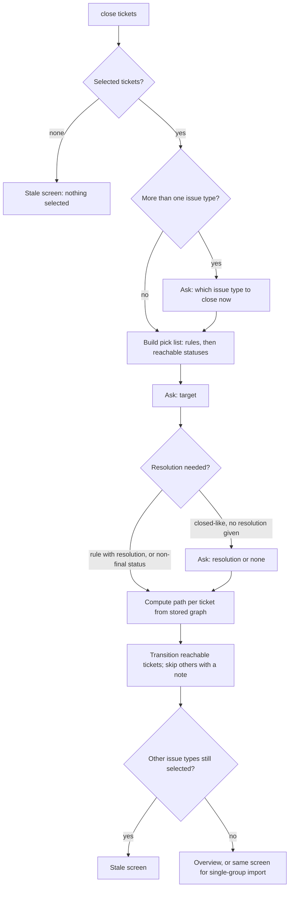

# Stale Ticket Target Pick - Plan

## Goal Capsule

- **Objective:** When a Veracode or Waltz import finds tickets whose findings are gone, the user can move those tickets to the status that fits their project's process, including a non-final status like "Verification", without editing `.jira-templates.json` first.
- **Means:** Ask for the target at close time on the Stale screen, one issue type per close, offering matching cleanup rules and reachable workflow statuses (R1, R2, KTD1).
- **Product authority:** The Product Contract below wins on behavior. The Planning Contract wins on mechanism within it. `docs/report-import.md` ("Stale-ticket detection and inline close") stays authoritative for everything this plan does not change.
- **Execution profile:** Standard. Four units inside the shared report-import flow (`@jira` only), its pure helpers and its docs. No new dependency, setting or secret.
- **Stop conditions:** Stop and ask if the close flow turns out to need a live Jira call from the review-reply path (KTD1 assumes none), or if a single issue-type close cannot be made without changing how the New or Already-ticketed screens behave.
- **Open blockers:** None.

---

## Product Contract

Product Contract preservation: changed: R1, R4 — one issue type per close run, following the user's planning-time decision. R6, R7, R8 and AE3 removed because the user dropped the remembered pick and the moved-ticket marker. R12 and AE6 added for the mixed-issue-type case. The deferred questions are resolved in place, in KTD1 and KTD3.

### Summary

After `close tickets` on the Stale screen, the user picks one target for the tickets being closed: a matching cleanup rule, or any status the workflow can reach. Each close run handles one issue type. When the selection spans several issue types, the user first chooses which one to close now.

### Problem Frame

Today the stale-ticket close takes its target from the first `cleanupRules` entry that matches the ticket's project and issue type. A team that wants stale security findings to go to a non-final review status cannot do that without a separate rule. Even with one, a general cleanup rule for the same project and issue type (for example "close released bugs → Done") gets used first, because matching ignores the rule's name and filters. Tickets with no matching rule are shown but cannot be selected at all.

### Key Decisions

- **The target is chosen at close time, not configured.** (session-settled: user-directed — chosen over a fixed target in config/template and over a config default with override: the target can differ from one import to the next.) Governs R1, R2.
- **The pick list offers matching rules first, then plain reachable statuses.** (session-settled: user-directed — chosen over rules only and over statuses only: a non-final state works without writing a rule, and picking a rule keeps its resolution.) Governs R2, R3, R4.
- **One issue type per close run.** (session-settled: user-directed — chosen over one target for all issue types and over allowing only one current status per selection: each run has one target and at most one resolution question.) Governs R1, R12.
- **Moved tickets are not tracked.** A ticket moved to a non-final status reappears on later imports as an ordinary stale row, unselected by default. (session-settled: user-directed — chosen over a Jira marker label and over matching against a remembered pick: keeps the build simple.) Governs nothing new; see Scope Boundaries.
- **The last pick is not remembered.** (session-settled: user-directed — chosen over preselecting it and over showing it as a hint: with no moved-ticket tracking, nothing else needs the memory.) Governs R1.
- **Waltz gets the same behavior.** Both importers share the stale close flow, and a difference between them on shared ground counts as a bug under `docs/report-import.md`'s consolidation rule. Governs R9.

### Requirements

**Choosing what to close**

- R12. When the selected stale tickets span more than one issue type, `close tickets` first asks which issue type to close now, listing only issue types that have a selected ticket. Tickets of the other issue types stay selected for a later close.
- R1. Each close run covers the selected tickets of exactly one issue type, and the user picks one target for them after `close tickets` (or `ok`), before any ticket is transitioned. The pick starts empty each time.

**Choosing the target**

- R2. The pick list shows every `cleanupRules` entry matching the project and issue type, listed by rule name and target status, followed by every status the selected tickets can reach according to the discovered workflow.
- R3. Picking a rule applies that rule's target status and its resolution.
- R4. Picking a plain status transitions to that status. A resolution is asked once for the run, only when the status is a closed-like one. A non-final status never asks for a resolution.
- R5. Replying `back` or cancelling at any step of the close returns to the Stale screen with nothing transitioned.

**Coverage and eligibility**

- R9. The Veracode and Waltz importers behave identically for R1–R5 and R10–R12.
- R10. A stale ticket with no matching cleanup rule becomes selectable when the discovered workflow for its project and issue type exists.
- R11. A ticket with no discovered workflow, or no path from its current status to the picked target, is left out of the transition with a per-ticket note saying why, and the rest of the run still goes ahead.

### Acceptance Examples

- AE1. Non-final target with no rule. **Covers R2, R4, R10.**
  - **Given:** Project `SEC` has no cleanup rule for `Bug`, and the workflow for `SEC`/`Bug` has been discovered.
  - **When:** The user selects two stale Bug tickets, runs `close tickets`, and picks the status "Verification".
  - **Then:** Both tickets move to "Verification". No resolution is asked.
- AE2. Rule picked over a status. **Covers R2, R3.**
  - **Given:** `SEC`/`Bug` has the rule "Close released bugs" (target "Done", resolution "Fixed").
  - **When:** The user picks that rule.
  - **Then:** The tickets go to "Done" with resolution "Fixed", and no resolution question is asked.
- AE4. Back out of the pick. **Covers R5.**
  - **When:** The pick list is showing and the user replies `back`.
  - **Then:** The Stale screen returns, and no ticket has been transitioned.
- AE5. Unreachable target. **Covers R11.**
  - **Given:** One selected ticket's current status has no path to the picked status.
  - **When:** The close runs.
  - **Then:** That ticket is skipped with a note naming the missing path. The other selected tickets are transitioned.
- AE6. Mixed issue types. **Covers R1, R12.**
  - **Given:** The user selected two stale `Bug` tickets and one stale `Vulnerability` ticket.
  - **When:** The user runs `close tickets` and chooses `Bug`.
  - **Then:** The target pick lists the options for `Bug` only. After the run, the two Bug tickets are transitioned and the Vulnerability ticket is still selected on the Stale screen, ready for another `close tickets`.

### Scope Boundaries

- No fixed or remembered target anywhere: not in `.jira-templates.json`, the import template, a VS Code setting or workspace storage.
- No tracking of tickets already moved to a non-final status. They come back as ordinary stale rows on the next import, because the stale search matches every open ticket with the marker label.
- No reopening or other action when a moved ticket's finding comes back in a later report. Deduplication already treats it as "already ticketed".
- No change to `@jira cleanup` / `@jira run cleanup`, the Language Model tools, or how stale tickets are detected.

### Sources / Research

- `src/participant/jira/cleanupHandler.ts` — `buildStaleTicketGroups()`: the first-match rule lookup, the `targetState ?? 'Done'` fallback, the workflow-cache path check, and `CLOSED_LIKE_STATES` gating the resolution ask.
- `src/utils/reportImport.ts` — `buildStaleSearchJql()`: stale candidates are `resolution is EMPTY` plus the marker label, which is why a ticket moved to a non-final status is flagged again. `buildDedupJql()` has no status filter, so a moved ticket still counts as already ticketed.
- `src/participant/jira/reportImportHandler.ts` — `closeStaleTickets()`, `streamStaleResolutionAsk()`, `continueAfterStaleResolution()`, `runStaleTransitions()`: today's close chain.
- `src/participant/sessionState.ts` — `StaleTicketGroup`, `StaleResolutionAskSession`, `buildStaleGroupScreen()`, `parseResolutionSelection()`, and the guided single-ticket transition helpers (`GuidedTransitionSession`, `buildGuidedTransitionStatusOptions()`, `parseGuidedTransitionStatusPick()`) this plan's pick step mirrors.
- `src/services/WorkflowService.ts` — `WorkflowGraph`, `findPath()`, `loadWorkflowCache()`.
- `docs/report-import.md` — "Stale-ticket detection and inline close" and "Overview and group screens".
- `docs/plans/2026-09-14-1726-feat-veracode-fold-page-stale-plan.md` — the plan that introduced the stale check and chose `cleanupRules` as its only target source.

---

## Planning Contract

### Key Technical Decisions

- KTD1. **Capture everything the close needs when the Stale screen is built.** `buildStaleTicketGroups()` already has the Jira client and workspace root. It stores on each issue-type group the matching cleanup rules and a snapshot of that project/issue type's workflow graph, and stores the project's resolution names once on the stale state. The close then runs from session data alone. The review-reply path (`handleImportReviewReply()`) only receives a `TicketService`, and this mirrors how `resolutionOptions` already travel on the session today. If fetching resolutions fails or returns none, the close proceeds without asking, matching today's fallback.
- KTD2. **Transition paths are computed at close time, from the stored graph.** `findPath()` runs per selected ticket against the picked target. Build time no longer computes paths and no longer requires a cleanup rule (R10). A ticket is ineligible at build time only when its issue type is unknown or no workflow graph exists for its project/issue type, keeping today's notes including the `@jira discover workflow` hint. A ticket already in the picked status, or with no path to it, is skipped at close with a per-ticket note (R11).
- KTD3. **The pick list is rules first, then the union of reachable statuses.** Rule entries show "rule name → target status". Status entries are every status reachable in the stored graph from the current status of at least one selected ticket in the chosen issue type, sorted alphabetically. A status is not dropped because a rule targets it too: picking the plain status transitions without the rule's resolution, per R3/R4.
- KTD4. **One close session with a `step` field replaces the resolution-only ask.** `StaleResolutionAskSession` generalizes to a session with `step: 'pick-issue-type' | 'pick-target' | 'pick-resolution'`, modelled on `GuidedTransitionSession`. It keeps the existing workspace key (`jira.session.staleResolution`) and metadata kind (`stale-resolution-selection`), so `JiraParticipant.ts` routing does not change. Steps are skipped when not needed: no issue-type step when only one type is selected, no resolution step unless R4 requires it. `CURRENT_SESSION_SCHEMA_VERSION` goes from 6 to 7, because `StaleTicketGroup` and the ask session change shape. An in-flight pre-upgrade session is treated as expired, as earlier bumps did.
- KTD5. **The resolution rule reuses today's check.** Closed-like means `CLOSED_LIKE_STATES` in `cleanupHandler.ts`. A rule pick uses `rule.resolution`, and asks only when the rule has none and its target is closed-like, which is today's behavior. Rule subtask settings (`closeSubtasks`, `subtaskTargetState`) stay unused, as today: stale tickets carry no subtasks.
- KTD6. **After a run, the Stale screen stays open while selected tickets remain.** When tickets of another issue type are still selected (R12), the Stale screen is shown again so the next `close tickets` is one reply away. Otherwise today's `afterGroupAction()` behavior applies (overview, or the same screen for a single-group import).
- KTD7. **Wording says "transitioned to <target>", not "closed".** The target may be non-final, so the progress and summary lines name the target status. Internal names (`closedKeys`, `outcomes.closed`) keep their meaning: tickets this session already acted on.

### High-Level Technical Design

Close flow after `close tickets` on the Stale screen. Every "back / cancel" edge returns to the Stale screen with nothing transitioned (R5).

### Assumptions

- The workflow graph for one project/issue type is small enough to store in `workspaceState` alongside the review session. Real graphs are tens of statuses at most.

### Risks

- **The cached graph can be stale.** A path from the snapshot may fail against live Jira. `transitionTickets()` already reports per-ticket failures and `runStaleTransitions()` already points to `@jira discover workflow`, so this surfaces as today's failure line, not a silent miss.
- **KL9 drift.** `docs/manual/report-imports.md` describes the stale close in user terms and must change alongside `docs/report-import.md` (U4).

---

## Implementation Units

### U1. Reachable-status and pick-list helpers

- **Goal:** Pure helpers that build the target pick list and parse the two new picks.
- **Requirements:** R2, R12; KTD3.
- **Dependencies:** None.
- **Files:**
  - `src/services/WorkflowService.ts` (modify: add a reachable-statuses helper next to `findPath()`)
  - `src/participant/sessionState.ts` (modify: pick-list builder, issue-type and target reply parsers)
  - `src/test/WorkflowService.test.ts`
  - `src/test/sessionState.test.ts`
- **Approach:**
  1. Add a BFS reachable-statuses function over `WorkflowGraph`, excluding the start status.
  2. Add a pick-list builder taking the group's matching rules, the stored graph and the selected tickets' current statuses. It returns rule options first, then the alphabetical union of reachable statuses (KTD3), each option tagged as rule or status.
  3. Add reply parsers for the target pick and the issue-type pick, using `pickByNumberOrName()` and the `isCancellation()`/`back` handling that `parseGuidedTransitionStatusPick()` uses.
- **Patterns to follow:** `buildGuidedTransitionStatusOptions()`, `parseGuidedTransitionStatusPick()`, `parseResolutionSelection()` in `src/participant/sessionState.ts`.
- **Test scenarios:**
  - Reachable statuses from "Open" in a three-status chain returns both later statuses and not "Open" itself.
  - A cycle in the graph terminates and lists each status once.
  - A status with no outgoing edges returns an empty list.
  - Pick list with one matching rule and a graph: the rule comes first, labelled with its target, then the statuses in alphabetical order.
  - Pick list where a rule targets "Done" and "Done" is also reachable: "Done" appears both as the rule and as a plain status.
  - Pick list for tickets in two different current statuses lists the union of what either can reach.
  - Pick list with no matching rule lists statuses only.
  - Target reply by number, by name (case-insensitive), `back`, `cancel`, and an unknown word each map to the right result.
  - Issue-type reply by number and by name picks that type; an unknown word is invalid.
- **Verification:** The helpers exist with unit coverage for the scenarios above, and none imports `vscode`.

### U2. Stale groups without a fixed target

- **Goal:** Stale-group building stops choosing the target, and instead stores what the close-time pick needs.
- **Requirements:** R10, R11; KTD1, KTD2, KTD4.
- **Dependencies:** U1.
- **Files:**
  - `src/participant/jira/cleanupHandler.ts` (modify `buildStaleTicketGroups()`)
  - `src/participant/sessionState.ts` (modify `StaleTicketGroup`, `ReviewSessionStale`, `StaleResolutionAskSession`, `buildStaleGroupScreen()`, `CURRENT_SESSION_SCHEMA_VERSION`)
  - `src/test/cleanupHandler.test.ts`
  - `src/test/sessionState.test.ts`
- **Approach:**
  1. `buildStaleTicketGroups()` groups by issue type as today. It collects all `cleanupRules` entries matching project + issue type, not only the first, and snapshots the cached graph for that project/issue type.
  2. A ticket is ineligible only when its issue type is unknown or no graph exists (KTD2). "No cleanup rule" is no longer a reason. Tickets default to `included: false`, as today.
  3. Fetch resolution names once, when at least one group is eligible, and store them on the stale state (KTD1). Catch a failed fetch locally and store an empty list, so a resolutions-API error cannot drop the whole stale section through the caller's catch in `continueAfterImportIssueType()`.
  4. `StaleTicketGroup` drops the build-time `targetState`/`ruleName`/`resolution`/`resolutionOptions` and per-ticket `transitionPath` in favour of the stored rules and graph. The ask session becomes the stepped close session (KTD4). The schema version goes from 6 to 7.
  5. `src/test/cleanupHandler.test.ts` switches its `WorkflowService` mock to the partial mock described in U3's execution note.
  6. The Stale screen's "→ To" and "Resolution" columns show that both are chosen on close, and the close hint explains that one issue type is closed per run when the selection spans several.
- **Patterns to follow:** existing `buildStaleTicketGroups()` ineligible-note shape, and the schema-bump comments above `CURRENT_SESSION_SCHEMA_VERSION`.
- **Test scenarios:**
  - Covers AE1. A Bug ticket in a project with no cleanup rule but a cached `SEC`/`Bug` graph is eligible and selectable.
  - A ticket whose project/issue type has no cached graph is ineligible, with the `@jira discover workflow` note.
  - A ticket with no known issue type stays ineligible with today's note.
  - Two matching cleanup rules for the same project + issue type are both stored on the group.
  - Resolution names are fetched once and stored. A fetch that returns none stores an empty list without failing the build.
  - A resolutions fetch that throws still produces the stale groups, with an empty resolution list.
  - The Stale screen renders an eligible ticket without a fixed target, and ineligible tickets with their notes.
  - A session stored with schema version 6 reads as expired.
- **Verification:** Stale groups build without any cleanup rule. The screen renders, and existing tests that depended on the rule-chosen target are updated to the new shape.

### U3. Stepped close flow

- **Goal:** `close tickets` runs issue-type choice, target pick and resolution ask, then transitions one issue type's selected tickets.
- **Requirements:** R1, R3, R4, R5, R9, R11, R12; KTD2, KTD4, KTD5, KTD6, KTD7.
- **Dependencies:** U1, U2.
- **Files:**
  - `src/participant/jira/reportImportHandler.ts` (modify `closeStaleTickets()`, replace `streamStaleResolutionAsk()`/`continueAfterStaleResolution()` with the stepped equivalents, modify `runStaleTransitions()`)
  - `src/participant/jira/veracodeHandler.ts`, `src/participant/jira/waltzHandler.ts` (re-export renames only, if any)
  - `src/participant/JiraParticipant.ts` (only if the handler names it calls change; routing key and kind stay per KTD4)
  - `src/test/reportImportHandler.test.ts`
- **Approach:**
  1. `closeStaleTickets()` collects selected, not-yet-acted-on tickets. With none it keeps today's message. With several issue types it opens the close session at `pick-issue-type`, otherwise at `pick-target`.
  2. If the pick list for the chosen issue type is empty (no matching rule and no selected ticket can reach any status in the stored graph), open no close session. Say the selected tickets have no reachable status in the cached workflow, suggest `@jira discover workflow <project> <issueType>`, and re-render the Stale screen with nothing transitioned.
  3. At `pick-target`, render the U1 pick list as clickable replies (`buildChatCommandLink()` through `trustedChatMarkdown()`), plus `Back`.
  4. On a pick, decide per KTD5 whether a resolution is needed. If so, move to `pick-resolution` using the stored resolution names and `parseResolutionSelection()`. Otherwise run.
  5. Run: for each selected ticket of the chosen issue type, compute the path from the stored graph (KTD2). Skip tickets already there or unreachable with a note, and pass the rest to `transitionTickets()` with the chosen resolution.
  6. Mark transitioned tickets in `closedKeys`, update outcomes, and word the summary per KTD7. Return to the Stale screen or overview per KTD6.
  7. `back`/cancel at any step clears the close session and re-renders the Stale screen (R5). The superseded-import guard from `continueAfterStaleResolution()` stays on every step.
- **Execution note:** Start by updating the existing "Stale-ticket review + transition (U6)" tests in `src/test/reportImportHandler.test.ts` to the new flow, so the old rule-first behavior visibly fails before the new flow replaces it. Both `src/test/reportImportHandler.test.ts` and `src/test/cleanupHandler.test.ts` mock `../services/WorkflowService` with only `loadWorkflowCache` and a fixed `findPath` return. Switch them to a partial mock that keeps the real `findPath` and the U1 reachable-statuses helper and mocks only `loadWorkflowCache`, then drive the stale tests from a mocked cache graph. Otherwise the new export is undefined and AE5 and AE6 cannot be exercised.
- **Patterns to follow:** today's `continueAfterStaleResolution()` (superseded guard, back handling, parked review session); the guided transition flow's step handling in `JiraParticipant.ts`.
- **Test scenarios:**
  - Covers AE1. One Bug ticket selected, no rule: `close tickets` shows the pick; picking "Verification" transitions it and asks no resolution.
  - Covers AE2. Picking the rule "Close released bugs" transitions to "Done" with "Fixed" and asks nothing.
  - A rule with a closed-like target and no resolution asks the resolution once, then transitions with the answer.
  - A plain closed-like status ("Done") asks the resolution once; answering `none` transitions without one.
  - Covers AE4. `back` at the target pick returns to the Stale screen and transitions nothing; the same holds at the issue-type and resolution steps.
  - Covers AE5. Two tickets selected, one with no path to the picked status: that one is skipped with a note naming the missing path, and the other is transitioned.
  - A selected ticket already in the picked status is skipped with an "already in" note, not counted as transitioned.
  - Covers AE6. Bug and Vulnerability tickets selected: `close tickets` asks for the issue type, choosing Bug lists Bug options only, and afterwards the Vulnerability ticket is still selected and the Stale screen is shown.
  - A second `close tickets` never re-transitions a ticket already acted on.
  - The same scenarios pass through the Waltz descriptor as through Veracode (R9), at least for AE1 and AE6.
  - A reply after a newer import claimed the session key cancels the close without transitioning.
  - An invalid reply at any step re-shows that step.
  - Selected tickets that can reach no status and have no matching rule: `close tickets` opens no pick, shows the discover-workflow hint and returns to the Stale screen with nothing transitioned.
- **Verification:** The close flow meets R1–R5, R11, R12 in handler tests for both descriptors, and the transition summary names the target status.

### U4. Documentation

- **Goal:** Docs describe the close-time pick and no longer say `cleanupRules` is the only target source.
- **Requirements:** R1–R5, R9–R12 (documentation of them).
- **Dependencies:** U3.
- **Files:**
  - `docs/report-import.md` ("Stale-ticket detection and inline close")
  - `docs/manual/report-imports.md` ("Stale tickets" bullet)
  - `docs/manual/jira-templates-and-cleanup-rules.md` (how cleanup rules appear in the stale pick, if the page covers stale close)
- **Approach:**
  1. Replace "No new setting exists for the stale-ticket target status; `cleanupRules` is the sole source" with the pick behavior, the one-issue-type-per-close rule and the ineligibility reasons.
  2. State that tickets moved to a non-final status reappear as ordinary stale rows.
  3. Keep `CLAUDE.md` unchanged: its existing report-import line and link still hold.
- **Test expectation:** none -- documentation only.
- **Verification:** A reader of either page can tell how to send stale tickets to a non-final status without editing `.jira-templates.json`.

---

## Verification Contract

| Gate | Command | Applies to |
|---|---|---|
| Type check | `npm run compile` | U1–U3 |
| Unit and handler tests | `npm test` | U1–U3 (`WorkflowService.test.ts`, `sessionState.test.ts`, `cleanupHandler.test.ts`, `reportImportHandler.test.ts`) |
| CI | `.github/workflows/ci.yml` (`npm ci` → `npm run compile` → `npm test`) | whole branch |

`npm run test:e2e` is not required: it needs a real VS Code instance and is not run in CI.

## Definition of Done

- `npm run compile` and `npm test` are green on the branch.
- AE1, AE2, AE4, AE5 and AE6 each have a passing test that names them.
- The stale close never transitions a ticket without an explicit target pick, and never touches tickets of an issue type other than the one chosen for the run.
- `@jira cleanup` / `@jira run cleanup` tests pass unchanged.
- `docs/report-import.md` and `docs/manual/report-imports.md` match the new behavior.
- No leftover code from abandoned approaches, and no unused exports from the old resolution-only ask.
