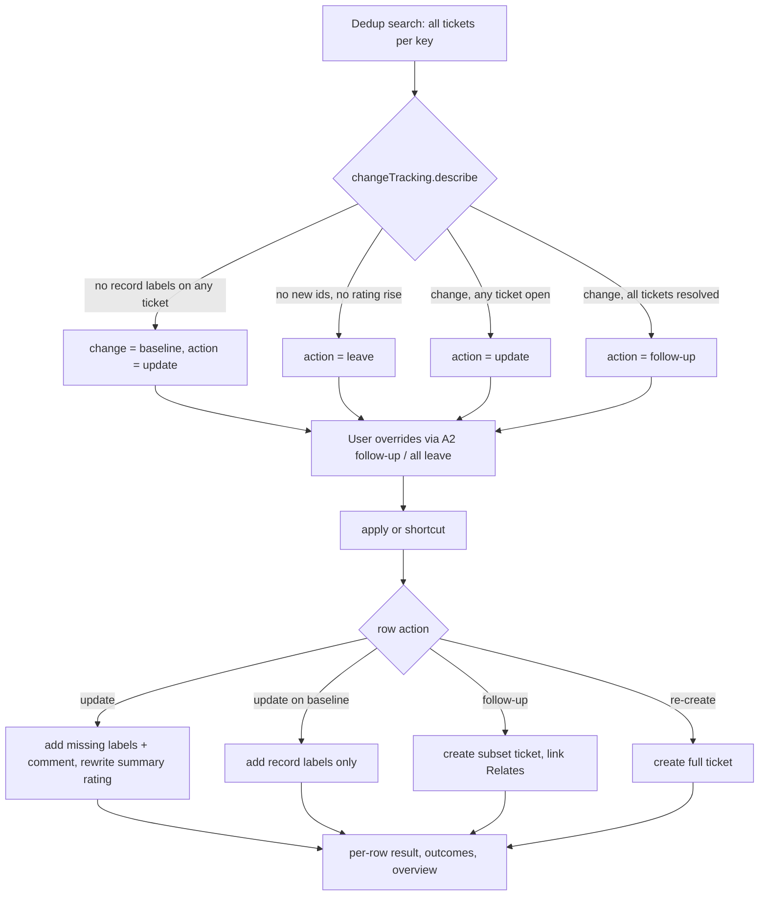

# Import Ticket Updates Parity - Plan

## Goal Capsule

- **Objective:** A user re-importing a Veracode or Waltz report can bring already-ticketed items up to date with what changed, choosing per item whether the change goes onto the existing ticket or onto a new one, and both importers behave the same way while doing it.
- **Product authority:** This Product Contract. The overview-hub rule that nothing is created, updated, re-created or closed except by an action the user chose inside its group (`docs/plans/2026-09-23-1400-feat-report-import-overview-hub-plan.md`, R11) stays in force.
- **Means:** one change-tracking hook on the shared report-import descriptor, driving a per-row action executor that replaces the bulk update and re-create actions (KTD2, KTD5).
- **Open blockers:** None.
- **Stop conditions:** Stop and ask if implementation shows that Jira rejects the label shape in KTD3, or that issue linking is disabled on the target instance in a way the warning path of R14 cannot absorb.
- **Execution profile:** `ce-work` or a human, unit by unit in U-ID dependency order; `npm run compile` and `npm test` green before each commit.

---

## Product Contract

### Summary

Both importers get one Already-ticketed screen where every row shows what changed since its ticket was made and a proposed action — update, follow-up, re-create or leave — which the user can change per row before replying `apply`.
Waltz learns to detect changes on components it already ticketed (new CVEs on the same version, a higher rating).
Veracode's bulk `update tickets` and `re-create tickets` become shortcuts into the same per-row model.

### Problem Frame

Re-importing a Waltz report today lists every previously ticketed component as "Already ticketed" and offers only a full re-create.
A component that gained CVEs or moved from High to Critical looks identical to one that did not change, so the existing ticket silently falls behind the report.

Veracode can already add new findings to existing tickets, but only for every changed row at once.
A user cannot say "this one goes on the existing ticket, that one needs its own ticket", which matters when the existing ticket is already in a sprint, owned by another team, or resolved.
The dedup search also matches resolved tickets, so the bulk update can add findings to a ticket nobody is looking at anymore.

Stale-ticket closing and the overview hub are already shared by both importers on `main` and are not part of this problem.

### Key Decisions

- **What counts as a Waltz change: new CVEs on the same component version, and a higher worst rating.** Governs R1. (session-settled: user-directed — chosen over also treating a newer version of the same library as the same ticket: a version bump keeps producing a new ticket plus a stale one.)
- **One per-row action model for both importers, replacing the bulk commands.** Governs R5–R10. (session-settled: user-directed — chosen over separate bulk commands per action and over a sub-menu per action: one screen, smart defaults, one `apply`.)
- **Both a follow-up (new findings only) and a full re-create are offered.** Governs R6, R14, R15. (session-settled: user-directed — chosen over offering only one of the two: not everything fits in one ticket, and a full fresh ticket is still sometimes wanted.)
- **A resolved ticket defaults to follow-up, but the user may still update it.** Governs R7. (session-settled: user-directed — chosen over blocking updates to resolved tickets and over no special case.)
- **Pre-existing Waltz tickets get a baseline recorded through `apply`, not automatically.** Governs R4, R13. (session-settled: user-directed — chosen over parsing old descriptions, over an automatic write during the dedup step, and over an in-memory-only comparison: keeps the no-write-without-action rule and avoids a flood of "new CVE" comments.)
- **Several tickets per item are read as one union; updates target the newest open one.** Governs R3, R11. (session-settled: user-directed — chosen over comparing against the newest ticket only and over one row per ticket.)
- **A rating rise rewrites the summary's rating suffix as well as commenting.** Governs R12. (session-settled: user-directed — chosen over comment only and over also changing Jira priority: the ticket list should show the current rating, and no rating-to-priority mapping exists.)
- **Follow-ups are joined to the original by a real Jira "relates to" link.** Governs R14. (session-settled: user-directed — chosen over a text mention only and over link plus text mention.)
- **`update tickets` and `re-create tickets` stay as shortcuts.** Governs R10. (session-settled: user-directed — chosen over removing them: existing habits keep working.)

### Requirements

**Change detection**

- R1. A Waltz already-ticketed component has a change when the report lists a CVE that none of the component's tickets record, or when its worst rating is higher than the highest rating any of its tickets record.
- R2. A Veracode already-ticketed row has a change when its folded group contains a flaw id that none of the group's tickets carry — today's rule, unchanged.
- R3. An item's known findings are the union across every ticket carrying its dedup key; a finding recorded on any of them is not new.
- R4. A Waltz ticket that records no CVEs or rating (created before this feature) shows its change as "baseline" rather than listing every CVE as new.

**Already-ticketed screen**

- R5. Veracode and Waltz show the same Already-ticketed screen: each row names its target ticket and that ticket's status, a one-line change summary (e.g. "+2 CVEs, High→Critical", "+1 flaw", "baseline", "—"), and its current action, alongside the importer's own item columns.
- R6. The row actions are `update`, `follow-up`, `re-create` and `leave`; `follow-up` is offered only on a row with new findings, and `update` only on a row with a change or a baseline.
- R7. Each row's proposed action is: no change → `leave`; change and the target ticket is open → `update`; change and every ticket for the item is resolved → `follow-up`; baseline → `update`.
- R8. The user changes a row with `<row id> <action>` (e.g. `A2 follow-up`) or every eligible row with `all <action>`; an action not offered on a row is rejected with a message and changes nothing.
- R9. Replying `apply` runs every row whose action is not `leave`, at most 50 (`BATCH_LIMIT`) rows per reply; rows beyond the cap stay pending and the reply says how many remain.
- R10. `update tickets` runs only the rows currently set to `update`, and `re-create tickets` only the rows currently set to `re-create`, under the same cap as R9.

**Actions**

- R11. `update` writes to the item's target ticket — its newest open ticket, or its newest ticket when all are resolved: it records the new findings on the ticket and posts one comment listing them, and for Waltz the comment also names a rating rise.
- R12. On a Waltz rating rise, `update` also replaces the rating at the end of the ticket's summary; a summary that no longer ends in the previously imported rating is left untouched and the comment says so.
- R13. `update` on a baseline row records the component's current CVEs and rating on the ticket without posting a comment or changing the summary.
- R14. `follow-up` creates a new ticket with the batch's picked template and issue type, containing only the new findings, carrying the item's dedup record plus the new findings, and linked "relates to" the item's newest ticket; if the link fails, the ticket is kept and the user sees a warning that is also logged.
- R15. `re-create` creates a full ticket as today, and that ticket counts as one of the item's tickets on later imports.
- R16. After `apply`, each row reports its own result; one row failing does not stop the others, and the overview counts updates, follow-ups and re-creates separately.

**Documentation**

- R17. The user manual (`docs/manual/report-imports.md`) and `docs/report-import.md` describe the per-row actions, defaults, reply words, the baseline, and the Waltz change rules.

### Key Flows

- F1. Re-import with changes
  - **Trigger:** The user imports a Veracode or Waltz report whose items were ticketed before, and opens the Already-ticketed group from the overview.
  - **Steps:** The screen lists every already-ticketed row with its change and proposed action (R5, R7). The user overrides some rows (R8). The user replies `apply` (R9). Each row runs its action (R11–R15) and reports its result (R16). The overview returns with updated counts.
  - **Outcome:** Existing tickets reflect the report where the user chose `update`; separate linked tickets exist where the user chose `follow-up`; nothing else was written.
  - **Covered by:** R5–R16

### Acceptance Examples

- AE1. **Covers R7.** Given three already-ticketed Waltz components — log4j-core 2.14.1 with 2 new CVEs and ticket PROJ-12 In Progress, jackson-databind 2.9 with 1 new CVE and ticket PROJ-8 Done, commons-text 1.9 with no change — when the screen opens, the proposed actions are `update`, `follow-up` and `leave`.
- AE2. **Covers R3, R11.** Given jackson-databind 2.9 has PROJ-8 (Done, CVE-A) and follow-up PROJ-30 (Open, CVE-B), when the report lists CVE-A, CVE-B and CVE-C, only CVE-C is new and `update` writes to PROJ-30.
- AE3. **Covers R4, R13.** Given PROJ-5 was created by a Waltz import before this feature, when the report is re-imported, the row shows "baseline" with action `update`; after `apply`, PROJ-5 records its CVEs and rating, has no new comment, and the next import shows the row as "—".
- AE4. **Covers R12.** Given PROJ-12's summary is `[OSS] log4j-core 2.14.1 — High` and the rating is now Critical, `update` changes it to `[OSS] log4j-core 2.14.1 — Critical`; given a user renamed it to `log4j upgrade`, the summary stays and the comment notes the rating rise.
- AE5. **Covers R14.** Given `follow-up` on PROJ-8 and the link request fails, the new ticket exists, the row reports it with a warning that the link is missing, and the Output Channel logs the failure.
- AE6. **Covers R6, R8.** Given row A3 has no change, `A3 follow-up` is rejected with a message and A3 keeps `leave`.

### Scope Boundaries

- A newer version of the same library stays a new ticket, and the older version's ticket goes stale; linking the two is not part of this work.
- Stale detection and closing, the overview hub and the New group are unchanged.
- Email import is unchanged; it has no dedup and no Already-ticketed group.
- Jira priority is not changed by a rating rise.
- Descriptions of existing tickets are never rewritten; changes arrive as comments.

### Dependencies / Assumptions

- The Jira client can read issue links but cannot create them, so `follow-up` needs a new issue-link write operation.
- A "resolved" ticket means a ticket with a resolution set, the same test the stale search uses (`resolution is EMPTY` for open).

### Sources / Research

- `src/participant/jira/reportImportHandler.ts` — `executeUpdateExistingTickets` (Veracode's current bulk update) and `recreateTicketedRows` (current re-create) are what the per-row actions replace.
- `src/utils/reportImport.ts` — `buildDedupJql` has no resolution filter; `buildReviewRows` sets `hasUnsyncedFindings`, today's change flag.
- `src/participant/jira/waltzHandler.ts`, `src/utils/waltzReport.ts` — Waltz dedup key is `sanitizeComponentLabel(nameVersion)`; summary format `[OSS] <nameVersion> — <maxVulnRating>`.
- `src/participant/sessionState.ts` — Already-ticketed screen and reply parsing (`buildTicketedGroupScreen`, `parseImportReviewReply`).
- `docs/plans/2026-09-14-1726-feat-veracode-fold-page-stale-plan.md` — origin of Veracode's update action; `docs/plans/2026-09-23-1400-feat-report-import-overview-hub-plan.md` — per-group screens and the no-write-without-action rule.

**Product Contract preservation:** Product Contract unchanged; the three "Deferred to Planning" questions are answered by KTD1, KTD3 and KTD8 and removed from the Product Contract.

---

## Planning Contract

### Key Technical Decisions

- KTD1. **The dedup search returns every ticket per dedup key, with its labels, resolution and creation date.** `findAlreadyTicketed` moves from a key→first-ticket map to key→ticket list; the search adds `resolution` and `created` to its requested fields. The row's target is the unresolved ticket with the latest `created` (ties: highest key number), or the newest ticket overall when every ticket is resolved; known findings are the union of all its tickets' labels. Implements R3, R7, R11; replaces `extractDedupMap`'s "first match wins".
- KTD2. **One optional `changeTracking` hook on `ReportImportDescriptor` replaces `updateExisting`.** It supplies: the record labels an item's current findings map to, a change describer (new finding ids, rating rise, baseline) given the known labels, the update comment builder, the follow-up ticket builder, and an optional summary rewriter. Veracode and Waltz both configure it; email omits it and keeps its screen unchanged. Implements R1, R2, R4–R15 without importer-specific branches in the shared handler.
- KTD3. **Waltz records findings as labels: `oss-cve-<id>` per CVE and one `oss-rating-<rating>`.** Ids and ratings are lower-cased and pass through the same character sanitizing as `sanitizeComponentLabel`. The rating label is replaced (not accumulated) on update. Implements R1, R4, R13. (session-settled: user-directed — chosen over a hidden Jira issue property and over labelling only the top-N CVEs: labels arrive free with the dedup search and never miss a low-severity CVE.)
- KTD4. **New Waltz tickets get the CVE and rating labels at creation.** The New group's `buildLabels` adds them, so every ticket created after this ships has a baseline without a later `apply`. Keeps R4's baseline state limited to pre-existing tickets.
- KTD5. **A single executor, `executeTicketedActions`, runs `apply` and both shortcuts.** It takes the set of actions to run (all non-`leave` for `apply`, one action for a shortcut), caps at `BATCH_LIMIT`, runs `update` rows with the existing 8-way bounded concurrency and creation rows (`follow-up`, `re-create`) sequentially. `executeUpdateExistingTickets` and `recreateTicketedRows` are removed. Implements R9, R10, R16.
- KTD6. **Issue linking is a new `IJiraClient.createIssueLink` POST to `/rest/api/2/issueLink` with type "Relates".** POST is never retried (existing `fetchWithRetry` rule). Exposed as `TicketService.linkIssues`. Implements R14.
- KTD7. **The Already-ticketed reply grammar is `<row id> <action>`, `all <action>`, `apply`, plus `update tickets` / `re-create tickets` (and legacy `update existing tickets`).** A bare row id no longer toggles re-create and is rejected as invalid. Confirmation words (`ok`, …) map to `apply` on this screen, since it now has a single run action. Implements R8–R10.
- KTD8. **Session schema version bumps from 7 to 8.** Row shape changes (`action`, `allowedActions`, `change`, `target`), so an in-flight review from the old version expires through the existing `isSessionExpired` path and the user re-runs the import.
- KTD9. **Each Action cell lists every allowed action as its own clickable link, current one in bold.** Links send `<row id> <action>` via `buildChatCommandLink`. Implements R5, R8. (session-settled: user-directed — chosen over one link that cycles actions and over typed-only replies.)
- KTD10. **Follow-up tickets reuse each importer's existing description builder on a subset.** Veracode builds from the folded group filtered to new flaw ids; Waltz builds from the component with only the new CVEs. The summary gets a ` (follow-up to <KEY>)` suffix so the two tickets are distinguishable in lists. Implements R14.

### High-Level Technical Design

Row action lifecycle on the Already-ticketed screen:

### Assumptions

- CVE ids from Waltz are short enough that `oss-cve-<id>` stays well under the 250-character label budget `waltzReport.ts` already uses.
- The "Relates" link type exists on target Jira instances (it is a Jira default); when it does not, R14's warning path applies.

---

## Implementation Units

### U1. Jira issue-link write

- **Goal:** Let `TicketService` link two issues with a "Relates" link.
- **Requirements:** R14; KTD6.
- **Dependencies:** none.
- **Files:** `src/jira/IJiraClient.ts`, `src/jira/JiraApiClient.ts`, `src/test/mocks/MockJiraClient.ts`, `src/services/TicketService.ts`, `src/test/JiraApiClient.test.ts`, `src/test/TicketService.test.ts`.
- **Approach:**
  1. Add `createIssueLink(inwardKey, outwardKey, typeName)` to `IJiraClient`.
  2. Implement it in `JiraApiClient` as a POST through `fetchWithRetry`, throwing `JiraApiError` on failure like `addComment`.
  3. Record calls in `MockJiraClient` and let tests make it throw.
  4. Add `TicketService.linkIssues(fromKey, toKey)` with an `onDiag` info line.
- **Patterns to follow:** `addComment` in `JiraApiClient` and `TicketService`; the "Adding a new Jira operation" checklist in `CLAUDE.md`.
- **Test scenarios:**
  - `createIssueLink` sends one POST to `/rest/api/2/issueLink` with type name, inward and outward keys.
  - A 400 response raises `JiraApiError` carrying status 400 and is not retried.
  - `linkIssues` calls the client once and logs through `onDiag`.
- **Verification:** Both test files pass; the mock and interface compile.

### U2. Waltz record labels and change builders

- **Goal:** Waltz can express a component's findings as labels, detect a change against known labels, and build the update comment, follow-up content and rewritten summary.
- **Requirements:** R1, R4, R12, R13, R14; KTD3, KTD4, KTD10.
- **Dependencies:** none.
- **Files:** `src/utils/waltzReport.ts`, `src/test/waltzReport.test.ts`.
- **Approach:**
  1. Add builders for `oss-cve-<id>` and `oss-rating-<rating>` labels and a parser that reads CVE ids and the recorded rating back from a label list.
  2. Extend `buildLabels` with those labels (KTD4).
  3. Add a change describer returning new CVE ids, a rating rise (old → new, compared with the existing `vulnRatingRank`), or baseline when no record label is present.
  4. Add an update-comment builder (new CVEs table, rating rise line, optional "summary not changed" note), a follow-up description builder over the new CVEs only, and a summary rewriter that replaces ` — <old rating>` at the end of the summary or directly before a trailing ` (follow-up to <KEY>)` (keeping that suffix), and returns null otherwise.
  5. Every untrusted value goes through `sanitizeCellText`/`sanitizeStandaloneLine` and one `markdownToJiraWiki()` call, as `buildDescriptionWiki` does.
  6. Add the source `WaltzComponent` to `WaltzReviewRow` (mirroring Veracode's `sourceGroup`) so the apply-time comment and follow-up builders can read the new CVEs from the persisted row.
- **Patterns to follow:** `buildDescriptionWiki`, `sanitizeComponentLabel` in `src/utils/waltzReport.ts`; `buildNewFindingsCommentWiki` in `src/utils/veracodeReport.ts`.
- **Test scenarios:**
  - A component with CVE-2021-44228 and rating Critical yields labels `oss-cve-cve-2021-44228` and `oss-rating-critical` alongside the existing component labels.
  - Known labels hold CVE-A and rating High; the report has CVE-A, CVE-B and Critical → new ids [CVE-B], rating rise High→Critical.
  - Known labels hold the component label only → baseline.
  - Known labels already hold every CVE and the same rating → no change.
  - A rating drop (Critical → High) is not a change.
  - Covers AE4. Summary `[OSS] log4j-core 2.14.1 — High` becomes `… — Critical`; summary `log4j upgrade` returns null.
  - `[OSS] jackson-databind 2.9 — High (follow-up to PROJ-8)` becomes `… — Critical (follow-up to PROJ-8)`.
  - A CVE summary containing `{code}` or a line starting with `h1.` is neutralized in the comment and the follow-up description.
- **Verification:** `waltzReport.test.ts` passes; existing Waltz label tests updated for the added labels.

### U3. Multi-ticket dedup and per-row defaults

- **Goal:** Dedup returns every ticket per key, and each already-ticketed row carries its target ticket, change and default action.
- **Requirements:** R2, R3, R4, R6, R7; KTD1, KTD2.
- **Dependencies:** U2 (Waltz describer signature).
- **Files:** `src/utils/reportImport.ts`, `src/test/reportImport.test.ts`.
- **Approach:**
  1. Change `extractDedupMap`/`findAlreadyTicketed` to collect, per dedup key, a list of `{key, labels, resolved, created, status}`; keep per-chunk fault tolerance.
  2. In `buildReviewRows`, for an already-ticketed item, gather all distinct tickets across its keys, pick the target per KTD1, union their labels, and call the descriptor's change describer.
  3. Derive `allowedActions` and the default `action` per R6/R7; retire `hasUnsyncedFindings` and `included` for already-ticketed rows.
  4. With no `changeTracking` hook (email), rows keep today's shape.
- **Patterns to follow:** current `findAlreadyTicketed` chunk loop and `buildReviewRows` id numbering.
- **Test scenarios:**
  - Covers AE1. Three rows (open ticket + change, resolved ticket + change, no change) default to `update`, `follow-up`, `leave`.
  - Covers AE2. PROJ-8 (Done, CVE-A) and PROJ-30 (Open, CVE-B); report has A, B, C → only C new, target PROJ-30.
  - Two open tickets for one key → the later-created one is the target.
  - A baseline row whose only ticket is resolved gets that ticket as its target, so `update` has somewhere to write.
  - Covers AE3 (detection half). A ticket with only the component label → change `baseline`, action `update`, `follow-up` not allowed.
  - A Veracode folded group whose flaws sit on two different tickets unions both tickets' labels (R2 unchanged).
  - One failed search chunk still returns tickets from the other chunks.
- **Verification:** `reportImport.test.ts` passes, including the rewritten dedup-map tests.

### U4. Already-ticketed screen and reply grammar

- **Goal:** Render the shared per-row screen and parse its replies.
- **Requirements:** R5, R6, R8, R10; KTD7, KTD8, KTD9.
- **Dependencies:** U3 (row shape).
- **Files:** `src/participant/sessionState.ts`, `src/test/sessionState.test.ts`.
- **Approach:**
  1. Extend `ReviewRowBase` with `action`, `allowedActions`, `change`, `target` and a per-row `result`; bump `CURRENT_SESSION_SCHEMA_VERSION` to 8.
  2. Rewrite `buildTicketedGroupScreen`: columns `#`, importer columns, Ticket, Status, Change, Action (KTD9 links); footer with `apply` (counting rows not on `leave`), the two shortcut links when they have rows, and the exit line.
  3. After a run, a finished row's Action cell shows its result instead of links (`updated`, `follow-up PROJ-31`, `follow-up PROJ-31 (link missing)`, `re-created as PROJ-32`); finished rows are excluded from later `apply`, `all <action>` and shortcut runs. A failed row shows the error and keeps its links for retry; a row left pending by the cap keeps its links.
  4. Update `countImportGroups` and the overview line to report rows with changes, updated, followed-up and re-created counts.
  5. Rewrite `parseTicketedGroupReply` per KTD7 with new action kinds (`setAction`, `setAllActions`, `apply`, `update`, `recreate`) and reject actions not in a row's `allowedActions`.
  6. Update `describeImportReplyVocabulary` and the command-word disjointness test.
- **Patterns to follow:** `buildNewGroupScreen`, `parseStrictRowToggle`, `IMPORT_COMMANDS`, the existing disjointness unit test.
- **Test scenarios:**
  - The Action cell of an `update` row with a change lists `**update** · follow-up · re-create · leave` as links; a no-change row lists `**leave** · re-create`.
  - `A2 follow-up` returns a set-action reply for A2; `all leave` returns set-all.
  - Covers AE6. `A3 follow-up` on a no-change row is invalid.
  - A bare `A1` is invalid on this screen.
  - `ok` returns `apply`; `update tickets`, `update existing tickets` and `re-create tickets` return their shortcuts.
  - A session with schema version 7 is expired.
  - A row updated in an earlier `apply` shows `updated` with no links and is skipped by a second `apply`; a failed row still shows its action links.
  - Overview reads e.g. "12 components · 3 with changes · 2 updated · 1 follow-up".
- **Verification:** `sessionState.test.ts` passes, including the disjointness test with the new words.

### U5. Apply executor and importer wiring

- **Goal:** Run the chosen actions against Jira and wire both importers to the hook.
- **Requirements:** R9–R16; KTD2, KTD5, KTD10.
- **Dependencies:** U1, U2, U3, U4.
- **Files:** `src/participant/jira/reportImportHandler.ts`, `src/participant/jira/veracodeHandler.ts`, `src/participant/jira/waltzHandler.ts`, `src/utils/veracodeReport.ts`, `src/services/TicketService.ts`, `src/test/reportImportHandler.test.ts`, `src/test/veracodeReport.test.ts`, `src/test/TicketService.test.ts`.
- **Approach:**
  1. Replace `updateExisting` with the `changeTracking` hook on `ReportImportDescriptor` (KTD2) and request `resolution`/`created` in the dedup search.
  2. Add a `TicketService` read-merge-write that adds missing labels and removes labels with a given prefix in one `updateIssue` call, returning the labels it added (`addMissingLabels` only appends, so it cannot replace `oss-rating-*` per KTD3).
  3. Add `executeTicketedActions` (KTD5): `update` → that label operation (removing old `oss-rating-*` for Waltz), comment, summary rewrite via `updateIssue` when the rewriter returns a value; baseline `update` → labels only; `follow-up` → `createTicket` with the subset content, then `linkIssues`, warning and log on link failure; `re-create` → today's creation path.
  4. Record each row's result, update `ImportOutcomes` with a new `followedUp` counter, and return to the overview as today.
  5. Route the new reply kinds in `handleImportReviewReply`; remove `executeUpdateExistingTickets` and `recreateTicketedRows`.
  6. Configure `changeTracking` in `veracodeHandler.ts` (record labels `veracode-issue-<id>`, no rating, no summary rewrite; follow-up via a new `buildFollowUpSummary` over the subset group) and `waltzHandler.ts` (U2 builders).
- **Patterns to follow:** `executeUpdateExistingTickets` (concurrency, split label/comment failure handling), `createOne` (per-row progress lines, `afterCreate` warning path).
- **Test scenarios:**
  - `apply` with rows on update, follow-up, re-create and leave writes to Jira for the first three only.
  - Covers AE3. Baseline `update` adds the record labels and posts no comment; a rebuilt session shows the row as no change.
  - Covers AE4. Waltz rating rise rewrites the summary through `updateIssue` and posts one comment; a renamed summary is left and the comment notes it.
  - Covers AE5. Link failure keeps the follow-up, streams a warning and logs at warn.
  - The Waltz follow-up ticket carries the component label, only the new CVE labels, the current `oss-rating-*` label, and a ` (follow-up to PROJ-8)` summary suffix.
  - After a High→Critical update the ticket has exactly one `oss-rating-*` label, `oss-rating-critical`.
  - 60 rows set to non-leave actions: the first 50 run and the reply says 10 remain.
  - `update tickets` runs only `update` rows; `re-create tickets` only `re-create` rows.
  - A comment failure after labels were added reports "labels updated, comment failed" and counts once, as today.
  - One row's creation failure does not stop the others (R16).
  - Email import's review screen and creation are unchanged.
- **Verification:** `reportImportHandler.test.ts` and `veracodeReport.test.ts` pass; the old "update existing tickets" and overview-hub AE4 tests are rewritten against the new executor.

### U6. User and developer documentation

- **Goal:** Users and developers can find the new screen, actions and Waltz rules.
- **Requirements:** R17.
- **Dependencies:** U5.
- **Files:** `docs/manual/report-imports.md`, `docs/report-import.md`, `CLAUDE.md`.
- **Approach:**
  1. Rewrite the manual's Already-ticketed paragraph around the Action column, defaults, `apply`, shortcuts and follow-ups.
  2. Replace the developer doc's "Update existing tickets" section with the per-row model, KTD1 target rule, Waltz record labels and baseline.
  3. Adjust the `reportImportHandler.ts` key-files line in `CLAUDE.md` (actions: create / apply per-row actions / close).
- **Test expectation:** none — documentation only; `userDocsSync.test.ts` still passes because no settings or commands change.
- **Verification:** Docs name every reply word from KTD7 and no removed wording remains.

---

## Verification Contract

| Check | Command | Applies to |
|---|---|---|
| Type check | `npm run compile` | every unit |
| Unit tests | `npm test` | every unit |
| Docs sync | `npm test` (`src/test/userDocsSync.test.ts`) | U6 |

`npm run test:e2e` is not required; no e2e flow changes shape beyond the import review screen, which unit tests cover.

---

## Definition of Done

- Every R1–R17 is traced to a passing test or, for R17, to the updated docs.
- AE1–AE6 each have a test tagged `Covers AE<N>`.
- `npm run compile` and `npm test` pass on the branch head.
- `executeUpdateExistingTickets`, `recreateTicketedRows`, `updateExisting` and `hasUnsyncedFindings` no longer exist, and no dead code from abandoned attempts remains in the diff.
- Email import behaves exactly as before.
