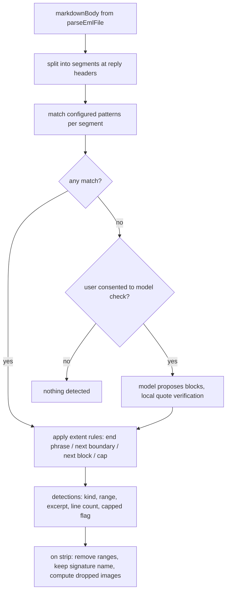

# Email Boilerplate Cleanup - Plan

## Goal Capsule

- **Objective:** Jira tickets and comments created from emails contain the actual message content, not repeated confidentiality headers, legal footers, bulky signatures or signature images, while the user stays in control of what is removed.
- **Product authority:** This Product Contract. Surrounding email-import behavior (batch review, template pick, attachment upload, `.eml` deletion) stays as documented in `docs/report-import.md` except where a requirement below changes it.
- **Means:** A pure, `vscode`-free boilerplate detector over the converted Markdown body, split per message in the thread (KTD1, KTD2), fronted by one new cleanup session step in both email flows (KTD8).
- **Open blockers:** None.
- **Stop conditions:** Stop and ask if implementation shows that detection on the Markdown body cannot tell reply headers apart reliably enough for AE2/AE7/AE8, or that the model fallback would need to send more than one email per call.
- **Product Contract preservation:** Unchanged in scope. AE7 and AE8 added (user-confirmed clarifications of R4 for stacked footers and unrecognized reply headers); the three planning-deferred questions resolved into KTD3, KTD6 and KTD8.

---

## Product Contract

### Summary

Before an email becomes a ticket or a comment, `@jira` detects confidentiality headers, legal footers and signature blocks throughout the thread. It uses the user's configured patterns first. If the user agrees for this batch, the Copilot model covers emails no pattern matched. One preview lists what was found per email. The user then strips or keeps the blocks, and can exclude single emails. Inline images that sit only inside stripped blocks are dropped. Signature authors' names are kept where they can be identified.

### Problem Frame

Emails imported from OWA carry company boilerplate: a confidentiality notice at the top, a legal disclaimer at the bottom, and long signatures with logos and social-media icons. Forwarded threads repeat all of it for every quoted message. Today the full body becomes the ticket description or comment verbatim, and every attachment, including inline signature images, is uploaded to the ticket. Tickets end up dominated by noise, and the attachment list fills with logo files.

### Key Decisions

- **Configured patterns first, model as a fallback.** Known company texts are removed the same way every time; the model only covers what patterns miss. Governs R2, R3. (session-settled: user-directed — chosen over model-only detection, pattern-only detection, and fixed built-in heuristics: predictable for known texts, still works without setup.)
- **The model runs only after a per-batch yes.** Email import makes no model calls today, and these are bank emails marked confidential. Governs R3. (session-settled: user-directed — chosen over an opt-in setting and on-by-default: the user decides per run whether content leaves for the model.)
- **Patterns live in user settings.** Governs R1. (session-settled: user-directed — chosen over the shared `.jira-templates.json` and a merged team+personal model: simpler to edit; each user keeps their own list.)
- **One batch-wide preview, not a per-row column or a silent setting.** Governs R6, R7. (session-settled: user-directed — chosen over a toggle column in the review table and an off/ask/always setting: the user sees what will be cut before deciding.)
- **Strip every occurrence, including quoted history.** Governs R4. (session-settled: user-directed — chosen over outer-message-only and disclaimers-everywhere-but-outer-signature-only: cleanest ticket.)
- **Images are removed only by position, not by fingerprint.** Governs R9. (session-settled: user-directed — chosen over also stripping known images by content hash and over stripping only the importing user's own signature: nothing to configure.)
- **Both email flows get the cleanup.** Governs R11. (session-settled: user-directed — chosen over batch ticket creation only: comments get the same noise.)
- **Keep the author's name best-effort; no header fallback.** Governs R5. (session-settled: user-directed — chosen over falling back to the sender's display name when the signature has no name: a nameless signature is removed completely.)

### Requirements

**Detection**

- R1. Users configure known confidentiality-header, legal-footer and signature patterns in a user-level `ticketSidekick.email.*` setting; with no patterns configured, detection relies on R3 alone.
- R2. Each email is checked against the configured patterns, and every matching block is recorded with its kind (header, footer, signature).
- R3. When at least one email in the batch has no pattern match, the user is asked once per batch whether the Copilot model may look at those emails; the model runs only on a yes, and only for those emails.
- R4. Detection covers the whole thread, so blocks repeated inside quoted or forwarded messages are found as well as the outer message's.

**Signature handling**

- R5. When a signature block is stripped, the author's name in it is kept on a best-effort basis; a signature with no recognizable name is removed completely.

**Preview and decision**

- R6. Before the batch review (or before the comment preview in the single-file flow), one preview lists, per email, which block kinds were found, a short excerpt of each, and the number of images that would be dropped.
- R7. The user replies once for the whole batch to strip or keep the detected blocks, and can exclude individual emails from stripping by row id.
- R8. For a block the model found, the preview offers to save it as a pattern, so the same text is caught by R2 next time without the model.

**Images and attachments**

- R9. An inline image that appears only inside stripped blocks is removed from the description and is not uploaded as an attachment; an image also used in the kept body stays.

**Scope of effect**

- R10. Emails with nothing detected, and emails the user kept or excluded, are imported exactly as today.
- R11. The cleanup applies to both batch ticket creation from emails and the single-file "add email as comment" flow.

### Key Flows

- F1. Batch import with cleanup
  - **Trigger:** The user imports one or more `.eml` files by any existing entry point.
  - **Steps:** The files are parsed. The configured patterns run (R2, R4). If any email has no match, the user is asked whether the model may look (R3). The preview is shown (R6, R8). The user replies strip/keep and optionally excludes rows (R7). The existing template pick, review and creation continue with the cleaned bodies and the reduced attachment set (R9).
  - **Covered by:** R2–R9, R11
- F2. Add email as comment with cleanup
  - **Trigger:** `@jira add email <KEY>` with a single file.
  - **Steps:** Same detection and preview as F1 for the one email, then the existing comment preview and posting.
  - **Covered by:** R11

### Acceptance Examples

- AE1. **Covers R3.** Given three emails where two match configured patterns, when the batch is parsed, the user is asked once whether the model may look at the one unmatched email; on "no", that email shows "nothing detected" in the preview and imports unchanged.
- AE2. **Covers R4.** Given a forwarded thread with the company disclaimer under each of four quoted messages, when the user chooses strip, all four disclaimers are removed.
- AE3. **Covers R5.** Given a signature "Best regards, Anna Schmidt, Senior Analyst, Phone …, [logo]", when stripped, "Anna Schmidt" stays and the title, phone and logo are removed. Given a signature "BR" plus a logo, when stripped, nothing of it stays.
- AE4. **Covers R9.** Given a logo image referenced once in a stripped signature and once in the kept body, when stripped, the logo stays inline and is still uploaded.
- AE5. **Covers R7.** Given a batch of five emails with detections, when the user replies strip and excludes row 3, emails 1, 2, 4, 5 are cleaned and email 3 imports unchanged.
- AE6. **Covers R8.** Given the model found a footer that no pattern matched, when the user accepts "save as pattern", the next import catches the same footer through the patterns without asking about the model.
- AE7. **Covers R4, R6.** Given a mail chain whose three legal footers are stacked one after the other at the very end, with a signature above them, when detected, the preview lists three footers plus the signature for that email, and stripping removes all three footers while keeping the signature author's name.
- AE8. **Covers R4.** Given a mail chain where one quoted message's reply header is in an unrecognized format, when a signature without end phrase is detected above it, the block stops at the length cap instead of running to the end of the email, and the preview shows its line count.

### Scope Boundaries

- Recognizing signature images by content fingerprint outside a detected block (e.g. a logo in the middle of the body).
- Team-shared patterns in `.jira-templates.json`.
- Falling back to the header's display name when a signature has no recognizable name.
- Keeping stripped text anywhere: if `ticketSidekick.email.deleteEmlAfterImport` is on, stripped blocks are gone for good. Accepted by the user.

### Dependencies / Assumptions

- The model fallback uses the same Copilot Language Model access the rest of `@jira` already uses; no new provider.
- Per-batch model consent is not remembered between batches.

- No real multi-message `.eml` chains exist in the repo; tests start from synthetic fixtures modeled on OWA/Outlook output and can be swapped for anonymized real samples later.

### Sources / Research

- `src/utils/emlParser.ts` — `parseEmlFile()` converts the HTML body to Markdown and collects all attachments, inline ones included; the single shared entry point for all three `.eml` entry points.
- `src/participant/jira/emailHandler.ts` — the batch descriptor's `afterCreate` uploads every attachment of a row; the single-file comment flow likewise uploads all of `session.attachments`.
- `docs/report-import.md` "EML email import (batch)" — the current batch flow this feature inserts into.
- `docs/plans/2026-09-03-2108-feat-batch-email-import-plan.md` — batching decisions for email import.

---

## Planning Contract

### Key Technical Decisions

- KTD1. **Detect on the converted Markdown body, not raw HTML.** `parseEmlFile()` already turns every inline image into a `[📎 name]` marker, so "is this image inside a stripped block" (R9) becomes a text check, and plain-text emails take the same path. Cost: patterns match rendered text, not HTML structure. Governs R2, R9.
- KTD2. **Split each body into per-message segments before matching.** A segment boundary is a recognized reply header: `From:`/`Sent:` (or `Date:`)/`To:`/`Subject:` and German `Von:`/`Gesendet:`/`An:`/`Betreff:`, in both the bold form `htmlToMarkdown` produces from OWA HTML and the plain-text form, plus `-----Original Message-----`/`-----Ursprüngliche Nachricht-----`. Each segment carries its sender display name for KTD6. Governs R4.
- KTD3. **Patterns are plain phrases with a kind and an optional end phrase.** One user setting, `ticketSidekick.email.boilerplatePatterns`, holds `{ kind: "header" | "footer" | "signature", start: string, end?: string }` entries. Matching is case-insensitive, collapses whitespace, and ignores Markdown emphasis markers. No regular expressions: a malformed regex in a user setting is a silent failure mode for the people least able to debug it. Governs R1, R2.
- KTD4. **Block extent rules.** With `end`: through the line containing the end phrase, within the same segment. Without `end`: a header covers its paragraph; a footer or signature runs until the earliest of the next segment boundary, the start of the next matched block (so stacked footers stay separate blocks, AE7), the end of the segment, or a length cap of 40 non-empty lines (tunable during implementation; guards AE8). A capped block is marked as capped in the preview. Governs R4, R6.
- KTD5. **The model proposes, local code verifies.** One call per unmatched email via `withLmRetry` (`src/utils/lmRetry.ts`), using the chat request's model. The body is framed as untrusted data. The reply is JSON: blocks with `kind`, `startQuote`, `endQuote`, and optional `authorName`. A block survives only if both quotes occur verbatim (under KTD3 normalization) and in order in the body. Bodies over 30,000 characters are not sent and show as "too long for model check". A failed or unparseable call leaves that email as "nothing detected" and is logged via `logDiag('jira.email', …)`. Governs R3.
- KTD6. **Name retention heuristic.** In a stripped signature, keep one line: first a line containing the segment's sender-name tokens; otherwise a line right after a closing phrase that looks like a personal name (2–4 capitalized words, no digits, `@`, or URL, not itself a closing phrase); for model-found blocks, the verified `authorName` if it occurs in the block. Otherwise nothing is kept. The header's display name is used only to recognize the line, never inserted. Governs R5.
- KTD7. **Image removal follows the text.** After stripping, images whose `[📎 name]` marker appears only in removed text are dropped from the upload set by matching `isInline` attachments on name. A marker that also appears in kept text keeps its image. Governs R9.
- KTD8. **One new session step in front of both flows.** A new `EmailCleanupSession` (`workspaceState` key `jira.session.emailCleanup`, metadata kind `email-cleanup`) has a `consent` phase (only when some email has no pattern match) and a `preview` phase. Its target is either a batch (then `buildImportTemplateSession`/`streamImportTemplateSelection` as today) or a comment (then `streamEmailCommentPreview` as today). When nothing is detected and no consent is needed, the step is skipped silently and the existing flow runs unchanged (R10). Replies use `buildChatCommandLink()` chips: `model check`/`skip model`, then `strip`, `keep`, row-id toggles, and `save <n>` for model-found blocks. The Command Palette command stores a `pending` cleanup session instead of a template session, and the chat turn it opens runs detection. Governs R6, R7, R11.
- KTD9. **"Save as pattern" writes the block's first and last line.** `save <n>` appends `{ kind, start: <first line>, end: <last line> }` to the user's global `boilerplatePatterns` via `ConfigurationTarget.Global`, trimmed to at most 200 characters per phrase. Governs R8.

### High-Level Technical Design

Detection pipeline for one email (directional):



Session steps in front of the existing flows:

```mermaid
stateDiagram-v2
  [*] --> Detect
  Detect --> Consent: some email unmatched
  Detect --> Preview: all matched, something detected
  Detect --> Existing: nothing detected
  Consent --> Preview: model check / skip model
  Preview --> Existing: strip / keep
  Existing --> [*]
  note right of Existing: batch: template pick and review\ncomment: comment preview
```

### Assumptions

- `request.model` is available in every chat turn that reaches the consent phase. The Command Palette path always lands in chat before detection runs (KTD8).
- The OWA reply-header shapes in KTD2 match what `htmlToMarkdown` currently emits. The synthetic fixtures in U1 pin that assumption.

---

## Implementation Units

### U1. Thread segmentation, pattern matching and block extent

- **Goal:** A pure detector that turns a Markdown body plus configured patterns into per-segment blocks.
- **Requirements:** R2, R4; KTD1–KTD4; AE2, AE7, AE8.
- **Dependencies:** none.
- **Files:** `src/utils/emailBoilerplate.ts` (new), `src/test/emailBoilerplate.test.ts` (new), `src/test/fixtures/eml/chain-owa-en.eml`, `src/test/fixtures/eml/chain-owa-de.eml`, `src/test/fixtures/eml/chain-plaintext.eml`, `src/test/fixtures/eml/chain-stacked-footers.eml` (new, synthetic).
- **Approach:** No `vscode` import. Segment first, then match within each segment, then apply KTD4 extents. Record for each block its kind, line range, excerpt (first line), non-empty line count, capped flag and source (`pattern` or `model`).
- **Patterns to follow:** `src/utils/reportImport.ts` for pure, Vitest-loadable helpers. Fixtures are loaded through `parseEmlFile()` the way `src/test/emlParser.test.ts` does.
- **Test scenarios:**
  - Covers AE2. An English OWA chain with the same disclaimer under four messages yields four footer blocks, one per segment.
  - A German OWA chain (`Von:`/`Gesendet:`/`An:`/`Betreff:`) splits into the right number of segments.
  - A plain-text chain with `-----Original Message-----` splits correctly.
  - Covers AE7. Three stacked footers at the end yield three separate footer blocks plus the signature above them.
  - Covers AE8. A signature without end phrase above an unrecognized reply header stops at the 40-line cap and is flagged capped.
  - A pattern with an end phrase covers exactly start line through end line.
  - A header pattern covers only its paragraph.
  - Matching ignores case, collapsed whitespace, and `**bold**` markers around the phrase.
  - No configured patterns and no matches yield an empty detection list.
- **Verification:** All scenarios pass under `npm test`; the module has no `vscode` import.

### U2. Stripping, name retention and image selection

- **Goal:** Apply confirmed detections to an email item and return the cleaned body and attachment set.
- **Requirements:** R5, R9, R10; KTD6, KTD7; AE3, AE4.
- **Dependencies:** U1.
- **Files:** `src/utils/emailBoilerplate.ts`, `src/test/emailBoilerplate.test.ts`.
- **Approach:** Remove block ranges back to front so indices stay valid. Signature blocks keep the KTD6 name line. Collapse the blank-line runs left behind. Compute dropped inline images per KTD7 and return a new item; never mutate the input (the keep path and excluded rows need the original).
- **Test scenarios:**
  - Covers AE3. "Best regards / Anna Schmidt / Senior Analyst / Phone … / [📎 logo.png]" keeps only "Anna Schmidt" and drops `logo.png` from the attachments.
  - Covers AE3. "BR / [📎 logo.png]" is removed completely.
  - A quoted segment's signature keeps the name matching that segment's `From:` name, not the top sender's.
  - Covers AE4. A logo marker in both a stripped signature and the kept body stays inline and stays in the upload set.
  - Non-inline attachments are never dropped.
  - An email with no detections comes back unchanged (R10).
- **Verification:** Scenarios pass; the cleaned body still converts through `buildEmailJiraWiki()` without leftover markers for dropped images.

### U3. Pattern setting and save-as-pattern

- **Goal:** Users can configure patterns, and model-found blocks can be saved as new ones.
- **Requirements:** R1, R8; KTD3, KTD9; AE6.
- **Dependencies:** U1.
- **Files:** `package.json` (`contributes.configuration` email section), `src/utils/emailBoilerplate.ts` (a pure `resolveBoilerplatePatterns()` validator and a `buildPatternFromBlock()` helper), `src/participant/jira/emailHandler.ts` (the settings write), `docs/manual/settings-reference.md`, `src/test/emailBoilerplate.test.ts`.
- **Approach:** The validator drops entries with an unknown kind or an empty `start`, and logs each dropped entry once via `logDiag`. The setting description tells users what a pattern is and where the block ends (KTD4). Default: `[]`.
- **Patterns to follow:** `resolveSizeLimitSetting()` in `src/utils/reportImport.ts` for validated settings reads; `src/test/userDocsSync.test.ts` enforces the settings-reference entry.
- **Test scenarios:**
  - Valid entries pass through; an unknown kind, a missing `start` and a non-object entry are dropped.
  - Covers AE6. A pattern built from a model-found footer detects the same footer in the same email on a second run.
  - Phrases longer than 200 characters are trimmed when built.
  - `userDocsSync.test.ts` passes with the new setting documented.
- **Verification:** `npm run compile` and `npm test` pass, including `userDocsSync.test.ts`.

### U4. Model fallback with local verification

- **Goal:** Emails with no pattern match can be checked by the model after consent, without trusting unverified output.
- **Requirements:** R3; KTD5; AE1.
- **Dependencies:** U1.
- **Files:** `src/utils/emailBoilerplate.ts` (pure prompt builder, reply parser, quote verifier), `src/participant/jira/emailHandler.ts` (the call through `withLmRetry`), `src/test/emailBoilerplate.test.ts`.
- **Approach:** Reuse `extractJsonObject()` for tolerant parsing. Verified model blocks enter the same KTD4 structure with source `model`, so U2 and the preview treat them uniformly.
- **Patterns to follow:** `resolveFindingAnchors()` in `src/participant/reviewSessionState.ts` for quote verification. `parseIntent()` in `src/participant/jira/llmHelpers.ts` for the role-setup message shape.
- **Test scenarios:**
  - A reply whose start and end quotes both occur in order becomes a model block.
  - A reply quoting text not in the body is dropped.
  - A reply with the end quote before the start quote is dropped.
  - An `authorName` that does not occur inside the block is discarded.
  - Non-JSON, empty and wrapper-object replies parse to zero blocks without throwing.
  - A body over 30,000 characters is not sent and is reported as too long.
  - The prompt builder places the body inside a clearly delimited untrusted-data section.
- **Verification:** Scenarios pass; no email content reaches the model unless the consent reply was given in that batch.

### U5. Cleanup session, preview and batch-flow wiring

- **Goal:** The consent and preview steps run in front of batch ticket creation from every entry point.
- **Requirements:** R3, R6, R7, R8, R10, R11; KTD8; F1; AE1, AE5, AE7.
- **Dependencies:** U1–U4.
- **Files:**
  - `src/participant/sessionState.ts`: `EmailCleanupSession` type, the `email-cleanup` kind, and pure `buildEmailCleanupPreview()`/`parseEmailCleanupReply()`.
  - `src/participant/jira/emailHandler.ts`: detection orchestration and phase handlers.
  - `src/participant/JiraParticipant.ts`: routing for the `email-cleanup` kind.
  - `src/extension.ts`: the Command Palette stores a pending cleanup session.
  - Tests: `src/test/sessionState.test.ts`, `src/test/emailHandler.test.ts`.
- **Approach:**
  1. `startEmailBatchImport()` and the Command Palette path hand parsed items to detection instead of straight to `buildImportTemplateSession()`.
  2. The preview lists, per email: row id, subject, block kinds with counts, excerpt, line counts (with "capped" where set), and dropped image count. Model-found blocks get a `save <n>` chip.
  3. On `strip`/`keep`, apply U2 to the included rows, then continue into the existing template pick.
- **Patterns to follow:** How `EmailTemplateSelectionSession` is stored and expired (`isSessionExpired`). `trustedChatMarkdown()` for chip lines only, with email-derived excerpts passed through `neutralizeMarkdownLinks()` (see `docs/solutions/security-issues/jira-native-wiki-trigger-neutralization-in-shared-markdown-converter.md`). `withLastTicket`/metadata conventions from `docs/solutions/best-practices/every-ticket-referencing-branch-must-carry-lastTicketKey-on-metadata.md` where a ticket key is referenced.
- **Test scenarios:**
  - Covers AE1. Two matched emails and one unmatched email produce one consent screen; `skip model` leads to a preview showing "nothing detected" for the third.
  - Covers AE5. `strip` with row 3 excluded yields cleaned items 1, 2, 4, 5 and the original item 3 in the template session.
  - Covers AE7. A stacked-footer email shows "3 footers, 1 signature" with line counts in the preview.
  - An import with nothing detected and all emails matched-or-empty goes straight to the template pick with no extra screen.
  - An email excerpt containing a `command:` link renders inert in the preview.
  - An expired cleanup session shows `SESSION_EXPIRED_MESSAGE` and clears the key.
  - `save 2` on a model-found block calls the settings write with the built pattern; `save` on a pattern-found block is rejected with a hint.
- **Verification:** Scenarios pass under `npm test`; `npm run compile` is clean; a manual e2e run with a synthetic chain fixture shows the consent → preview → template pick sequence.

### U6. Comment-flow wiring and documentation

- **Goal:** `@jira add email <KEY>` gets the same cleanup, and user and developer docs describe it.
- **Requirements:** R11; F2.
- **Dependencies:** U5.
- **Files:**
  - `src/participant/jira/emailHandler.ts` (`handleAddEmailFromChat` comment branch).
  - `src/test/emailHandler.test.ts`.
  - Docs: `docs/report-import.md`, `docs/manual/report-imports.md`, `README.md` (only if its email table lists reply words), and `CLAUDE.md` (a one-line key-files entry for `src/utils/emailBoilerplate.ts` plus a one-line flow summary linking `docs/report-import.md`).
- **Approach:** The comment branch builds a single-item cleanup session with a comment target. `addEmailAsComment()` uploads the cleaned attachment set instead of all attachments.
- **Test scenarios:**
  - A single email with a detected footer shows the preview. `strip` then leads to the comment preview without the footer, and only the kept attachments are uploaded after `post it`.
  - `keep` leads to today's comment preview unchanged.
- **Verification:** Scenarios pass; the docs describe the setting, the consent step, reply words and the name rule; `userDocsSync.test.ts` passes.

---

## Verification Contract

| Gate | Command | Applies to |
|---|---|---|
| Type check | `npm run compile` | every unit |
| Unit tests | `npm test` | every unit; must be green before each commit (CLAUDE.md) |
| Docs sync | `npm test` (includes `src/test/userDocsSync.test.ts`) | U3, U6 |
| Participant e2e | `npm run test:e2e` (local VS Code only, not in CI) | U5, U6 manual confirmation |

CI (`.github/workflows/ci.yml`) runs `npm ci`, `npm run compile` and `npm test` on push and pull request.

## Definition of Done

- Every AE1–AE8 has at least one passing test named for it.
- `npm run compile` and `npm test` are green.
- `src/utils/emailBoilerplate.ts` has no `vscode` import.
- No email content reaches the model without the consent reply in that batch (U4 verification).
- An import with no patterns configured and consent declined behaves exactly like today (R10).
- Docs updated per U6; `CLAUDE.md` gains only index lines, no flow prose.
- No leftover experimental or abandoned-approach code in the diff.
