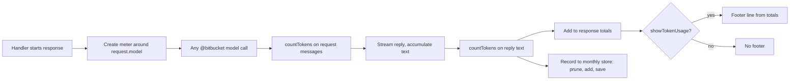

# Bitbucket Token Usage - Plan

## Goal Capsule

- **Objective:** `@bitbucket` users see token consumption only when they ask for it, and can look up how many input and output tokens each model consumed over the last three months, accurately enough to compare against current API prices themselves.
- **Product authority:** The user (repository owner) decided every point below in the brainstorm dialogue. `@jira` and price calculation are not active scope.
- **Means:** Decorate the chat model once per response to count tokens, and keep monthly per-model counters in VS Code's global state (KTD1, KTD4).
- **Open blockers:** None.

## Product Contract

### Summary

The `~N estimated tokens` line under `@bitbucket` answers becomes an opt-in setting, default off. When on, it shows one line with input tokens, output tokens, and the model. Separately, every `@bitbucket` model call adds its tokens to a local per-month, per-model counter. `@bitbucket usage` shows the stored months as a table. Counters older than the current month plus the two before it are deleted. The extension contains no prices.

### Problem Frame

Today the token line appears under every review, follow-up answer, and comment refinement and cannot be turned off. It is a `chars/4` guess that merges input and output into one number, so it cannot be matched against API prices, which differ for input and output and per model. Nothing records usage over time, so a month of reviews cannot be totalled. The user wants a quiet default, trustworthy counts, and the data needed to do the price comparison themselves.

### Key Decisions

- **Tokens only, no prices.** Prices change and Copilot does not expose them; the table is the input to the user's own comparison. Governs R9.
- **Only input and output are tracked.** VS Code's model API exposes neither cache reads, cache writes, nor reasoning tokens. Governs R4, R6.
- **Counting is always on; only the footer is optional.** Otherwise `@bitbucket usage` would be empty for anyone who has not enabled the footer. Governs R5.
- **Counters are per model.** Price differs per model, so merged totals would be useless for comparison. Governs R5, R8.
- **Three-month retention, pruned on write.** Keeps the stored data small without a background job. Governs R7.
- **Footer format is a single line (session-settled: user-directed — chosen over a per-pass breakdown and a line with the monthly total: the user picked the minimal line).** Governs R3.
- **`@bitbucket usage` is a chat table (session-settled: user-directed — chosen over a short comparison and a Command Palette report: the user picked the per-model table).** Governs R8.

### Requirements

**Token footer**

- R1. A setting turns the token footer on or off; its default is off.
- R2. With the setting off, no token line appears under any `@bitbucket` answer (review, follow-up, comment refinement).
- R3. With the setting on, each such answer ends with one line: `_Tokens: <in> in · <out> out · <model> · budget <K>_`, with `budget` shown only where the previous line showed one.
- R4. The line's figures are totals across every model call made for that answer, with input and output reported separately. Figures come from the model's own token counter; when it is unavailable for a call, the old `chars/4` estimate is used for that call and the line marks the figures as estimated.

**Usage tracking**

- R5. Every `@bitbucket` model call adds its input and output tokens to a counter keyed by calendar month (local time) and model, whether or not the footer is on.
- R6. A counter stores only month, model identifier, input tokens, output tokens, call count, and an estimated-figures flag. No PR content, titles, URLs, or user text is stored.
- R7. When a counter is written, counters for months older than the current month and the two before it are deleted.
- R8. `@bitbucket usage` replies with a table of all stored months, one row per month and model: month, model, input, output, calls. Rows containing estimated figures are marked. With nothing stored, it says so instead of showing an empty table.
- R9. The extension holds no price data and shows no costs.

**Documentation**

- R10. User-visible changes (setting, `@bitbucket usage`, the footer wording) are reflected in the user manual and domain docs as the project's documentation rules require. All wording, setting descriptions, and docs are in English.

### Acceptance Examples

- AE1. **Covers R1, R2.** Given a fresh install, when a PR review completes, then no token line appears under the answer.
- AE2. **Covers R3, R4.** Given the footer is on and a review made calls totalling 41,230 input and 6,840 output tokens on one model, then the answer ends with `_Tokens: 41,230 in · 6,840 out · <model> · budget <K>_`.
- AE3. **Covers R4.** Given the token counter fails for one call, then that call is counted with the `chars/4` estimate and the footer marks the totals as estimated.
- AE4. **Covers R5.** Given the footer is off, when a follow-up answer is produced, then the current month's counter for that model still increases.
- AE5. **Covers R7.** Given counters exist for July, August, September, and October 2026, when October's counter is next written, then July's counter is deleted and the other three remain.
- AE6. **Covers R8.** Given two models were used in October and one in September, then `@bitbucket usage` shows three rows with input, output, and call counts. Given nothing is stored, it shows a short "no usage recorded" message.

### Scope Boundaries

**Deferred for later**

- Prices and cost calculation (live fetch, built-in table, or user-entered prices).
- Token footers or usage tracking for `@jira`.
- A Command Palette report, per-call-type breakdown, or CSV export.
- Syncing usage across machines.

**Outside this plan**

- Tracking cache reads, cache writes, or reasoning tokens (not exposed by the model API).
- Matching Copilot's real billing (flat rate or premium requests).

Key flows are omitted: the behavior is two independent one-step outputs (a footer line and a table), fully covered by the requirements and examples.

### Dependencies / Assumptions

- Assumes the model API's token counter is available for most calls; the estimate fallback (R4) covers the rest.
- Every model call within one `@bitbucket` response uses the model the user selected in chat, so a footer names exactly one model.

### Sources / Research

- Token footer sites and heuristic: `src/participant/BitbucketParticipant.ts` (four `estimated tokens` call sites; `callLLMOnce` is the `sendRequest` path for reviews and follow-ups; comment refinement goes through `generateContent` in `src/participant/jira/llmHelpers.ts`, which also calls `model.sendRequest`).
- Existing documentation of the footer: `docs/review-process.md` ("Token estimate"), `docs/manual/bitbucket-pr-review.md`, `docs/bitbucket-follow-up-improvements.md`.
- Settings docs sync: `docs/manual/settings-reference.md`, enforced by `src/test/userDocsSync.test.ts`, which also requires every slash command to appear in the `README.md` tables.
- Boolean-setting precedent: `ticketSidekick.bitbucket.showConnectionInfo` and `detailedDiagnostics` (`src/services/ConfigService.ts`, `src/bitbucket/IBitbucketClient.ts`).
- Pure-helper precedent: `src/participant/bitbucket/reviewDiagnostics.ts` and `src/test/reviewDiagnostics.test.ts`.

## Planning Contract

Product Contract preservation: restructured, no scope change. The multi-model assumption and the four Deferred-to-Planning questions are resolved below (one model per response; setting key; storage; slash command). All R-IDs and AE-IDs are unchanged.

### Key Technical Decisions

- KTD1. **Meter by decorating the chat model, once per response.** The handler wraps `request.model` in a proxy that overrides only `sendRequest`; every `@bitbucket` call, including comment refinement through the shared Jira helper, then goes through it with no Jira code change. Chosen over threading a counter through about nine call sites. Serves R3, R4, R5.
- KTD2. **Count at the request boundary.** Input comes from `model.countTokens` on the request messages once the provider accepts the request; output comes from `countTokens` on the streamed text when the stream ends, breaks, or is abandoned. Every accepted attempt counts, retries included, because the provider processed those tokens. A request the provider rejects counts nothing. Governs R4, R5.
- KTD3. **Estimate per count, not per response.** When `countTokens` throws, that one figure falls back to `ceil(chars / 4)` on the same text and the call is flagged estimated. Governs R4, R6.
- KTD4. **Storage is `ExtensionContext.globalState`, key `bitbucket.tokenUsage`,** shaped `{ [YYYY-MM]: { [modelId]: { input, output, calls, estimated } } }`, accessed through an injected get/update interface so tests use a fake. Chosen over `workspaceState` because usage belongs to the user across workspaces. Governs R5, R6, R7.
- KTD5. **Writes are serialized by a promise chain inside one service instance.** Two windows writing in the same instant can still lose an update; that is accepted and registered as KL11. Governs R5.
- KTD6. **No `vscode` import in the new logic.** `src/utils/tokenUsage.ts` (store, retention, formatters) and `src/participant/bitbucket/tokenMeter.ts` (the decorator, typed against a structural model interface) stay Vitest-loadable, per the project's testing rule. Only `BitbucketParticipant.ts` touches `vscode`.
- KTD7. **Model key is `model.id`,** shown as-is in the footer and the table. Governs R3, R5, R8.
- KTD8. **Setting is `ticketSidekick.bitbucket.showTokenUsage`** (boolean, default `false`), named after `showConnectionInfo`. Governs R1, R2.
- KTD9. **`usage` is routed right after `check`,** before connection-info output, session detection, and the Bitbucket-configured gate, so it works without credentials. It answers to `@bitbucket /usage` and to a prompt that is exactly the word `usage` (case-insensitive); any prompt containing a PR URL is never a usage request. Governs R8. Inside an active review session, a reply that is exactly `usage` is therefore treated as this command, not as a follow-up question.
- KTD10. **The old character tallies are removed.** Once the footer is built from the meter, nothing reads `inputChars`/`outputChars`; the funnel and diagnostic record never did. Their accumulators, the stored-session fields, and `runContinuation`'s `promptChars`/`responseChars` return values go with the old footer.

### High-Level Technical Design

### System-Wide Impact

- `@jira` and the Language Model tools are untouched; the tools never call a model.
- Comment refinement runs through a Jira-owned helper, but only the model object passed in is wrapped, so Jira's own calls stay unmetered.
- Each model call adds two `countTokens` calls. Deep reviews make many calls, so this adds a small amount of latency per call.

### Risks & Dependencies

- Token counts come from the editor's tokenizer for the chosen model and exclude chat-message framing, so they will differ slightly from provider billing. The docs say so.
- A `Proxy` over a VS Code model object must bind methods to the original object, or property and method access can break. U2's tests cover pass-through of properties and methods.
- Two windows writing concurrently can drop an update (KTD5, KL11).

## Implementation Units

### U1. Usage store, retention, and formatters

- **Goal:** Pure logic and persistence for the monthly counters, the footer line, and the usage table.
- **Requirements:** R3, R4, R5, R6, R7, R8, R9
- **Dependencies:** none
- **Files:** `src/utils/tokenUsage.ts` (new), `src/test/tokenUsage.test.ts` (new)
- **Approach:**
  - Month key from local time (`YYYY-MM`, zero-padded), taking `now` as an injectable clock.
  - Retained window is the current month plus the two before it; the window is applied both when writing (delete others) and when listing (hide others), so the table never shows data the store would delete.
  - `TokenUsageService` takes a get/update storage interface and the clock; `record(modelId, figures)` runs through a promise chain: read, prune, add, save.
  - Formatters: footer line per R3 with `~` before each figure when estimated and `budget` only when a budget is passed; table sorted by month descending then model; estimated rows marked with `~`; empty store returns a short "no usage recorded" message.
  - Malformed stored data (wrong shape, non-finite or negative numbers) is treated as absent, never thrown.
- **Execution note:** Write the retention and formatter tests first; they pin R7 and R8 before any storage code exists.
- **Patterns to follow:** `src/participant/bitbucket/reviewDiagnostics.ts` (pure, injected dependencies) and its test file.
- **Test scenarios:**
  - Month key for 2026-10-01 local is `2026-10`; 2027-01-01 is `2027-01`.
  - Two records for the same month and model sum input, output, and calls (calls = 2).
  - Two models in one month produce two separate rows.
  - One estimated record makes that row estimated; later exact records keep it estimated.
  - AE5: stored July–October, record in October, July is gone and August–October remain.
  - Year boundary: current month 2027-01 keeps 2026-11 and 2026-12 and drops 2026-10.
  - Listing hides a stored 2026-06 entry when the clock is in October, without a write.
  - AE6: two models in October and one in September produce three rows with input, output, and calls; an empty store returns the no-usage message.
  - Footer with 41,230 in and 6,840 out on a named model matches the R3 line exactly, with and without a budget; estimated totals show `~`.
  - Two `record` calls started without awaiting both land, using a fake storage with an async delay.
  - Malformed stored values (a string, `null`, negative numbers) yield an empty table and a clean subsequent write.
- **Verification:** `npx vitest run src/test/tokenUsage.test.ts` passes; the module has no `vscode` import.

### U2. Token meter around the chat model

- **Goal:** A per-response wrapper that counts every model call and reports it to the store.
- **Requirements:** R4, R5
- **Dependencies:** U1
- **Files:** `src/participant/bitbucket/tokenMeter.ts` (new), `src/test/tokenMeter.test.ts` (new)
- **Approach:**
  - `createTokenMeter(model, record, onDiag?)` returns the wrapped model plus `totals()` (input, output, calls, estimated) and the model id.
  - The wrapper overrides `sendRequest` only; every other property and method reads through to the original, with methods bound to it. The model type is a small structural interface (`id`, `sendRequest`, `countTokens`), so the module needs no `vscode` import.
  - After `sendRequest` resolves, count input per KTD2; wrap `response.text` so output is counted when iteration ends, throws, or is abandoned; pass `stream` through.
  - A failing `record` call is logged through `onDiag` and never fails the model call.
- **Execution note:** Test-first against a fake model; the wrapper's stream and failure handling is where the subtle bugs are.
- **Patterns to follow:** `onDiag` injection as in `src/utils/diagTypes.ts` users.
- **Test scenarios:**
  - Happy path: input counts 100, streamed text counts 20, totals are 100 in and 20 out with one call, and `record` receives the model id and those figures.
  - `family` and `maxInputTokens` read through the wrapper, and `countTokens` called through it still works.
  - AE3: `countTokens` rejects for input, so input falls back to `ceil(chars / 4)` and the totals are estimated.
  - `countTokens` rejects for output, so output falls back and the totals are estimated.
  - Stream throws after partial text: output counts the partial text and the original error is rethrown.
  - Consumer stops iterating early: output is still counted once.
  - `sendRequest` rejects: nothing is counted, the error is rethrown.
  - Two sequential calls (a retry) give calls = 2 and summed figures.
  - Two meters created for two responses keep separate totals.
  - `record` rejects: the model call still succeeds and a diagnostic is logged.
- **Verification:** `npx vitest run src/test/tokenMeter.test.ts` passes; no `vscode` import.

### U3. Setting and config plumbing

- **Goal:** The `showTokenUsage` setting, default off, readable from `BitbucketConfig`.
- **Requirements:** R1, R2, R10
- **Dependencies:** none
- **Files:** `package.json`, `src/bitbucket/IBitbucketClient.ts`, `src/services/ConfigService.ts`, `src/test/ConfigService.test.ts`, `docs/manual/settings-reference.md`
- **Approach:** Add `ticketSidekick.bitbucket.showTokenUsage` (boolean, default `false`, English description saying it appends an input/output token line to answers, counts are approximate, and usage is recorded either way) in the `ticketSidekick.bitbucket.*` group; add `showTokenUsage?: boolean` to `BitbucketConfig`; read it in `getBitbucketConfig`; list it with the same default in `settings-reference.md`.
- **Patterns to follow:** `detailedDiagnostics` (`package.json:847`, `ConfigService.ts:61`, `IBitbucketClient.ts:40`, `settings-reference.md:151`).
- **Test scenarios:**
  - `getBitbucketConfig` returns `showTokenUsage: false` when the setting is unset.
  - It returns `true` when the setting is true.
  - `src/test/userDocsSync.test.ts` passes with the new setting listed at default `false`.
- **Verification:** `npx vitest run src/test/ConfigService.test.ts src/test/userDocsSync.test.ts` passes.

### U4. Participant wiring, footer, and `usage`

- **Goal:** Meter every `@bitbucket` response, show the footer when enabled, and answer `usage`.
- **Requirements:** R2, R3, R4, R5, R8
- **Dependencies:** U1, U2, U3
- **Files:** `src/participant/BitbucketParticipant.ts`, `src/participant/reviewSessionState.ts`, `package.json`, `README.md`, `src/test/reviewSessionState.test.ts`
- **Approach:**
  - In `createBitbucketParticipant`, create one `TokenUsageService` over `context.globalState`.
  - In the handler, create one meter per response and route every model use (about 22 `request.model` reads, including helpers that receive `request`) through the metered model, passing it as an explicit parameter where helpers take `request` today.
  - Replace the four `estimated tokens` lines with the U1 footer built from the meter's totals, shown only when `showTokenUsage` is on and at least one call was counted; the review keeps its budget segment, follow-ups and refinement omit it. Remove the character-estimate locals that become dead; keep the tallies the diagnostics use (KTD10).
  - Add `isUsageRequest(prompt)` to `reviewSessionState.ts` (exact word `usage`, case-insensitive, trimmed, false when a PR URL is present). Route `request.command === 'usage' || isUsageRequest(prompt)` right after the `check` branch (KTD9) and reply with the U1 table.
  - Add the `usage` command to the Bitbucket participant's `commands` in `package.json`, and add it to the README core-command and slash-command tables.
- **Patterns to follow:** the `check` routing at `BitbucketParticipant.ts:570`; `hasPrUrl` for URL detection.
- **Test scenarios:**
  - `isUsageRequest('usage')`, `' Usage '` are true.
  - `isUsageRequest('usage of retries in https://bitbucket.example.com/projects/P/repos/r/pull-requests/4')` is false; `'show usage'` and `''` are false.
  - `src/test/userDocsSync.test.ts` passes with `usage` in the slash-command tables.
  - Integration (e2e or manual smoke in an Extension Development Host): with the setting off, a review, a follow-up, and a comment refinement show no token line (AE1); with it on, each ends with the R3 line, and the review's line has a budget segment (AE2).
  - Integration: with the setting off, a follow-up still raises the current month's counter (AE4).
  - Integration: `@bitbucket usage` shows the table, and shows the no-usage message on a fresh profile (AE6), without Bitbucket credentials configured.
  - Integration: a message containing a PR URL and the word `usage` starts a review.
- **Verification:** `npm run compile` and `npm test` pass; the manual smoke above is done once and reported.

### U5. Documentation and register

- **Goal:** Docs match the new behavior; the cross-window limitation is registered.
- **Requirements:** R10
- **Dependencies:** U4
- **Files:** `docs/manual/bitbucket-pr-review.md`, `docs/review-process.md`, `docs/bitbucket-follow-up-improvements.md`, `docs/known-limitations.md`, `CLAUDE.md`
- **Approach:**
  - Manual page: replace the "estimated tokens / `chars/4`" sentence with the opt-in footer and its format, add a short "Token usage" section for `@bitbucket usage` (what it counts, three-month retention, approximate counts, no prices).
  - `review-process.md` "Token estimate": describe the footer setting, the meter, and the estimate fallback; keep in sync per project rule.
  - `bitbucket-follow-up-improvements.md`: update the footer description.
  - `known-limitations.md`: add KL11 (two VS Code windows writing usage at the same moment can lose an update), severity Low, pointing at `src/utils/tokenUsage.ts`.
  - `CLAUDE.md`: add key-file rows for `tokenUsage.ts` and `tokenMeter.ts`, and update the `ConfigService`/slash-command mentions only where they list Bitbucket commands.
  - All wording in English.
- **Test scenarios:** Test expectation: none — documentation only; `src/test/userDocsSync.test.ts` still passes.
- **Verification:** `grep -rn "estimated tokens" docs README.md` finds no stale description of the old always-on line; `npm test` passes.

## Verification Contract

| Check | Command | Applies to |
| --- | --- | --- |
| Type check | `npm run compile` | all units |
| Unit tests | `npm test` | all units; must be green before every commit |
| Focused tests | `npx vitest run src/test/tokenUsage.test.ts src/test/tokenMeter.test.ts src/test/ConfigService.test.ts src/test/reviewSessionState.test.ts src/test/userDocsSync.test.ts` | U1–U4 |
| Manual smoke | Extension Development Host: footer off/on across review, follow-up, refinement; `@bitbucket usage` before and after usage | U4 |

The e2e suite (`npm run test:e2e`) needs a real VS Code and is not run in CI; the manual smoke covers the participant glue.

## Definition of Done

- All R1–R10 and AE1–AE6 hold; AE1, AE2, AE4, and the participant half of AE6 are confirmed by the manual smoke, the rest by unit tests.
- `npm run compile` and `npm test` pass.
- The setting is off by default and listed in `docs/manual/settings-reference.md`; `usage` is in the README tables.
- No `estimated tokens` footer wording remains in code or docs.
- Dead character-estimate locals removed; no experimental code left in the diff.
