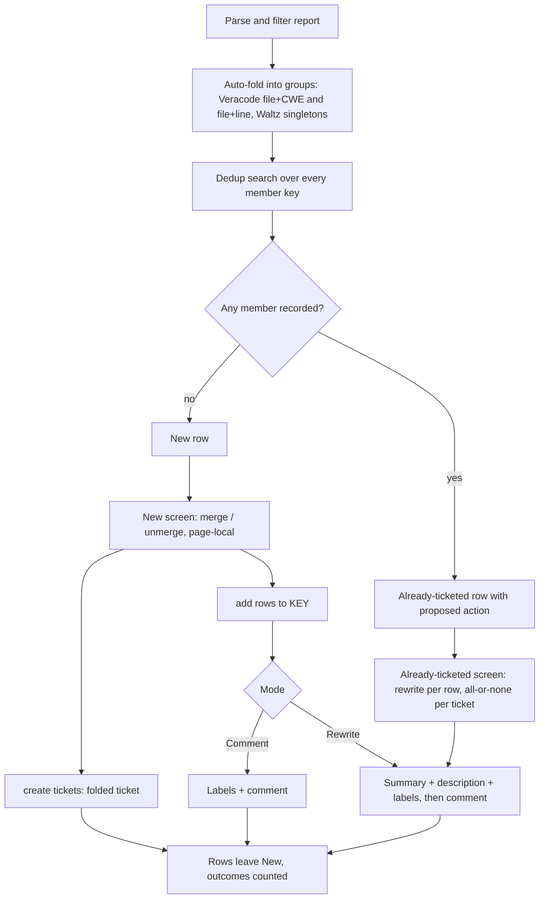

# Report Import Finding Folding - Plan

## Goal Capsule

- **Objective:** A user importing a Veracode or Waltz report ends up with one Jira ticket per piece of fixing work instead of one per finding, can correct the folding before anything is created, can add findings to an existing ticket, and can tell at a glance from any folded ticket exactly what it folds.
- **Product authority:** This Product Contract. The rule that nothing is created, updated or closed except by an action the user chose inside its group (`docs/plans/2026-09-23-1400-feat-report-import-overview-hub-plan.md`, R11) stays in force; `merge`, `unmerge` and `add` are such actions.
- **Open blockers:** None.
- **Stop conditions:** Stop and ask if implementation shows that Jira rejects a description write through `updateIssue` on the target instance, or that the shared New-screen reply parser cannot take `merge`, `unmerge` and `add` without changing the meaning of an existing reply word.
- **Execution profile:** `ce-work` or a human, unit by unit in U-ID dependency order; `npm run compile` and `npm test` green before each commit.

---

## Product Contract

### Summary

Veracode findings in the same file with the same CWE fold into one New row automatically; Waltz folds nothing automatically.
In both importers the user widens or corrects folds on the New screen with `merge` and `unmerge`, and can add rows to any existing Jira ticket with `add <rows> to <KEY>`, as a comment or as a full rewrite of the ticket.
Every folded ticket opens with a banner and an overview table so the fold is unmissable, and carries a count-based title.

### Problem Frame

A report import turns each finding into its own ticket, but the fix is usually one piece of work: ten SQL injections in one repository class, or a dozen netty artifacts that move to the next version together.
The ticket queue fills with noise and related findings are triaged separately.

Folding exists only for Veracode findings on the exact same file and line (`src/utils/veracodeReport.ts`, `groupFlawsByLocation`), so the same-file case the user cares about is not covered.
Waltz has no folding; each component (name and version) is its own ticket.
Where a fold does exist, nothing makes it obvious in the ticket, nothing lets the user correct it, and findings cannot be added to a ticket that already exists, in particular one a colleague created by hand.

### Actors

- A1. The support developer running the import and deciding what folds.
- A2. The owner of an existing ticket that findings are added to, who sees its labels and, on a rewrite, its description and title change.

### Requirements

**Shared behavior**

- R1. Veracode and Waltz behave identically for every rule below except R2 and R3, because both run on the shared report-import review flow.
- R2. Veracode folds findings with the same source file and the same CWE into one New row, whatever their lines, in addition to today's rule that findings on the same file and line fold whatever their CWE.
- R3. Waltz folds nothing automatically; every component is its own New row.
- R4. All new user-facing text (ticket content, comments, chat replies, README and manual pages, this plan) is English.

**Manual folding on the New screen**

- R5. `merge <row ids>` combines the named New rows on the visible page into one row, for any combination (other CWEs, other files, other components or versions); an id that is not on the visible page is unrecognized input, as for the existing page-local replies.
- R6. `unmerge <row id>` restores a merged row to its automatic grouping (Veracode) or to one row per component (Waltz).
- R7. `merge` and `unmerge` act only on New rows; Already-ticketed and Stale rows are not merge targets.

**Folded ticket content**

- R8. A folded ticket's description opens with a banner stating how many findings it folds, then an overview table with one row per finding (Veracode: issue id, severity, CWE, file and line, function; Waltz: component, version, rating, CVE count), then one section per finding with its own location or component details.
- R9. A folded ticket's title is count-based, never an id list. Veracode: `<file> - <CWE short label> (<n> findings)`; several CWEs: `<file> - <n> findings: <CWE short label>, <CWE short label>`; several files: `<file> +<m> files - <CWE short label> (<n> findings)`. Waltz: `[OSS] <first component>:<version> +<m> components — <highest rating>`, keeping the ` — <rating>` suffix the rating-rise update rewrites. Titles stay within Jira's summary length limit.
- R10. When a description would exceed Jira's description limit, the per-finding description and recommendation texts are shortened and a note says so; the overview table always lists every finding.
- R11. A folded ticket carries the record labels of every member (Veracode: `veracode`, one `veracode-issue-<id>` per finding, one `cwe-<id>` per distinct CWE; Waltz: `oss-dependency`, one component label per member, one `oss-cve-<id>` per CVE, one `oss-rating-<rating>` for the highest rating), so a later dedup search finds it from any member.

**Adding to an existing ticket**

- R12. `add <row ids> to <KEY>` on the New screen adds the named rows (visible page only) to the named ticket, whether or not Ticket Sidekick created it; a key that does not resolve to a ticket is rejected before anything is written.
- R13. Each add asks the user to choose **Comment** or **Rewrite** before anything is written.
- R14. Comment posts one comment listing the added findings, each with its own location or component, and leaves the ticket's description and title as they are.
- R15. Rewrite, after a warning that the description and title will be overwritten, replaces both with the regenerated fold per R8 and R9, built from the added rows plus the findings the ticket's record labels name that are still in the report; it also posts a comment listing the added findings and naming any finding the ticket recorded that no longer appears in the description.
- R16. Comment and Rewrite both write the record labels of R11 to the target ticket, and the confirmation names that the ticket's labels will change.
- R17. Rows added to a ticket leave the New group; nothing outside the named rows and ticket is touched.

**Re-importing**

- R18. A group whose members are only partly recorded on existing tickets appears in Already ticketed with the existing change-tracking proposal for its new findings, not in New.
- R19. The Already-ticketed screen also offers Rewrite per row, with the same warning, regeneration and traceability comment as R15, built from every row that points to the target ticket; Rewrite is accepted only when it is set on all rows that point to the same ticket or on none of them.

### Key Decisions

- **The automatic Veracode fold is same file plus same CWE, and anything wider is the user's call through `merge`.** Mixed-CWE tickets cannot be closed until all of them are fixed, so that choice stays with the user. Governs R2, R5.
- **Waltz has no automatic fold or suggestion.** Component names are only similar across a family, so a name heuristic can be wrong; the user decides with `merge`. Governs R3, R5.
- **`merge` and `add` act on the visible page only.** This matches the existing page-local replies and keeps the commands predictable, at the cost of rows from one file or family sitting on different pages. Governs R5, R12.
- **Titles are count-based.** An id list hides extra CWEs or files behind the first member's label and cannot fit in large folds; ids stay in the table and the `veracode-issue-<id>` labels, so search by id still works. Governs R9.
- **Oversize folds shorten per-finding text instead of splitting into several tickets.** One fold stays one ticket and the table keeps every finding. Governs R10.
- **Rewrite overwrites fully, with a warning and a traceability comment.** The comment records what was added and what dropped out, so the overwritten description is not the only record. Governs R15, R19.
- **Record labels are written in both add modes.** Without them the next import offers the same findings as New again. Governs R16.
- **A partly recorded group stays in Already ticketed.** This reuses the existing proposal (update on an open ticket, follow-up on a resolved one) instead of a second mechanism; the user can still choose re-create or leave. Governs R18.
- **Rewrite on re-import is all-or-none per target ticket.** Rewriting only some of the rows that point to one ticket would leave its labels disagreeing with its description. Governs R19.
- **Both importers share one behavior.** Differences between importers on shared ground are bugs in this project. Governs R1.

### Key Flows

- F1. Fold and create (Veracode)
  - **Trigger:** The user imports a report with ten SQL injections in `OrderRepository.java` and two XSS findings in the same file.
  - **Actors:** A1
  - **Steps:** The New screen shows one row for the ten SQL injections and one for the XSS findings; the user replies `merge 1,2`; the row count drops by one; `create tickets` creates one ticket for all twelve.
  - **Covered by:** R2, R5, R8, R9, R11

- F2. Add to an existing ticket
  - **Trigger:** A colleague already created PROJ-123 by hand for a netty upgrade; the report has three more netty components.
  - **Actors:** A1, A2
  - **Steps:** The user replies `add 4,6,7 to PROJ-123`, chooses Comment or Rewrite, confirms the warning, and the rows leave the New group.
  - **Covered by:** R12, R13, R14, R15, R16, R17

- F3. Re-import after a manual merge
  - **Trigger:** A later import where three components were merged into PROJ-123 earlier.
  - **Actors:** A1
  - **Steps:** Three Already-ticketed rows point to PROJ-123; the user sets Rewrite on all three and applies; the ticket is regenerated from current data and a comment lists what changed.
  - **Covered by:** R15, R19

### Acceptance Examples

- AE1. **Covers R2, R9.** Given a Veracode report with seven SQL injection findings in `OrderRepository.java` on seven different lines, when the New screen opens, then they form one row and the created ticket is titled `OrderRepository.java - SQL Injection (7 findings)`.
- AE2. **Covers R2.** Given one CWE-89 finding and one CWE-79 finding on the same file and line, and a second CWE-89 finding on another line of that file, when the New screen opens, then all three form one row.
- AE3. **Covers R5, R9.** Given two New rows on the visible page, one CWE-89 and one CWE-79 in `OrderRepository.java`, when the user replies `merge 1,2`, then one row remains and its ticket title is `OrderRepository.java - 7 findings: SQL Injection, Cross-Site Scripting`.
- AE4. **Covers R5.** Given row 61 is on page 2 while page 1 is showing, when the user replies `merge 3,61`, then nothing is merged and the reply is reported as not understood.
- AE5. **Covers R3, R9, R11.** Given three Waltz components `netty-codec:4.1.100`, `netty-handler:4.1.100` and `netty-buffer:4.1.94` with highest rating High, when the user merges them and creates the ticket, then the title is `[OSS] netty-codec:4.1.100 +2 components — High` and the ticket carries all three component labels and one `oss-rating-high` label.
- AE6. **Covers R14, R16.** Given PROJ-123 was created by hand and is open, when the user adds two rows to it as Comment, then one comment lists the two findings, the description and title are unchanged, and the findings' record labels are on PROJ-123.
- AE7. **Covers R15.** Given PROJ-123 carries a label for finding 1001 that is no longer in the report, when the user adds a row to it as Rewrite and confirms, then the description and title are regenerated without 1001 and the traceability comment names 1001 as dropped.
- AE8. **Covers R18.** Given finding 1001 is recorded on open PROJ-50 and the report has nine more findings in the same file and CWE, when the New screen opens, then the group is not in New and appears in Already ticketed with `update` proposed for PROJ-50.
- AE9. **Covers R19.** Given rows A1, A2 and A3 all point to PROJ-123, when the user sets Rewrite on A1 and A3 only and replies `apply`, then nothing is written and the reply says Rewrite must cover all three rows or none.

### Scope Boundaries

**Deferred for later**

- Automatic fold suggestions or automatic folding for Waltz.
- Remembering manual merges between imports; a later import shows the members as separate rows again and R19 is how the user rebuilds the ticket.
- Splitting an oversized fold into numbered tickets.
- Merging or adding across pages.
- Automatic folding of different CWEs in one file.
- Preserving the old description text on Rewrite.

### Dependencies / Assumptions

- The automatic Veracode groups are the transitive closure of both fold rules (R2 and the same-line rule), because one finding must not appear in two tickets; a finding with no source file never folds automatically. This extends today's rule that a finding with no location never folds.
- Merges are page-local like the existing toggles: leaving a page discards the merges made on it. This was assumed in dialogue, not decided.
- Add and Rewrite on an already-resolved ticket show a warning and proceed; they are not blocked. Also assumed, not decided.
- Jira's default limits of 255 characters for a summary and about 32,000 for a description are assumed, not checked against the user's instance. The code has no cap on either today (a search of `src/` for both found none).
- New reply words (`merge`, `unmerge`, `add ... to`) must stay disjoint from the existing reply vocabularies, which `sessionState.ts` and its tests keep disjoint.
- Because users see the new commands, README and `docs/manual/` pages change in the same work, per `CLAUDE.md`.

### Sources / Research

- `src/utils/veracodeReport.ts`: `groupKey` and `groupFlawsByLocation` fold on file plus line; `buildGroupSummary` lists every issue id; `buildGroupDescriptionWiki` hoists one shared Location.
- `src/participant/jira/veracodeHandler.ts`: folding runs at parse time, before the dedup search and paging.
- `src/utils/waltzReport.ts`: one ticket per `nameVersion`; `rewriteSummaryRating` rewrites a trailing ` — <rating>`.
- `docs/report-import.md`: dedup treats a match on any member as the whole group being already ticketed; Already-ticketed actions and their defaults; page-local replies.
- Earlier plans: `docs/plans/2026-09-14-1726-feat-veracode-fold-page-stale-plan.md` (same-line folding), `docs/plans/2026-09-30-0902-feat-import-ticket-updates-parity-plan.md` (per-row Already-ticketed actions), `docs/plans/2026-09-23-1400-feat-report-import-overview-hub-plan.md` (group screens).

---

## Planning Contract

Product Contract preservation: unchanged. KTD6 makes "rows that point to a ticket" and "findings still in the report" precise for R15 and R19 without changing their meaning. The three questions the Product Contract deferred to planning are resolved and removed from it: row ordering stays report order (Considered and Not Built), shortening follows KTD8, and title overflow follows KTD9.

### Key Technical Decisions

- KTD1. **A fold is a group array in both importers, and merging is concatenation.** Veracode's item is already `VeracodeFlaw[]`; Waltz's item becomes `WaltzComponent[]` and its row field `sourceComponent` becomes `sourceGroup`, mirroring `VeracodeReviewRow`. Every builder (title, labels, description, comment) takes a group, and a one-member group reproduces today's output, so existing tickets and tests keep their shape. A merged row must carry every member's data, and one shape for both importers makes R1 structural instead of a convention. Governs R1, R3, R5.
- KTD2. **Veracode's automatic groups are the transitive closure of two keys.** Findings sharing path, file and CWE join, and findings sharing path, file and line join (today's key). A finding with no `sourceFile` never joins, and a finding with no CWE never joins by CWE. `groupFlawsByLocation` stays the only grouping entry point, and both of its call sites (`readAndFilterVeracodeFile`, `buildVeracodeTemplateSession`) already run before the dedup search. Governs R2.
- KTD3. **A merge is a page-local row edit.** The merged row keeps its lowest member's id, carries a `memberIds` list on `ReviewRowBase`, and is built by calling the importer's `buildRowFields` on the concatenated group. `session.rows` changes and `session.allRows` keeps the original rows, so `unmerge` restores them from `allRows` and a page move discards the merge. Creating or adding a merged row removes every member id from `allRows`. Governs R5, R6, R7, R17.
- KTD4. **The New screen gains three reply forms, gated by an optional `fold` capability on the descriptor.** `merge <ids>`, `unmerge <id>` and `add <ids> to <KEY>` are parsed in `parseNewGroupReply` before the row-toggle parse. The descriptor's `fold` object (`itemOf`, `combine`, `recordLabelsOf`, `buildComment`) is supplied by Veracode and Waltz only, so email, which shares the screen, offers none of them. Governs R1, R5, R6, R12.
- KTD5. **Add is a stateless two-step.** A bare `add <ids> to <KEY>` fetches the ticket, validates it and the rows, then renders the warnings and two clickable links that resend the command with `as comment` or `as rewrite`. A command with an explicit mode executes. No new session kind, because a pending-add session would add state that must expire and routing in `JiraParticipant.ts`, which Vitest cannot load. Governs R12, R13, R15.
- KTD6. **One writer serves add-Comment, add-Rewrite and re-import Rewrite.** For a target ticket K the regeneration set is the added rows plus the Already-ticketed rows whose `target` is K. The ticket's recorded keys, read from its labels through the descriptor's existing `labelToDedupKey`, that no member of the set carries are the dropped findings, and the traceability comment names them (Veracode by issue id, Waltz by component label, because a label cannot be turned back into a name). A finding recorded on K whose row targets a newer ticket is therefore named as dropped from K, never silently lost. On re-import, the added findings are the union of the set's rows' `change.newIds`. Governs R14, R15, R19.
- KTD7. **Rewrite is one `updateIssue` write followed by one comment.** A new `TicketService.rewriteTicket` reads the issue, merges labels (replacing `oss-rating-` labels as `updateLabels` already does), and writes summary, description and labels together. If the comment then fails, the result says "rewritten, comment failed" like `update`'s "labels updated, comment failed", and nothing is undone. Governs R15, R16.
- KTD8. **Folded content is built by pure functions that fit a size budget.** One shared helper in `src/utils/reportImport.ts` tries successively smaller detail levels until the wiki output is at most `MAX_DESCRIPTION_CHARS` (30,000, below Jira's default of about 32,767) and ends at table-only plus a note. Veracode's levels cut per-finding description and recommendation text; Waltz's cut the shown artifacts and CVEs per component (25 and 10 today). The same fit applies to add comments. Governs R8, R10, R14.
- KTD9. **Titles come from one builder per importer that clamps to 255 characters.** The clamp trims the file or component name, never the finding count, the CWE labels or the Waltz ` — <rating>` suffix that `rewriteSummaryRating` depends on. Up to three CWE labels are listed, then `+<k> more CWEs`. Governs R9.
- KTD10. **A merged Waltz ticket carries the union of its members' labels with one rating label.** That is `oss-dependency`, every member's component label, every member's `oss-cve-<id>` labels, and a single `oss-rating-<highest>`. Veracode's `buildGroupLabels` already unions. Add-Comment adds a rating label only when the ticket has none; add-Rewrite sets it from the regeneration set. Governs R11, R16.
- KTD11. **`rewrite` is a fifth `TicketedAction` with its all-or-none rule checked at `apply`.** It is offered on every Already-ticketed row. Before any write, `apply` groups the unfinished rows by target and aborts the whole apply when a target has some rows on `rewrite` and others not. The `BATCH_LIMIT` cap is applied by target group, never splitting one target's rows; a single group larger than the cap runs whole. Governs R19.
- KTD12. **The stored session schema version is bumped.** `memberIds` and the Waltz `sourceGroup` change the persisted row shape, so `CURRENT_SESSION_SCHEMA_VERSION` goes from 8 to 9. `isSessionExpired` then discards every stored multi-turn Jira session written before the update, not only import reviews, which is the existing mechanism for a shape change. Governs R1.
- KTD13. **Text from the target ticket is untrusted in the add prompt.** The prompt carries command links and so goes through `trustedChatMarkdown`; the ticket's summary and label names pass through `neutralizeMarkdownLinks` or the cell sanitizer first, as the Already-ticketed screen already does (`docs/solutions/security-issues/jira-native-wiki-trigger-neutralization-in-shared-markdown-converter.md`). Governs R12.

### High-Level Technical Design

The shape below is the authoritative flow; the prose in KTD3 to KTD6 and KTD11 carries the rules at each arrow.

### Alternative Approaches Considered

- **Merge at the item level only, leaving Waltz's single-component item.** Rejected: Waltz's description, title and labels need the member list, so a merged Waltz row needs a group anyway, and two item shapes would put the importers back out of step (KTD1).
- **A pending-add session holding the chosen rows and mode across turns.** Rejected: it adds a session kind, expiry and router glue for a flow that two clickable links carry statelessly (KTD5).

### Considered and Not Built

- Sorting New rows by file or component name so merge candidates share a page. Not requested, and report order is unchanged and harmless; evidence that would change this is users reporting that merging across pages is painful.
- Removing labels of rows left out of a Rewrite. Replaced by the all-or-none rule (R19), which keeps labels and description in agreement.
- Retrying a failed merged create automatically. The merged row falls back to its member rows when the page refreshes, which is the same page-local behavior as every other New-row edit.

### Assumptions

- The Jira v2 API accepts a wiki-markup `description` string through `updateIssue` on both Data Center and Cloud, as `createTicket` already sends one (`CLAUDE.md`, "Jira API").
- A target ticket counts as resolved when `getIssue` returns a non-null `fields.resolution`.
- Merging two already-merged rows is allowed and unions their `memberIds`.
- A merged row is included by default and shows the highest severity (Veracode) or rating (Waltz) of its members.
- Jira's limits of 255 characters for a summary and about 32,767 for a description or comment are defaults not checked against the user's instance; the 30,000 budget leaves margin.

### Risks and Mitigations

| Risk | Mitigation |
| --- | --- |
| Email shares the New screen and could inherit `merge` and `add` | The `fold` capability gate (KTD4) and a test that email rejects all three words |
| A partial rewrite leaves labels and description disagreeing | All-or-none abort at `apply` before any write (KTD11, AE9) |
| `BATCH_LIMIT` splitting one ticket's rows across two applies | The cap is applied by target group (KTD11) |
| Rewrite destroys text a colleague wrote | Accepted by the user; the warning names the overwrite and the dropped findings, and the comment records them (R15) |
| A merged Waltz ticket carries a very large label set | Labels are the dedup record (R11), so they stay; the dedup search already chunks by label, and the risk is noted for the manual check in the Definition of Done |
| Untrusted ticket text turns into a chat command link | KTD13 and a test with a markdown-link summary |
| Open reviews break when the row shape changes | Schema bump (KTD12) |

### Sources and Research

- `src/participant/jira/reportImportHandler.ts`: `handleImportReviewReply` dispatch, `createNewRows`, `executeTicketedActions`, `updateTicketedRow` and `createForTicketedRow` are the code the new actions extend.
- `src/participant/sessionState.ts`: `ReviewRowBase`, `ReviewSession`, `buildReviewPage`, `parseNewGroupReply`, `parseTicketedGroupReply`, `TICKETED_ACTION_WORDS`, `CURRENT_SESSION_SCHEMA_VERSION`.
- `src/utils/reportImport.ts`: `buildReviewRows`, `deriveTicketedActions`, `TICKETED_ACTION_ORDER`, `sanitizeCellText`.
- `src/services/TicketService.ts`: `updateLabels` is the model for `rewriteTicket`.
- `src/participant/jira/veracodeHandler.ts` and `src/participant/jira/waltzHandler.ts`: the two descriptors.
- `docs/solutions/logic-errors/confirm-cancel-word-list-broadening-swallows-domain-name-collisions.md`: new reply words must be matched so they are never swallowed by confirmation or cancel words.

---

## Implementation Units

### U1. Veracode automatic fold grouping

- **Goal:** Group findings by file and CWE as well as by file and line.
- **Requirements:** R2, R18; AE1, AE2.
- **Dependencies:** None.
- **Files:** `src/utils/veracodeReport.ts`, `src/test/veracodeReport.test.ts`.
- **Approach:**
  - Rework `groupFlawsByLocation` to link findings through the two keys of KTD2 and return the connected groups.
  - Keep group order as first occurrence and member order as input order.
  - Keep the `::` separator rule the file's comment explains so differing path and file pairs never collide.
- **Execution note:** Add characterization tests for today's same-line grouping first, then the new key.
- **Patterns to follow:** The existing `groupFlawsByLocation` tests in `src/test/veracodeReport.test.ts`.
- **Test scenarios:**
  - Covers AE1. Seven CWE-89 findings in `OrderRepository.java` on seven lines form one group of seven.
  - Covers AE2. A (CWE 89, line 10), B (CWE 89, line 20) and C (CWE 79, line 10) in one file form one group of three.
  - CWE 89 and CWE 79 on different lines of one file stay two groups.
  - The same file name under two different `sourceFilePath` values never groups.
  - Two findings with no `sourceFile` stay two singletons even with equal CWEs.
  - Two findings with no CWE on different lines of one file stay separate; on one line they group.
  - Covers AE8. Ten same-file, same-CWE findings where one issue id is in the dedup map produce one group whose dedup keys include all ten ids.
- **Verification:** One group per file and CWE in a fixture report, and every earlier same-line test still passes.

### U2. Veracode folded content builders and shared fit helpers

- **Goal:** Produce the count-based title, the banner and overview table description, the add comment, and the size fit for Veracode groups.
- **Requirements:** R8, R9, R10, R14; AE1, AE3.
- **Dependencies:** U1.
- **Files:** `src/utils/veracodeReport.ts`, `src/utils/reportImport.ts`, `src/test/veracodeReport.test.ts`, `src/test/reportImport.test.ts`.
- **Approach:**
  - Replace the id-list title in `buildGroupSummary` with the R9 forms; a one-member group keeps today's `buildSummary` output.
  - Build the description as banner, a table through `sanitizeCellText` per cell, then one section per finding with its own file, line, module and function. A one-member group keeps today's group output without a banner.
  - Add `buildFoldedCommentWiki(group, dropped)` for add comments, using the same banner, table and sections.
  - Put the generic pieces in `src/utils/reportImport.ts`: `MAX_SUMMARY_CHARS`, `MAX_DESCRIPTION_CHARS`, a clamp that trims one named part, and the detail-level fit helper of KTD8.
  - Keep every report-derived string behind `sanitizeCellText` or `sanitizeStandaloneLine`, and convert once with `markdownToJiraWiki`.
- **Patterns to follow:** `buildGroupDescriptionWiki`, `pushSeverityAndCwe` and the sanitizer comments in `src/utils/veracodeReport.ts`.
- **Test scenarios:**
  - Covers AE1. Seven same-file CWE-89 findings give `OrderRepository.java - SQL Injection (7 findings)`.
  - Covers AE3. Five CWE-89 and two CWE-79 findings in one file give `OrderRepository.java - 7 findings: SQL Injection, Cross-Site Scripting`.
  - Three files with one CWE give `OrderRepository.java +2 files - SQL Injection (7 findings)`.
  - Four distinct CWEs list three labels then `+1 more CWEs`.
  - A 300-character file name still yields a title of at most 255 characters that keeps the count.
  - A one-finding group gives today's exact title and description.
  - Covers R11. A merged group across two files carries one `veracode-issue-<id>` per finding and one `cwe-<id>` per distinct CWE, plus `veracode`.
  - The description's table has one row per finding and a banner stating the count; a pipe or `{` inside a function name cannot break the row or open a macro.
  - Forty findings with long recommendation text exceed the budget at full detail, so the output is at most 30,000 characters, still lists all forty in the table and carries the shortening note.
  - The add comment lists each finding with its own file and line, and names dropped issue ids when given.
- **Verification:** A rendered fixture description reads banner, table, sections, and never exceeds the budget.

### U3. Waltz group shape and folded content builders

- **Goal:** Make Waltz rows group-shaped and give merged components the same title, labels, description and comment.
- **Requirements:** R1, R3, R8, R9, R10, R11; AE5.
- **Dependencies:** U2.
- **Files:** `src/utils/waltzReport.ts`, `src/participant/jira/waltzHandler.ts`, `src/test/waltzReport.test.ts`.
- **Approach:**
  - Change the descriptor's item to `WaltzComponent[]` with one singleton group per component; `readAndFilterWaltzFile` wraps, and `buildActivePredicate` keeps reading the raw flat components.
  - Rename `WaltzReviewRow.sourceComponent` to `sourceGroup` and update the descriptor's call sites: `describe`, `recordLabelsOf`, `buildUpdateComment`, `buildFollowUp`, `searchLabelOf`, `dedupKeyOf`.
  - Add group builders: title (`[OSS] <first> +<m> components — <highest rating>`, one member unchanged), labels per KTD10, description (banner, a table of component, rating, CVE count and artifact count, then each component's existing sections one heading level down), and the add comment.
  - Parameterize the existing description builder's heading level instead of copying it.
  - Wire the fit levels of KTD8 to the shown artifact and CVE caps.
- **Execution note:** Add characterization tests for every singleton output before changing the item shape.
- **Patterns to follow:** `buildDescriptionWiki`, `buildUpdateCommentWiki` and `rewriteSummaryRating` in `src/utils/waltzReport.ts`.
- **Test scenarios:**
  - Covers AE5. Merging `netty-codec:4.1.100`, `netty-handler:4.1.100` and `netty-buffer:4.1.94` with High as the worst gives `[OSS] netty-codec:4.1.100 +2 components — High`, three component labels and one `oss-rating-high`.
  - A singleton group gives today's exact title, labels and description.
  - Mixed ratings (Medium, High, Critical) give a title ending `— Critical` and exactly one rating label.
  - The summary produced still ends in ` — <rating>`, so `rewriteSummaryRating` rewrites it.
  - Twelve components with 40 CVEs each exceed the budget at full detail, so the output is at most 30,000 characters and the table still lists all twelve.
  - A component name containing `|` or `{` cannot break the table or open a macro.
  - The add comment lists each component with its CVE count.
- **Verification:** Existing Waltz tests pass unchanged apart from the renamed row field.

### U4. Merge and unmerge on the New screen

- **Goal:** Let the user combine and split New rows on the visible page in both importers.
- **Requirements:** R1, R5, R6, R7, R17; AE3, AE4.
- **Dependencies:** U2, U3.
- **Files:** `src/participant/sessionState.ts`, `src/participant/jira/reportImportHandler.ts`, `src/participant/jira/veracodeHandler.ts`, `src/participant/jira/waltzHandler.ts`, `src/test/sessionState.test.ts`, `src/test/reportImportHandler.test.ts`.
- **Approach:**
  - Add the optional `fold` object to `ReportImportDescriptor` (KTD4) and `memberIds` to `ReviewRowBase` (KTD3); bump `CURRENT_SESSION_SCHEMA_VERSION` (KTD12).
  - Add `merge` and `unmerge` to `ImportReplyAction` and `parseNewGroupReply`, ahead of the row-toggle parse, with a context flag saying whether the importer can fold.
  - Write pure `mergeNewRows` and `unmergeNewRow` in `sessionState.ts` taking a row-builder callback; the handler supplies one that calls `descriptor.buildRowFields` on the combined group with the template labels.
  - Reject, with a reason, a merge of fewer than two ids, an id not on the visible page, or an `A` id, and an `unmerge` of a row with no `memberIds`.
  - Make `createNewRows` remove every member id from `allRows` and write excluded members back as excluded.
  - Extend `describeImportReplyVocabulary` and the New screen's hint line with the new words, shown only when the importer can fold.
- **Patterns to follow:** `applyBulkNewRowSet` and `parseBulkNewRowReply` for exact-match, page-local replies.
- **Test scenarios:**
  - `merge 1,2`, `merge 1 2` and `MERGE 1, 2` all merge rows 1 and 2 into one row with the lowest id.
  - Covers AE3. Merging a CWE-89 row and a CWE-79 row of one file gives one row whose summary is the mixed-CWE title.
  - Covers AE4. `merge 3,61` with row 61 on page 2 is invalid and changes nothing.
  - `merge 3` and `merge A1 2` are invalid with a reason.
  - `unmerge 1` on a merged row restores the original rows in their positions, and on an unmerged row is invalid.
  - Moving to the next page and back discards a merge.
  - A stored review with `schemaVersion` 8 is treated as expired and is not resumed.
  - Merging a merged row with a third row unions the member ids.
  - Creating a merged row calls `createTicket` once and removes all member ids from `allRows`.
  - A failed create leaves the member rows in `allRows`, so the refreshed page shows them separately.
  - Email's descriptor has no `fold`: `merge 1,2` is invalid and the hint line omits the words.
  - `merge`, `unmerge` and `add` are never confirmation or cancellation words, and no existing reply parses differently.
- **Verification:** The Veracode and Waltz New screens merge, unmerge and create end to end against a fake `TicketService`.

### U5. Add rows to an existing ticket (Comment or Rewrite)

- **Goal:** Add New rows to a named ticket by comment or by full rewrite, with the record labels and a traceability comment.
- **Requirements:** R12, R13, R14, R15, R16, R17; AE6, AE7.
- **Dependencies:** U4.
- **Files:** `src/services/TicketService.ts`, `src/participant/sessionState.ts`, `src/participant/jira/reportImportHandler.ts`, `src/participant/jira/veracodeHandler.ts`, `src/participant/jira/waltzHandler.ts`, `src/test/TicketService.test.ts`, `src/test/sessionState.test.ts`, `src/test/reportImportHandler.test.ts`.
- **Approach:**
  - Add `rewriteTicket` to `TicketService` (KTD7), tested against the existing `IJiraClient` test double, with no new client method because `updateIssue` already takes any field map.
  - Parse `add <ids> to <KEY>` with an optional `as comment` or `as rewrite`; normalize the key to upper case and require the `[A-Z][A-Z0-9]+-\d+` shape.
  - On the bare form, fetch the ticket with `getIssue`, and on a failure show the error and write nothing. Otherwise render the KTD5 prompt: key, summary, status, resolved warning, the overwrite warning with the dropped list from KTD6, and the two links, with ticket text neutralized (KTD13).
  - Implement the shared writer of KTD6 in `reportImportHandler.ts`. Comment: `updateLabels` with the record labels (KTD10), then `addComment`. Rewrite: `rewriteTicket`, then the traceability comment. Report partial failures like `updateTicketedRow` does.
  - Mark success by removing member ids from `allRows` and adding `added` and `addFailed` counters to `ImportOutcomes`, shown in `buildImportDoneSummary`.
- **Patterns to follow:** `updateTicketedRow` for label-then-comment failure reporting, and `updateLabels` for read-merge-write.
- **Test scenarios:**
  - `add 3,5 to proj-123` normalizes the key and shows the prompt with both links and writes nothing.
  - Covers AE6. `add 3,5 to PROJ-123 as comment` on an open hand-made ticket calls `updateLabels` with the rows' record labels and `addComment` once with both findings, and never writes summary or description.
  - Covers AE7. `as rewrite` on a ticket carrying a label for issue 1001 absent from the report calls `rewriteTicket` once with a regenerated summary, description and labels, and the comment names 1001 as dropped.
  - The Rewrite prompt lists the dropped findings before any write.
  - A key that does not resolve shows an error and leaves the rows in New.
  - A resolved target shows a warning and still offers both links.
  - A ticket summary of `[click](command:workbench.action.chat.open)` appears neutralized, not as a link.
  - A comment failure after a successful rewrite reports "rewritten, comment failed" and the rows still leave New.
  - A failed `updateIssue` writes no comment and keeps the rows in New.
  - A Waltz Comment on a ticket that already has `oss-rating-medium` adds the CVE and component labels but leaves the rating label; a Rewrite replaces it with the highest rating.
  - An id not on the visible page, an `A` id, or an email descriptor rejects the command.
  - Covers R17. Rows not named in the command stay in New, and no ticket other than the target is written.
- **Verification:** The two-step flow completes against a fake Jira for both modes and both importers.

### U6. Rewrite on the Already-ticketed screen

- **Goal:** Offer Rewrite per Already-ticketed row, all-or-none per target ticket.
- **Requirements:** R18, R19; AE8, AE9.
- **Dependencies:** U5.
- **Files:** `src/utils/reportImport.ts`, `src/participant/sessionState.ts`, `src/participant/jira/reportImportHandler.ts`, `src/test/reportImport.test.ts`, `src/test/sessionState.test.ts`, `src/test/reportImportHandler.test.ts`.
- **Approach:**
  - Add `rewrite` to `TicketedAction`, `TICKETED_ACTION_ORDER` (after `follow-up`), `deriveTicketedActions`, `TICKETED_ACTION_WORDS`, the apply action set and `formatTicketedRowResult`; add the rewrite result variants to `TicketedRowResult`.
  - In `executeTicketedActions`, validate KTD11 before any write and abort the whole apply with a message naming the target and the rows left out.
  - Group rewrite rows by target, apply the batch cap by group, run the shared writer of U5 once per target, and write each row's result.
  - Update the Action cell and the vocabulary hint so `rewrite` appears as a link.
- **Patterns to follow:** `executeTicketedActions` result marking and `applyTicketedActionChange`.
- **Test scenarios:**
  - Covers AE9. A1, A2 and A3 share a target and only A1 and A3 are on `rewrite`: `apply` writes nothing and says Rewrite must cover all three or none.
  - `all rewrite` sets every row and `apply` rewrites each target once.
  - Three rows on one target cause one `rewriteTicket` call and one traceability comment.
  - Rows A1 and A2 on target PROJ-1 and A3 on PROJ-2 with a cap that would cut between A1 and A2 run PROJ-1's rows together.
  - A row already finished by `update` is outside the all-or-none set for its target.
  - Covers AE8. Finding 1001 recorded on open PROJ-50 and nine more in one file and CWE produce an Already-ticketed row with `update` proposed, and none in New.
  - Existing change-tracking tests still pass after `rewrite` joins `allowedActions`.
- **Verification:** A re-import after a merge rebuilds the merged ticket from three rows and records the result on each.

### U7. User manual, domain docs and known limitation

- **Goal:** Document the new behavior in English where users and developers look for it.
- **Requirements:** R4; every requirement a user sees.
- **Dependencies:** U1 to U6.
- **Files:** `docs/manual/report-imports.md`, `README.md`, `docs/report-import.md`, `CLAUDE.md`, `CONCEPTS.md`, `docs/known-limitations.md`.
- **Approach:**
  - Update the New-screen reply list and the Already-ticketed actions in `docs/manual/report-imports.md`, and the "Report imports" pointer in `README.md` only if its text lists replies.
  - Replace "Same-line finding folding" in `docs/report-import.md` with the new fold, merge, add and rewrite behavior, and fix its statement that folding is Veracode-only.
  - Update the `veracodeReport.ts`, `waltzReport.ts` and `reportImportHandler.ts` rows in the `CLAUDE.md` key-files table.
  - Add Fold and Folded ticket to `CONCEPTS.md` following its existing entries.
  - Add a known-limitation entry with the next `KL<N>` for the unverified Jira length limits and the unchecked Jira write of a rewritten description.
- **Test expectation:** none -- documentation only; `src/test/userDocsSync.test.ts` still has to pass because it checks `package.json` against the manual.
- **Verification:** A reader of the manual can find `merge`, `unmerge`, `add … to` and Rewrite, and `docs/report-import.md` no longer says Waltz cannot fold.

---

## Verification Contract

| Gate | Command or evidence | Applies to |
| --- | --- | --- |
| Type check | `npm run compile` | every unit |
| Unit tests | `npm test` | every unit; green before each commit |
| Targeted tests | `src/test/veracodeReport.test.ts`, `src/test/waltzReport.test.ts`, `src/test/reportImport.test.ts`, `src/test/sessionState.test.ts`, `src/test/reportImportHandler.test.ts`, `src/test/TicketService.test.ts` | U1 to U6 |
| Docs sync | `src/test/userDocsSync.test.ts` inside `npm test` | U7 |
| Not run | `npm run test:e2e` needs a real VS Code instance and is not part of CI | VS Code glue |

---

## Definition of Done

- Every behavioral requirement (R1 to R3 and R5 to R19) is enforced by at least one test, every acceptance example AE1 to AE9 has a test that names it, and R4 is met by the English documentation and text in the diff.
- `npm run compile` and `npm test` are green.
- A one-finding Veracode group and a one-component Waltz group produce the same title, labels and description as before this work.
- The user manual, `docs/report-import.md`, the `CLAUDE.md` key-files table and `CONCEPTS.md` describe the shipped behavior, in English.
- The known-limitation entry exists, and a manual Comment and Rewrite check against a Jira sandbox is either done or recorded in it.
- No abandoned-attempt or dead code remains in the diff.
