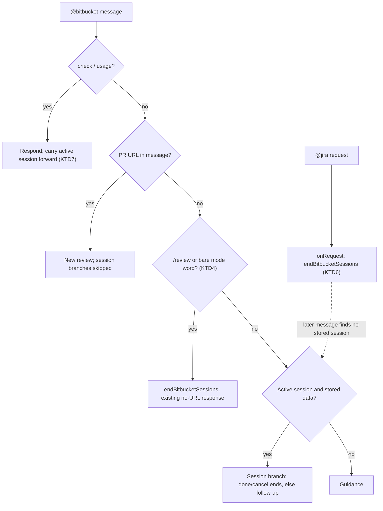

## Goal Capsule

- **Objective:** a developer who is done with a Bitbucket review can leave it with one click at any point, and starting something new (a PR URL, a Jira request) is never answered as a follow-up to the old review.
- **Means:** end-session chips derived from the active session kind (KTD1) and one shared way to end all Bitbucket sessions (KTD5, KTD6).
- **Product authority:** the invoking brainstorm dialogue; its decisions are recorded under Key Decisions.
- **Open blockers:** none.

---

## Product Contract

### Summary

After a Bitbucket review, every response that keeps the session alive carries a clickable chip to end it. The comment preview and the smart-fallback question get their own Post/Cancel chips. A new PR URL, a bare `/review` or mode word, and any `@jira` request end the old session instead of being treated as a follow-up question. `check` and `usage` stop breaking a live session.

### Problem Frame

Today the only clickable way out of a review session is an inline `Cancel` link inside the comment preview, which scrolls away. After a review the chips offer Add findings, Explain #1 and Copy for Teams, and nothing to end the session. Leaving means typing `c` or `cancel`.

A session also survives or dies for the wrong reasons. `@jira` runs in its own chat history, so a Jira request in between leaves the Bitbucket session stored and live: the next plain `@bitbucket` message goes to the model as a follow-up question. In the other direction, `check` and `usage` return no session marker, so a harmless status command makes a live session invisible and the next `explain #2` falls through to the "Point me at a PR" guidance.

### Key Decisions

- **Chips are the always-clickable mechanism**, not only inline links (session-settled: user-approved — chosen over keeping inline links: links scroll away, chips sit under the last response). Governs R1, R2, R3.
- **Done ends the whole session; Cancel in a preview drops only the preview** (session-settled: user-approved — chosen over one ambiguous Cancel everywhere). Governs R1, R2.
- **A PR URL always starts a new review**, with or without a mode word or focus question (session-settled: user-directed — chosen over matching only "review" phrasing). Governs R5.
- **Any `@jira` request ends the Bitbucket session** (session-settled: user-directed — chosen over detecting Jira-like text typed inside `@bitbucket`). Governs R7.
- **`check` and `usage` are neutral** (session-settled: user-directed — chosen over letting them end the session). Governs R8.
- **A bare `/review` or a message that is only a mode word ends the session** (session-settled: user-approved — chosen over answering it as a follow-up question). Governs R6.

### Requirements

**End-session chips**

- R1. Every `@bitbucket` response that leaves a review session active shows a **Done** chip that ends the session; typing `done` does the same.
- R2. A comment preview shows **Post it** and **Cancel** chips. Cancel drops only the preview and returns to the review session, whose response then carries the Done chip.
- R3. The smart-fallback question shows a **Cancel** chip beside its All and Standard replies.
- R4. End-session chips do not count against the existing three-chip limit on action chips.

**Starting something new**

- R5. A message containing a PR URL always starts a fresh review, whatever mode word or focus question it carries; no session branch sees it.
- R6. `/review` without a URL, or a message that is only `quick`, `smart` or `deep`, ends any active session and shows the existing no-URL response: the orientation text for an empty prompt, otherwise the "Point me at a PR to review" guidance.
- R7. Any `@jira` request, including `/check` and a request that fails for missing configuration, ends the active Bitbucket sessions, so a later `@bitbucket` message gets no follow-up treatment.

**Neutral commands**

- R8. `check` and `usage` leave an active session unchanged: their responses carry the session's end-session chip, and a follow-up after them is answered as before.

### Acceptance Examples

- AE1. **Given** a finished review, **when** the user asks `explain #2` and then clicks Done under the answer, **then** the session ends with "Review session ended" and the next plain `@bitbucket` message gets no follow-up treatment. **Covers R1.**
- AE2. **Given** a comment preview, **when** the user clicks Cancel, **then** the preview is dropped, `explain #1` still works, and the response shows a Done chip. **Covers R2.**
- AE3. **Given** an active review session, **when** the user sends `@bitbucket smart <another PR URL> -- focus question`, **then** a new review of that PR runs and the old session's follow-ups are not consulted. **Covers R5.**
- AE4. **Given** an active review session, **when** the user sends `/review` alone, **then** the orientation text appears and a following `explain #1` is not answered from the old review. **Covers R6.**
- AE5. **Given** an active review session, **when** the user sends `@jira show PROJ-1` and then `@bitbucket is this safe?`, **then** the second message gets the "Point me at a PR" guidance, not a model answer about the old review. **Covers R7.**
- AE6. **Given** a finished review, **when** the user runs `@bitbucket usage` and then `explain #2`, **then** the usage table shows the Done chip and the explanation still works. **Covers R8.**
- AE7. **Given** an active review session, **when** the user asks `is this quick to fix?`, **then** it is still answered as a follow-up question. **Covers R6.**

### Scope Boundaries

- Parsing of `explain`, `add`, `copy` and the existing cancel words is unchanged, as is the rule that an LLM error keeps the session alive.
- Jira-like text typed inside `@bitbucket` is not detected.
- Starting a Bitbucket review does not touch `@jira` sessions.
- Considered and not built: ending a session after inactivity. The chips, a new URL and `@jira` cover the cases raised; revisit if sessions are still left open by accident.
- Considered and not built: adding `done` to the shared cancel-word list. `@jira` pick-lists match live status names, and a status named `Done` would stop being pickable (see KTD3).

---

## Planning Contract

### Key Technical Decisions

- KTD1. **Derive end-session chips from the session kind in the result metadata, not per return site.** `followupProvider` reads `bitbucketSession.kinds` as well as `bitbucketFollowup`, so every response that keeps a session alive gets its chips, and a future return site cannot forget them. Kind to chips: review session gives Done; comment preview gives Post it and Cancel; smart fallback gives Cancel. Governs R1, R2, R3, R8.
- KTD2. **End chips are appended after the action chips and sit outside the cap.** The cap of three in `BITBUCKET_MAX_FOLLOWUPS` applies to action chips, so a finished review shows up to four chips. Governs R4.
- KTD3. **Bitbucket gets its own end-session vocabulary.** `isEndSessionRequest` accepts the `isCancellation` words plus `done`, whole-message only, and the review-session branch uses it. The shared `isCancellation` stays untouched because its other callers match against live Jira option names (see `docs/solutions/logic-errors/confirm-cancel-word-list-broadening-swallows-domain-name-collisions.md`). Chip prompts are `done`, `cancel` and `post it`. Governs R1.
- KTD4. **A pure predicate decides "review start without a URL".** `isReviewStartWithoutUrl(prompt, command)` is true for the `review` command with no URL or a whole message equal to `quick`, `smart` or `deep`. Whole-message only, so `is this quick to fix?` stays a follow-up. The handler evaluates it before the session branches. Governs R6.
- KTD5. **One function ends every Bitbucket session.** `endBitbucketSessions(store)` clears the three `bitbucket.session.*` keys, taking any object with `update(key, value)` so it stays free of `vscode`. The Done branch and the R6 path call it. Governs R1, R6, R7.
- KTD6. **`@jira` reaches Bitbucket state through an injected callback, not an import.** `createJiraParticipant` takes an optional `onRequest` callback that `extension.ts` binds to `endBitbucketSessions`, so the two participants stay independent as `CLAUDE.md` requires. The Jira handler awaits it first, before the configuration checks, and logs and continues if it throws. Clearing the stored data is what makes the end real: each Bitbucket session branch also requires its stored session, so a missing key falls through to the guidance whatever the chat history shows. Governs R7.
- KTD7. **`check` and `usage` carry the active session forward.** The handler reads the active session before those two branches and returns it as `bitbucketSession` metadata, so KTD1 renders the chips and the next turn still finds the session. Without an active session they return as today. Governs R8.

### High-Level Technical Design

### Assumptions

- VS Code gives each participant only its own turns in `chatContext.history`. This is unverified and the plan does not depend on it: R7 clears stored data, and every session branch needs that data.
- Follow-up chips render under the most recent response and a chip click sends its prompt to the same participant, as the existing chips already rely on.

### Risks & Dependencies

- A review still running when `@jira` is used writes its session at completion, so the session reappears after that review finishes. That review is newer than the Jira request, so this is acceptable.
- A fourth chip on a finished review changes the layout users know. The Done chip is last so the action chips keep their positions.

---

## Implementation Units

### U1. Session-end helpers and chip derivation

**Goal:** the pure logic for chips, end vocabulary, fresh-start detection and session clearing.

**Requirements:** R1, R2, R3, R4, R6, R7, KTD1, KTD2, KTD3, KTD4, KTD5

**Dependencies:** none

**Files:**
- `src/participant/reviewSessionState.ts`
- `src/test/reviewSessionState.test.ts`

**Approach:**
1. Export the three session keys and `endBitbucketSessions(store)`.
2. Add `isEndSessionRequest` and `isReviewStartWithoutUrl`.
3. Extend `computeBitbucketFollowups` with the session kinds, appending end chips after the capped action chips.

**Patterns to follow:** `computeBitbucketFollowups` and `isUsageRequest` in the same file; whole-message matching as in `isGreetingOrEmpty`.

**Test scenarios:**
- Covers AE1. A `reviewCompleted` state with findings and kind `review-session` returns Add findings, Explain #1, Copy for Teams, then Done.
- A zero-findings review with kind `review-session` returns Copy for Teams, then Done.
- Kind `comment-preview` with no state returns Post it and Cancel; kind `smart-fallback-session` returns Cancel; state `none` with no kinds returns nothing.
- `isEndSessionRequest` is true for `done`, `Done`, `cancel` and `c`, and false for `done with the security findings?`.
- `isReviewStartWithoutUrl` is true for the `review` command with an empty prompt and for `smart`, `Quick` and `deep`; false for `is this quick to fix?`, for a mode word with a PR URL, and for an empty prompt with no command.
- `endBitbucketSessions` on a fake store clears the three Bitbucket keys and leaves an unrelated key alone.

**Verification:** the new and existing `computeBitbucketFollowups` tests pass; no `vscode` import is added to the file.

### U2. Wire chips, end handling and neutral commands into `@bitbucket`

**Goal:** the participant shows the chips, ends sessions on Done and on a fresh start, and no longer breaks sessions on `check` and `usage`.

**Requirements:** R1, R2, R3, R5, R6, R8, KTD1, KTD3, KTD4, KTD5, KTD7

**Dependencies:** U1

**Files:**
- `src/participant/BitbucketParticipant.ts`
- `src/test/bitbucketReviewFlow.test.ts`

**Approach:**
1. In `followupProvider`, pass the result's session kinds to the chip computer along with the follow-up state.
2. Read the active session before the `check` and `usage` branches and return it as metadata from both when present.
3. Evaluate `isReviewStartWithoutUrl` before the session branches; when true, call `endBitbucketSessions` and skip them so the existing no-URL response runs (the greeting branch for an empty prompt, the "Point me at a PR" text otherwise).
4. In the review-session branch use `isEndSessionRequest` and `endBitbucketSessions`.
5. Test harness: let `turn()` take a `command`, and keep the participant object the mock returns so a test can call `followupProvider`.

**Patterns to follow:** the existing session branches (2a, 2a2, 2b) and `sessionTurn()` in the harness test.

**Test scenarios:**
- Covers AE1. After a review, `done` replies "Review session ended", clears the review key and returns no session metadata; a following `explain #1` gets the guidance.
- Covers AE2. After `add #1 to review`, `cancel` clears only the preview, returns the review-session metadata, and a following `explain #1` is answered.
- Covers AE3. With a stored review, a message with a different PR URL, `smart` and a `--` question runs a new review and the old findings are not sent to the model.
- Covers AE4. With a stored review, the `review` command and an empty prompt show the orientation text and clear the stored keys; a bare `smart` shows the "Point me at a PR" text and clears them too.
- Covers AE6. After a review, `usage` and `check` return the review-session metadata; a follow-up turn built on that result is answered from the stored review.
- Covers AE7. With a stored review, `is this quick to fix?` is sent to the model as a follow-up question.
- `followupProvider` called with a result carrying kind `review-session`, `comment-preview` or `smart-fallback-session` returns the chips from U1, mapped to `{ prompt, label }`.

**Verification:** the harness scenarios above pass and the existing `bitbucketReviewFlow` tests still pass unchanged.

### U3. End Bitbucket sessions on any `@jira` request

**Goal:** a Jira interaction ends the Bitbucket session.

**Requirements:** R7, KTD5, KTD6

**Dependencies:** U1

**Files:**
- `src/participant/JiraParticipant.ts`
- `src/extension.ts`

**Approach:**
1. Add an optional `onRequest` parameter to `createJiraParticipant`.
2. At the top of the handler, before the configuration checks, await it inside a try/catch that logs through `logDiag` and continues.
3. In `extension.ts`, pass a callback that calls `endBitbucketSessions(context.workspaceState)`.

**Patterns to follow:** the `logDiag` usage next to it in `JiraParticipant.ts`; how `extension.ts` already passes `context` and `configService` to both participants.

**Test scenarios:** Covers AE5. `JiraParticipant.ts` and `extension.ts` import `vscode` and cannot be loaded by Vitest, so the clearing is proven by U1's `endBitbucketSessions` test. Verify the wiring by hand in VS Code: finish a review, run `@jira show <key>`, then send `@bitbucket is this safe?` and expect the guidance; repeat with Jira unconfigured and expect the same.

**Verification:** `npm run compile` passes and the hand check above behaves as described.

### U4. Update documentation

**Goal:** the user manual and developer docs describe the chips, the new exits and the neutral commands.

**Requirements:** R1-R8

**Dependencies:** U1, U2, U3

**Files:**
- `docs/manual/bitbucket-pr-review.md`
- `README.md`
- `docs/review-process.md`
- `docs/onboarding.md`
- `CLAUDE.md`

**Approach:**
1. Manual: in "Follow-ups and posting comments", replace the cancel instructions with the Done chip plus `done`, `c` and `cancel`; name the Post it and Cancel chips in the preview text; add a short note that a new PR URL, `/review` alone and any `@jira` request end the session while `check` and `usage` do not.
2. README: add a Done row beside the Copy for Teams row in the Bitbucket table.
3. `docs/review-process.md`, "Follow-ups": rewrite the paragraph on `isCancellation` to cover `isEndSessionRequest`, the chips and the three exits.
4. `docs/onboarding.md`: chips are now also derived from the session kind, and end chips sit outside the cap of three.
5. `CLAUDE.md`: add the new helpers to the `reviewSessionState.ts` row and note the `onRequest` callback on `JiraParticipant.ts`.

**Test expectation:** none -- documentation only; `src/test/userDocsSync.test.ts` still has to pass because it checks README tables.

**Verification:** each described behavior matches U1-U3; `npm test` stays green.

---

## Verification Contract

| Check | Command | Applies to |
| --- | --- | --- |
| Type check | `npm run compile` | U1, U2, U3 |
| Unit and flow tests | `npm test` | U1, U2, U4 |
| Hand check in VS Code | AE5 steps in U3 | U3 |

`npm run test:e2e` needs a real VS Code instance and is not run in CI.

## Definition of Done

- `npm run compile` and `npm test` are green.
- Each AE has a passing test, or for AE5 the hand check has been run and noted in the PR.
- The manual, README, `docs/review-process.md`, `docs/onboarding.md` and `CLAUDE.md` match the shipped behavior.
- No leftover experimental code remains in the diff.

---

## Sources & Research

- Session branches, `check`/`usage` handling and the review start: `src/participant/BitbucketParticipant.ts`.
- Chip state and cap: `computeBitbucketFollowups` and `BITBUCKET_MAX_FOLLOWUPS` in `src/participant/reviewSessionState.ts`; its tests in `src/test/reviewSessionState.test.ts`.
- Test harness: `src/test/bitbucketReviewFlow.test.ts`.
- Shared `isCancellation` and why it stays untouched: `src/participant/session/primitives.ts`; `docs/solutions/logic-errors/confirm-cancel-word-list-broadening-swallows-domain-name-collisions.md`.
- Earlier chip rules: `docs/plans/2026-09-10-0958-feat-followup-chip-reliability-plan.md`.
