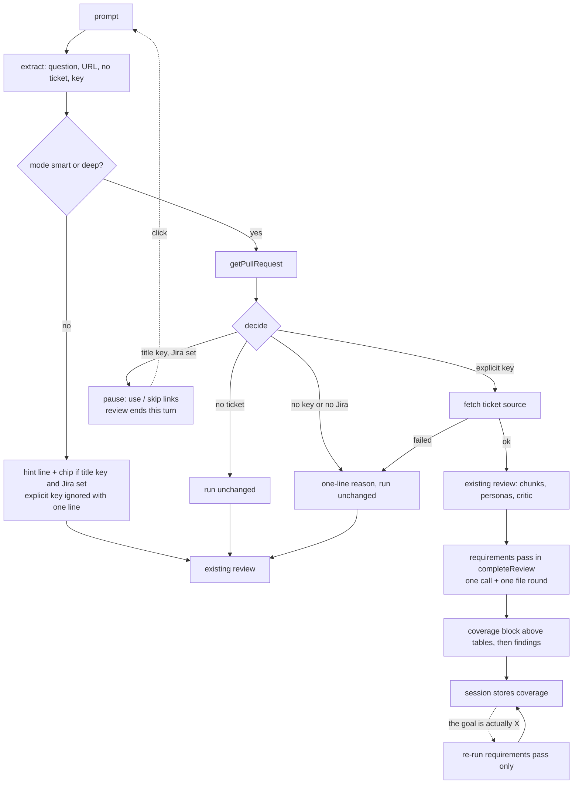

# Bitbucket Requirements-Aware Review - Plan

## Goal Capsule

- **Objective:** A developer running a smart or deep `@bitbucket` review learns whether the change does what its Jira ticket asked for, and what it changes beyond that, without leaving the review.
- **Means:** An isolated requirements pass that is the only part of the review that sees the ticket (KD1, KTD6).
- **Product authority:** The Product Contract below wins on behavior. The Planning Contract wins on mechanism within it. `STRATEGY.md` boundaries still apply: nothing is written to Jira or Bitbucket, and nothing leaves the machine.
- **Execution profile:** Standard. Six units inside the `@bitbucket` participant, its `vscode`-free helpers, `TicketService`, and the docs. No new setting, command or secret.
- **Stop conditions:** Stop and ask if the requirements pass cannot be kept out of the ordinary, persona and critic prompts, or if informal question parsing (R16) cannot be made unambiguous against URLs, mode words and Jira keys.
- **Open blockers:** None.

---

## Product Contract

Product Contract preservation: changed — R1 and R2 were narrowed during planning at the user's direction (the pause offers only use or skip, there is no per-check or alternate-ticket choice, no `ticket:` prefix, and `no ticket` is the skip command). R-IDs are unchanged. AE5 was reworded for clarity only.

### Summary

In smart and deep reviews, a Jira key in the PR title makes the review pause once and ask whether to use the ticket. If you opt in, a separate requirements pass compares the diff with the ticket's summary, description and comments, and the review gains a "Requirements coverage" block above the findings tables. You can also name the ticket by writing its key in the prompt, and the upfront question no longer needs a `question:` prefix. Hints, the guided start and `help` show the exact command to copy.

### Problem Frame

The review sees the diff and the PR title and description, so it cannot tell whether the change does what the ticket asked for, or whether it also touches things the ticket never mentioned. The requirements are already in Jira and the key is usually in the PR title. Many tickets are loose bug reports or tasks, and the agreed solution only appears in a comment. The options that steer a review (mode, ticket, question) are also hard to remember.

### Key Decisions

- KD1. **Only the requirements pass sees the ticket.** Ordinary, persona and critic passes are untouched, so the earlier goal of sharpening existing findings with the ticket is dropped. Governs R8. (session-settled: user-directed — chosen over giving ordinary passes a goal summary: the existing passes stay unaffected.)
- KD2. **Ask first with two clickable choices, use or skip,** rather than auto-using the ticket or requiring a keyword. Governs R1, R2. (session-settled: user-directed — chosen over keyword-only, auto-use, ask-only-in-smart/deep, single-check and alternate-ticket variants.)
- KD3. **Comments count as requirements source.** Governs R6, R10. (session-settled: user-directed — chosen over summary and description only.)
- KD4. **Coverage is a separate block, not numbered findings.** Governs R13, R14. (session-settled: user-directed — chosen over ordinary findings and over both.)
- KD5. **A wrong reading can be corrected in a follow-up.** Governs R15. (session-settled: user-directed — included at the user's request.)
- KD6. **A trailing question sentence is accepted** with no delimiter. Governs R16. (session-settled: user-directed — chosen over keeping `question:` formal or deferring.)
- KD7. **A missing key or failed lookup runs the review unchanged** and says why. Governs R4. (session-settled: user-directed — chosen over searching further or asking for the key.)
- KD8. **Jira stays optional for `@bitbucket`.** The two participants remain independent and share only credential storage. Governs R5. (session-settled: user-approved)

### Requirements

**Triggering and ticket reference**

- R1. In smart and deep reviews, when the PR title contains a Jira key, no explicit ticket was given and Jira is configured, the review pauses once before reviewing and offers two clickable choices: use the ticket (both checks) or skip it.
- R2. A Jira key in the prompt, outside the PR URL and outside the upfront question text, is the explicit ticket: it overrides a different title key, skips the pause, and runs both checks. The words `no ticket` skip the ticket with no pause; the pause's skip choice is this command.
- R3. Quick and standard reviews are unchanged except for one hint line when the title has a key and Jira is configured, plus a follow-up chip, both giving the exact smart re-run command. An explicit ticket reference in those modes is ignored with one line saying so.
- R4. When no key is found, Jira is not configured, or the ticket cannot be fetched, the review runs exactly as today and says why in one line. The branch name and PR description are not searched for a key.
- R5. `@bitbucket` reviews work with no Jira configuration at all.

**Reading the ticket**

- R6. The requirements source is the ticket's summary, description and comments. Comments are capped in size, newest first.
- R7. Ticket text is treated as untrusted input and fenced the way the PR description is.

**The requirements pass**

- R8. The requirements pass is the only pass that receives ticket text. It runs only after the user opts in, in smart and deep.
- R9. The pass can ask for extra whole files beyond the diff, within the same budget rules as the existing whole-file pass.
- R10. The pass opens with "How I read this ticket" and labels each requirement by source: description, comment, or inferred. When a later comment narrows or contradicts the description, the newest agreed direction wins; a contradictory thread is flagged and the affected requirements are marked unclear.
- R11. When no usable goal can be derived, the block says "no clear requirements found" and the gap and scope checks are skipped. A requirement is never invented to have something to check.
- R12. Each requirement is marked met, not evident or unclear, and the scope check lists changes the ticket does not account for. Only a requirement that can be pointed to in the ticket text can be marked not evident.

**Output and follow-ups**

- R13. The result is a "Requirements coverage" block above the findings tables. Its items are not numbered findings, so `explain`, `add` and `copy` cannot target them individually.
- R14. "Copy for Teams" includes the coverage block in its plain-text output.
- R15. A follow-up that states the real goal ("the goal is actually X") redoes the coverage block against that wording. Only the requirements pass re-runs.

**Informal syntax and discoverability**

- R16. The upfront question may be a sentence ending in `?` before or after the PR URL, with no delimiter; `question:` and `--` keep working. The review's first line echoes the detected focus. A mode word or Jira key inside the question never changes the review mode or the ticket (per R2).
- R17. The guided start (a bare `/review` or a mode word without a URL) and `@bitbucket help` list smart, deep, a ticket key, `no ticket` and a question, each with a copyable example.

**Documentation and testability**

- R18. The README command table, the matching page under `docs/manual/` and `docs/review-process.md` are updated in the same change.
- R19. The decisions for mode gating, prompt parsing, ticket-text isolation and the correction follow-up live in `vscode`-free modules so Vitest can cover them. The participant file only calls them.

### Key Flows

- F1. Smart or deep review with a title key
  - **Trigger:** The user runs `@bitbucket review smart <url>` and the title contains PROJ-123.
  - **Steps:** The review asks whether to use the ticket; the user clicks use; the requirements pass runs; the coverage block appears above the findings tables.
  - **Covered by:** R1, R6, R8, R10, R12, R13
- F2. Explicit ticket
  - **Trigger:** The user runs `@bitbucket review smart <url> PROJ-9 does this handle retries?`
  - **Steps:** The ticket and question are extracted, no pause occurs, both checks run, and the first line echoes the focus.
  - **Covered by:** R2, R16
- F3. Correcting the reading
  - **Trigger:** The coverage block misreads the ticket and the user replies with the real goal.
  - **Steps:** The requirements pass re-runs against that wording and the block is replaced.
  - **Covered by:** R15

### Acceptance Examples

- AE1. **Covers R1, R8.** Given a smart review of a PR titled "PROJ-123 add retry" with Jira configured, when the user clicks use, a coverage block appears and no ordinary, persona or critic prompt contains ticket text.
- AE2. **Covers R3.** Given a standard review of the same PR, when it runs, no pause occurs and one line shows the smart re-run command.
- AE3. **Covers R10.** Given a bug report whose description is vague and whose last comment says "fix by adding an idempotency key", when the pass runs, the block names that requirement and labels its source as a comment.
- AE4. **Covers R11.** Given a ticket with a one-line summary and no description or useful comments, when the pass runs, the block says "no clear requirements found" and lists no gaps.
- AE5. **Covers R2, R16.** Given the prompt `review deep <url> does this fix PROJ-77?` and a title key of PROJ-123, when the prompt is parsed, the mode is deep, the question is the sentence, and no explicit ticket is found because the key inside the question is ignored; the title key PROJ-123 then triggers the pause.
- AE6. **Covers R4, R5.** Given Jira is not configured, when a smart review of a PR with a title key runs, it behaves as today and one line says Jira is not configured.
- AE7. **Covers R1, R2.** Given a smart review of a PR with a title key, when the user clicks skip, the review runs exactly as it does today, with no ticket lookup and no extra model call.

### Success Criteria

- The parsing rows in R2, R16 and the AE examples hold as a table of prompts under Vitest, including URLs containing `--`.
- A recording fake model shows ticket text reaches only the requirements call, and quick and standard make no extra call.
- Fixture tickets cover a clean spec, a bug report with the fix agreed in a comment, a contradictory thread and an empty ticket. Recorded replies check parsing and rendering in CI. A manual Extension Development Host check runs real reviews against the same four ticket shapes to compare interpretations by eye.
- The click behavior of the pause links is checked manually in the Extension Development Host; everything the handler streams is covered by the recorded-reply flow test.

### Scope Boundaries

**Deferred for later**

- Parent epics, linked tickets and attachments as requirements source.
- Searching the branch name or PR description for a key.
- Requirements checks in quick and standard reviews.
- Writing anything back to Jira.
- Choosing a single check, or a different ticket, from the pause (declined for now to keep the grammar small).

**Outside this product's identity**

- Posting review results to Jira or Bitbucket without a confirmation step (`STRATEGY.md` boundary).

### Dependencies / Assumptions

- Jira credentials come from the existing shared configuration; `@bitbucket` reads tickets without depending on the `@jira` participant.
- "Copy for Teams" including the coverage block (R14) is an assumption the user confirmed in the synthesis.

### Sources / Research

- `docs/review-process.md` — whole-file Pass 2, "Upfront question", "Follow-ups".
- `src/participant/reviewSessionState.ts` — `parseUpfrontQuestion`, `isReviewStartWithoutUrl`, `computeBitbucketFollowups`, `formatReviewForSharing`.
- `src/services/PrReviewService.ts` — PR title and description already sent to the model, fenced as untrusted.
- `docs/plans/2026-09-04-1350-feat-bitbucket-persona-review-plan.md` — precedent for an isolated, mode-gated pass.
- `STRATEGY.md` — boundaries; `CLAUDE.md` — test layout and documentation rules.

---

## Planning Contract

### Key Technical Decisions

- KTD1. **The pause is stateless.** Its two links are complete re-run commands: use is the original prompt plus the title key, skip is the original prompt plus `no ticket`. No new session kind or `workspaceState` key is needed, because nothing in flight has to survive the pause. The PR is fetched a second time on the re-run; the first fetch only reads its title, and the pause happens right after it, before the diff is fetched. Governs R1, R2. Alternative considered: a stored session like `SmartFallbackSession`, rejected as more state with no benefit.
- KTD2. **The gating decision is one pure function** in a new `vscode`-free module, `src/participant/bitbucket/requirementsFlow.ts`. Its inputs are the review mode, the parsed prompt, the title key and whether Jira is configured. Its output is one of: ask, run, skip, hint, ignored-explicit, not-configured, nothing. The same module builds the pause text, the hint line and their commands. The participant file only executes the outcome. Governs R1–R5, R19.
- KTD3. **One extraction pass over the prompt, in a fixed order,** beside `findUpfrontQuestionMatch` in `src/participant/reviewSessionState.ts`: the upfront question (the existing `question:` and `--` forms first, then a trailing or leading sentence ending in `?`), then PR URLs, then `no ticket`, then the first Jira key in what remains. Mode detection reads only the remainder, so a key, `no ticket` or mode word inside the question or URL never acts. The key pattern is `TICKET_ID_PATTERN` from `src/utils/branchParser.ts` with word boundaries; the title key comes from `extractTicketId(pr.title)`. When both `no ticket` and a key are present, `no ticket` wins as the explicit opt-out. An informal question needs at least three words and applies only when no `question:` or `--` form matched. The sentence search skips URL spans, so a query string such as `?w=1` on a PR URL is never read as a question. Governs R2, R16.
- KTD4. **Ticket access goes through `TicketService`.** A new `getRequirementsSource(key)` returns a typed result: ok with the source, or not-ok with a reason (not found, auth, other). It classifies by `JiraApiError.status`, never message text. It fetches the issue and all comments, converts bodies with `formatJiraBody`, and shapes the capped text with a pure helper in a new `src/utils/requirementsSource.ts`. The Bitbucket participant builds `JiraApiClient` and `TicketService` from `ConfigService.getConfig()`; it never imports `JiraParticipant`. A failed comment fetch still returns the ticket and records that comments were unavailable. Governs R4–R7.
- KTD5. **Size caps as named constants in one place, starting values:** summary plus description at most 6,000 characters; comments newest first within 8,000 characters total and 1,500 each; a line records how many older comments were left out. No setting. The values leave room beside the 24,000-token chunk cap and can be tuned once the fixtures show real shapes. Governs R6.
- KTD6. **The requirements pass is one call over the whole PR, not one per chunk.** It runs inside `completeReview` after every other pass, so the smart-fallback resume gets it too; the ticket source rides in `SmartFallbackSession`. The prompt holds the ticket source, the PR title and description, and as many diff files as `selectFilesWithinBudget` fits; files left out are listed by path with changed-line counts. One file round: the reply's `additionalFilesNeeded` goes through the existing `fetchAndBudgetContextFiles`, capped like the critic's round. Governs R8, R9. Alternative considered: per-chunk passes merged afterwards, rejected because it fragments verdicts and multiplies cost.
- KTD7. **Partial view means "unclear", never "not evident".** When files were left out, the prompt tells the pass to mark a requirement unclear if the evidence could sit in an unseen file, and the block says how many files were not seen. Governs R12.
- KTD8. **The reply is one JSON object** read with the shared `extractJsonObject`: a reading, requirements (text, source, status, evidence), out-of-scope entries (file, note), a conflict note, a no-clear-requirements flag, and `additionalFilesNeeded`. A tolerant parser, types and renderers live in a new `src/participant/bitbucket/requirementsCoverage.ts`. An invalid status becomes unclear, and an out-of-scope entry naming a file outside the PR is dropped. An unreadable reply is retried like a provider error (`UnparseableReplyError` with `withLmRetry`); if every try fails, the review completes without the block and says so in one line. Governs R10–R12.
- KTD9. **The coverage block is inserted by `formatReview` through a new optional preamble argument,** after the header and before the severity tables, also in the no-findings case. Every piece of ticket- or model-derived text goes through `neutralizeMarkdownLinks`, and table cells through `sanitizeGfmCellText`, because the whole response is trust-gated by `trustedChatMarkdown` and un-neutralized ticket text could plant live command links. Governs R13.
- KTD10. **Stored state is optional fields only.** `ReviewSession` gains `requirements` (ticket key, capped source, parsed coverage) and `SmartFallbackSession` gains the ticket source, so sessions saved before this change keep working. Governs R14, R15.
- KTD11. **The correction is a new `goal` follow-up intent,** recognized only when the session has `requirements`, checked after `copy` and `add` and before `explain`, in strict start-anchored forms ("the goal is …", "actually the goal is …", "the real goal is …", "goal: …"). The handler re-runs only the requirements pass on the stored diff parsed back with `parseDiff` (omitted files per KTD7), with the user's wording as the primary requirement and the ticket as background. It replaces the stored coverage, streams the new block, and leaves findings and their numbers alone. A "what is the goal of this PR?" question stays an `explain`. Governs R15.
- KTD12. **Diagnostics follow the existing pattern.** `ReviewPass` gains `requirements`, the call is logged with `formatCallLine`, and the findings funnel is untouched because coverage items are not findings. Token metering counts the call through the existing model proxy. Governs R8.
- KTD13. **Discoverability is text plus one chip.** The guided-start and greeting messages each gain one line listing the options. The hint line and its chip come from `requirementsFlow.ts`. When the hint chip shows, it replaces "Explain finding #1" so the three-chip cap holds. Governs R3, R17.
- KTD14. **Tests extend the recorded-reply harness** in `src/test/bitbucketReviewFlow.test.ts`, which already loads the real handler under Vitest with a mocked `vscode`. Jira is faked by mocking the `JiraApiClient` module with a `MockJiraClient`-backed class, the way that file swaps in `MockBitbucketClient`. Governs R19.

### High-Level Technical Design

This diagram shows the decision path and where the new pass sits. It is directional guidance, not implementation specification.

### Alternatives Considered

- **A stored pause session** (rejected, see KTD1): more state, nothing to preserve.
- **Per-chunk requirements passes** (rejected, see KTD6): one verdict per requirement needs the whole picture.
- **A user setting for the default behavior, or a live-check Command Palette command** (not built): no one asked, and a new command would also have to be listed in the README by `src/test/userDocsSync.test.ts`.

### Risks & Dependencies

| Risk | Mitigation |
| --- | --- |
| A large PR hides the evidence for a requirement and the pass reports a false gap | KTD7: unseen files make a verdict "unclear" and the block says how many files were not seen. Registered as a known limitation (U6). |
| A crafted ticket or comment injects instructions or fake links | KTD9 neutralizes all echoed text; the ticket is fenced as untrusted input (R7); output is advisory and nothing is posted. |
| The informal question rule misreads a sentence | The first streamed line echoes the detected focus, so a wrong guess is visible. Registered as a known limitation (U6). |
| A key-shaped word such as `UTF-8` is taken as a ticket | It produces one "not found" line and the review runs unchanged (R4). U1 pins this behavior with a test. |
| The "use" link needs the chat host to resubmit the full command | The links reuse `buildChatCommandLink`, already used for the smart-fallback reply. The click behavior is checked manually (Verification Contract). |
| Extra cost on smart and deep reviews | One call plus at most one file round, only after the user opts in. |
| Stored sessions grow | The capped source text adds at most about 14,000 characters; fields are optional. |

---

## Implementation Units

### U1. Prompt grammar: ticket key, `no ticket`, informal question

**Goal:** One pure extraction step turns the prompt into mode text, upfront question, explicit ticket key and skip flag.

**Requirements:** R2, R16. Settled decisions via KD6 and KTD3.

**Dependencies:** None.

**Files:**
- Modify `src/participant/reviewSessionState.ts`
- Test `src/test/reviewSessionState.test.ts`

**Approach:**
1. Keep `findUpfrontQuestionMatch` and the existing `question:` and `--` behavior as is; add the informal sentence rule behind it (KTD3).
2. Add a function returning question, ticket key, skip flag and the remainder text, using the fixed order in KTD3. Keep `parseUpfrontQuestion` and `stripUpfrontQuestion` working for existing callers.
3. Point the new-review branch of `BitbucketParticipant.ts` at the remainder text when U4 wires it in; this unit does not touch the participant.

**Execution note:** Start with the existing upfront-question tests as characterization, then add the new rows.

**Patterns to follow:** The URL-span and delimiter handling in `findUpfrontQuestionMatch`; `TICKET_ID_PATTERN` in `src/utils/branchParser.ts`.

**Test scenarios:**
- Covers AE5. `review deep <url> does this fix PROJ-77?` gives mode text containing `deep`, the sentence as question, and no ticket.
- `review smart <url> PROJ-9` gives ticket PROJ-9 and no question.
- `review smart <url> PROJ-9 does this handle retries?` gives both, and the remainder still resolves to smart.
- `does this handle retries? <url>` takes the leading sentence as the question.
- A `question:` or `--` form still wins over an informal sentence and produces the same result as before this change.
- A `--` inside `api--service` in a URL, and `PROJ` inside `/projects/PROJ/`, are never read as a marker or a ticket.
- A PR URL ending in a query string such as `?w=1` is never read as a question, with or without a sentence after it.
- `review smart <url> no ticket` gives skip true; `no ticket` inside the question text is ignored; with both `no ticket` and a key, skip wins.
- `is this quick to fix? <url>` keeps the configured default mode, because the question is removed before mode words are read.
- A statement without `?`, and a fragment such as `ok?`, are not questions.
- Two keys outside the URL and question give the first one.
- A lowercase `proj-9` is not a key.
- `UTF-8` outside the question is returned as the ticket key (documented false positive).
- The remainder contains no URL, question, key or `no ticket`.

**Verification:** All rows pass and the pre-existing upfront-question tests are unchanged and green.

### U2. Ticket requirements source

**Goal:** Given a key, `TicketService` returns the capped, readable requirements source or a typed failure.

**Requirements:** R4, R5, R6, R7. Settled decisions via KD3, KD7, KD8 and KTD4, KTD5.

**Dependencies:** None.

**Files:**
- Modify `src/services/TicketService.ts`
- Create `src/utils/requirementsSource.ts`
- Modify `src/test/mocks/MockJiraClient.ts`
- Create `src/test/fixtures/ticket-req-clean-spec.json`, `ticket-req-bug-comment-fix.json`, `ticket-req-contradictory.json`, `ticket-req-empty.json`
- Test `src/test/TicketService.test.ts`, `src/test/requirementsSource.test.ts`

**Approach:**
1. The pure helper takes an issue and its comments and returns the shaped source: key, summary, description text, comment lines with author and date, dropped-comment count, comments-unavailable flag (KTD5). The helper's module exports the `RequirementsSource` type; U3 and U4 import it from there.
2. `getRequirementsSource` fetches the issue, then all comments, and classifies failures by `JiraApiError.status` (KTD4).
3. Extend `MockJiraClient.getIssue` to serve the new fixtures by key and keep its `PROJ-404` behavior; fixtures follow the real Jira API shape as `CLAUDE.md` requires.

**Patterns to follow:** `formatJiraBody` in `src/utils/markdownFormatter.ts`; `JiraApiError` in `src/utils/apiError.ts`; the existing `TicketService.test.ts` fixture use.

**Test scenarios:**
- The bug-report fixture yields the vague description and a later comment saying to fix it with an idempotency key, the comment carrying author and date, newest first.
- Thirty long comments come out at or under the total cap with the newest kept and a line naming how many older ones were left out.
- One comment over the per-comment cap is trimmed with a visible marker.
- An ADF description object and a wiki-markup string description both become readable text; an empty description shows a "no description" marker.
- A 404 gives not found, a 401 gives auth, any other error gives other with its message, built from `JiraApiError` values.
- The comment fetch failing while the issue succeeds gives ok with comments marked unavailable.
- The empty fixture gives a source with only the summary and no description or comment sections.

**Verification:** Scenarios pass; `TicketService` still imports `IJiraClient` only.

### U3. Requirements pass core

**Goal:** Pure prompt building, tolerant reply parsing and safe rendering of the coverage block.

**Requirements:** R7, R9–R13. Settled decisions via KD1, KD4 and KTD7, KTD8, KTD9, KTD12.

**Dependencies:** U2 (type only: `RequirementsSource`).

**Files:**
- Create `src/participant/bitbucket/requirementsCoverage.ts`
- Modify `src/services/PrReviewService.ts`
- Modify `src/participant/reviewSessionState.ts` (`ReviewPass` gains `requirements`)
- Create `src/test/fixtures/requirements-reply-*.json` (recorded replies for the four ticket shapes)
- Test `src/test/requirementsCoverage.test.ts`, `src/test/PrReviewService.test.ts`

**Approach:**
1. In `PrReviewService`, a prompt builder takes the PR, the ticket source, the shown diff files, the omitted files, and an optional user goal. The ticket and PR sit inside the untrusted-content fence used by the other prompts (R7).
2. The prompt asks for the reading, source labels, newest-agreed-direction rule, conflict flag, no-invented-requirements rule, and the KTD7 rule only when files were omitted. With a user goal, the goal comes first as the primary requirement and the ticket is labeled background (U5 uses this).
3. The parser and types in `requirementsCoverage.ts` follow KTD8. Renderers produce the chat block (a table of requirement, source, status, evidence, then out-of-scope entries, conflict line and unseen-files line) and a plain-text form for U5, with all text neutralized per KTD9.
4. `formatReview` takes an optional preamble inserted after the header, in both the findings and no-findings branches.

**Patterns to follow:** `buildCriticPrompt` and the `«UNTRUSTED-CONTENT»` fence in `PrReviewService`; `parseReviewReply` tolerance; `sanitizeGfmCellText` and `neutralizeMarkdownLinks` use in `formatReview`.

**Test scenarios:**
- Covers AE3. The recorded bug-report reply renders a requirement about the idempotency key with source "comment".
- Covers AE4. A no-clear-requirements reply renders that sentence and no requirement rows or out-of-scope list.
- A reply wrapped in a code fence, one with prose before and after the JSON, and a pretty-printed one all parse.
- An invalid status becomes unclear; unknown fields are ignored.
- A reply cut off mid-object is reported unreadable.
- An out-of-scope entry naming a file not in the PR is dropped.
- Evidence containing `[x](command:workbench.action.chat.open?...)`, a pipe, a newline and `**bold**` renders inert and keeps the table intact.
- The prompt places ticket text and PR text inside the untrusted fence, and includes the unseen-files rule and file list only when files were omitted.
- With a user goal, the goal appears first and the ticket text is labeled background.
- `formatReview` puts the block after the header and before the first severity table, and also before "No issues found".

**Verification:** Scenarios pass; existing `PrReviewService` tests stay green with no preamble given.

### U4. Review-flow wiring

**Goal:** Smart and deep reviews pause, fetch the ticket, run the requirements pass and show the block; quick and standard get the hint.

**Requirements:** R1, R3, R4, R5, R8, R9, R13, R19. Settled decisions via KD1, KD2, KD7, KD8 and KTD1, KTD2, KTD6, KTD14.

**Dependencies:** U1, U2, U3.

**Files:**
- Create `src/participant/bitbucket/requirementsFlow.ts`
- Modify `src/participant/BitbucketParticipant.ts`
- Modify `src/participant/reviewSessionState.ts` (`SmartFallbackSession` gains the ticket source)
- Test `src/test/requirementsFlow.test.ts`, `src/test/bitbucketReviewFlow.test.ts`

**Approach:**
1. `requirementsFlow.ts` holds the decision function and the text and command builders (KTD2). It has no `vscode` import.
2. In the new-review branch, use U1's extraction for mode, question, key and skip. After `client.getPullRequest`, build the Jira reader only when Jira is configured, call the decision function with `extractTicketId(pr.title)`, and act on the outcome:
   - Ask: stream the pause through `trustedChatMarkdown` with two `buildChatCommandLink` links (KTD1) and return with no session metadata.
   - Run: fetch the source; on failure stream the one-line reason and continue unchanged; on success stream a short "using PROJ-123" line.
   - Other outcomes: stream their single line, or remember the hint for U6's chip.
3. Add a module-level helper beside `runPersonaPassesForChunk` that runs the pass: pack files, one call with `withLmRetry`, parse, one optional file round through `fetchAndBudgetContextFiles`, return the coverage or undefined with a notice. Call it from `completeReview` and pass the result to `formatReview` as the preamble (KTD6, KTD9).
4. Carry the ticket source in `SmartFallbackSession` and hand it to `resumeSmartReviewPhase2`'s `completeReview` call.
5. Log the decision, the fetch result, the pass call line and the outcome through `logReview`.

**Execution note:** Start with a failing recorded-reply test for the pause, then add the pass.

**Patterns to follow:** `askSmartFallbackChoice` for the link-and-trust pattern; `runPersonaPassesForChunk` and `fetchAndBudgetContextFiles` for pass and file handling; `h.client` swapping in `bitbucketReviewFlow.test.ts`.

**Test scenarios:**
- Covers AE1. A smart review of a PR titled with PROJ-123 ends the turn with the pause: two links, no diff fetch and no model call, and the links' queries are the original prompt plus the key and plus `no ticket`.
- Resubmitting with the key runs the review: the coverage block precedes the tables, and a distinctive sentence from the ticket appears only in the requirements call's prompt.
- Covers AE7. Resubmitting with `no ticket` makes no Jira call and no extra model call, and the output matches a review without the feature.
- Covers AE2. A standard review with a title key and Jira configured shows the hint, has no pause and makes no Jira call.
- A quick review with an explicit key shows the ignored line.
- Covers AE6. Smart with a title key and Jira not configured shows one line and runs normally.
- A 404 ticket and a 401 ticket each show their own one-line reason and run normally.
- The requirements reply unreadable on every try completes the review with a one-line notice and no block.
- Deep mode: persona and critic prompts contain no ticket text.
- A small budget forces omitted files: the prompt lists them and the block states how many files were not seen.
- A reply asking for an extra file triggers one fetch and a second call that includes the file; a second round is not made.
- The smart-fallback path: no usable persona signal, reply `all`, and the resumed review still shows the coverage block.
- A failing requirements pass does not trigger the partial-review warning.

**Verification:** Scenarios pass; `npm test` green; the existing flow tests are unchanged.

### U5. Share text and goal correction

**Goal:** "Copy for Teams" includes the coverage, and a stated goal redoes only the coverage block.

**Requirements:** R14, R15. Settled decisions via KD4, KD5 and KTD10, KTD11.

**Dependencies:** U3, U4.

**Files:**
- Modify `src/participant/reviewSessionState.ts` (`ReviewSession.requirements`, `parseFollowUpIntent`, `formatReviewForSharing`)
- Modify `src/participant/BitbucketParticipant.ts` (store coverage at review completion; goal branch in the review-session follow-up)
- Test `src/test/reviewSessionState.test.ts`, `src/test/bitbucketReviewFlow.test.ts`

**Approach:**
1. `completeReview` stores the ticket key, capped source and coverage on the session when a pass ran.
2. `formatReviewForSharing` puts a plain-text coverage section after the header and before the severity groups for whole-review copies, also when there are no findings. A copy limited to `#N` findings omits it.
3. `parseFollowUpIntent` gains the `goal` kind when the caller says the session has requirements (KTD11). The handler re-runs the pass with the user's wording, replaces the stored coverage, and streams the block.

**Patterns to follow:** The `copy` branch and `parseCopyCommand` strictness; `buildDiffAwarePrompt` for reading the stored diff.

**Test scenarios:**
- Covers F3. After a review with coverage, `the goal is actually X` makes one extra model call whose prompt has X as the primary requirement and the ticket as background, streams a new block, leaves the findings and their numbers unchanged, and replaces the stored coverage.
- `copy` after the correction shows the new block; `copy` on a session with coverage shows it above the severity groups; `copy #1 #3` omits it.
- A zero-findings review with coverage still copies header, coverage and "No issues found".
- A session without coverage copies exactly as it does today.
- `what is the goal of this PR?` and a session without requirements both fall through to `explain` with no extra pass.
- `goal:` with no text asks what the goal is, in one line.
- A stored diff that was truncated makes the redone block state how many files it did not see.
- The pass failing during a correction keeps the old coverage and shows an error line.

**Verification:** Scenarios pass; existing copy and follow-up tests are unchanged.

### U6. Discoverability and documentation

**Goal:** A user can find the options without remembering syntax, and the docs describe the feature.

**Requirements:** R3, R17, R18. Settled decisions via KTD13.

**Dependencies:** U1, U4, U5.

**Files:**
- Modify `src/participant/BitbucketParticipant.ts` (guided-start and greeting text)
- Modify `src/participant/reviewSessionState.ts` (`reviewCompleted` follow-up state gains an optional ticket hint; `actionChips` adds the chip)
- Modify `src/participant/bitbucket/requirementsFlow.ts` (hint line and chip command builders, if not already there)
- Modify `README.md` (`@bitbucket` command table), `docs/manual/bitbucket-pr-review.md`, `docs/review-process.md`, `docs/onboarding.md` (only where it quotes the greeting), `CLAUDE.md`, `docs/known-limitations.md`
- Test `src/test/reviewSessionState.test.ts`, `src/test/bitbucketReviewFlow.test.ts`

**Approach:**
1. The guided-start and greeting messages each gain one line listing `smart`, `deep`, a ticket key, `no ticket` and a question sentence with examples (R17).
2. The hint chip's prompt is the exact smart re-run command with the key and URL (R3); it replaces "Explain finding #1" so the cap holds (KTD13).
3. Docs, following "Where documentation belongs" in `CLAUDE.md`:
   - `README.md`: table rows for the ticket key, `no ticket` and the informal question.
   - Manual page: a short section on checking a PR against its ticket and the corrected upfront-question section.
   - `docs/review-process.md`: the new node in the pipeline diagram, a "Requirements pass" section, the goal follow-up, and the coverage block in "Copy for Teams".
   - `CLAUDE.md`: key-file rows for the new modules, and the independence note now says `@bitbucket` can read tickets through the shared `TicketService`.
   - `docs/known-limitations.md`: two new rows, large-PR coverage and the informal-question guess, using the next unused `KL` numbers.

**Test expectation:** The chip and text rows below are behavior tests; the doc edits have none beyond `src/test/userDocsSync.test.ts` staying green.

**Test scenarios:**
- The guided-start and greeting messages contain `no ticket`, a key example and a question example.
- Covers AE2. After a standard review with a title key, the chips include the re-run command chip, drop "Explain finding #1", and stay at three.
- Without a hint, the chips are exactly the current three.
- A review with zero findings and a hint shows the re-run chip and the Copy chip.

**Verification:** Scenarios pass; every doc names the same options the parser accepts; `userDocsSync` is green.

---

## Verification Contract

| Gate | Command / action | Applies to |
| --- | --- | --- |
| Type check | `npm run compile` | U1–U6 |
| Unit and flow tests | `npm test` (Vitest; includes `src/test/reviewSessionState.test.ts`, `src/test/requirementsCoverage.test.ts`, `src/test/requirementsFlow.test.ts`, `src/test/requirementsSource.test.ts`, `src/test/TicketService.test.ts`, `src/test/PrReviewService.test.ts`, `src/test/bitbucketReviewFlow.test.ts`, `src/test/userDocsSync.test.ts`) | U1–U6 |
| CI | `.github/workflows/ci.yml` (`npm ci` → compile → test) green on the branch | all |
| Manual: pause links | In the Extension Development Host, run a smart review of a PR with a key in its title, click use, then repeat with skip; confirm each click resubmits the full command and the review runs as specified | U4 |
| Manual: ticket shapes | With a real model, run reviews against PRs linked to the four ticket shapes (clean spec, fix agreed in a comment, contradictory thread, empty ticket) and compare the "How I read this ticket" lines by eye | U3, U4 |
| Manual: Teams paste | Copy a review with a coverage block and paste it into a Teams chat | U5 |

`npm run test:e2e` is not used: `package.json` points it at `out/test/runTest.js`, but no source for that runner exists in the repo, so the recorded-reply flow test is the handler-level gate.

---

## Definition of Done

- Every R1–R19 is covered by a passing Vitest scenario, or by a named manual check above for the link clicks, the model's real interpretations and the Teams paste.
- `npm run compile` and `npm test` are green, and CI is green on the pushed branch.
- Quick and standard reviews behave as before apart from the hint line and chip (verified by AE2 and the unchanged existing flow tests).
- No ordinary, persona or critic prompt contains ticket text (verified by the recording fake model).
- The docs in U6 are updated and `userDocsSync` is green.
- No leftover code from abandoned approaches (for example a stored pause session) remains in the diff.
