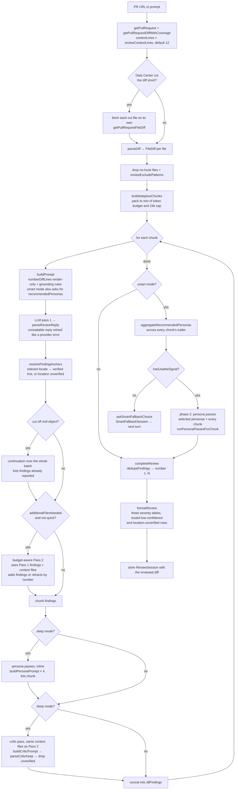
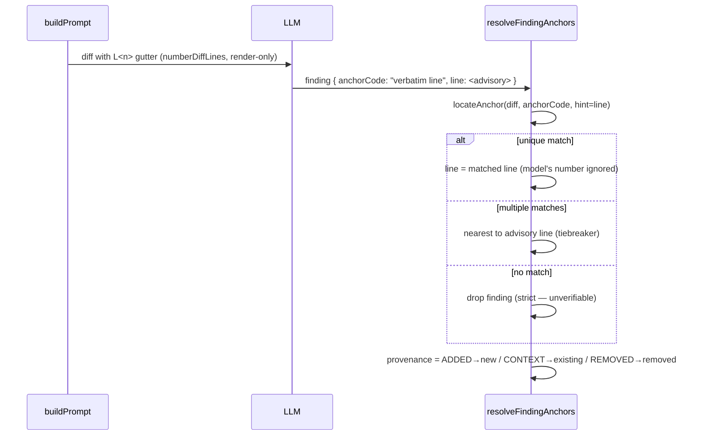

# Bitbucket PR Review Process

How `@bitbucket <pr-url>` turns a pull request into a grounded, line-accurate
review. **Keep this document in sync whenever the review pipeline changes** — it
is the single source of truth for how the steps fit together.

The code lives in:

- [`src/participant/BitbucketParticipant.ts`](../src/participant/BitbucketParticipant.ts) — orchestration (the handler).
- [`src/services/PrReviewService.ts`](../src/services/PrReviewService.ts) — prompt building, critic prompt, report formatting.
- [`src/participant/reviewSessionState.ts`](../src/participant/reviewSessionState.ts) — all pure helpers (numbering, anchor-locate, dedup, chunking).
- [`src/bitbucket/BitbucketApiClient.ts`](../src/bitbucket/BitbucketApiClient.ts) — HTTP, diff fetch (with context lines), file fetch.

## Pipeline overview



Smart mode's persona passes never run inside the per-chunk loop above — they need the
recommendation aggregated across *all* chunks first, so phase 2 is a second, separate
walk over the same `chunks` after the loop completes. `deep` mode instead runs all four
persona passes inline, per chunk, alongside the standard pass — no aggregation needed
because deep mode always uses every persona.

## Diff intake and chunk budgeting

`parseDiff(raw)` builds `FileDiff[]` from the `---`/`+++` header lines (falling
back to the `diff --git` header); a deletion (`+++ /dev/null`) keeps the source
path and sets `deleted: true` so removed code is still reviewed. `reviewExcludePatterns`
are matched via `minimatch` with `matchBase: true`, and excluded files are
reported to the user; the review returns early if every file is excluded.

The token budget resolves in order: the `modelContextTokens` setting, then
`request.model.maxInputTokens` (VS Code LM API), then a `60 000` fallback —
multiplied by `contextBudgetRatio` (default `0.7`). `buildAdaptiveChunks`
packs files into chunks against the smaller of that budget and a fixed
`REVIEW_CHUNK_TOKEN_CAP` of 24 000 estimated tokens, estimating each file's
cost as `1500 + 50×files + ceil(diff.length/4)` tokens. The cap exists
because the model's *reply* is what gets divided across a chunk's files: a
window-sized chunk on a large-window model left each file only a sliver of
the answer. The room the cap frees up is what Pass 2 and the critic use for
context files. A single file whose diff exceeds the per-file budget is first
split along `@@` hunk boundaries (each sub-diff keeping the file header) so
an oversized file is reviewed across several calls instead of blowing the
context; a file with one giant hunk can't be subdivided and is sent as-is.

### Data Center truncated diffs

Bitbucket Data Center stops sending a PR diff past a server limit (about
10 000 lines by default). `getPullRequestDiffWithCoverage` reports which
files that cut: entries with a `truncated` flag on the file, a hunk or a
segment, plus — when the response itself is marked truncated — every path in
the PR's paged `changes` list that the response left out entirely. If the
changes list can't be fetched, the review goes ahead with the cut files it
already knows about. The review then fetches each cut file on its own with
`getPullRequestFileDiff` (passing the source path for a moved file), skipping
files that `reviewExcludePatterns` would drop anyway, and reviews it with the
rest. A file the server still cuts is named as *reviewed partially*; one that
can't be fetched is named as *not reviewed*. Cloud never reports cut files.

Every Data Center diff, changes-list and per-file response writes a one-line,
content-free shape summary to the output channel (`Data Center response
shape — …`: top-level keys, each `truncated` flag and its level, file/hunk/
segment/line counts, source/destination presence). It never includes code.
The response shape was built from documentation rather than a captured
response (`docs/known-limitations.md`, KL10), so this line is what shows a
mismatch in a user's log.

## The line-number trust boundary

The original failure mode: the model was handed a plain unified diff and had to
*count* lines from each `@@` header to state a line number — arithmetic it gets
wrong. The fix removes the model from that path entirely.



Key invariant: **`FileDiff.diff` is never mutated.** Line numbering is applied
only when rendering the prompt string (`numberDiffLines`). All code-side line
math — `parseDiff`, `resolveLineType`, `locateAnchor`, `splitFileDiff` — walks the
raw diff with its own `@@`-anchored counters, so the visible gutter cannot break
parsing.

## Filtering: what can remove a finding

A finding leaves the review only as a duplicate, for naming a file outside
the PR, by an explicit Pass 2 retraction, or by the critic. Every other
doubt keeps the finding visible. This protects recall — a review never looks
empty because filters stacked up, and whenever findings were dropped the
review says how many in one line above the tables
(`formatDroppedFindingsNotice`).

| Step | When | Effect |
| --- | --- | --- |
| Dedup (`dedupeFindings`) | always | **merge** two findings on the same file + verified line with the same meaning (the stronger severity survives); a location-unverified finding is also dropped when another pass located a finding with the same title in the same file |
| Path resolution (`resolveFindingAnchors`) | always | **drop and count** a finding whose file names nothing in the diff, after trying `./`, `a/`, `b/`, leading `/` and a unique suffix match |
| Anchor locate (`resolveFindingAnchors`) | always | locate `anchorCode` in tiers — exact, whitespace-collapsed, then with a copied `L<n>` gutter or diff marker removed; when nothing matches, **keep** the finding as *location unverified*: no line, muted, activity-feed only when posted |
| Confidence (`formatReview`, `confidenceThreshold`) | always | **mute** (render the confidence cell non-bold) if `confidence < threshold` — never deleted, always shown in its severity table |
| Pass 2 retraction (`mergePass2Findings`) | standard, smart, deep | **drop** a Pass 1 finding only when Pass 2 names its number in the meta line's `retract` list |
| Critic (`buildCriticPrompt` + `parseCriticKeep`) | deep mode only | **drop** findings the verification pass can't confirm; an unreadable verdict (no JSON, or an index outside 1..N) keeps the batch's findings unverified, with a notice |

Persona-pass findings (smart/deep) are not a separate filtering stage — they
flow through the exact same two hard drops as standard-pass findings (anchor
locate, and critic in deep mode), then merge into `allFindings` alongside
the standard pass's findings before the shared dedup/confidence/format steps
run once over the combined set.

Fixed order: `parse → number(render) → LLM → locate+classify (drop only for
a file outside the PR) → [truncated: continuation] → [Pass 2 refine] →
[deep: critic] → merge chunks → dedup → format`.
The end-of-review findings funnel (below) reports these same stages — dedup,
outside-PR drops, Pass 2 retractions, critic — in that conceptual order regardless of the
pipeline's actual per-chunk execution order, since it's a summary of where
findings went, not a step-by-step trace.

## Resilience & debugging

Every LLM call in the pipeline gets exactly 3 tries: the original request,
one identical retry (short exponential backoff), and — for the two calls
that dominate `deep` mode's extra load, the main review call and the critic
call — a 3rd try that's genuinely easier for the model instead of a 3rd
identical one: the batch of files (or findings) is split in half once and
each half gets one final attempt. This bounds every chunk to at most 4 real
LLM calls, never an open-ended retry storm. A file or finding that still
fails standalone after its tries is skipped and reported — it does not
abort the rest of the review. `dedupeFindings` → `formatReview` →
`ReviewSession` always run on whatever was collected, even after partial
failures, so follow-ups keep working.

### Reading replies

Every review reply goes through `parseReviewReply`, which accepts one object
per line (the requested NDJSON), pretty-printed multi-line objects, a JSON
array, a `{"findings":[…]}` wrapper (its sibling meta keys included), and
any of those inside a code fence. A reply is *truncated* only when it stops
inside an unbalanced object or array; a reply that ends cleanly without its
trailing meta line is complete, not truncated, and stays eligible for Pass 2.

Parsing runs inside the retried call: a reply with nothing review-shaped
(empty, or prose with no usable JSON) throws `UnparseableReplyError`, which
the retry layer treats as transient. So a bad reply is retried and split like
a provider error, and after its tries only that batch's files are reported as
not reviewed — it never aborts the review.

### Truncation continuation

A cut-off reply — from Pass 1 or a persona pass — gets one continuation call.
Findings arrive ordered by severity, not by file, so no file can be proven
finished: the continuation re-reviews the whole batch, lists the findings
already reported, and asks only for new ones. Duplicates are merged by the
review-wide dedup.

### Pass 2 refines Pass 1

When the model asks for files outside the diff, Pass 2 re-reviews the batch
with those files rendered in a *Context files (not part of this diff)*
section and with Pass 1's findings as a numbered list. It may add findings,
and it retracts a Pass 1 finding only by naming its number in the meta
line's `retract` list; to correct a finding's severity or wording it retracts
the number and reports the corrected version. These instructions sit outside
the untrusted-content fence; only the numbered list sits inside it. Every Pass 1 finding it doesn't retract is kept
(`mergePass2Findings`), so a Pass 2 reply cut off before its meta line, or a
failed Pass 2, can never lose a Pass 1 finding. In `deep` mode the critic
judges each chunk with the same context files Pass 2 used, in both rounds.
A context file that doesn't fit the remaining budget is skipped and logged,
never admitted over budget.

### Always-on diagnostic timeline

Every review opens with one line in the shared `"Ticket Sidekick"` output
channel (`View → Output`) recording its effective configuration: model
identity, resolved token budget, context budget ratio, review mode,
critic-enabled, and context lines — enough to see a misconfiguration (e.g. an
unusually small `contextBudgetRatio`) without re-running the review.

Every LLM call in the pipeline — pass 1, a truncation continuation, pass 2,
each persona pass, and the critic pass — then logs one compact per-call
line: pass, batch, attempt, a short run tag (`pr=PROJ/repo#42`, so two
reviews running concurrently in one VS Code window stay attributable to
their own lines), prompt size with estimated tokens, response size,
duration, and outcome status (`ok`, `truncated`, or `error` with its code).
A persona pass's `pass` value is the persona's own id (`security`,
`performance`, `reliability`, or `maintainability`) — the exact same
`formatCallLine`/`handleAttemptFailure` diagnostic machinery every other
pass uses, just with that id instead of `pass1`/`pass2`/`critic` (KTD6). In
`smart` mode, the standard pass's per-chunk `recommendedPersonas` trailer and
the aggregation step that follows it are not separate LLM calls, so neither
gets its own `pass` tag — instead each gets one plain diagnostic line: the
aggregation result (`"Smart mode: personas selected — …"`, or an explicit
`"no usable persona recommendation from any chunk"` line when every chunk's
trailer failed to parse, which is also when the smart-fallback question
fires). A truncated response —
previously the one event in the pipeline that threw nothing and logged
nothing — gets its own event: response size, complete-vs-cut-off line
counts, whether the final meta line was present, which files were covered
versus left uncovered, and a short raw preview of what came back (bounded
length, same key-based redaction as everywhere else — not scanned for
secret-shaped content). Recovery decisions — an identical retry in flight, a
batch split into halves, a continuation starting with N files — are logged
as their own lines too, so a reader can follow what happened without knowing
the retry/split algorithm.

At the end of every review, one findings-funnel summary line reports counts
at each stage from the table above — raw findings from LLM responses,
deduped as duplicate, dropped as outside the PR, retracted by Pass 2, and
(deep mode) dropped by critic — down to the final count shown, with how many
of those are location unverified. There is no
"folded by confidence" stage: every finding lands in a severity table, so
`final` is the total finding count shown (KTD5/KTD6). Persona-pass findings
(smart/deep) fold into that same `raw`
count alongside the standard pass's — there is no separate persona stage or
line in the funnel (KTD6); a persona-heavy run is distinguishable only via
the per-call `pass:` tags above, not via the funnel shape. If a review is
cancelled or throws before reaching this line,
the outer catch logs a closing line naming the last batch/stage reached, so
that's distinguishable from a channel-write failure (the funnel's absence
alone can't tell those apart).

Every failed attempt — including ones that succeed on retry — is logged to
the output channel this way, along with the model identity in use
(vendor/family/id/version) once per review. This is what makes it possible
to tell a one-off provider hiccup apart from a specific model that
consistently fails on a specific prompt shape, or the model's output from
an operator-side misconfiguration.

### Detailed diagnostics (opt-in)

`ticketSidekick.bitbucket.detailedDiagnostics` (boolean, default `false`)
additionally buffers every line above during the run and, when the review
completes, emits a single fenced structured record to the output channel —
configuration, every per-call/event line, and the findings funnel — as one
copy-pasteable block for comparing two runs or filing a provider bug report.
It adds no file persistence and no size cap; a large or deep-mode review
produces a proportionally larger block. Off by default, it adds no
measurable overhead to the normal always-on timeline.

## Provenance (new vs. existing code)

Every located finding is tagged from the line type it anchored to:

- 🆕 **new** — anchored to an added (`+`) line; introduced by this PR.
- 📍 **existing** — anchored to an unchanged context line; a real issue, but
  pre-existing. Surfaced and clearly marked, never confused with new work.
- ➖ **removed** — anchored to a removed (`-`) line; kept and tagged (rare).

Wider context (`reviewContextLines`, default 12) deliberately surfaces *more* 📍
existing findings — they are labelled, not introduced by the PR.

## Multi-line findings

A finding carries a primary anchor (where the bug manifests — the inline-comment
location) plus optional `relatedCode` resolved to `relatedLines` (the other lines
in a build-up). The report shows `L19 (also L12, L15)`; the report stays brief and
the full line-by-line walk happens on follow-up.

## Modes

Capability order is `quick < standard < smart < deep`; mode-keyword *detection*
priority in the prompt is the reverse — `deep` > `smart` > `quick` > the
configured default (`resolveReviewMode`, KTD1) — so a prompt that accidentally
contains more than one keyword resolves to the more thorough mode rather than
silently downgrading a `deep`/`smart` request.

| Invocation | Pass 2 (whole-file context) | Persona passes | Critic pass |
| --- | --- | --- | --- |
| `@bitbucket review quick <url>` | off | off | off |
| `@bitbucket <url>` (standard, default) | on (budget-aware) | off | off |
| `@bitbucket review smart <url>` | on (budget-aware) | on — selected subset, phase 2 | off |
| `@bitbucket review deep <url>` | on | on — all four, inline per chunk | on |

Context widening applies in **all** modes — only the expensive whole-file Pass 2,
the persona passes, and the critic pass are mode-gated.

`deep` mode's critic pass adds one LLM call per chunk on top of the main
review call — roughly doubling the number of sequential calls made per
review, and proportionally increasing exposure to a transient provider
failure (see "Resilience & debugging" above).

## Persona lenses (`smart` and `deep`)

`PERSONAS` (`src/services/PrReviewService.ts`) is a fixed catalog of four
single-lens review personas, mirroring compound-engineering-plugin's persona
set: **security**, **performance**, **reliability**, **maintainability**. Each
is an independent LLM call over the same numbered diff chunks the standard
pass already uses (`buildPersonaPrompt` — identical grounding rules, severity
rubric, and NDJSON output contract as `buildPrompt`, with the generalist
"Review the changes for:" section swapped for the persona's own focus
paragraph, which explicitly tells the model not to report findings outside
its lens).

- **`deep` mode** runs all four persona passes inline, once per chunk,
  alongside the standard pass — no selection step, since deep mode always
  wants full coverage.
- **`smart` mode** runs a cheaper two-phase flow instead of always paying for
  all four:
  1. **Phase 1** — the standard pass runs over every chunk as usual, but its
     prompt also asks the model to name which personas it thinks are worth a
     dedicated look, in a `recommendedPersonas` trailer field (ids from the
     fixed catalog only).
  2. **Aggregation** — after every chunk's phase 1 pass has returned,
     `aggregateRecommendedPersonas` unions the recommended ids across all
     chunks into one PR-wide selected set. A chunk that failed or returned no
     parseable trailer contributes no signal; an empty `recommendedPersonas`
     array (the model explicitly recommending nothing) still counts as usable
     signal. If **no** chunk contributed usable signal, smart mode doesn't
     guess — it stores a `SmartFallbackSession` and asks the user to choose
     between running all four passes or continuing with the standard review
     only (see "Follow-ups" below). Otherwise it streams one line announcing
     the selected personas (or explicitly says none were selected, if the
     union came back empty).
  3. **Phase 2** — the selected personas' passes run once, after every
     chunk's phase 1 has completed, over the *same* chunks
     (`runPersonaPassesForChunk`, the same shared helper deep mode's inline
     passes and the fallback-resume turn use) — never per-chunk during phase
     1, since the selection is PR-wide, not per-chunk.

Persona-sourced findings carry no persona tag on the `ReviewFinding` itself —
they're formatted, deduped, and funneled exactly like a standard-pass finding
(R2). The only place a persona pass is visible at all is the diagnostic
timeline (see below); the review output and follow-up flow are unaware which
pass produced which finding.

### Upfront question

An optional focus question can be attached to any review, in either syntax:

```text
@bitbucket question: does this change handle concurrent writes safely? <pr-url>
@bitbucket <pr-url> -- does this change handle concurrent writes safely?
```

(`--` is a plain double-dash, chosen for keyboard-typability — not an em-dash.)
`parseUpfrontQuestion`/`stripUpfrontQuestion` (`reviewSessionState.ts`) extract it
and strip it from the prompt **before** `quick`/`deep` mode-keyword detection runs,
so a question that happens to contain the word "deep" or "quick" can't flip the
review mode. This makes the question orthogonal to the mode keywords — the two
compose freely, in either order:

```text
@bitbucket review deep <url> question: Did I introduce any regression?
```

The question is composed with any configured `reviewInstructions` into a single
trusted `ADDITIONAL INSTRUCTIONS` block, and injected into **every** LLM call in
the pipeline: Pass 1, the truncation-continuation pass, Pass 2, and — when running
in deep mode — the critic pass too. Reaching the critic pass matters: without it,
a `deep` review's verification step would be checking findings against a generic
rubric with no idea the question was the point, and could drop question-driven
findings the critic didn't recognize as relevant.

When no question is supplied, Pass 1, Pass 2, and the continuation pass behave
exactly as before this feature — they already received `reviewInstructions` (if
configured) pre-feature, and `ADDITIONAL INSTRUCTIONS` is only added when there's
content to add. The one exception is the critic pass: in `deep` mode it now also
receives `reviewInstructions` (if configured) as `ADDITIONAL INSTRUCTIONS` —
previously `buildCriticPrompt` took no instructions parameter at all, so a user
with `reviewInstructions` set will see a (usually minor) change to critic-pass
behavior in deep mode even without asking a question. Behavior is unchanged
everywhere for users without `reviewInstructions` configured.

If a question was supplied, the review's first streamed line is `_focus: <question>_`,
before `_Fetching PR…_`.

## Token estimate

A `_~N estimated tokens · budget K_` line is appended after the review output
and after every follow-up answer. The estimate is `(totalInputChars +
totalOutputChars) / 4`, summed across all LLM calls in that response (Pass 1,
continuation, Pass 2, and critic for a review; the single call for a
follow-up). VS Code's LM API does not expose actual token counts; this is a
ballpark consistent with the chunk-budget heuristic above.

Persona passes (`buildPersonaPrompt`) and smart mode's phase 1
`recommendedPersonas` trailer add no separate accounting — they're regular
prompt/response calls whose char counts are added into the same
`totalInputChars`/`totalOutputChars` accumulators as every other pass
(`runPersonaPassesForChunk` returns its own `inputChars`/`outputChars`,
summed at each call site the same way pass1/pass2/critic already are), so
the estimate line already reflects them without any special-casing. A
`smart`-mode review's estimate therefore covers phase 1 (standard pass, all
chunks) plus phase 2 (selected personas × all chunks); a `deep`-mode
review's covers the standard pass, all four persona passes, and the critic
pass, all per chunk.

## Follow-ups

After a review, `ReviewSession` is stored in `workspaceState` with the findings,
each carrying its numbered `diffHunk`. A follow-up question (`#3`, or a free-text
match) feeds that hunk into the follow-up prompt so the answer reasons about the
real code instead of reconstructing it from the finding text (a finding on a
removed line gets the hunk around that removed line). The session also
persists the upfront `question` (see "Upfront question" above), if one was
asked, and every follow-up prompt includes it, so it keeps informing
follow-up answers.

`#N <question>` answers are built by `buildFindingFollowUpPrompt`: the PR's
title and description, the upfront question, and the finding's own detail
and `diffHunk`. A free-text question is first matched to a finding by the
model; `parseFindingMatchReply` reads `2`, `#2`, `Finding 2` or `2.` as
finding 2, and "none" as a general PR question. A message counts as "add to
review" only when it asks to add or post findings *to the review*
(`add … to (the) review`); a question that merely mentions both words is
answered. `#N` where `N` doesn't exist gets a friendly "Finding #N
not found. The review has findings #1–#M." message. `c` / `cancel` / etc.
(`isCancellation`) clears the session and shows "Review session ended."
without carrying the session forward, so no further follow-ups fire until a
new review. Any LLM error surfaces as `**Follow-up failed: …**` with the
session kept alive so the user can retry; a comment-preview refinement error
surfaces as `**Refinement failed: …**` with the comment-preview session kept
alive the same way.

Each finding's own heading in a completed review is itself a clickable
element (`composeReviewOutput()` in `BitbucketParticipant.ts`, over
`PrReviewService.formatReview()`'s returned `findingHeadings`) that resubmits
`#<id>` — the exact text the `#N` follow-up path above already accepts — so
clicking a finding produces the same answer as typing a reference to it.
Every externally-influenced string `formatReview()` combines into that
response (PR title/author, each finding's file path/title/recommendation) is
neutralized first via `neutralizeMarkdownLinks()`, since the composed output
is streamed as a trusted `vscode.MarkdownString` once those links are woven
in — see `docs/jira-flows.md`'s "Clickable replies" for why.

The session also stores `rawDiff` — the diff of the reviewed files, distinct
from any single finding's `diffHunk` — built by `buildStoredReviewDiff`:
excluded and binary files are left out, a split file's pieces stay together,
files with findings come first, and whole files are dropped to fit the token
budget, never cut mid-way (`rawDiffOmittedFiles` names them). A generic
follow-up (no `#N`, and no match against an existing finding) draws on this
stored diff via `buildDiffAwarePrompt`, which combines PR metadata, the
upfront question, all findings, and the diff itself, re-bounded at read time
by dropping whole files again. The prompt names every omitted file so the
model knows its view is incomplete. Sessions without a stored `rawDiff` (e.g. from before this
feature) keep falling back to the old findings-only prompt.

`ReviewSession` is looked up under the `workspaceState` key `bitbucket.session.review`
and expires once its `kind` is no longer present in `ChatResult.metadata.bitbucketSession`
on the **last** assistant turn (`getActiveBitbucketSession()` in `BitbucketParticipant.ts`,
mirroring Jira's `JiraSessionContinuity` — see `BitbucketSessionContinuity` in
`reviewSessionState.ts`) — no visible marker rides along in the rendered response. The
Bitbucket handler's detection order is: `check` command → comment preview → smart-mode
fallback question → review-session follow-up (cancel check first, then try-catch around
intent handling) → new PR review. A PR URL anywhere in the prompt always bypasses every
follow-up branch and starts a fresh review, even when a `review-session` (or
`comment-preview`/`smart-fallback-session`) kind is active — `hasPrUrl()` in
`reviewSessionState.ts` encodes this check and is unit-tested.

### Smart-mode fallback session

`SmartFallbackSession` (`bitbucket.session.smartFallback` in `workspaceState`,
detected via the `smart-fallback-session` `bitbucketSession` kind) is a second,
narrower multi-turn session that only fires mid-`smart`-mode-review — not
after one has completed. It's created when phase 1's aggregation step (`aggregateRecommendedPersonas`)
finds no usable persona recommendation from any chunk: rather than guessing,
the handler stores the PR reference, the fetched diffs, the chunk boundaries,
phase 1's already-numbered findings, the upfront question and phase 1's
counters and failure state, then asks the user to reply **all**
(run all four persona passes) or **standard** (skip straight to formatting
phase 1's findings). The next turn's reply resumes via
`resumeSmartReviewPhase2`, which — having none of the original review's local
state in scope — rebuilds its own client/service/`runTag`, runs phase 2 (or
skips it, for "standard") over the stored chunks with `runPersonaPassesForChunk`
(the same helper the main flow's phase 2 and deep mode's inline passes use,
with the same upfront question), merges the result with the stored phase 1
findings, and finishes through `completeReview` — the same completion step
the main flow uses. So a resumed review shows the partial-failure banner,
dropped-findings notice, token estimate and follow-up chips, and stores a
normal `ReviewSession` with the reviewed diff, exactly like an uninterrupted
review.

## Settings that shape the run

| Setting | Default | Effect |
| --- | --- | --- |
| `ticketSidekick.bitbucket.reviewContextLines` | 12 | context lines around each hunk |
| `ticketSidekick.bitbucket.confidenceThreshold` | 0.7 | below → muted (non-bold) confidence cell, not folded |
| `ticketSidekick.bitbucket.reviewMode` | standard | default depth (`standard` \| `quick` \| `smart` \| `deep`) — `smart`/`deep` are also selectable per-review via the `review smart`/`review deep` prompt keyword, same as `quick` already was |
| `ticketSidekick.bitbucket.contextBudgetRatio` | 0.7 | fraction of the context window for a review call's prompt; chunks are further capped at 24 000 estimated tokens |
| `ticketSidekick.bitbucket.modelContextTokens` | (model API) | token budget override |
| `ticketSidekick.bitbucket.reviewExcludePatterns` | `[]` | globs skipped before review |

## Onboarding: follow-up chips and greeting detection

Follow-up suggestion chips after a completed review (add findings to
review, explain finding #1), and greeting/empty-prompt detection ahead of
the "Point me at a PR to review" guidance, are documented in
[`docs/onboarding.md`](onboarding.md#follow-up-suggestion-chips-greeting-detection-and-the-unclassifiable-prompt-fallback).
