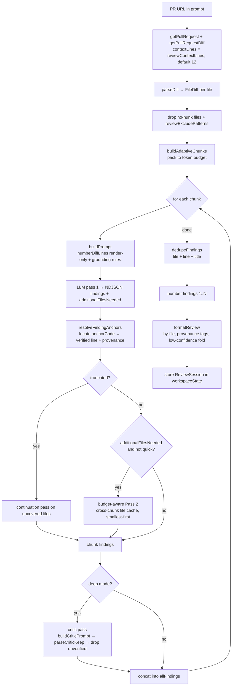
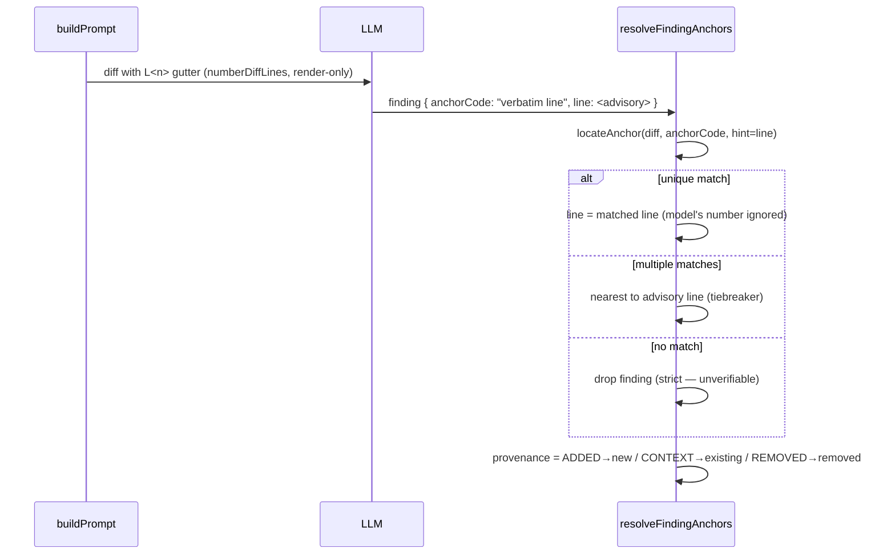

# Bitbucket PR Review Process

How `@bitbucket <pr-url>` turns a pull request into a grounded, line-accurate
review. **Keep this document in sync whenever the review pipeline changes** — it
is the single source of truth for how the steps fit together.

The code lives in:

- [`src/participant/BitbucketParticipant.ts`](../src/participant/BitbucketParticipant.ts) — orchestration (the handler).
- [`src/services/PrReviewService.ts`](../src/services/PrReviewService.ts) — prompt building, critic prompt, report formatting.
- [`src/participant/reviewSessionState.ts`](../src/participant/reviewSessionState.ts) — all pure helpers (numbering, anchor-locate, dedup, chunking).
- [`src/bitbucket/BitbucketApiClient.ts`](../src/bitbucket/BitbucketApiClient.ts) — HTTP, diff fetch (with context lines), file fetch.

## Pipeline overview



## The line-number trust boundary

The original failure mode: the model was handed a plain unified diff and had to
*count* lines from each `@@` header to state a line number — arithmetic it gets
wrong. The fix removes the model from that path entirely.



Key invariant: **`FileDiff.diff` is never mutated.** Line numbering is applied
only when rendering the prompt string (`numberDiffLines`). All code-side line
math — `parseDiff`, `resolveLineType`, `locateAnchor`, `splitFileDiff` — walks the
raw diff with its own `@@`-anchored counters, so the visible gutter cannot break
parsing.

## Filtering: only one hard drop

Three steps can remove a finding; only the first deletes outright. This protects
recall — a review never looks empty because filters stacked up.

| Step | When | Effect |
| --- | --- | --- |
| Anchor locate (`resolveFindingAnchors`) | always | **drop** if `anchorCode` is unlocatable in the diff (unverifiable) |
| Confidence (`formatReview`, `confidenceThreshold`) | always | **fold** into a collapsed section if `confidence < threshold` — never deleted |
| Critic (`buildCriticPrompt` + `parseCriticKeep`) | deep mode only | **drop** findings the verification pass can't confirm; fail-open if its reply is unparseable |

Fixed order: `parse → number(render) → LLM → locate+classify (drop only if
unlocatable) → confidence fold → [deep: critic] → merge chunks → dedup → format`.

## Provenance (new vs. existing code)

Every located finding is tagged from the line type it anchored to:

- 🆕 **new** — anchored to an added (`+`) line; introduced by this PR.
- 📍 **existing** — anchored to an unchanged context line; a real issue, but
  pre-existing. Surfaced and clearly marked, never confused with new work.
- ➖ **removed** — anchored to a removed (`-`) line; kept and tagged (rare).

Wider context (`reviewContextLines`, default 12) deliberately surfaces *more* 📍
existing findings — they are labelled, not introduced by the PR.

## Multi-line findings

A finding carries a primary anchor (where the bug manifests — the inline-comment
location) plus optional `relatedCode` resolved to `relatedLines` (the other lines
in a build-up). The report shows `L19 (also L12, L15)`; the report stays brief and
the full line-by-line walk happens on follow-up.

## Modes

| Invocation | Pass 2 (whole-file context) | Critic pass |
| --- | --- | --- |
| `@bitbucket review quick <url>` | off | off |
| `@bitbucket <url>` (standard, default) | on (budget-aware) | off |
| `@bitbucket review deep <url>` | on | on |

Context widening applies in **all** modes — only the expensive whole-file Pass 2
and the critic pass are mode-gated.

### Upfront question

An optional focus question can be attached to any review, in either syntax:

```text
@bitbucket question: does this change handle concurrent writes safely? <pr-url>
@bitbucket <pr-url> -- does this change handle concurrent writes safely?
```

(`--` is a plain double-dash, chosen for keyboard-typability — not an em-dash.)
`parseUpfrontQuestion`/`stripUpfrontQuestion` (`reviewSessionState.ts`) extract it
and strip it from the prompt **before** `quick`/`deep` mode-keyword detection runs,
so a question that happens to contain the word "deep" or "quick" can't flip the
review mode. This makes the question orthogonal to the mode keywords — the two
compose freely, in either order:

```text
@bitbucket review deep <url> question: Did I introduce any regression?
```

The question is composed with any configured `reviewInstructions` into a single
trusted `ADDITIONAL INSTRUCTIONS` block, and injected into **every** LLM call in
the pipeline: Pass 1, the truncation-continuation pass, Pass 2, and — when running
in deep mode — the critic pass too. Reaching the critic pass matters: without it,
a `deep` review's verification step would be checking findings against a generic
rubric with no idea the question was the point, and could drop question-driven
findings the critic didn't recognize as relevant.

When no question is supplied, Pass 1, Pass 2, and the continuation pass behave
exactly as before this feature — they already received `reviewInstructions` (if
configured) pre-feature, and `ADDITIONAL INSTRUCTIONS` is only added when there's
content to add. The one exception is the critic pass: in `deep` mode it now also
receives `reviewInstructions` (if configured) as `ADDITIONAL INSTRUCTIONS` —
previously `buildCriticPrompt` took no instructions parameter at all, so a user
with `reviewInstructions` set will see a (usually minor) change to critic-pass
behavior in deep mode even without asking a question. Behavior is unchanged
everywhere for users without `reviewInstructions` configured.

If a question was supplied, the review's first streamed line is `_focus: <question>_`,
before `_Fetching PR…_`.

## Follow-ups

After a review, `ReviewSession` is stored in `workspaceState` with the findings,
each carrying its numbered `diffHunk`. A follow-up question (`#3`, or a free-text
match) feeds that hunk into the follow-up prompt so the answer reasons about the
real code instead of reconstructing it from the finding text.

The session also stores `rawDiff` — the full unified diff, distinct from any
single finding's `diffHunk` — bounded to the token budget before it's saved
(`rawDiffTruncated` records whether that write-time cut happened). A generic
follow-up (no `#N`, and no match against an existing finding) now draws on this
stored diff via `buildDiffAwarePrompt`, which combines PR metadata, all findings,
and the diff itself, re-bounded to a freshly-computed token budget at read time.
If the diff was truncated — either when originally stored or again at follow-up
time — a note to that effect is included in the prompt so the model knows its
view may be incomplete. Sessions without a stored `rawDiff` (e.g. from before this
feature) keep falling back to the old findings-only prompt.

## Settings that shape the run

| Setting | Default | Effect |
| --- | --- | --- |
| `ticketSidekick.bitbucket.reviewContextLines` | 12 | context lines around each hunk |
| `ticketSidekick.bitbucket.confidenceThreshold` | 0.7 | below → low-confidence fold |
| `ticketSidekick.bitbucket.reviewMode` | standard | default depth (`standard` \| `quick`) |
| `ticketSidekick.bitbucket.contextBudgetRatio` | 0.7 | fraction of context window per chunk |
| `ticketSidekick.bitbucket.modelContextTokens` | (model API) | token budget override |
| `ticketSidekick.bitbucket.reviewExcludePatterns` | `[]` | globs skipped before review |
